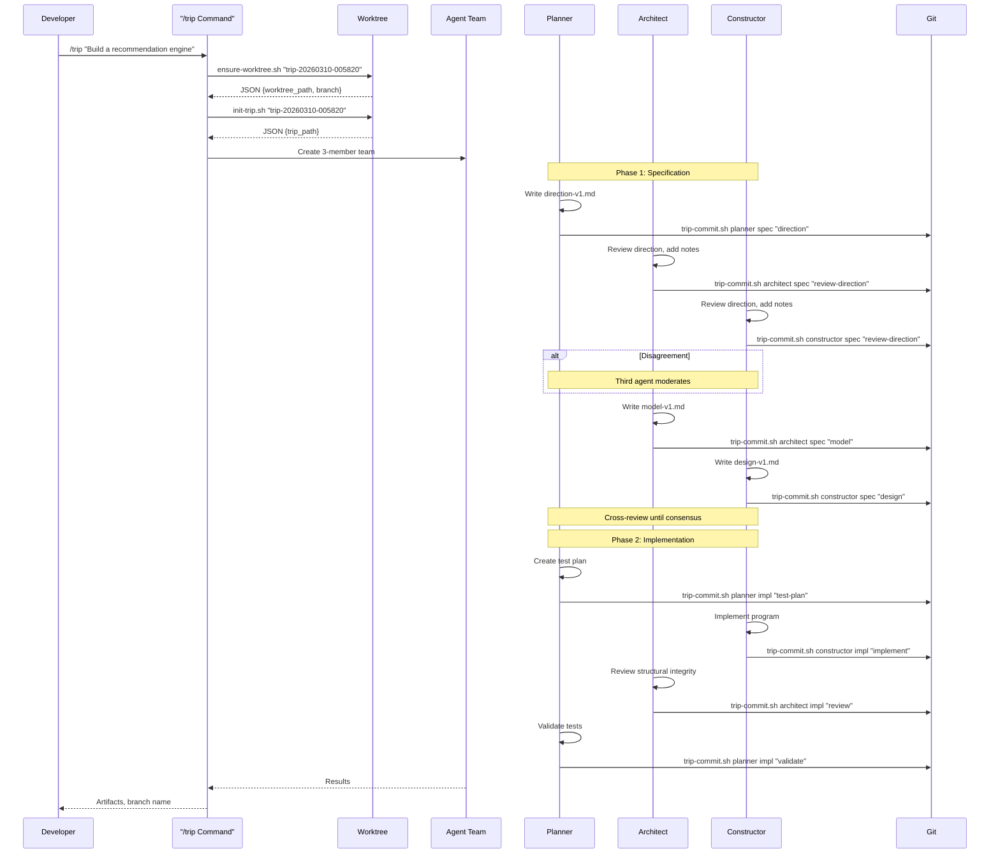
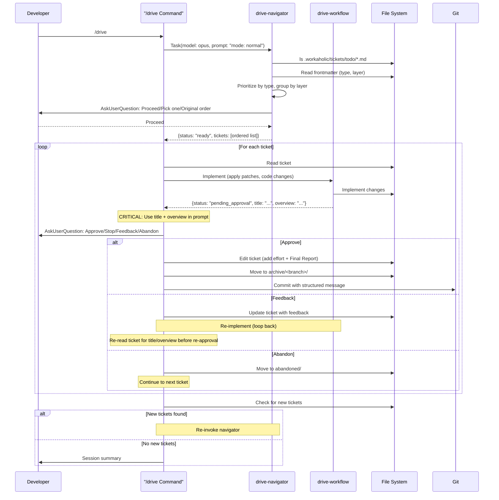
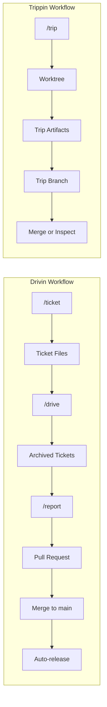

[English](usecase.md) | [Japanese](usecase_ja.md)

# Use Case Viewpoint

The Use Case Viewpoint documents how developers interact with Workaholic through its five commands across two plugins, describing the workflows, input/output contracts, error paths, and decision points in each use case. Every interaction follows either a ticket-driven pattern (drivin plugin) where markdown files serve as both input and output, or an artifact-driven exploration pattern (trippin plugin) where three agents collaborate through versioned markdown artifacts in an isolated git worktree.

## Primary Workflows

### Drivin Workflows

Drivin implements a ticket-driven development workflow consisting of three sequential phases: specification, implementation, and release. Each phase is supported by dedicated commands that orchestrate subagents and skills to automate repetitive tasks while maintaining developer control through explicit approval gates. Documentation generation is handled by writer agents invoked from the release-prep workflow rather than a separate documentation phase.

#### Ticket Creation Workflow

The `/ticket` command accepts a natural language description as its argument and orchestrates comprehensive context discovery through parallel subagent invocation. The workflow begins by checking the current git branch using the `branching` skill, creating a new topic branch with format `drive-YYYYMMDDHHmmss` if the developer is on main or master. After branch validation, the command invokes three discovery subagents concurrently via the Task tool: `history-discoverer` searches archived tickets for related work, `source-discoverer` identifies relevant source files and code patterns, and `ticket-discoverer` analyzes the todo and icebox queues for potential duplicates or overlap.

The `ticket-organizer` subagent synthesizes discovery results into implementation tickets following the format defined in the `create-ticket` skill. Each ticket includes YAML frontmatter with `created_at`, `author`, `type`, and `layer` fields, followed by markdown sections for Overview, Key Files, Related History, Implementation Steps, optional Patches, and Considerations. The subagent evaluates complexity and may split a single request into 2-4 discrete tickets when dealing with independent features or unrelated architectural layers. Tickets are written to `.workaholic/tickets/todo/` or `.workaholic/tickets/icebox/` based on the target parameter.

The command handles several moderation scenarios returned by `ticket-discoverer`: duplicate status triggers immediate termination with a reference to the existing ticket, needs-decision status presents the developer with merge/split options via `AskUserQuestion`, and needs-clarification status returns questions that the developer must answer before proceeding. Upon successful completion, the command stages ticket files with `git add` and commits them with message format "Add ticket for <short-description>", then instructs the developer to run `/drive` for implementation.

#### Ticket Implementation Workflow

The `/drive` command implements tickets from `.workaholic/tickets/todo/` in an intelligent priority order determined by the `drive-navigator` subagent. The navigator lists all todo tickets using `ls -1 .workaholic/tickets/todo/*.md`, reads each ticket's frontmatter to extract `type` and `layer` fields, and applies a priority ranking where bugfix tickets take precedence over enhancement and refactoring tickets, which in turn precede housekeeping tickets. The navigator groups tickets by architectural layer to maximize context efficiency, presents the prioritized list to the developer via `AskUserQuestion` with selectable options (Proceed, Pick one, Original order), and returns a JSON object with status "ready" and an ordered ticket array.

For each ticket in the navigator's list, the drive command follows the `drive-workflow` skill: read the ticket to understand requirements, apply patches if a Patches section exists (using `git apply --check` for validation before `git apply`), implement changes according to Implementation Steps, run type checks per CLAUDE.md, and return a summary JSON with status "pending_approval". The command then invokes the `drive-approval` skill to present an approval dialog via `AskUserQuestion`.

The approval dialog requires the ticket title (from the H1 heading) and overview (from the Overview section) to be present in the prompt header and question fields. This is enforced as a CRITICAL rule: the drive command must use the `title` and `overview` fields from the drive-workflow result to populate the approval prompt. If these fields are unavailable (particularly after feedback re-implementation loops where context may be lost), the command must re-read the ticket file to obtain them. Presenting an approval prompt without ticket context is treated as a failure condition. The selectable options are: Approve (archive and continue), Approve and stop (archive and end session), and Abandon (discard and continue). Users can also select "Other" to provide free-form feedback.

When the developer approves a ticket, the command follows the `write-final-report` skill to add effort estimation and a Final Report section to the ticket file using the Edit tool. After verifying the frontmatter update succeeded, it invokes the `archive-ticket` skill which moves the ticket from todo to `.workaholic/tickets/archive/<branch>/` and commits with a structured message following the expanded `commit` skill guidelines: title line, blank line, Motivation section, UX Change section, Arch Change section, blank line, and co-authorship attribution. The archive operation fails immediately if frontmatter validation fails, preventing incomplete tickets from entering the archive.

When the developer provides feedback (selects "Other"), the command updates the ticket file first by adding new Implementation Steps and appending a Discussion section with the verbatim feedback, interpretation, and ticket updates. After verifying the ticket was updated, it re-implements based on the updated ticket. Before presenting the approval prompt again, the command ensures ticket title and overview are available by re-reading the ticket file if needed, preventing context loss across feedback iterations.

After processing all tickets from the navigator's list, the drive command re-checks the todo directory for tickets added mid-session and re-invokes the navigator if new tickets are found. If the todo queue is empty, the navigator checks `.workaholic/tickets/icebox/` and asks the developer whether to work on icebox tickets.

#### Documentation Workflow

`.workaholic/specs/` documents are hand-maintained reference docs updated alongside structural changes through `/ticket`. Earlier in the project, an automated full-codebase documentation command bundled an upstream context tier and downstream lead/writer agents into a single batch run. That command and tier were retired; documentation generation now happens piecemeal through writer agents invoked from `/report` and `/release` workflows (changelog, terms, story, release notes).

#### Report Generation Workflow

The `/report` command generates a development story and creates or updates a GitHub pull request. The command first checks whether a version bump has already occurred in the current branch using the branching skill's `check-version-bump.sh` script, making the operation idempotent when called multiple times. If no bump commit exists, it reads the current version from `.claude-plugin/marketplace.json`, increments the PATCH component, updates all three version files (marketplace.json, drivin plugin.json, trippin plugin.json), and commits with message "Bump version to v{new_version}".

After version bumping, the report command invokes the `story-writer` subagent which orchestrates two phases of parallel agent invocation. Phase 1 invokes four agents (release-readiness, performance-analyst, overview-writer, section-reviewer) for story content generation. Phase 2 invokes two agents (release-note-writer, pr-creator) for delivery artifacts. The story-writer commits, pushes, and returns the PR URL.

### Trippin Workflows

#### Exploration Session Workflow

The `/trip` command launches a collaborative Agent Teams session for creative exploration and development. The workflow proceeds through four steps:

**Step 1: Create Worktree**. The command generates a trip name from the current timestamp and runs `ensure-worktree.sh` to create an isolated git worktree at `.worktrees/<trip-name>/` with a `trip/<trip-name>` branch. If the git state is unclean, the worktree already exists, or the branch already exists, the command informs the user and stops.

**Step 2: Initialize Trip Artifacts**. Inside the worktree, the command runs `init-trip.sh` to create the artifact directory structure at `.workaholic/.trips/<trip-name>/` with `directions/`, `models/`, and `designs/` subdirectories.

**Step 3: Launch Agent Teams**. The command creates a three-member Agent Team with the Planner, Architect, and Constructor agents. The team lead provides workflow instructions specifying the two-stage Implosive Structure protocol, artifact locations, and commit rules. The team members work independently in their own context windows, communicating through filesystem artifacts.

**Phase 1 (Specification)**: The Planner writes `directions/direction-v1.md` based on the user instruction. The Architect and Constructor each review the direction and add review notes. If disagreements arise, the uninvolved third agent moderates. Revisions produce `direction-v2.md`, `direction-v3.md`, etc. Once the direction reaches consensus, the Architect writes `models/model-v1.md` and the Constructor writes `designs/design-v1.md`. Each agent reviews the other two artifacts. Iteration continues until all three artifacts are mutually consistent and all agents confirm consensus.

**Phase 2 (Implementation)**: The Planner creates a test plan. The Constructor implements the program. The Architect reviews structural integrity. The Planner validates through testing. The team iterates until all agents approve.

Every discrete step in both phases produces a git commit via `trip-commit.sh` with message format `trip(<agent>): <step>` and phase information in the body.

**Step 4: Present Results**. After the team completes, the command lists all artifacts created, summarizes the agreed direction, model, and design, reports implementation results, and shows the worktree branch name for the user to merge or inspect.

#### Trip Workflow Sequence

```mermaid
sequenceDiagram
    participant Dev as Developer
    participant Cmd as "/trip Command"
    participant WT as Worktree
    participant Team as Agent Team
    participant P as Planner
    participant A as Architect
    participant C as Constructor
    participant Git as Git

    Dev->>Cmd: /trip "Build a recommendation engine"
    Cmd->>WT: ensure-worktree.sh "trip-20260310-005820"
    WT-->>Cmd: JSON {worktree_path, branch}
    Cmd->>WT: init-trip.sh "trip-20260310-005820"
    WT-->>Cmd: JSON {trip_path}
    Cmd->>Team: Create 3-member team

    Note over P,C: Phase 1: Specification

    P->>P: Write direction-v1.md
    P->>Git: trip-commit.sh planner spec "direction"
    A->>A: Review direction, add notes
    A->>Git: trip-commit.sh architect spec "review-direction"
    C->>C: Review direction, add notes
    C->>Git: trip-commit.sh constructor spec "review-direction"

    alt Disagreement
        Note over P,C: Third agent moderates
    end

    A->>A: Write model-v1.md
    A->>Git: trip-commit.sh architect spec "model"
    C->>C: Write design-v1.md
    C->>Git: trip-commit.sh constructor spec "design"

    Note over P,C: Cross-review until consensus

    Note over P,C: Phase 2: Implementation

    P->>P: Create test plan
    P->>Git: trip-commit.sh planner impl "test-plan"
    C->>C: Implement program
    C->>Git: trip-commit.sh constructor impl "implement"
    A->>A: Review structural integrity
    A->>Git: trip-commit.sh architect impl "review"
    P->>P: Validate tests
    P->>Git: trip-commit.sh planner impl "validate"

    Team-->>Cmd: Results
    Cmd-->>Dev: Artifacts, branch name
```

## Command Contracts

### /ticket Command

**Plugin:** drivin
**Invocation Format:** `/ticket <description>`

**Input Contract:**
- Required: Natural language description of desired change
- Optional: None
- Environment: Must be in a git repository

**Output Contract:**
- Success: One or more ticket files in `.workaholic/tickets/todo/` or `.workaholic/tickets/icebox/`
- Commit: "Add ticket for <short-description>"
- Response: JSON from ticket-organizer with status "success" and tickets array
- Side effects: May create new topic branch if on main/master

**Error Paths:**
- Duplicate detected: Returns status "duplicate" with existing_ticket path
- Ambiguous scope: Returns status "needs_clarification" with questions array
- Merge/split decision: Returns status "needs_decision" with options array
- Git failure: Command aborts without writing tickets

### /drive Command

**Plugin:** drivin
**Invocation Format:** `/drive` or `/drive icebox`

**Input Contract:**
- Required: None
- Optional: "icebox" argument to enable icebox mode
- Environment: Requires `.workaholic/tickets/todo/` directory

**Output Contract:**
- Success: Multiple commits, each with format "<title>\n\nMotivation: ...\nUX Change: ...\nArch Change: ..."
- Side effects: Moves tickets from todo to `.workaholic/tickets/archive/<branch>/`
- Response: Summary of tickets implemented and commits created across all batches

**Error Paths:**
- Empty queue: Checks icebox, prompts developer, or returns "No tickets"
- Implementation blocked: Stops, asks developer to move to icebox/skip/abort
- Frontmatter update failure: Aborts archiving, reports error, does not proceed
- Patch apply failure: Notes failure, proceeds with manual implementation
- Type check failure: Halts before approval dialog, requires fix
- Missing approval context: Re-reads ticket file (failure condition if context cannot be obtained)

### /report Command

**Plugin:** drivin
**Invocation Format:** `/report`

**Input Contract:**
- Required: None
- Optional: None
- Environment: Must be on a feature branch with archived tickets

**Output Contract:**
- Success: Story file in `.workaholic/stories/<branch>.md`, release notes in `.workaholic/release-notes/<branch>.md`, GitHub PR created/updated
- Commits: "Bump version to v{version}" (if not already bumped), "Add story", "Add release notes"
- Response: PR URL
- Side effects: Increments patch version in all three version files, pushes branch to remote

**Error Paths:**
- No archived tickets: Story generation may produce minimal content
- PR creation failure: Reports error but story/notes are still committed
- Git push failure: Aborts before PR creation

### /trip Command

**Plugin:** trippin
**Invocation Format:** `/trip <instruction>`

**Input Contract:**
- Required: Natural language instruction describing what to explore or build
- Optional: None
- Environment: Must be in a git repository with clean state; Agent Teams experimental flag must be enabled

**Output Contract:**
- Success: Versioned artifacts in `.workaholic/.trips/<trip-name>/` (directions, models, designs), implementation code in worktree
- Commits: Multiple commits on `trip/<trip-name>` branch, each with format `trip(<agent>): <step>`
- Response: Summary of artifacts, agreed direction/model/design, implementation results, branch name
- Side effects: Creates git worktree at `.worktrees/<trip-name>/`, creates `trip/<trip-name>` branch

**Error Paths:**
- Unclean git state: Cannot create worktree, command stops with explanation
- Worktree already exists: Command stops with explanation
- Branch already exists: Command stops, suggests cleanup
- Agent Teams not enabled: Feature unavailable, requires environment variable

**Decision Points:**
- None (fully automated after invocation; agent consensus is internal to the team)

### Ticket Creation Sequence

```mermaid
sequenceDiagram
    participant Dev as Developer
    participant Cmd as "/ticket Command"
    participant TO as ticket-organizer
    participant HD as history-discoverer
    participant SD as source-discoverer
    participant TD as ticket-discoverer
    participant FS as File System
    participant Git as Git

    Dev->>Cmd: /ticket add dark mode
    Cmd->>TO: Task(model: opus, prompt: description + target)
    TO->>Git: Check branch via branching skill
    alt On main/master
        Git-->>TO: main
        TO->>Git: Create drive-YYYYMMDDHHmmss branch
    end

    par Parallel Discovery
        TO->>HD: Task(model: opus, prompt: description)
        HD-->>TO: JSON with related tickets
    and
        TO->>SD: Task(model: opus, prompt: description)
        SD-->>TO: JSON with relevant files
    and
        TO->>TD: Task(model: opus, prompt: description)
        TD-->>TO: JSON with duplicate analysis
    end

    alt Duplicate Found
        TO-->>Cmd: {status: "duplicate", existing_ticket: path}
        Cmd-->>Dev: Show existing ticket, abort
    else Needs Decision
        TO-->>Cmd: {status: "needs_decision", options: [...]}
        Cmd->>Dev: AskUserQuestion with options
        Dev-->>Cmd: Selection
        Cmd->>TO: Re-invoke with decision
    else Clear to Proceed
        TO->>TO: Evaluate complexity, split if needed
        TO->>FS: Write ticket(s) to todo/
        TO-->>Cmd: {status: "success", tickets: [...]}
        Cmd->>Git: git add + commit
        Cmd-->>Dev: Confirm tickets created, suggest /drive
    end
```

### Drive Implementation Sequence

```mermaid
sequenceDiagram
    participant Dev as Developer
    participant Cmd as "/drive Command"
    participant Nav as drive-navigator
    participant Wf as drive-workflow
    participant FS as File System
    participant Git as Git

    Dev->>Cmd: /drive
    Cmd->>Nav: Task(model: opus, prompt: "mode: normal")
    Nav->>FS: ls .workaholic/tickets/todo/*.md
    Nav->>FS: Read frontmatter (type, layer)
    Nav->>Nav: Prioritize by type, group by layer
    Nav->>Dev: AskUserQuestion: Proceed/Pick one/Original order
    Dev-->>Nav: Proceed
    Nav-->>Cmd: {status: "ready", tickets: [ordered list]}

    loop For each ticket
        Cmd->>FS: Read ticket
        Cmd->>Wf: Implement (apply patches, code changes)
        Wf->>FS: Implement changes
        Wf-->>Cmd: {status: "pending_approval", title: "...", overview: "..."}

        Note over Cmd: CRITICAL: Use title + overview in prompt
        Cmd->>Dev: AskUserQuestion: Approve/Stop/Feedback/Abandon

        alt Approve
            Cmd->>FS: Edit ticket (add effort + Final Report)
            Cmd->>FS: Move to archive/<branch>/
            Cmd->>Git: Commit with structured message
        else Feedback
            Cmd->>FS: Update ticket with feedback
            Note over Cmd,Wf: Re-implement (loop back)
            Note over Cmd: Re-read ticket for title/overview before re-approval
        else Abandon
            Cmd->>FS: Move to abandoned/
            Note over Cmd: Continue to next ticket
        end
    end

    Cmd->>FS: Check for new tickets
    alt New tickets found
        Note over Cmd,Nav: Re-invoke navigator
    else No new tickets
        Cmd->>Dev: Session summary
    end
```

## Use Case Dependencies

### Drivin Workflow Sequence

The typical development session follows this sequence:

1. **Specification**: `/ticket` creates tickets based on natural language descriptions
2. **Implementation**: `/drive` implements and archives tickets one by one with approval
3. **Delivery**: `/report` generates story, creates PR, and bumps version
4. **Ship**: `/ship` merges the PR and verifies production
5. **Release**: Auto-release or manual `/release` publishes to marketplace

### Trippin Workflow Sequence

Trip sessions are independent of the drivin workflow:

1. **Exploration**: `/trip` creates worktree, launches agent team
2. **Specification**: Agents collaboratively produce direction, model, and design
3. **Implementation**: Agents build, review, and test
4. **Integration**: Developer merges trip branch or inspects results

### Cross-Command Data Flow

```mermaid
flowchart LR
    subgraph "Drivin Workflow"
        T["/ticket"] --> TD[Ticket Files]
        TD --> D["/drive"]
        D --> AT[Archived Tickets]
        AT --> R["/report"]
        R --> PR[Pull Request]
        PR --> M[Merge to main]
        M --> REL[Auto-release]
    end

    subgraph "Trippin Workflow"
        TR["/trip"] --> WT[Worktree]
        WT --> Arts[Trip Artifacts]
        Arts --> Branch[Trip Branch]
        Branch --> Merge[Merge or Inspect]
    end
```

## Lead Lens Application

The four leading skills (`leading-validity`, `leading-availability`, `leading-security`, `leading-accessibility`) are preloaded into work-plugin commands and orchestrators. When ticket-organizer scopes a ticket or `/drive` implements one, the relevant leading skills apply as policy lenses based on the ticket's `layer` field. There is no separate strategic-context workflow; leads derive their viewpoint directly from the codebase.

## Assumptions

- [Explicit] The `/ticket` command delegates entirely to ticket-organizer, which invokes 3 discovery agents in parallel, as documented in ticket command instructions.
- [Explicit] The `/drive` command processes tickets sequentially with human approval between each, as documented in drive command instructions.
- [Explicit] The `/report` command delegates to story-writer, which orchestrates 4 agents in stage 1 and 2 agents in stage 2.
- [Explicit] The `/trip` command creates a worktree, initializes trip artifacts, and launches a 3-member Agent Team, as documented in trip.md.
- [Explicit] The drive approval flow requires ticket title and overview with CRITICAL enforcement, as documented in `plugins/core/skills/drive/SKILL.md` Approval section and `plugins/work/commands/drive.md` Step 2.2.
- [Explicit] Trip sessions require the Agent Teams experimental feature flag, as documented in trip.md prerequisites.
- [Explicit] Every trip workflow step produces a git commit via trip-commit.sh, as documented in trip-protocol SKILL.md.
- [Explicit] Version bumping updates four files (marketplace.json plus the three plugin.json files for core, standards, work), as documented in CLAUDE.md Version Management.
- [Inferred] The trippin workflow is independent of drivin and can run concurrently on separate worktree branches.
- [Inferred] The worktree isolation ensures trip sessions do not interfere with the main working tree or ongoing drivin development.
- [Inferred] The three philosophical stances in trippin agents create productive dialectical tension for thorough specification.
