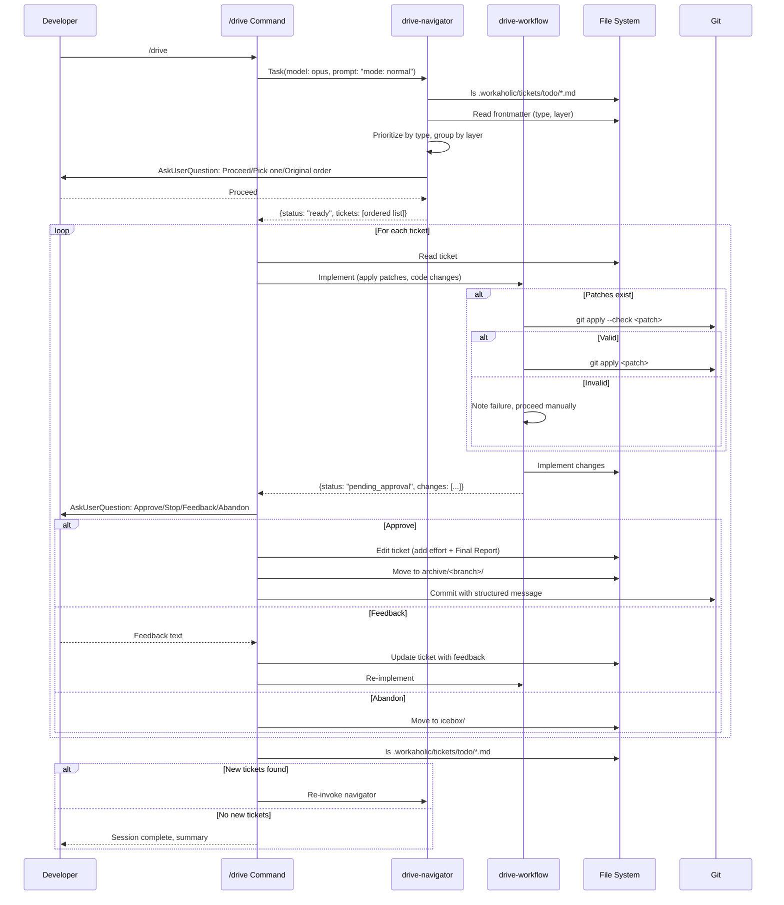
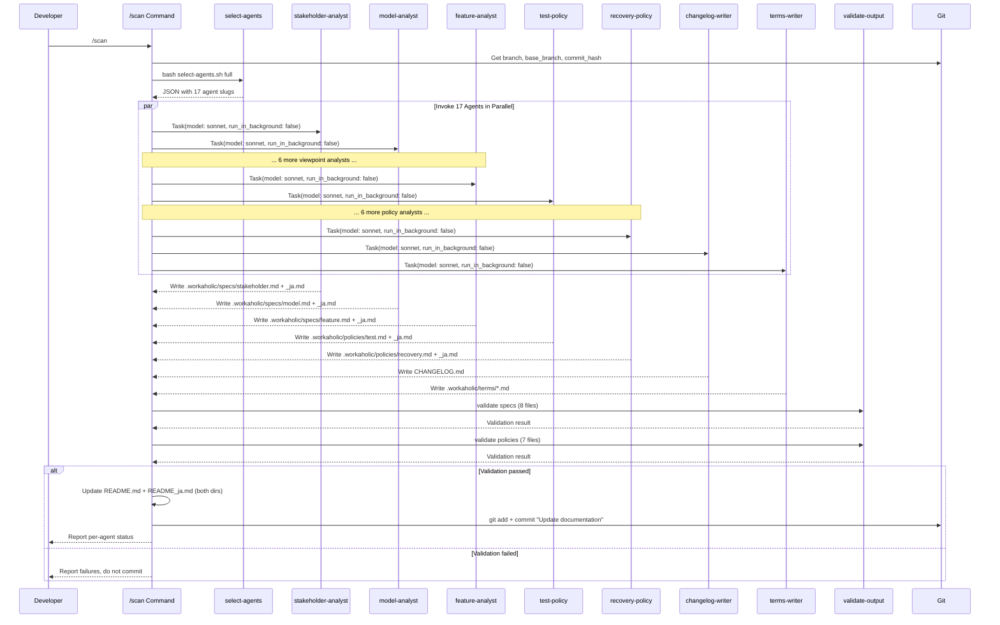
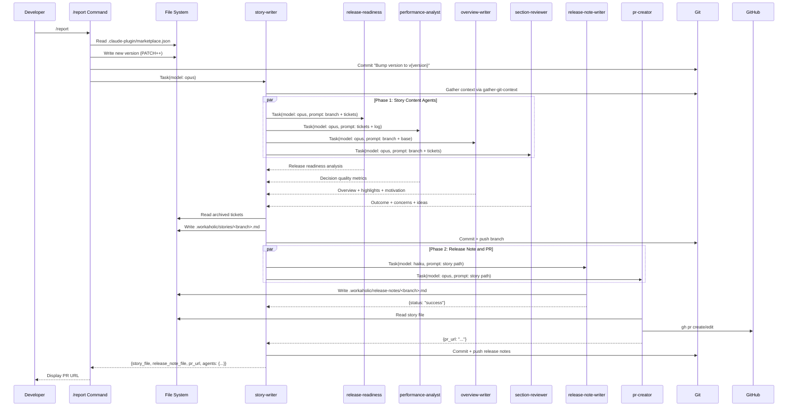

[English](usecase.md) | [Japanese](usecase_ja.md)

# Use Case Viewpoint

The Use Case Viewpoint documents how developers interact with Workaholic through its five primary commands, describing the workflows, input/output contracts, error paths, and decision points in each use case. Every interaction follows a ticket-driven pattern where markdown files serve as both input and output, enabling version control and human review at every stage.

## Primary Workflows

Workaholic implements a ticket-driven development workflow consisting of four sequential phases: specification, implementation, documentation, and release. Each phase is supported by dedicated commands that orchestrate subagents and skills to automate repetitive tasks while maintaining developer control through explicit approval gates.

### Ticket Creation Workflow

The `/ticket` command accepts a natural language description as its argument and orchestrates comprehensive context discovery through parallel subagent invocation. The workflow begins by checking the current git branch using the `manage-branch` skill, creating a new topic branch with format `drive-YYYYMMDDHHmmss` if the developer is on main or master. After branch validation, the command invokes three discovery subagents concurrently via the Task tool: `history-discoverer` searches archived tickets for related work, `source-discoverer` identifies relevant source files and code patterns, and `ticket-discoverer` analyzes the todo and icebox queues for potential duplicates or overlap.

The `ticket-organizer` subagent synthesizes discovery results into implementation tickets following the format defined in the `create-ticket` skill. Each ticket includes YAML frontmatter with `created_at`, `author`, `type`, and `layer` fields, followed by markdown sections for Overview, Key Files, Related History, Implementation Steps, optional Patches, and Considerations. The subagent evaluates complexity and may split a single request into 2-4 discrete tickets when dealing with independent features or unrelated architectural layers. Tickets are written to `.workaholic/tickets/todo/` or `.workaholic/tickets/icebox/` based on the target parameter.

The command handles several moderation scenarios returned by `ticket-discoverer`: duplicate status triggers immediate termination with a reference to the existing ticket, needs-decision status presents the developer with merge/split options via `AskUserQuestion`, and needs-clarification status returns questions that the developer must answer before proceeding. Upon successful completion, the command stages ticket files with `git add` and commits them with message format "Add ticket for <short-description>", then instructs the developer to run `/drive` for implementation.

### Ticket Implementation Workflow

The `/drive` command implements tickets from `.workaholic/tickets/todo/` in an intelligent priority order determined by the `drive-navigator` subagent. The navigator lists all todo tickets using `ls -1 .workaholic/tickets/todo/*.md`, reads each ticket's frontmatter to extract `type` and `layer` fields, and applies a priority ranking where bugfix tickets take precedence over enhancement and refactoring tickets, which in turn precede housekeeping tickets. The navigator groups tickets by architectural layer to maximize context efficiency, presents the prioritized list to the developer via `AskUserQuestion` with selectable options (Proceed, Pick one, Original order), and returns a JSON object with status "ready" and an ordered ticket array.

For each ticket in the navigator's list, the drive command follows the `drive-workflow` skill: read the ticket to understand requirements, apply patches if a Patches section exists (using `git apply --check` for validation before `git apply`), implement changes according to Implementation Steps, run type checks per CLAUDE.md, and return a summary JSON with status "pending_approval". The command then invokes the `drive-approval` skill to present an approval dialog via `AskUserQuestion` with four selectable options: Approve (archive and continue), Approve and stop (archive and end session), provide free-form feedback (update ticket and re-implement), or Abandon (move to icebox without implementation).

When the developer approves a ticket, the command follows the `write-final-report` skill to add effort estimation and a Final Report section to the ticket file using the Edit tool. After verifying the frontmatter update succeeded, it invokes the `archive-ticket` skill which moves the ticket from todo to `.workaholic/tickets/archive/<branch>/` and commits with a structured message following `format-commit-message` guidelines: title line, blank line, Motivation section, UX Change section, Arch Change section, blank line, and co-authorship attribution. The archive operation fails immediately if frontmatter validation fails, preventing incomplete tickets from entering the archive. After processing all tickets from the navigator's list, the drive command re-checks the todo directory for tickets added mid-session and re-invokes the navigator if new tickets are found.

If the todo queue is empty, the navigator checks `.workaholic/tickets/icebox/` and asks the developer via `AskUserQuestion` whether to work on icebox tickets. The developer can select "Work on icebox" (triggering icebox mode) or "Stop" (ending the session). In icebox mode, the navigator lists icebox tickets and presents them as selectable options, moves the selected ticket to todo, and returns it for implementation. The drive command maintains session-wide counters tracking total tickets implemented, total commits created, and the list of all commit hashes across multiple navigator batches.

### Documentation Workflow

The `/scan` command updates `.workaholic/` documentation by invoking 17 documentation agents directly in parallel, providing real-time progress visibility for each agent. The command begins by gathering git context (branch, base_branch, repo_url) using the `gather-git-context` skill and retrieving the current commit hash via `git rev-parse --short HEAD`. It then runs the `select-scan-agents` skill with mode "full" to get the complete list of 17 agents: 8 viewpoint analysts (stakeholder, model, usecase, infrastructure, application, component, data, feature), 7 policy analysts (test, security, quality, accessibility, observability, delivery, recovery), a changelog writer, and a terms writer.

The scan command invokes all 17 agents in a single message using parallel Task tool calls, with each agent using model "sonnet" and receiving appropriate prompt context (base branch for analysts, repository URL for changelog writer, branch name for terms writer). All invocations must use the default `run_in_background: false` parameter because agents need Write/Edit permissions which require interactive prompt access; background agents cannot receive prompts and would have all file writes auto-denied. After all agents complete, the command validates output using the `validate-writer-output` skill for both `.workaholic/specs/` (8 viewpoint files) and `.workaholic/policies/` (7 policy files).

If validation passes, the scan command updates index files (README.md and README_ja.md) in both specs and policies directories following the `write-spec` skill's index file rules. It then stages all documentation changes with `git add CHANGELOG.md .workaholic/specs/ .workaholic/terms/ .workaholic/policies/` and commits with message "Update documentation". The command reports per-agent status showing which agents succeeded, failed, or were skipped, along with validation results.

### Report Generation Workflow

The `/report` command generates a development story and creates or updates a GitHub pull request without any documentation scanning. The command first bumps the version following CLAUDE.md Version Management section: reads the current version from `.claude-plugin/marketplace.json`, increments the PATCH component (e.g., 1.0.0 → 1.0.1), updates both `.claude-plugin/marketplace.json` and `plugins/core/.claude-plugin/plugin.json` with the new version, stages the version files, and commits with message "Bump version to v{new_version}".

After version bumping, the report command invokes the `story-writer` subagent (model: opus) which orchestrates parallel subagent invocation for story content generation. The story-writer gathers git context using `gather-git-context`, then invokes four agents in parallel: `release-readiness` analyzes branch for release readiness, `performance-analyst` evaluates decision quality, `overview-writer` generates overview and highlights, and `section-reviewer` produces outcome analysis and concerns. After waiting for all four agents to complete, the story-writer reads archived tickets using Glob pattern `.workaholic/tickets/archive/<branch>/*.md` and writes the story file following the `write-story` skill's content structure and templates.

The story-writer commits the story file, pushes the branch with `git push -u origin <branch-name>`, then invokes two more agents in parallel: `release-note-writer` (model: haiku) generates concise release notes in `.workaholic/release-notes/<branch>.md`, and `pr-creator` (model: opus) reads the story file, derives the PR title from the first Summary item, and runs the `create-pr` skill to execute `gh` CLI operations that create or update the pull request. The story-writer stages and commits release notes, pushes again, and returns a JSON object containing story_file path, release_note_file path, pr_url, and per-agent status. The report command displays the PR URL as mandatory output.

### Release Workflow

The `/release` command (not yet implemented but documented in CLAUDE.md) bumps the marketplace version and publishes a new release. It accepts an optional argument specifying version bump type (major, minor, or patch), defaulting to patch if not provided. The command reads the current version from `.claude-plugin/marketplace.json`, increments the appropriate version component, updates both `marketplace.json` and `plugins/core/.claude-plugin/plugin.json` to keep versions in sync, stages the changes, and commits with message "Bump version to v{new_version}". The GitHub Action `release.yml` then creates a release when the version bump commit reaches main.

## Command Contracts

### /ticket Command

**Invocation Format:** `/ticket <description>`

**Input Contract:**
- Required: Natural language description of desired change
- Optional: None
- Environment: Must be in a git repository

**Output Contract:**
- Success: One or more ticket files in `.workaholic/tickets/todo/` or `.workaholic/tickets/icebox/`
- Commit: "Add ticket for <short-description>"
- Response: JSON from ticket-organizer with status "success" and tickets array
- Side effects: May create new topic branch if on main/master

**Error Paths:**
- Duplicate detected: Returns status "duplicate" with existing_ticket path
- Ambiguous scope: Returns status "needs_clarification" with questions array
- Merge/split decision: Returns status "needs_decision" with options array
- Git failure: Command aborts without writing tickets

**Decision Points:**
- Branch creation (automatic if on main/master)
- Target directory (todo vs icebox, passed as argument to ticket-organizer)
- Ticket splitting (handled by ticket-organizer complexity evaluation)
- Duplicate handling (developer chooses whether to proceed or cancel)

### Ticket Creation Sequence

```mermaid
sequenceDiagram
    participant Dev as Developer
    participant Cmd as /ticket Command
    participant TO as ticket-organizer
    participant HD as history-discoverer
    participant SD as source-discoverer
    participant TD as ticket-discoverer
    participant FS as File System
    participant Git as Git

    Dev->>Cmd: /ticket add dark mode
    Cmd->>TO: Task(model: opus, prompt: description + target)
    TO->>Git: Check branch via manage-branch skill
    alt On main/master
        Git-->>TO: main
        TO->>Git: Create drive-YYYYMMDDHHmmss branch
    end

    par Parallel Discovery
        TO->>HD: Task(model: opus, prompt: description)
        HD-->>TO: JSON with related tickets
    and
        TO->>SD: Task(model: opus, prompt: description)
        SD-->>TO: JSON with relevant files
    and
        TO->>TD: Task(model: opus, prompt: description)
        TD-->>TO: JSON with duplicate analysis
    end

    alt Duplicate Found
        TO-->>Cmd: {status: "duplicate", existing_ticket: path}
        Cmd-->>Dev: Show existing ticket, abort
    else Needs Decision
        TO-->>Cmd: {status: "needs_decision", options: [...]}
        Cmd->>Dev: AskUserQuestion with options
        Dev-->>Cmd: Selection
        Cmd->>TO: Re-invoke with decision
    else Clear to Proceed
        TO->>TO: Evaluate complexity, split if needed
        TO->>FS: Write ticket(s) to todo/
        TO-->>Cmd: {status: "success", tickets: [...]}
        Cmd->>Git: git add + commit
        Cmd-->>Dev: Confirm tickets created, suggest /drive
    end
```

### /drive Command

**Invocation Format:** `/drive` or `/drive icebox`

**Input Contract:**
- Required: None
- Optional: "icebox" argument to enable icebox mode
- Environment: Requires `.workaholic/tickets/todo/` directory

**Output Contract:**
- Success: Multiple commits, each with format "<title>\n\nMotivation: ...\nUX Change: ...\nArch Change: ..."
- Side effects: Moves tickets from todo to `.workaholic/tickets/archive/<branch>/`
- Response: Summary of tickets implemented and commits created across all batches

**Error Paths:**
- Empty queue: Checks icebox, prompts developer, or returns "No tickets"
- Implementation blocked: Stops, asks developer to move to icebox/skip/abort
- Frontmatter update failure: Aborts archiving, reports error, does not proceed
- Patch apply failure: Notes failure, proceeds with manual implementation
- Type check failure: Halts before approval dialog, requires fix

**Decision Points:**
- Ticket priority order (developer confirms via AskUserQuestion)
- Per-ticket approval (Approve, Approve and stop, Feedback, Abandon)
- Icebox processing (developer chooses whether to work on icebox)
- New ticket detection (automatic re-check after each batch)

### Drive Implementation Sequence

```mermaid
sequenceDiagram
    participant Dev as Developer
    participant Cmd as /drive Command
    participant Nav as drive-navigator
    participant Wf as drive-workflow
    participant FS as File System
    participant Git as Git

    Dev->>Cmd: /drive
    Cmd->>Nav: Task(model: opus, prompt: "mode: normal")
    Nav->>FS: ls .workaholic/tickets/todo/*.md
    Nav->>FS: Read frontmatter (type, layer)
    Nav->>Nav: Prioritize by type, group by layer
    Nav->>Dev: AskUserQuestion: Proceed/Pick one/Original order
    Dev-->>Nav: Proceed
    Nav-->>Cmd: {status: "ready", tickets: [ordered list]}

    loop For each ticket
        Cmd->>FS: Read ticket
        Cmd->>Wf: Implement (apply patches, code changes)
        alt Patches exist
            Wf->>Git: git apply --check <patch>
            alt Valid
                Wf->>Git: git apply <patch>
            else Invalid
                Wf->>Wf: Note failure, proceed manually
            end
        end
        Wf->>FS: Implement changes
        Wf-->>Cmd: {status: "pending_approval", changes: [...]}
        Cmd->>Dev: AskUserQuestion: Approve/Stop/Feedback/Abandon

        alt Approve
            Cmd->>FS: Edit ticket (add effort + Final Report)
            Cmd->>FS: Move to archive/<branch>/
            Cmd->>Git: Commit with structured message
        else Feedback
            Dev-->>Cmd: Feedback text
            Cmd->>FS: Update ticket with feedback
            Cmd->>Wf: Re-implement
        else Abandon
            Cmd->>FS: Move to icebox/
        end
    end

    Cmd->>FS: ls .workaholic/tickets/todo/*.md
    alt New tickets found
        Cmd->>Nav: Re-invoke navigator
    else No new tickets
        Cmd-->>Dev: Session complete, summary
    end
```

### /scan Command

**Invocation Format:** `/scan`

**Input Contract:**
- Required: None
- Optional: None
- Environment: Must be in git repository with `.workaholic/` directory

**Output Contract:**
- Success: Single commit with message "Update documentation"
- Modified files: CHANGELOG.md, `.workaholic/specs/*.md`, `.workaholic/policies/*.md`, `.workaholic/terms/*.md`, README files
- Response: Per-agent status report with validation results

**Error Paths:**
- Agent failure: Continues with remaining agents, reports failure in status
- Validation failure: Reports which files failed validation, does not commit
- Git failure: Aborts without committing documentation changes

**Decision Points:** None (fully automated)

### Scan Execution Sequence

```mermaid
sequenceDiagram
    participant Dev as Developer
    participant Cmd as /scan Command
    participant SA as select-agents
    participant V1 as stakeholder-analyst
    participant V2 as model-analyst
    participant V8 as feature-analyst
    participant P1 as test-policy
    participant P7 as recovery-policy
    participant CW as changelog-writer
    participant TW as terms-writer
    participant Val as validate-output
    participant Git as Git

    Dev->>Cmd: /scan
    Cmd->>Git: Get branch, base_branch, commit_hash
    Cmd->>SA: bash select-agents.sh full
    SA-->>Cmd: JSON with 17 agent slugs

    par Invoke 17 Agents in Parallel
        Cmd->>V1: Task(model: sonnet, run_in_background: false)
        Cmd->>V2: Task(model: sonnet, run_in_background: false)
        Note over Cmd,V8: ... 6 more viewpoint analysts ...
        Cmd->>V8: Task(model: sonnet, run_in_background: false)
        Cmd->>P1: Task(model: sonnet, run_in_background: false)
        Note over Cmd,P7: ... 6 more policy analysts ...
        Cmd->>P7: Task(model: sonnet, run_in_background: false)
        Cmd->>CW: Task(model: sonnet, run_in_background: false)
        Cmd->>TW: Task(model: sonnet, run_in_background: false)
    end

    V1-->>Cmd: Write .workaholic/specs/stakeholder.md + _ja.md
    V2-->>Cmd: Write .workaholic/specs/model.md + _ja.md
    V8-->>Cmd: Write .workaholic/specs/feature.md + _ja.md
    P1-->>Cmd: Write .workaholic/policies/test.md + _ja.md
    P7-->>Cmd: Write .workaholic/policies/recovery.md + _ja.md
    CW-->>Cmd: Write CHANGELOG.md
    TW-->>Cmd: Write .workaholic/terms/*.md

    Cmd->>Val: validate specs (8 files)
    Val-->>Cmd: Validation result
    Cmd->>Val: validate policies (7 files)
    Val-->>Cmd: Validation result

    alt Validation passed
        Cmd->>Cmd: Update README.md + README_ja.md (both dirs)
        Cmd->>Git: git add + commit "Update documentation"
        Cmd-->>Dev: Report per-agent status
    else Validation failed
        Cmd-->>Dev: Report failures, do not commit
    end
```

### /report Command

**Invocation Format:** `/report`

**Input Contract:**
- Required: None
- Optional: None
- Environment: Must be in git repository with archived tickets

**Output Contract:**
- Success: Two commits ("Bump version to v{version}", "Add branch story for {branch}", "Add release notes for {branch}")
- Files created: `.workaholic/stories/<branch>.md`, `.workaholic/release-notes/<branch>.md`
- GitHub: Created or updated pull request
- Response: PR URL (mandatory)

**Error Paths:**
- Version read failure: Aborts before story generation
- Story-writer agent failure: Reports which agents failed, may still create PR
- PR creation failure: Reports error, story file still exists
- Git push failure: Aborts PR creation

**Decision Points:** None (fully automated)

### Report Generation Sequence

```mermaid
sequenceDiagram
    participant Dev as Developer
    participant Cmd as /report Command
    participant FS as File System
    participant SW as story-writer
    participant RR as release-readiness
    participant PA as performance-analyst
    participant OW as overview-writer
    participant SR as section-reviewer
    participant RNW as release-note-writer
    participant PRC as pr-creator
    participant Git as Git
    participant GH as GitHub

    Dev->>Cmd: /report
    Cmd->>FS: Read .claude-plugin/marketplace.json
    Cmd->>FS: Write new version (PATCH++)
    Cmd->>Git: Commit "Bump version to v{version}"

    Cmd->>SW: Task(model: opus)
    SW->>Git: Gather context via gather-git-context

    par Phase 1: Story Content Agents
        SW->>RR: Task(model: opus, prompt: branch + tickets)
        SW->>PA: Task(model: opus, prompt: tickets + log)
        SW->>OW: Task(model: opus, prompt: branch + base)
        SW->>SR: Task(model: opus, prompt: branch + tickets)
    end

    RR-->>SW: Release readiness analysis
    PA-->>SW: Decision quality metrics
    OW-->>SW: Overview + highlights + motivation
    SR-->>SW: Outcome + concerns + ideas

    SW->>FS: Read archived tickets
    SW->>FS: Write .workaholic/stories/<branch>.md
    SW->>Git: Commit + push branch

    par Phase 2: Release Note and PR
        SW->>RNW: Task(model: haiku, prompt: story path)
        SW->>PRC: Task(model: opus, prompt: story path)
    end

    RNW->>FS: Write .workaholic/release-notes/<branch>.md
    RNW-->>SW: {status: "success"}

    PRC->>FS: Read story file
    PRC->>GH: gh pr create/edit
    PRC-->>SW: {pr_url: "..."}

    SW->>Git: Commit + push release notes
    SW-->>Cmd: {story_file, release_note_file, pr_url, agents: {...}}
    Cmd-->>Dev: Display PR URL
```

### /release Command

**Invocation Format:** `/release` or `/release [major|minor|patch]`

**Input Contract:**
- Required: None
- Optional: Version bump type (major, minor, patch)
- Environment: Must be on main branch

**Output Contract:**
- Success: Single commit with message "Bump version to v{new_version}"
- Modified files: `.claude-plugin/marketplace.json`, `plugins/core/.claude-plugin/plugin.json`
- GitHub Action: Triggers release.yml on push to main

**Error Paths:**
- Not on main branch: Aborts with error message
- Version read failure: Aborts without modifying files
- Version file write failure: May leave files in inconsistent state
- Commit failure: Version files modified but not committed

**Decision Points:**
- Version bump type (defaults to patch)

## Step-by-Step Sequences

### Complete Development Cycle

The typical development cycle progresses through four commands in sequence: `/ticket` to create specifications, `/drive` to implement and commit changes, `/scan` to update comprehensive documentation, and `/report` to generate the development story and create a pull request.

**Step 1: Feature Request → Ticket**

Developer invokes `/ticket add OAuth2 integration for Google login`. The command creates a new branch `drive-20260209-153000`, invokes `ticket-organizer` which runs three discovery subagents in parallel, synthesizes results into a ticket with frontmatter, Key Files section, Related History section, Implementation Steps, Patches, and Considerations. The ticket is written to `.workaholic/tickets/todo/20260209153000-add-oauth2-google-login.md` and committed.

**Step 2: Ticket → Implementation**

Developer invokes `/drive`. The `drive-navigator` lists the OAuth2 ticket, determines it is an enhancement affecting Infrastructure layer, presents priority order to developer who selects Proceed. The drive command reads the ticket, applies patches from the Patches section using `git apply --check` then `git apply`, implements the remaining steps, runs type checks, and presents approval dialog. Developer selects Approve. The command adds Final Report section with effort "1.5h", moves ticket to `.workaholic/tickets/archive/drive-20260209-153000/`, and commits with structured message including Motivation, UX Change, and Arch Change sections.

**Step 3: Implementation → Documentation**

Developer invokes `/scan`. The command gathers git context, invokes 17 agents in parallel (stakeholder-analyst, model-analyst, usecase-analyst, infrastructure-analyst, application-analyst, component-analyst, data-analyst, feature-analyst, test-policy-analyst, security-policy-analyst, quality-policy-analyst, accessibility-policy-analyst, observability-policy-analyst, delivery-policy-analyst, recovery-policy-analyst, changelog-writer, terms-writer), validates output, updates README index files in specs and policies directories, stages all changes, and commits with message "Update documentation".

**Step 4: Documentation → Pull Request**

Developer invokes `/report`. The command bumps version from 1.0.5 to 1.0.6, commits the version change, invokes `story-writer` which runs four content agents in parallel (release-readiness, performance-analyst, overview-writer, section-reviewer), synthesizes results into `.workaholic/stories/drive-20260209-153000.md` following `write-story` skill templates, commits and pushes the story file, invokes `release-note-writer` and `pr-creator` in parallel, commits release notes, and displays PR URL. Developer reviews the PR on GitHub and merges when ready.

### Error Recovery Patterns

**Abandoned Ticket Recovery**

If a developer selects Abandon during `/drive` approval, the command moves the ticket from `.workaholic/tickets/todo/` to `.workaholic/tickets/icebox/` without archiving or committing. The ticket remains available for future implementation. When the developer later runs `/drive`, the navigator detects an empty todo queue, checks icebox, and asks "Work on icebox or Stop?" via AskUserQuestion. If the developer selects "Work on icebox", the navigator lists icebox tickets and allows selection. The selected ticket is moved back to todo and implementation proceeds normally.

**Feedback Loop Recovery**

If a developer provides feedback via the "Other" option during `/drive` approval, the command follows `drive-approval` skill Section 3: updates the ticket's Implementation Steps section with the feedback prefixed by timestamp and "User feedback:", re-implements changes based on the updated ticket, and re-presents the approval dialog. This loop continues until the developer selects Approve, Approve and stop, or Abandon. The ticket file serves as the source of truth and always reflects the full implementation plan.

**Frontmatter Update Failure**

If the Edit tool fails when adding effort and Final Report to a ticket during `/drive` approval, the command halts immediately and reports the error to the developer. The archive operation does not proceed, preventing incomplete tickets from entering the archive. The developer must manually fix the ticket file or re-run `/drive` after resolving the issue.

**Agent Failure Recovery**

When an agent fails during `/scan` or `/report`, the system continues with remaining agents and reports the failure in the per-agent status. For `/scan`, failed agents result in missing documentation files but do not prevent other agents from succeeding. Validation catches missing files and aborts the commit. For `/report`, failed content agents (release-readiness, performance-analyst, overview-writer, section-reviewer) result in incomplete story sections but the story file is still created and PR creation proceeds. The developer can manually update the story file and re-run `/report` to update the PR.

## Error Handling

### Command-Level Error Handling

All commands follow consistent error handling patterns: validate input before invoking subagents, check git state before file operations, use explicit approval gates via AskUserQuestion for destructive operations, report errors to the developer with actionable messages, and abort without side effects when critical failures occur. Commands never use open-ended text questions; all developer interactions use selectable options via the AskUserQuestion `options` parameter.

### Subagent Error Handling

Subagents communicate errors through JSON status fields in their output. The `ticket-organizer` returns status "duplicate", "needs_decision", or "needs_clarification" with context for the parent command to handle. The `drive-navigator` returns status "empty", "stopped", or "icebox" to signal queue states. The `story-writer` includes per-agent status in its output JSON with "success" or "failed" for each of the six agents it invokes. Parent commands interpret these status codes and present appropriate prompts or abort operations.

### Git Operation Failures

Commands using git operations (add, commit, push, apply) check exit codes and abort on failure. The `drive-workflow` skill prohibits destructive git commands (`git clean`, `git checkout .`, `git restore .`, `git reset --hard`, `git stash drop`) to prevent data loss in multi-contributor environments. Patches are validated with `git apply --check` before applying. Branch creation during `/ticket` uses the `manage-branch` skill which checks for uncommitted changes and existing branch names before creating topic branches.

### File System Failures

Write operations use the Write tool which creates parent directories automatically. The Edit tool validates that old_string exists and is unique before replacement, failing if the target content is not found or ambiguous. The Read tool handles missing files by returning empty content, which subagents interpret as "file does not exist". Validation scripts in the `validate-writer-output` skill check for file existence, non-empty content, and valid frontmatter before approving documentation commits.

## Assumptions

- [Explicit] The five primary commands and their input/output contracts are documented in `CLAUDE.md` and individual command markdown files in `plugins/core/commands/`.
- [Explicit] `/drive` requires explicit approval at each ticket via `AskUserQuestion` with selectable options, as stated in drive.md critical rules.
- [Explicit] `/scan` invokes 17 agents in parallel as defined in scan.md Phase 3, with each agent using `run_in_background: false` (default) to maintain Write/Edit permissions.
- [Explicit] `/report` bumps the version before generating the story, as documented in report.md instructions step 1.
- [Explicit] All commands use the Task tool to invoke subagents, with model parameter specified in subagent frontmatter or command instructions.
- [Inferred] The workflow assumes linear, single-branch development where one developer works through tickets sequentially, based on the serial execution model in `/drive` and single-branch PR creation in `/report`.
- [Inferred] The absence of conflict resolution mechanisms in `drive-workflow` suggests the system assumes a single active developer per branch at any given time.
- [Inferred] The requirement for developer approval at each ticket in `/drive` implies that automated end-to-end implementation is intentionally avoided to maintain human oversight.
- [Inferred] The use of markdown files for tickets, stories, and documentation suggests a preference for human-readable, version-controlled artifacts over binary or database storage.
- [Inferred] The separation of `/scan` (full documentation) and partial scan in `/report` (branch-relevant documentation) implies that full scans are expensive operations to be run selectively, while partial scans are cheap enough for routine PR creation.
