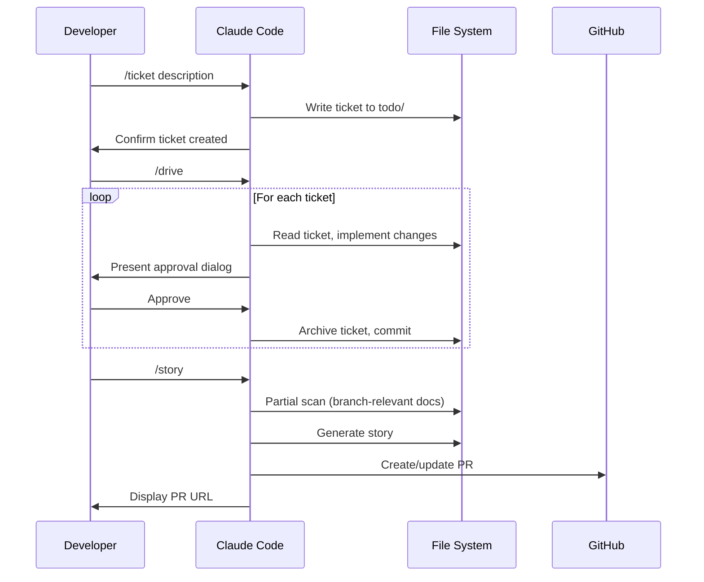

[English](usecase.md) | [Japanese](usecase_ja.md)

# 1. Use Case Viewpoint

Use Case Viewpoint は、developer が4つの主要 command と1つの release command を通じて Workaholic とどのようにやり取りするかを文書化し、各ユースケースのワークフロー、入出力契約、決定ポイントを記述します。すべてのやり取りは markdown ファイルが入力と出力の両方として機能する ticket-driven パターンに従います。

## 2. Primary Use Cases

### 2-1. Ticket の作成（/ticket）

`/ticket` command は自然言語の説明を引数として受け取ります（例：`/ticket add dark mode toggle to settings page`）。`ticket-organizer` subagent（model: opus）に委任し、コードベース構造、既存 ticket、関連履歴の並列ディスカバリーをオーケストレーションします。出力は検証された frontmatter を持つ `.workaholic/tickets/todo/` にコミットされた markdown ticket ファイルです。

**入力:** 希望する変更の自然言語説明。
**出力:** `.workaholic/tickets/todo/<timestamp>-<slug>.md` にコミットされた ticket ファイル。
**決定ポイント:** 重複 ticket の検出、曖昧なスコープの明確化、対象ディレクトリ（todo vs icebox）。

### 2-2. Ticket の実装（/drive）

`/drive` command は todo キューから ticket を順次実装します。`drive-navigator` subagent（model: opus）を呼び出して ticket を優先順位付けし順序付けます。各 ticket について、`drive-workflow` skill に従って変更を実装し、`AskUserQuestion` を使用して選択可能なオプション付きの承認ダイアログを提示します。

**入力:** オプションの "icebox" 引数。
**出力:** 実装されたコードとアーカイブされた ticket。
**決定ポイント:** ticket ごとの承認、abandon vs feedback、icebox 処理、新 ticket の検出。

### 2-3. ドキュメント更新（/scan）

`/scan` command は `scanner` subagent（model: opus）を呼び出して `.workaholic/` ドキュメントを更新します。Scanner は17のエージェントを並列実行します：8つの viewpoint analyst、7つの policy analyst、changelog writer、terms writer。出力はインデックスファイル更新前に検証されます。

**入力:** なし。
**出力:** 更新された spec ファイル、policy ファイル、changelog、terms、インデックス README。
**決定ポイント:** なし（完全自動化）。

### 2-4. パーシャルスキャンとレポート（/story）

`/story` command はパーシャルドキュメントスキャン（ブランチに関連するエージェントのみ）を実行し、開発 story を生成して pull request を作成または更新します。まず `scanner` subagent を partial mode で呼び出し、`select-scan-agents` を使用して `git diff --stat` に基づいて実行するエージェントを決定します。ドキュメント変更をステージングした後、`story-writer` subagent（model: opus）を呼び出してナラティブと PR を生成します。

**入力:** なし。
**出力:** 更新された `.workaholic/` ドキュメント（パーシャル）、`.workaholic/stories/` の story ファイル、GitHub pull request。
**決定ポイント:** なし（完全自動化）。

### 2-5. レポート生成（/report）

`/report` command はスキャンなしで開発 story を生成し、pull request を作成または更新します。`story-writer` subagent（model: opus）を呼び出し、`.workaholic/stories/` にナラティブドキュメントを生成して GitHub PR を作成します。

**入力:** なし。
**出力:** `.workaholic/stories/` の story ファイル、GitHub pull request。
**決定ポイント:** なし（完全自動化）。

### 2-6. リリース（/release）

`/release` command は `marketplace.json` と `plugin.json` のバージョンを更新してコミットします。デフォルトは patch バージョン増加です。

**入力:** オプションのバージョンバンプタイプ（major, minor, patch）。
**出力:** 更新されたバージョンファイル、コミットされたバージョンバンプ。
**決定ポイント:** バージョンバンプタイプ。

## 3. Workflow Sequence

## 4. Input/Output Contracts

| Command | 入力 | 主要出力 | 副作用 |
| --- | --- | --- | --- |
| `/ticket <desc>` | 自然言語 | `.workaholic/tickets/todo/*.md` | Git commit |
| `/drive` | なしまたは "icebox" | 実装されたコード + アーカイブされた ticket | 複数の git commit |
| `/scan` | なし | 更新された `.workaholic/` ドキュメント（フル） | Git commit |
| `/story` | なし | 更新されたドキュメント（パーシャル）+ story + PR | Git commit、push、PR |
| `/report` | なし | `.workaholic/stories/*.md` + PR | Git push、PR 作成 |
| `/release [type]` | オプションのバンプタイプ | 更新されたバージョンファイル | Git commit |

## 5. Assumptions

- [Explicit] 4つの主要 command とその入出力契約は `CLAUDE.md` と各 command ファイルに文書化されています。
- [Explicit] `/drive` は `drive.md` の critical rules に記載されているように、各 ticket で `AskUserQuestion` による明示的な承認を要求します。
- [Explicit] `/scan` は `scanner.md` で定義されているように17の並列エージェントを呼び出します。
- [Inferred] ワークフローはシリアル実行モデルとシングルブランチ PR 作成パターンに基づき、1人の developer が ticket を順次処理するリニアなシングルブランチ開発用に設計されています。
- [Inferred] コンフリクト解決メカニズムの不在は、任意の時点でブランチごとに1人のアクティブな developer を前提としていることを示唆しています。
