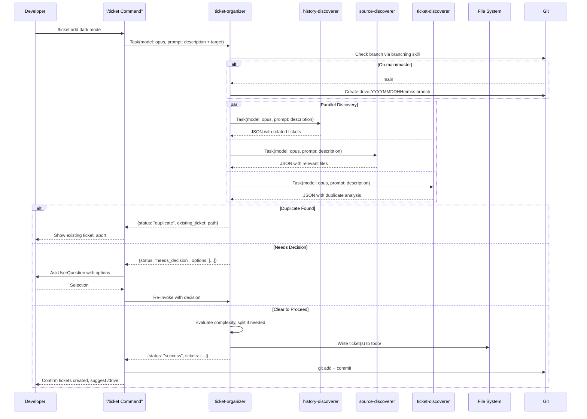
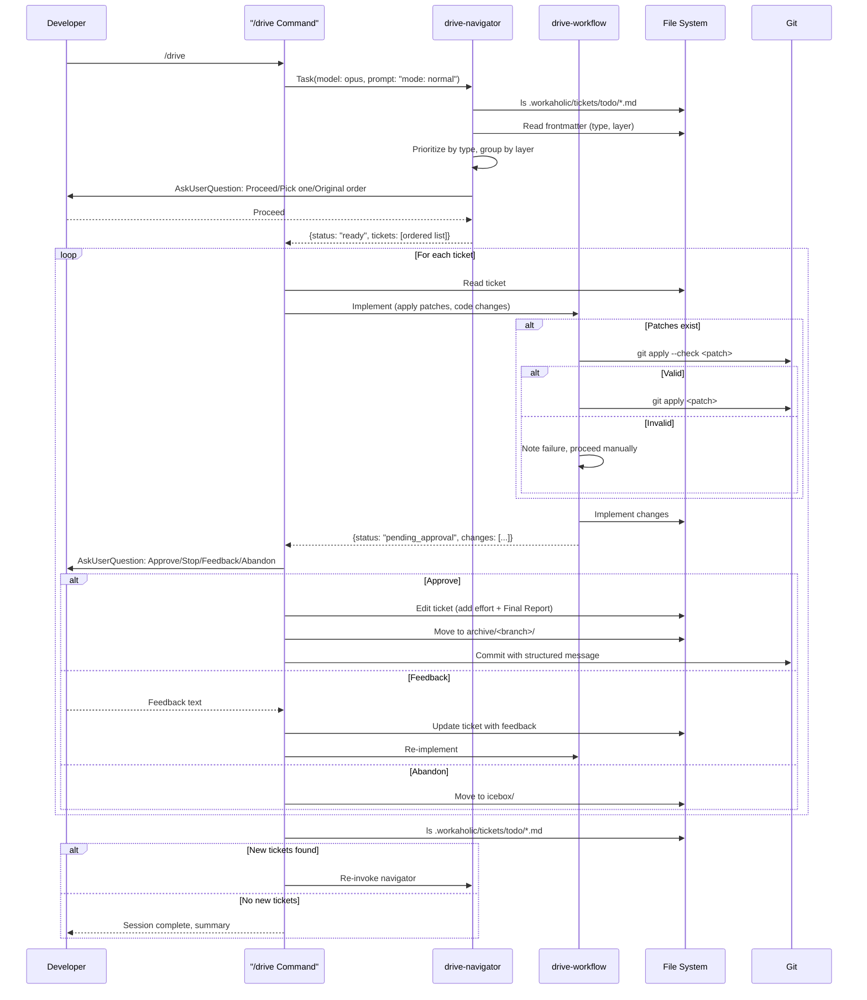
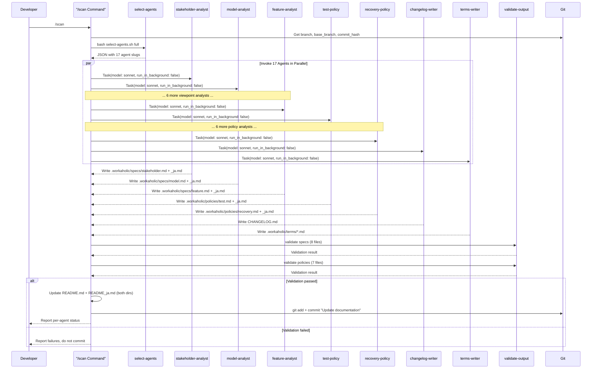
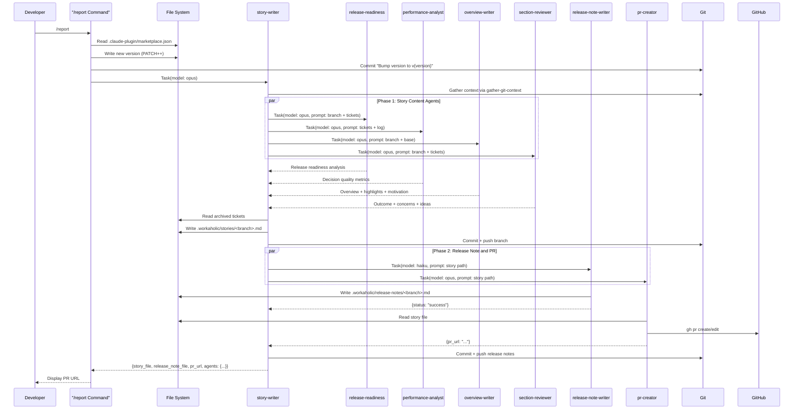

[English](usecase.md) | [Japanese](usecase_ja.md)

# Use Case Viewpoint

Use Case Viewpoint は、開発者が 5 つの主要な command を通じて Workaholic とどのようにやり取りするかを文書化します。各 use case における workflow、入出力契約、エラー経路、決定ポイントを記述します。すべてのやり取りは ticket 駆動パターンに従い、markdown file が入力と出力の両方として機能し、すべての段階で version 管理と人間によるレビューを可能にします。

## Primary Workflows

Workaholic は、4 つの連続した phase からなる ticket 駆動開発 workflow を実装します: 仕様、実装、documentation、release。各 phase は専用の command によってサポートされ、subagent と skill を orchestrate して反復的なタスクを自動化しながら、明示的な承認 gate を通じて開発者の制御を維持します。

### Ticket Creation Workflow

`/ticket` command は自然言語の description を引数として受け取り、並列 subagent 呼び出しを通じて包括的な context 発見を orchestrate します。workflow は `branching` skill を使用して現在の git branch をチェックすることから始まり、開発者が main または master にいる場合は `drive-YYYYMMDDHHmmss` format の新しい topic branch を作成します。branch 検証後、command は Task tool を介して 3 つの discovery subagent を同時に呼び出します: `history-discoverer` は関連作業のために archive された ticket を検索し、`source-discoverer` は関連する source file と code pattern を識別し、`ticket-discoverer` は todo と icebox queue を分析して潜在的な重複や重なりを見つけます。

`ticket-organizer` subagent は、`create-ticket` skill で定義された format に従って discovery 結果を implementation ticket に統合します。各 ticket には、`created_at`、`author`、`type`、`layer` field を持つ YAML frontmatter が含まれ、その後に Overview、Key Files、Related History、Implementation Steps、オプションの Patches、Considerations の markdown section が続きます。subagent は複雑さを評価し、独立した feature や無関係な architectural layer を扱う場合、単一のリクエストを 2-4 個の個別の ticket に分割する場合があります。ticket は target parameter に基づいて `.workaholic/tickets/todo/` または `.workaholic/tickets/icebox/` に書き込まれます。

command は `ticket-discoverer` から返されるいくつかの moderation シナリオを処理します: duplicate status は既存の ticket への参照とともに即座に終了をトリガーし、needs-decision status は `AskUserQuestion` を介して merge/split オプションを開発者に提示し、needs-clarification status は開発者が続行する前に答えなければならない質問を返します。正常に完了すると、command は `git add` で ticket file を stage し、"Add ticket for <short-description>" format の message で commit し、開発者に実装のために `/drive` を実行するよう指示します。

### Ticket Implementation Workflow

`/drive` command は、`drive-navigator` subagent によって決定されたインテリジェントな優先順位で `.workaholic/tickets/todo/` から ticket を実装します。navigator は `ls -1 .workaholic/tickets/todo/*.md` を使用してすべての todo ticket をリストし、各 ticket の frontmatter を読み取って `type` と `layer` field を抽出し、bugfix ticket が enhancement と refactoring ticket よりも優先され、それらが housekeeping ticket よりも優先される優先順位付けを適用します。navigator は context 効率を最大化するために architectural layer ごとに ticket をグループ化し、選択可能なオプション (Proceed、Pick one、Original order) を持つ `AskUserQuestion` を介して開発者に優先順位付けされた list を提示し、status "ready" と順序付けられた ticket array を持つ JSON object を返します。

navigator の list 内の各 ticket について、drive command は `drive-workflow` skill に従います: ticket を読んで要件を理解し、Patches section が存在する場合は patch を適用し (`git apply --check` で検証してから `git apply`)、Implementation Steps に従って変更を実装し、CLAUDE.md に従って type check を実行し、status "pending_approval" を持つ summary JSON を返します。その後、command は `drive-approval` skill を呼び出して、4 つの選択可能なオプションを持つ `AskUserQuestion` を介して承認ダイアログを提示します: Approve (archive して続行)、Approve and stop (archive してセッション終了)、自由形式の feedback を提供 (ticket を更新して再実装)、または Abandon (実装せずに icebox に移動)。

開発者が ticket を承認すると、command は `write-final-report` skill に従い、Edit tool を使用して ticket file に effort 推定と Final Report section を追加します。frontmatter 更新が成功したことを確認した後、`archive-ticket` skill を呼び出し、ticket を todo から `.workaholic/tickets/archive/<branch>/` に移動し、`format-commit-message` guideline に従った構造化 message で commit します: title 行、空白行、Motivation section、UX Change section、Arch Change section、空白行、co-authorship attribution。frontmatter 検証が失敗した場合、archive 操作は即座に失敗し、不完全な ticket が archive に入るのを防ぎます。navigator の list からすべての ticket を処理した後、drive command は session 中に追加された ticket のために todo directory を再チェックし、新しい ticket が見つかった場合は navigator を再呼び出しします。

todo queue が空の場合、navigator は `.workaholic/tickets/icebox/` をチェックし、icebox ticket で作業するかどうかを `AskUserQuestion` を介して開発者に尋ねます。開発者は "Work on icebox" (icebox mode をトリガー) または "Stop" (session を終了) を選択できます。icebox mode では、navigator は icebox ticket をリストして選択可能なオプションとして提示し、選択された ticket を todo に移動し、実装のために返します。drive command は、複数の navigator batch にわたって実装された ticket の総数、作成された commit の総数、すべての commit hash の list を追跡する session 全体のカウンターを維持します。

### Documentation Workflow

`/scan` command は、17 の documentation agent を直接並列に呼び出すことで `.workaholic/` documentation を更新し、各 agent のリアルタイム進行状況の可視性を提供します。command は `gather-git-context` skill を使用して git context (branch、base_branch、repo_url) を収集し、`git rev-parse --short HEAD` を介して現在の commit hash を取得することから始まります。次に、mode "full" で `select-scan-agents` skill を実行して、17 agent の完全な list を取得します: 8 つの viewpoint analyst (stakeholder、model、usecase、infrastructure、application、component、data、feature)、7 つの policy analyst (test、security、quality、accessibility、observability、delivery、recovery)、changelog writer、terms writer。

scan command は、並列 Task tool call を使用して単一の message ですべての 17 agent を呼び出し、各 agent は model "sonnet" を使用し、適切な prompt context (analyst には base branch、changelog writer には repository URL、terms writer には branch name) を受け取ります。すべての呼び出しは、agent が Write/Edit permission を必要とし、interactive prompt access を必要とするため、デフォルトの `run_in_background: false` parameter を使用する必要があります。background agent は prompt を受け取ることができず、すべての file 書き込みが自動拒否されます。すべての agent が完了した後、command は `.workaholic/specs/` (8 viewpoint file) と `.workaholic/policies/` (7 policy file) の両方について `validate-writer-output` skill を使用して出力を検証します。

検証が合格すると、scan command は `write-spec` skill の index file rule に従って、specs と policies directory の両方で index file (README.md と README_ja.md) を更新します。次に、`git add CHANGELOG.md .workaholic/specs/ .workaholic/terms/ .workaholic/policies/` ですべての documentation 変更を stage し、message "Update documentation" で commit します。command は、どの agent が成功、失敗、またはスキップされたかを示す agent ごとの status を、検証結果とともに報告します。

### Report Generation Workflow

`/report` command は、documentation scan を実行せずに開発 story を生成し、GitHub pull request を作成または更新します。command は最初に CLAUDE.md Version Management section に従って version を bump します: `.claude-plugin/marketplace.json` から現在の version を読み取り、PATCH component をインクリメントし (例: 1.0.0 → 1.0.1)、新しい version で `.claude-plugin/marketplace.json` と `plugins/core/.claude-plugin/plugin.json` の両方を更新し、version file を stage し、message "Bump version to v{new_version}" で commit します。

version bump 後、report command は `story-writer` subagent (model: opus) を呼び出し、story content 生成のために並列 subagent 呼び出しを orchestrate します。story-writer は `gather-git-context` を使用して git context を収集し、次に 4 つの agent を並列に呼び出します: `release-readiness` は branch の release readiness を分析し、`performance-analyst` は decision quality を評価し、`overview-writer` は overview と highlight を生成し、`section-reviewer` は outcome 分析と concern を生成します。4 つの agent すべてが完了するのを待った後、story-writer は Glob pattern `.workaholic/tickets/archive/<branch>/*.md` を使用して archive された ticket を読み取り、`write-story` skill の content structure と template に従って story file を書き込みます。

story-writer は story file を commit し、`git push -u origin <branch-name>` で branch を push し、次にさらに 2 つの agent を並列に呼び出します: `release-note-writer` (model: haiku) は `.workaholic/release-notes/<branch>.md` に簡潔な release note を生成し、`pr-creator` (model: opus) は story file を読み取り、最初の Summary item から PR title を導出し、`create-pr` skill を実行して `gh` CLI 操作を実行して pull request を作成または更新します。story-writer は release note を stage して commit し、再度 push し、story_file path、release_note_file path、pr_url、agent ごとの status を含む JSON object を返します。report command は必須出力として PR URL を表示します。

### Release Workflow

`/release` command (まだ実装されていませんが CLAUDE.md に文書化されています) は marketplace version を bump し、新しい release を公開します。version bump type (major、minor、または patch) を指定するオプションの引数を受け取り、提供されない場合はデフォルトで patch になります。command は `.claude-plugin/marketplace.json` から現在の version を読み取り、適切な version component をインクリメントし、version を同期させるために `marketplace.json` と `plugins/core/.claude-plugin/plugin.json` の両方を更新し、変更を stage し、message "Bump version to v{new_version}" で commit します。GitHub Action `release.yml` は、version bump commit が main に到達したときに release を作成します。

## Command Contracts

### /ticket Command

**Invocation Format:** `/ticket <description>`

**Input Contract:**
- Required: 望ましい変更の自然言語 description
- Optional: なし
- Environment: git repository 内である必要がある

**Output Contract:**
- Success: `.workaholic/tickets/todo/` または `.workaholic/tickets/icebox/` 内の 1 つ以上の ticket file
- Commit: "Add ticket for <short-description>"
- Response: status "success" と tickets array を持つ ticket-organizer からの JSON
- Side effects: main/master にいる場合、新しい topic branch を作成する可能性がある

**Error Paths:**
- Duplicate detected: existing_ticket path を持つ status "duplicate" を返す
- Ambiguous scope: questions array を持つ status "needs_clarification" を返す
- Merge/split decision: options array を持つ status "needs_decision" を返す
- Git failure: ticket を書き込まずに command が中止される

**Decision Points:**
- Branch creation (main/master にいる場合は自動)
- Target directory (todo vs icebox、ticket-organizer への引数として渡される)
- Ticket splitting (ticket-organizer の複雑さ評価によって処理される)
- Duplicate handling (開発者が続行するかキャンセルするかを選択)

### Ticket Creation Sequence

```mermaid
sequenceDiagram
    participant Dev as Developer
    participant Cmd as "/ticket Command"
    participant TO as ticket-organizer
    participant HD as history-discoverer
    participant SD as source-discoverer
    participant TD as ticket-discoverer
    participant FS as File System
    participant Git as Git

    Dev->>Cmd: /ticket add dark mode
    Cmd->>TO: Task(model: opus, prompt: description + target)
    TO->>Git: Check branch via branching skill
    alt On main/master
        Git-->>TO: main
        TO->>Git: Create drive-YYYYMMDDHHmmss branch
    end

    par Parallel Discovery
        TO->>HD: Task(model: opus, prompt: description)
        HD-->>TO: JSON with related tickets
    and
        TO->>SD: Task(model: opus, prompt: description)
        SD-->>TO: JSON with relevant files
    and
        TO->>TD: Task(model: opus, prompt: description)
        TD-->>TO: JSON with duplicate analysis
    end

    alt Duplicate Found
        TO-->>Cmd: {status: "duplicate", existing_ticket: path}
        Cmd-->>Dev: Show existing ticket, abort
    else Needs Decision
        TO-->>Cmd: {status: "needs_decision", options: [...]}
        Cmd->>Dev: AskUserQuestion with options
        Dev-->>Cmd: Selection
        Cmd->>TO: Re-invoke with decision
    else Clear to Proceed
        TO->>TO: Evaluate complexity, split if needed
        TO->>FS: Write ticket(s) to todo/
        TO-->>Cmd: {status: "success", tickets: [...]}
        Cmd->>Git: git add + commit
        Cmd-->>Dev: Confirm tickets created, suggest /drive
    end
```

### /drive Command

**Invocation Format:** `/drive` または `/drive icebox`

**Input Contract:**
- Required: なし
- Optional: icebox mode を有効にする "icebox" 引数
- Environment: `.workaholic/tickets/todo/` directory が必要

**Output Contract:**
- Success: 複数の commit、それぞれ "<title>\n\nMotivation: ...\nUX Change: ...\nArch Change: ..." format
- Side effects: ticket を todo から `.workaholic/tickets/archive/<branch>/` に移動
- Response: すべての batch にわたって実装された ticket と作成された commit の summary

**Error Paths:**
- Empty queue: icebox をチェック、開発者に prompt、または "No tickets" を返す
- Implementation blocked: 停止し、開発者に icebox/skip/abort への移動を尋ねる
- Frontmatter update failure: archiving を中止、エラーを報告、続行しない
- Patch apply failure: 失敗を記録し、manual 実装で続行
- Type check failure: approval dialog の前に停止、修正が必要

**Decision Points:**
- Ticket priority order (開発者が AskUserQuestion を介して確認)
- Per-ticket approval (Approve、Approve and stop、Feedback、Abandon)
- Icebox processing (開発者が icebox で作業するかどうかを選択)
- New ticket detection (各 batch 後の自動再チェック)

### Drive Implementation Sequence

```mermaid
sequenceDiagram
    participant Dev as Developer
    participant Cmd as "/drive Command"
    participant Nav as drive-navigator
    participant Wf as drive-workflow
    participant FS as File System
    participant Git as Git

    Dev->>Cmd: /drive
    Cmd->>Nav: Task(model: opus, prompt: "mode: normal")
    Nav->>FS: ls .workaholic/tickets/todo/*.md
    Nav->>FS: Read frontmatter (type, layer)
    Nav->>Nav: Prioritize by type, group by layer
    Nav->>Dev: AskUserQuestion: Proceed/Pick one/Original order
    Dev-->>Nav: Proceed
    Nav-->>Cmd: {status: "ready", tickets: [ordered list]}

    loop For each ticket
        Cmd->>FS: Read ticket
        Cmd->>Wf: Implement (apply patches, code changes)
        alt Patches exist
            Wf->>Git: git apply --check <patch>
            alt Valid
                Wf->>Git: git apply <patch>
            else Invalid
                Wf->>Wf: Note failure, proceed manually
            end
        end
        Wf->>FS: Implement changes
        Wf-->>Cmd: {status: "pending_approval", changes: [...]}
        Cmd->>Dev: AskUserQuestion: Approve/Stop/Feedback/Abandon

        alt Approve
            Cmd->>FS: Edit ticket (add effort + Final Report)
            Cmd->>FS: Move to archive/<branch>/
            Cmd->>Git: Commit with structured message
        else Feedback
            Dev-->>Cmd: Feedback text
            Cmd->>FS: Update ticket with feedback
            Cmd->>Wf: Re-implement
        else Abandon
            Cmd->>FS: Move to icebox/
        end
    end

    Cmd->>FS: ls .workaholic/tickets/todo/*.md
    alt New tickets found
        Cmd->>Nav: Re-invoke navigator
    else No new tickets
        Cmd-->>Dev: Session complete, summary
    end
```

### /scan Command

**Invocation Format:** `/scan`

**Input Contract:**
- Required: なし
- Optional: なし
- Environment: `.workaholic/` directory を持つ git repository 内である必要がある

**Output Contract:**
- Success: message "Update documentation" を持つ単一の commit
- Modified files: CHANGELOG.md、`.workaholic/specs/*.md`、`.workaholic/policies/*.md`、`.workaholic/terms/*.md`、README file
- Response: 検証結果を含む agent ごとの status report

**Error Paths:**
- Agent failure: 残りの agent で続行、status で失敗を報告
- Validation failure: 検証に失敗した file を報告、commit しない
- Git failure: documentation 変更を commit せずに中止

**Decision Points:** なし (完全自動)

### Scan Execution Sequence

```mermaid
sequenceDiagram
    participant Dev as Developer
    participant Cmd as "/scan Command"
    participant SA as select-agents
    participant V1 as stakeholder-analyst
    participant V2 as model-analyst
    participant V8 as feature-analyst
    participant P1 as test-policy
    participant P7 as recovery-policy
    participant CW as changelog-writer
    participant TW as terms-writer
    participant Val as validate-output
    participant Git as Git

    Dev->>Cmd: /scan
    Cmd->>Git: Get branch, base_branch, commit_hash
    Cmd->>SA: bash select-agents.sh full
    SA-->>Cmd: JSON with 17 agent slugs

    par Invoke 17 Agents in Parallel
        Cmd->>V1: Task(model: sonnet, run_in_background: false)
        Cmd->>V2: Task(model: sonnet, run_in_background: false)
        Note over Cmd,V8: ... 6 more viewpoint analysts ...
        Cmd->>V8: Task(model: sonnet, run_in_background: false)
        Cmd->>P1: Task(model: sonnet, run_in_background: false)
        Note over Cmd,P7: ... 6 more policy analysts ...
        Cmd->>P7: Task(model: sonnet, run_in_background: false)
        Cmd->>CW: Task(model: sonnet, run_in_background: false)
        Cmd->>TW: Task(model: sonnet, run_in_background: false)
    end

    V1-->>Cmd: Write .workaholic/specs/stakeholder.md + _ja.md
    V2-->>Cmd: Write .workaholic/specs/model.md + _ja.md
    V8-->>Cmd: Write .workaholic/specs/feature.md + _ja.md
    P1-->>Cmd: Write .workaholic/policies/test.md + _ja.md
    P7-->>Cmd: Write .workaholic/policies/recovery.md + _ja.md
    CW-->>Cmd: Write CHANGELOG.md
    TW-->>Cmd: Write .workaholic/terms/*.md

    Cmd->>Val: validate specs (8 files)
    Val-->>Cmd: Validation result
    Cmd->>Val: validate policies (7 files)
    Val-->>Cmd: Validation result

    alt Validation passed
        Cmd->>Cmd: Update README.md + README_ja.md (both dirs)
        Cmd->>Git: git add + commit "Update documentation"
        Cmd-->>Dev: Report per-agent status
    else Validation failed
        Cmd-->>Dev: Report failures, do not commit
    end
```

### /report Command

**Invocation Format:** `/report`

**Input Contract:**
- Required: なし
- Optional: なし
- Environment: archive された ticket を持つ git repository 内である必要がある

**Output Contract:**
- Success: 2 つの commit ("Bump version to v{version}"、"Add branch story for {branch}"、"Add release notes for {branch}")
- Files created: `.workaholic/stories/<branch>.md`、`.workaholic/release-notes/<branch>.md`
- GitHub: 作成または更新された pull request
- Response: PR URL (必須)

**Error Paths:**
- Version read failure: story 生成前に中止
- Story-writer agent failure: どの agent が失敗したかを報告、それでも PR を作成する可能性がある
- PR creation failure: エラーを報告、story file はまだ存在する
- Git push failure: PR 作成を中止

**Decision Points:** なし (完全自動)

### Report Generation Sequence

```mermaid
sequenceDiagram
    participant Dev as Developer
    participant Cmd as "/report Command"
    participant FS as File System
    participant SW as story-writer
    participant RR as release-readiness
    participant PA as performance-analyst
    participant OW as overview-writer
    participant SR as section-reviewer
    participant RNW as release-note-writer
    participant PRC as pr-creator
    participant Git as Git
    participant GH as GitHub

    Dev->>Cmd: /report
    Cmd->>FS: Read .claude-plugin/marketplace.json
    Cmd->>FS: Write new version (PATCH++)
    Cmd->>Git: Commit "Bump version to v{version}"

    Cmd->>SW: Task(model: opus)
    SW->>Git: Gather context via gather-git-context

    par Phase 1: Story Content Agents
        SW->>RR: Task(model: opus, prompt: branch + tickets)
        SW->>PA: Task(model: opus, prompt: tickets + log)
        SW->>OW: Task(model: opus, prompt: branch + base)
        SW->>SR: Task(model: opus, prompt: branch + tickets)
    end

    RR-->>SW: Release readiness analysis
    PA-->>SW: Decision quality metrics
    OW-->>SW: Overview + highlights + motivation
    SR-->>SW: Outcome + concerns + ideas

    SW->>FS: Read archived tickets
    SW->>FS: Write .workaholic/stories/<branch>.md
    SW->>Git: Commit + push branch

    par Phase 2: Release Note and PR
        SW->>RNW: Task(model: haiku, prompt: story path)
        SW->>PRC: Task(model: opus, prompt: story path)
    end

    RNW->>FS: Write .workaholic/release-notes/<branch>.md
    RNW-->>SW: {status: "success"}

    PRC->>FS: Read story file
    PRC->>GH: gh pr create/edit
    PRC-->>SW: {pr_url: "..."}

    SW->>Git: Commit + push release notes
    SW-->>Cmd: {story_file, release_note_file, pr_url, agents: {...}}
    Cmd-->>Dev: Display PR URL
```

### /release Command

**Invocation Format:** `/release` または `/release [major|minor|patch]`

**Input Contract:**
- Required: なし
- Optional: Version bump type (major、minor、patch)
- Environment: main branch にいる必要がある

**Output Contract:**
- Success: message "Bump version to v{new_version}" を持つ単一の commit
- Modified files: `.claude-plugin/marketplace.json`、`plugins/core/.claude-plugin/plugin.json`
- GitHub Action: main への push で release.yml をトリガー

**Error Paths:**
- Not on main branch: エラー message で中止
- Version read failure: file を変更せずに中止
- Version file write failure: file が不整合な状態になる可能性がある
- Commit failure: Version file は変更されたが commit されていない

**Decision Points:**
- Version bump type (デフォルトは patch)

## Step-by-Step Sequences

### Complete Development Cycle

典型的な開発サイクルは、4 つの command を順番に進めます: 仕様を作成する `/ticket`、変更を実装して commit する `/drive`、包括的な documentation を更新する `/scan`、開発 story を生成して pull request を作成する `/report`。

**Step 1: Feature Request → Ticket**

開発者は `/ticket add OAuth2 integration for Google login` を呼び出します。command は新しい branch `drive-20260209-153000` を作成し、3 つの discovery subagent を並列に実行する `ticket-organizer` を呼び出し、結果を frontmatter、Key Files section、Related History section、Implementation Steps、Patches、Considerations を持つ ticket に統合します。ticket は `.workaholic/tickets/todo/20260209153000-add-oauth2-google-login.md` に書き込まれ、commit されます。

**Step 2: Ticket → Implementation**

開発者は `/drive` を呼び出します。`drive-navigator` は OAuth2 ticket をリストし、Infrastructure layer に影響する enhancement であると判断し、優先順位を開発者に提示し、開発者は Proceed を選択します。drive command は ticket を読み取り、Patches section から `git apply --check` を使用してから `git apply` で patch を適用し、残りの step を実装し、type check を実行し、approval dialog を提示します。開発者は Approve を選択します。command は effort "1.5h" を持つ Final Report section を追加し、ticket を `.workaholic/tickets/archive/drive-20260209-153000/` に移動し、Motivation、UX Change、Arch Change section を含む構造化 message で commit します。

**Step 3: Implementation → Documentation**

開発者は `/scan` を呼び出します。command は git context を収集し、17 agent を並列に呼び出し (stakeholder-analyst、model-analyst、usecase-analyst、infrastructure-analyst、application-analyst、component-analyst、data-analyst、feature-analyst、test-policy-analyst、security-policy-analyst、quality-policy-analyst、accessibility-policy-analyst、observability-policy-analyst、delivery-policy-analyst、recovery-policy-analyst、changelog-writer、terms-writer)、出力を検証し、specs と policies directory で README index file を更新し、すべての変更を stage し、message "Update documentation" で commit します。

**Step 4: Documentation → Pull Request**

開発者は `/report` を呼び出します。command は version を 1.0.5 から 1.0.6 に bump し、version 変更を commit し、4 つの content agent を並列に実行する `story-writer` を呼び出し (release-readiness、performance-analyst、overview-writer、section-reviewer)、結果を `write-story` skill template に従って `.workaholic/stories/drive-20260209-153000.md` に統合し、story file を commit して push し、`release-note-writer` と `pr-creator` を並列に呼び出し、release note を commit し、PR URL を表示します。開発者は GitHub で PR をレビューし、準備ができたら merge します。

### Error Recovery Patterns

**Abandoned Ticket Recovery**

開発者が `/drive` 承認中に Abandon を選択すると、command は ticket を `.workaholic/tickets/todo/` から `.workaholic/tickets/icebox/` に archive や commit をせずに移動します。ticket は将来の実装のために利用可能なままです。開発者が後で `/drive` を実行すると、navigator は空の todo queue を検出し、icebox をチェックし、AskUserQuestion を介して "Work on icebox or Stop?" を尋ねます。開発者が "Work on icebox" を選択すると、navigator は icebox ticket をリストして選択を許可します。選択された ticket は todo に戻され、実装は通常通り進行します。

**Feedback Loop Recovery**

開発者が `/drive` 承認中に "Other" オプションを介して feedback を提供すると、command は `drive-approval` skill Section 3 に従います: timestamp と "User feedback:" をプレフィックスとして ticket の Implementation Steps section を更新し、更新された ticket に基づいて変更を再実装し、承認ダイアログを再提示します。このループは、開発者が Approve、Approve and stop、または Abandon を選択するまで続きます。ticket file は真実の source として機能し、常に完全な実装計画を反映します。

**Frontmatter Update Failure**

`/drive` 承認中に ticket に effort と Final Report を追加するときに Edit tool が失敗すると、command は即座に停止し、開発者にエラーを報告します。archive 操作は続行せず、不完全な ticket が archive に入るのを防ぎます。開発者は ticket file を手動で修正するか、問題を解決した後に `/drive` を再実行する必要があります。

**Agent Failure Recovery**

`/scan` または `/report` 中に agent が失敗すると、system は残りの agent で続行し、agent ごとの status で失敗を報告します。`/scan` の場合、失敗した agent は documentation file の欠落を引き起こしますが、他の agent が成功するのを妨げません。検証は欠落した file を検出し、commit を中止します。`/report` の場合、失敗した content agent (release-readiness、performance-analyst、overview-writer、section-reviewer) は不完全な story section を引き起こしますが、story file はまだ作成され、PR 作成は続行します。開発者は story file を手動で更新し、PR を更新するために `/report` を再実行できます。

## Error Handling

### Command-Level Error Handling

すべての command は一貫したエラー処理パターンに従います: subagent を呼び出す前に入力を検証し、file 操作の前に git 状態をチェックし、破壊的操作に対して AskUserQuestion を介した明示的な承認 gate を使用し、実行可能な message で開発者にエラーを報告し、重大な失敗が発生したときに副作用なしで中止します。command はオープンエンドのテキスト質問を使用しません。すべての開発者とのやり取りは、AskUserQuestion `options` parameter を介した選択可能なオプションを使用します。

### Subagent Error Handling

Subagent は出力の JSON status field を通じてエラーを伝達します。`ticket-organizer` は、親 command が処理するための context を持つ status "duplicate"、"needs_decision"、または "needs_clarification" を返します。`drive-navigator` は queue 状態を示すために status "empty"、"stopped"、または "icebox" を返します。`story-writer` は、呼び出す 6 つの agent のそれぞれについて "success" または "failed" を持つ agent ごとの status を出力 JSON に含めます。親 command はこれらの status code を解釈し、適切な prompt を提示するか操作を中止します。

### Git Operation Failures

git 操作 (add、commit、push、apply) を使用する command は終了コードをチェックし、失敗時に中止します。`drive-workflow` skill は、マルチコントリビューター環境でのデータ損失を防ぐために、破壊的な git command (`git clean`、`git checkout .`、`git restore .`、`git reset --hard`、`git stash drop`) を禁止します。patch は適用前に `git apply --check` で検証されます。`/ticket` 中の branch 作成は `branching` skill を使用し、topic branch を作成する前に uncommitted 変更と既存の branch name をチェックします。

### File System Failures

Write 操作は、親 directory を自動的に作成する Write tool を使用します。Edit tool は、置換前に old_string が存在し、一意であることを検証し、ターゲット content が見つからないか曖昧な場合は失敗します。Read tool は、欠落した file を空の content を返すことで処理し、subagent は "file does not exist" として解釈します。`validate-writer-output` skill の検証 script は、documentation commit を承認する前に、file の存在、空でない content、有効な frontmatter をチェックします。

## Assumptions

- [Explicit] 5 つの主要な command とその入出力契約は、`CLAUDE.md` と `plugins/core/commands/` 内の個々の command markdown file に文書化されています。
- [Explicit] `/drive` は、drive.md critical rule に記載されているように、選択可能なオプションを持つ `AskUserQuestion` を介して各 ticket で明示的な承認を必要とします。
- [Explicit] `/scan` は、scan.md Phase 3 で定義されているように 17 agent を並列に呼び出し、各 agent は Write/Edit permission を維持するために `run_in_background: false` (default) を使用します。
- [Explicit] `/report` は、report.md instructions step 1 に文書化されているように、story を生成する前に version を bump します。
- [Explicit] すべての command は、subagent frontmatter または command instruction で指定された model parameter で、subagent を呼び出すために Task tool を使用します。
- [Inferred] workflow は、`/drive` の serial 実行 model と `/report` の single-branch PR 作成に基づいて、1 人の開発者が順番に ticket を処理する線形の single-branch 開発を想定しています。
- [Inferred] `drive-workflow` に conflict 解決メカニズムがないことは、system が branch ごとに一度に 1 人のアクティブな開発者を想定していることを示唆しています。
- [Inferred] `/drive` で各 ticket で開発者の承認を必要とすることは、人間の監視を維持するために自動化されたエンドツーエンドの実装が意図的に回避されていることを示唆しています。
- [Inferred] ticket、story、documentation に markdown file を使用することは、binary または database storage よりも人間が読みやすく、version 管理された成果物を好むことを示唆しています。
- [Inferred] `/scan` (完全な documentation) と `/report` での partial scan (branch 関連の documentation) の分離は、完全な scan が選択的に実行される高価な操作であり、partial scan は routine PR 作成に十分安価であることを示唆しています。
