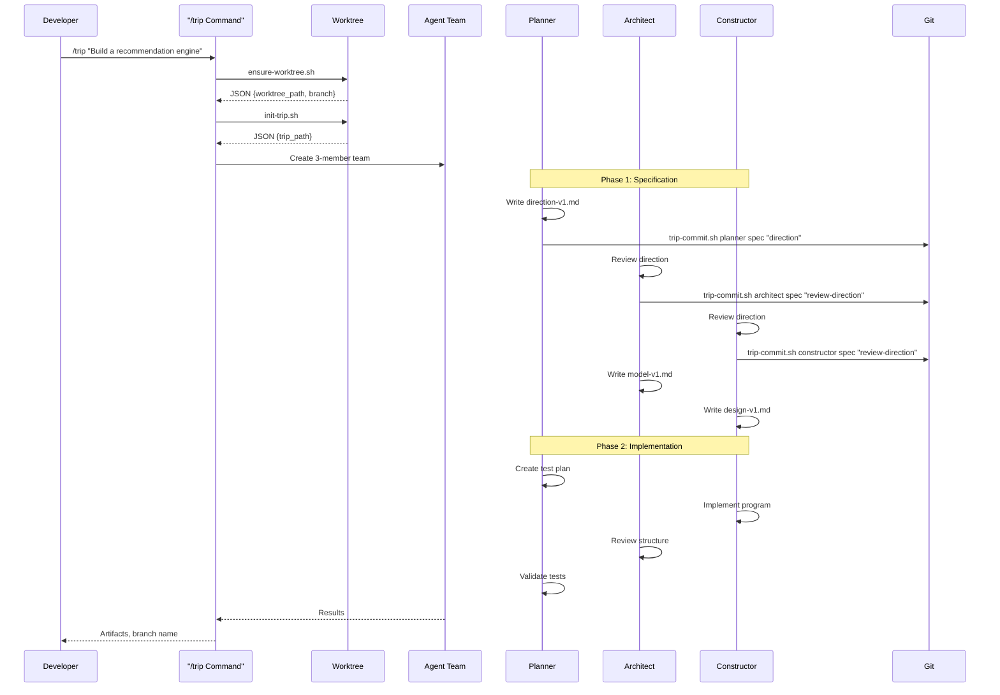
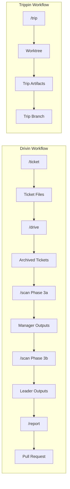

[English](usecase.md) | [Japanese](usecase_ja.md)

# Use Case Viewpoint

Use Case Viewpoint は、開発者が 2 つの plugin にわたる 5 つの command を通じて Workaholic とどのようにインタラクションするかを文書化し、各ユースケースの workflow、入出力契約、エラーパス、判断ポイントを説明します。すべてのインタラクションは、markdown ファイルが入力と出力の両方として機能する ticket 駆動パターン（drivin plugin）か、3 つの agent が隔離された git worktree でバージョン管理された markdown artifact を通じて協働する artifact 駆動探索パターン（trippin plugin）のいずれかに従います。

## 主要 Workflow

### Drivin Workflow

Drivin は、仕様策定、実装、ドキュメント、リリースの 4 つの逐次フェーズからなる ticket 駆動の開発 workflow を実装します。

#### Ticket 作成 Workflow

`/ticket` command は自然言語の説明を引数として受け取り、並列 subagent 呼び出しを通じて包括的なコンテキスト discovery をオーケストレーションします。3 つの discovery subagent を同時に呼び出します：`history-discoverer`、`source-discoverer`、`ticket-discoverer`。

`ticket-organizer` subagent が discovery の結果を `create-ticket` skill で定義されたフォーマットに従って実装 ticket に統合します。複雑さを評価し、独立した機能や無関係なアーキテクチャレイヤーを扱う場合、単一のリクエストを 2-4 の個別 ticket に分割することがあります。

#### Ticket 実装 Workflow

`/drive` command は `drive-navigator` subagent によって決定される知的な優先順位で `.workaholic/tickets/todo/` の ticket を実装します。

各 ticket について、drive command は `drive-workflow` skill に従います。その後、`drive-approval` skill を使って `AskUserQuestion` で承認ダイアログを提示します。

承認ダイアログはプロンプトの header と question フィールドに ticket のタイトル（H1 見出しから）と概要（Overview セクションから）が存在することを要求します。これは CRITICAL ルールとして強制されます：drive command は drive-workflow の結果から `title` と `overview` フィールドを使用して承認プロンプトを構成する必要があります。これらのフィールドが利用できない場合（特にコンテキストが失われる可能性があるフィードバック再実装ループ後）、command は ticket ファイルを再読み取りする必要があります。Ticket コンテキストなしで承認プロンプトを提示することは失敗条件として扱われます。

開発者がフィードバックを提供した場合（"Other" を選択）、command はまず新しい Implementation Steps を追加し verbatim フィードバック付きの Discussion セクションを追加して ticket ファイルを更新します。再実装前に ticket が更新されたことを検証します。承認プロンプトを再び提示する前に、ticket のタイトルと概要が利用可能であることを確認します。

#### ドキュメント Workflow

`/scan` command は 2 フェーズの実行モデルで `.workaholic/` ドキュメントを更新します。Phase 3a は 3 つの manager agent を通じて戦略的コンテキストを確立します。Phase 3b は manager の出力を消費する 13 の leader/writer agent を通じて戦術的ドキュメントを生成します。

##### Phase 3a：戦略的コンテキスト確立

3 つの manager agent（project-manager、architecture-manager、quality-manager）を並列に呼び出します。各 manager は制約設定 workflow（Analyze、Ask、Propose、Produce）に従います。

##### Phase 3b：戦術的ポリシー生成

Manager の完了後、13 の leader/writer agent を並列に呼び出します。各 leader agent は分析前に関連する manager の出力を戦略的入力として読み取ります。

#### Report 生成 Workflow

`/report` command は開発 story を生成し、GitHub pull request を作成/更新します。最初にバージョンバンプが既に発生しているかをチェックし、操作をべき等にします。バージョンバンプは marketplace.json と両 plugin の plugin.json の 3 つのバージョンファイルを更新します。

### Trippin Workflow

#### 探索セッション Workflow

`/trip` command は創造的な探索と開発のための協働 Agent Teams セッションを起動します。

**Step 1: Worktree 作成**。Command はタイムスタンプから trip 名を生成し、`ensure-worktree.sh` を実行して `.worktrees/<trip-name>/` に `trip/<trip-name>` branch で隔離された git worktree を作成します。

**Step 2: Trip Artifact 初期化**。Worktree 内で `init-trip.sh` を実行し、`.workaholic/.trips/<trip-name>/` に `directions/`、`models/`、`designs/` サブディレクトリを持つ artifact ディレクトリ構造を作成します。

**Step 3: Agent Teams 起動**。Planner、Architect、Constructor agent で 3 メンバーの Agent Team を作成します。

**Phase 1（Specification）**: Planner が `directions/direction-v1.md` を作成。Architect と Constructor がそれぞれレビューし review note を追加。不一致が発生した場合、関与していない第 3 の agent が仲裁。リビジョンは `direction-v2.md`、`direction-v3.md` 等を生成。コンセンサスに達したら Architect が `models/model-v1.md` を、Constructor が `designs/design-v1.md` を作成。3 つの artifact が相互に一致しすべての agent がコンセンサスを確認するまで反復。

**Phase 2（Implementation）**: Planner がテスト計画を作成。Constructor がプログラムを実装。Architect が構造的整合性をレビュー。Planner がテストで検証。すべての agent が承認するまで反復。

両フェーズのすべての離散的ステップが `trip-commit.sh` を通じて git commit を生成します。

**Step 4: 結果の提示**。作成されたすべての artifact のリスト、合意された direction/model/design のサマリー、実装結果の報告、worktree branch 名を表示します。

#### Trip Workflow シーケンス

```mermaid
sequenceDiagram
    participant Dev as Developer
    participant Cmd as "/trip Command"
    participant WT as Worktree
    participant Team as Agent Team
    participant P as Planner
    participant A as Architect
    participant C as Constructor
    participant Git as Git

    Dev->>Cmd: /trip "Build a recommendation engine"
    Cmd->>WT: ensure-worktree.sh
    WT-->>Cmd: JSON {worktree_path, branch}
    Cmd->>WT: init-trip.sh
    WT-->>Cmd: JSON {trip_path}
    Cmd->>Team: Create 3-member team

    Note over P,C: Phase 1: Specification

    P->>P: Write direction-v1.md
    P->>Git: trip-commit.sh planner spec "direction"
    A->>A: Review direction
    A->>Git: trip-commit.sh architect spec "review-direction"
    C->>C: Review direction
    C->>Git: trip-commit.sh constructor spec "review-direction"

    A->>A: Write model-v1.md
    C->>C: Write design-v1.md

    Note over P,C: Phase 2: Implementation

    P->>P: Create test plan
    C->>C: Implement program
    A->>A: Review structure
    P->>P: Validate tests

    Team-->>Cmd: Results
    Cmd-->>Dev: Artifacts, branch name
```

## Command 契約

### /ticket Command

**Plugin:** drivin
**呼び出し形式:** `/ticket <description>`

**入力契約:**
- 必須：変更の自然言語説明
- 環境：git repository 内であること

**出力契約:**
- 成功：`.workaholic/tickets/todo/` または `.workaholic/tickets/icebox/` に 1 つ以上の ticket ファイル
- Commit："Add ticket for <short-description>"

### /drive Command

**Plugin:** drivin
**呼び出し形式:** `/drive` または `/drive icebox`

**入力契約:**
- 必須：なし
- オプション："icebox" 引数

**出力契約:**
- 成功：各 "<title>\n\nMotivation: ...\nUX Change: ...\nArch Change: ..." 形式の複数 commit
- 副作用：ticket を todo から `.workaholic/tickets/archive/<branch>/` に移動

**エラーパス:**
- 空のキュー：icebox をチェック、開発者に確認
- Frontmatter 更新失敗：アーカイブを中止、エラーを報告
- 承認コンテキスト欠如：ticket ファイルを再読み取り（コンテキストが取得できない場合は失敗条件）

### /scan Command

**Plugin:** drivin
**呼び出し形式:** `/scan`

**出力契約:**
- 成功：`.workaholic/specs/`、`.workaholic/policies/`、`CHANGELOG.md`、`.workaholic/terms/` の更新されたドキュメント
- Commit："Update documentation"
- レスポンス：すべての agent（3 manager + 13 leader/writer）のステータス

### /report Command

**Plugin:** drivin
**呼び出し形式:** `/report`

**出力契約:**
- 成功：story ファイル、release note、GitHub PR 作成/更新
- Commit："Bump version to v{version}"（未バンプの場合）、"Add story"、"Add release notes"
- レスポンス：PR URL

### /trip Command

**Plugin:** trippin
**呼び出し形式:** `/trip <instruction>`

**入力契約:**
- 必須：探索/構築する内容の自然言語インストラクション
- 環境：クリーンな git 状態の git repository 内；Agent Teams 実験フラグが有効であること

**出力契約:**
- 成功：`.workaholic/.trips/<trip-name>/` のバージョン管理された artifact（directions、models、designs）、worktree 内の実装コード
- Commit：`trip/<trip-name>` branch 上の複数 commit、各 `trip(<agent>): <step>` 形式
- レスポンス：artifact のサマリー、合意された direction/model/design、実装結果、branch 名
- 副作用：`.worktrees/<trip-name>/` に git worktree を作成、`trip/<trip-name>` branch を作成

**エラーパス:**
- 不潔な git 状態：worktree を作成できず、command は説明とともに停止
- Worktree が既に存在：command は説明とともに停止
- Branch が既に存在：command が停止、クリーンアップを提案
- Agent Teams が未有効：機能が利用不可、環境変数が必要

## ユースケースの依存関係

### Cross-Command データフロー

```mermaid
flowchart LR
    subgraph "Drivin Workflow"
        T["/ticket"] --> TD[Ticket Files]
        TD --> D["/drive"]
        D --> AT[Archived Tickets]
        AT --> SP3a["/scan Phase 3a"]
        SP3a --> MO[Manager Outputs]
        MO --> SP3b["/scan Phase 3b"]
        SP3b --> LO[Leader Outputs]
        LO --> R["/report"]
        R --> PR[Pull Request]
    end

    subgraph "Trippin Workflow"
        TR["/trip"] --> WT[Worktree]
        WT --> Arts[Trip Artifacts]
        Arts --> Branch[Trip Branch]
    end
```

## Assumptions

- [Explicit] `/ticket` command は ticket-organizer に完全に委譲し、3 つの discovery agent を並列に呼び出します。
- [Explicit] `/drive` command は human approval を間に挟んで ticket を逐次処理します。
- [Explicit] `/scan` command は 2 フェーズ実行（phase 3a で manager、phase 3b で leader）を使用します。
- [Explicit] `/trip` command は worktree を作成し、trip artifact を初期化し、3 メンバーの Agent Team を起動します。
- [Explicit] Drive-approval skill は CRITICAL 強制で ticket タイトルと概要を要求します。
- [Explicit] Trip セッションは Agent Teams 実験フラグを必要とします。
- [Explicit] すべての trip workflow ステップが trip-commit.sh を通じて git commit を生成します。
- [Explicit] Core plugin は drivin に名称変更され、すべての subagent_type prefix が変更されました。
- [Explicit] バージョンバンプは 3 つのファイル（marketplace.json、drivin plugin.json、trippin plugin.json）を更新します。
- [Inferred] Trippin workflow は drivin から独立し、別の worktree branch で並行実行できます。
- [Inferred] Worktree 隔離により trip セッションがメインの作業ツリーに干渉しないことが保証されます。
- [Inferred] Trippin agent の 3 つの哲学的スタンスは弁証法的レビューを通じて徹底的な仕様策定を促進する生産的な緊張を生み出します。
