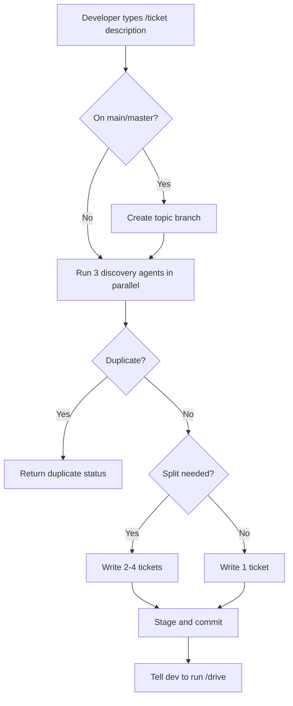
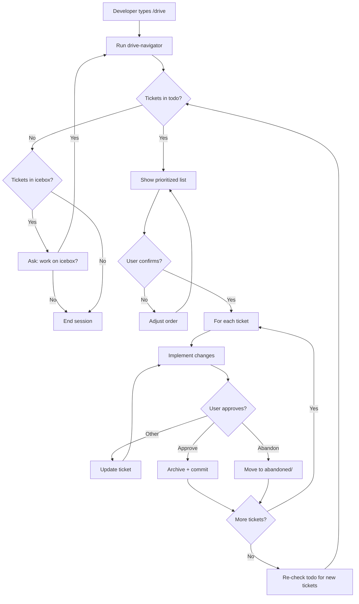
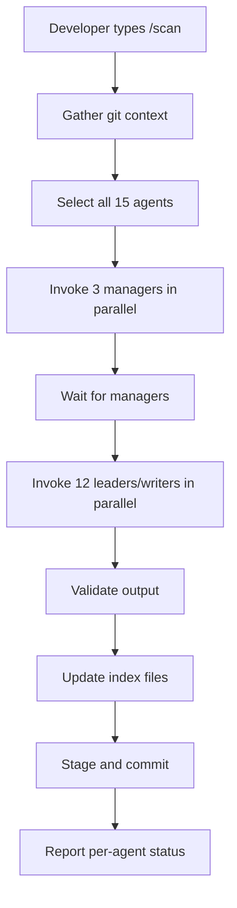
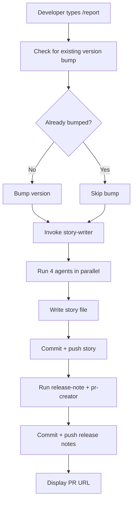

[English](ux.md) | [Japanese](ux_ja.md)

# UX Viewpoint

The UX Viewpoint examines how users experience and interact with the Workaholic plugin system, documenting the journeys they follow, the patterns they encounter, and the paths available for onboarding. Workaholic creates a triangular relationship between developers who request work, Claude Code agents that execute work, and the plugin author who maintains the system. Recent architectural changes introduced a two-tier agent hierarchy (managers then leaders) that structures how documentation generation happens, shifting from a flat analyst pattern to strategic-then-tactical execution.

## User Types and Their Goals

Workaholic serves three distinct user types whose interactions form a development ecosystem centered on ticket-driven development.

### Primary User: Developer (End User)

The developer represents the primary consumer of Workaholic. They install the plugin from the marketplace using `/plugin marketplace add qmu/workaholic` and interact exclusively through slash commands. The developer's workflow revolves around four core commands that form a complete development cycle: `/ticket` for planning changes, `/drive` for implementation, `/scan` for documentation updates, and `/report` for PR creation.

The developer operates under explicit human-in-the-loop control. During `/drive` execution, the system presents approval dialogs using `AskUserQuestion` with selectable options, requiring explicit confirmation before committing each ticket. The developer never writes tickets manually—the ticket-organizer subagent explores the codebase and writes implementation specifications on their behalf. Similarly, the developer never manually writes changelogs or PR descriptions—these generate automatically from accumulated ticket history.

The developer's fundamental goal is fast serial development without git worktree overhead. Tickets queue in `.workaholic/tickets/todo/`, implementation proceeds one ticket at a time with clear commits, and when ready to deliver, `/report` generates all documentation from the ticket archive. The bottleneck is deliberately placed on human cognition (approval decisions) rather than implementation speed (agent execution).

The developer values transparency over automation. They prefer seeing individual agent progress during `/scan` rather than waiting for a single scanner subagent to complete. They prefer explicit approval dialogs with selectable options over autonomous decisions about ticket moves or implementation deviations.

### Secondary User: Plugin Author (Maintainer)

The plugin author (currently `tamurayoshiya <a@qmu.jp>`) develops and releases the plugin. They work exclusively within the `plugins/` directory structure, adding commands to `plugins/core/commands/`, agents to `plugins/core/agents/`, skills to `plugins/core/skills/`, and rules to `plugins/core/rules/`. The author follows the architecture policy defined in `CLAUDE.md`, which enforces thin commands and subagents (orchestration only) with comprehensive skills (knowledge layer).

The author maintains version synchronization between `.claude-plugin/marketplace.json` (marketplace version) and `plugins/core/.claude-plugin/plugin.json` (plugin version). Version management follows semantic versioning with PATCH increment by default. The `/release` command automates version bumping across both files.

The author's workflow mirrors the developer's workflow but operates at the meta-level. They use the same `/ticket` and `/drive` commands to develop plugin features. Archived tickets in `.workaholic/tickets/archive/` document the evolution of the plugin itself, creating a searchable history of architectural decisions and implementation rationale.

The plugin author balances feature development with documentation maintenance. Every plugin change requires updates to multiple viewpoint specs in `.workaholic/specs/`. The `/scan` command automates this documentation update by invoking 3 manager agents then 12 leader/writer agents, providing strategic context before domain-specific analysis.

### Tertiary User: AI Agent (Claude Code)

Claude Code acts as the execution engine that receives slash commands, invokes subagents via Task tool, executes shell scripts bundled in skills, and produces artifacts (tickets, specs, stories, changelogs, PRs). The agent operates under strict architectural constraints defined in `CLAUDE.md`:

- Commands can invoke skills and subagents, but never other commands
- Subagents can invoke skills and other subagents, but never commands
- Skills can invoke only other skills, never subagents or commands

The agent follows explicit git safety protocols: never commit without user request, never use `run_in_background: true` for agents requiring Write/Edit permissions, never skip hooks, and never force push to main/master. Complex shell operations must be extracted to bundled skill scripts rather than written inline in markdown files.

The agent provides transparency through real-time progress reporting. The `/scan` command invokes all 15 documentation agents (3 managers + 12 leaders/writers) in two phases using separate Task calls within a single message, making each agent's progress visible to the developer. The two-phase execution (managers first, then leaders) ensures strategic context is available before domain-specific analysis begins.

## User Journeys

Each user type follows distinct but complementary journeys within the Workaholic ecosystem.

### Developer Journey: Feature Development Cycle

The developer's primary journey is the feature development cycle, which consists of four sequential phases that transform ideas into merged pull requests.

#### Phase 1: Ticket Creation

The developer invokes `/ticket <description>`, which delegates to the ticket-organizer subagent. The ticket-organizer runs three discovery agents in parallel (history-discoverer for related tickets, source-discoverer for relevant files, ticket-discoverer for duplicate detection), then writes a ticket to `.workaholic/tickets/todo/` with sections: Overview, Key Files, Related History, Implementation Steps, Patches (if applicable), Considerations. If on main/master, the system creates a new topic branch first.

The ticket creation journey emphasizes exploration over manual planning. The developer provides a brief description and the system explores the codebase, finds relevant context, and produces a comprehensive implementation specification. This shifts cognitive load from "figure out what files to change" to "approve or refine the proposed plan."

#### Phase 2: Implementation

The developer invokes `/drive`, which delegates to the drive-navigator subagent to list and prioritize tickets. For each ticket, the system reads the ticket file, implements the changes, requests approval via `AskUserQuestion` with selectable options (Approve, Approve and stop, Other, Abandon), and upon approval, archives the ticket to `.workaholic/tickets/archive/<branch>/` with a Final Report section documenting deviations.

The implementation journey is serial and approval-gated. Each ticket gets implemented, reviewed by the developer, and committed before the next ticket begins. This creates a clean commit-per-ticket history where each commit corresponds to exactly one archived ticket. If the developer provides feedback (selects "Other"), the system updates the ticket file and re-implements, preserving the ticket as the source of truth.

#### Phase 3: Documentation Update

The developer optionally invokes `/scan` to update all documentation. The scan command executes in two phases:

**Phase 3a (Manager Phase)**: Invokes 3 manager agents in parallel (project-manager, architecture-manager, quality-manager). Each manager analyzes the repository from a strategic perspective and produces context documents that leaders will consume.

**Phase 3b (Leader Phase)**: Invokes 12 leader/writer agents in parallel (ux-lead, model-analyst, infra-lead, db-lead, test-lead, security-lead, quality-lead, a11y-lead, observability-lead, delivery-lead, recovery-lead, changelog-writer, terms-writer). Each leader reads the relevant manager outputs before performing domain-specific analysis, ensuring their documentation is grounded in strategic context.

The documentation journey is transparent and parallelized. All agents run concurrently within each phase, making progress visible in the main session. The developer sees which agents succeeded, which failed, and can inspect outputs immediately.

#### Phase 4: Delivery

The developer invokes `/report` to generate a story and create a PR. The report command first checks whether a version bump commit already exists in the current branch using the `branching` skill's `check-version-bump.sh` script. If `already_bumped` is `false`, it bumps the version in both version files. If `true`, it skips the bump to prevent double incrementing when `/report` runs multiple times in the same branch. After ensuring the version is correctly bumped exactly once, the command invokes the story-writer subagent.

The story-writer runs 4 agents in parallel (release-readiness for release analysis, performance-analyst for decision quality, overview-writer for narrative sections, section-reviewer for outcome/concerns/ideas), composes a story file in `.workaholic/stories/<branch>.md`, commits and pushes it, then invokes 2 more agents in parallel (release-note-writer for release notes, pr-creator for GitHub PR creation).

The delivery journey transforms accumulated ticket history into a cohesive narrative. Section 4 of the story (Changes) now presents a concise summary per ticket instead of listing every changed file, making the story readable as a development narrative rather than an exhaustive file changelog. The generated story becomes the PR description, providing reviewers with context about motivation, journey, and decision quality. The idempotent version bump ensures that re-running `/report` to update the PR after additional commits does not cause unintended version increments.

### Developer Journey: Icebox Management

When the drive-navigator finds no tickets in `.workaholic/tickets/todo/`, it checks `.workaholic/tickets/icebox/` and presents options via `AskUserQuestion`:

- **Work on icebox**: Invoke drive-navigator with `mode: icebox` to select from deferred tickets
- **Stop**: End the drive session

If the developer selects "Work on icebox", the navigator lists icebox tickets and uses `AskUserQuestion` to let the developer select one, then moves it to `.workaholic/tickets/todo/` before proceeding with implementation.

Critically, tickets never move to icebox autonomously. If a ticket cannot be implemented (out of scope, too complex, blocked), the system stops and asks the developer using `AskUserQuestion` with options: "Move to icebox", "Skip for now", or "Abort drive". This design preserves developer authority over ticket prioritization.

### Plugin Author Journey: Extending the Plugin

Plugin authors follow the same four-phase journey (ticket creation, implementation, documentation, delivery) but work within the `plugins/core/` directory structure. They add new commands, agents, skills, and rules while adhering to the architecture policy.

The author's journey differs in the target of documentation updates. When the author runs `/scan`, the viewpoint specs document the plugin's own architecture rather than application code. The ux-lead analyzes how developers interact with commands, the component-analyst documents agent hierarchy, and policy leads document cross-cutting concerns like commit message format and vendor neutrality.

The author uses archived tickets as a searchable history of architectural decisions. When making changes to agent hierarchy or skill structure, the author reads related tickets to understand past rationale and avoid repeating mistakes. This creates a feedback loop where the plugin documents its own evolution through the same mechanisms it provides to developers.

### Plugin Author Journey: Defining Constraints

The manager skills include a constraint-setting workflow that produces structured constraint files. When managers lack explicit project constraints (release cadence, stakeholder priorities, scope boundaries), they follow the Constraint Setting workflow from `managers-principle`:

1. Identify missing or implicit constraints by analyzing gathered evidence
2. Ask the user targeted questions about business priorities, stakeholder rankings, and scope decisions
3. Propose constraints grounded in gathered evidence and user answers
4. Produce constraints to `.workaholic/constraints/<scope>.md` following the constraint file template from `managers-principle`
5. Produce other directional materials (roadmap, stakeholder priority matrix) to `.workaholic/` as appropriate

Each manager writes a structured constraint file to its dedicated path: `project.md` for project-manager, `architecture.md` for architecture-manager, and `quality.md` for quality-manager. The constraint file template uses frontmatter (manager name, last_updated timestamp), a summary section, and individual constraint entries. Each constraint entry states what it bounds, why it matters, which leaders it affects, the falsifiability criterion, and review trigger.

This journey transforms implicit assumptions into explicit, structured boundaries that guide future development. The separation of `.workaholic/constraints/` (manager-generated prescriptive boundaries) from `.workaholic/policies/` (leader-generated observational documentation) clarifies which artifacts constrain decisions versus document current practices.

### AI Agent Journey: Command Execution

The AI agent (Claude Code) receives a slash command and follows a deterministic workflow defined in the command's markdown file. For `/scan`, the journey is:

1. Gather git context (branch, base branch, commit hash)
2. Select agents using the select-scan-agents skill
3. Invoke 3 manager agents in parallel, wait for completion
4. Invoke 12 leader/writer agents in parallel, wait for completion
5. Validate output files (viewpoint specs, policy docs)
6. Update index files (README.md and README_ja.md)
7. Stage and commit all documentation changes
8. Report per-agent status to the developer

The agent's journey is structured by phases defined in the command file. Each phase has explicit success criteria and failure handling. The agent cannot deviate from the workflow without returning to the developer for clarification.

## Interaction Patterns

User interactions with Workaholic follow well-defined patterns that preserve context, enforce human approval, and generate documentation automatically.

### Approval Pattern

The approval pattern enforces human-in-the-loop control during `/drive` execution. After implementing a ticket, the system presents an approval dialog using `AskUserQuestion` with four selectable options:

- **Approve**: Commit the implementation and continue to next ticket
- **Approve and stop**: Commit the implementation and end the drive session
- **Other**: Provide free-form feedback, causing the system to update the ticket and re-implement
- **Abandon**: Move ticket to `.workaholic/tickets/abandoned/` and continue to next ticket

The drive-approval skill (preloaded by the drive command) defines the exact dialog format and handling logic. If the user provides feedback (selects "Other"), the system must update the ticket file before re-implementing to ensure the ticket always reflects the full implementation plan. This pattern creates a tight feedback loop where the ticket file is the source of truth and the developer always has the final say.

### Two-Phase Execution Pattern

The `/scan` command introduced a two-phase execution pattern in recent commits. Managers run first in parallel, producing strategic context. Leaders run second in parallel, consuming manager outputs for domain-specific analysis.

**Phase 1 (Manager Phase)**:
```
/scan → [project-manager, architecture-manager, quality-manager] in parallel
       ↓
       Wait for all managers to complete
       ↓
       Manager outputs written to .workaholic/specs/ and .workaholic/policies/
```

**Phase 2 (Leader Phase)**:
```
       → [ux-lead, model-analyst, infra-lead, db-lead, test-lead,
          security-lead, quality-lead, a11y-lead, observability-lead,
          delivery-lead, recovery-lead, changelog-writer, terms-writer] in parallel
       ↓
       Each leader reads relevant manager outputs before analyzing
       ↓
       Leader outputs written to .workaholic/specs/, .workaholic/policies/, .workaholic/terms/
```

This pattern ensures strategic context is available before tactical execution begins. The architecture-manager defines system structure and layers, then infra-lead, db-lead, and security-lead use that structure when analyzing their domains. The quality-manager defines quality standards, then quality-lead, test-lead, and a11y-lead enforce those standards in their policies.

### Agent Transparency Pattern

Recent architectural changes (ticket `20260208131751-migrate-scanner-into-scan-command.md`) migrated the scanner subagent's orchestration logic directly into the `/scan` command to provide real-time progress visibility. Previously, `/scan` delegated to a single scanner subagent via one Task call, hiding all parallel agent invocations. Now, the scan command invokes all agents directly using parallel Task calls within a single message, making each agent's progress visible in the developer's session.

This pattern reflects a broader design philosophy: transparency over abstraction. Developers should see what the system is doing rather than waiting for opaque operations to complete. The `/scan` command contains ~90 lines of orchestration logic (exceeding the typical 50-100 line guideline for commands), but this is justified because delegating to a subagent would hide the progress visibility benefit.

### Parallel Discovery Pattern

The ticket-organizer agent uses parallel discovery to minimize latency during ticket creation:

```
ticket-organizer
  ↓
Single Task invocation with 3 parallel calls
  ├─ ticket-discoverer (find duplicates)
  ├─ source-discoverer (find relevant files)
  └─ history-discoverer (find related tickets)
  ↓
Wait for all 3 to complete
  ↓
Use all 3 JSON results to write ticket
```

This pattern reduces discovery time from 3 sequential calls to 1 parallel batch. The developer sees all three discovery agents running concurrently in their session, providing transparency into what context the ticket-organizer is gathering. The combined results inform the ticket's Key Files section (from source-discoverer), Related History section (from history-discoverer), and moderate duplication decisions (from ticket-discoverer).

### Commit Message Enrichment Pattern

Recent changes (ticket `20260210154917-expand-commit-message-sections.md`) restructured commit messages from four sections to five, targeting lead agent consumption:

**Old format** (Title, Motivation, UX Change, Arch Change):
- Focused on what changed from user and developer perspectives
- Short sentences, minimal guidance for downstream leads

**New format** (Title, Description, Changes, Test Planning, Release Preparation):
- Description: why this change was needed (motivation and rationale)
- Changes: what users will experience differently
- Test Planning: what verification was done or should be done
- Release Preparation: what is needed to ship and support afterward

Each section now requires 3-5 sentences with rich detail. This pattern gives downstream leads (test-lead, delivery-lead, security-lead) enough signal to judge what is required to ship each change without reading the full diff. Leaders consume commit messages via `git log` during `/scan` and use the structured sections to inform their domain-specific analysis.

### Story Summarization Pattern

The story-writing workflow changed from listing every file per ticket to providing concise summaries (ticket `20260210121628-summarize-changes-in-report.md`). Section 4 (Changes) now contains one subsection per ticket with a 1-3 sentence summary describing what changed and why, focusing on intent and scope rather than enumerating files.

**Old pattern** (verbose file listing):
```markdown
### 4-1. Add Feature X (abc1234)
- plugins/core/commands/scan.md - added manager phase
- plugins/core/agents/project-manager.md - created agent
- plugins/core/skills/manage-project/SKILL.md - created skill
... (140+ lines of file listings)
```

**New pattern** (concise summary):
```markdown
### 4-1. Add Feature X ([abc1234](repo-url/commit/abc1234))
Introduced a manager tier that sits above leaders in the agent hierarchy. Managers produce strategic outputs (project context, architecture structure, quality standards) that leaders consume before performing domain-specific analysis. This change restructures the scan command to execute in two phases (managers then leaders) and adds three manager skills with corresponding agents.
```

This pattern makes the story readable as a development narrative. Reviewers can understand the branch's journey without wading through exhaustive file lists. The clickable commit hash provides a fallback for detailed file inspection.

## Command Interaction Flow

The four core commands form distinct interaction flows that developers navigate based on their current task.

### Ticket Command Flow



The ticket flow emphasizes automated exploration and planning. The developer provides a description, and the system handles branch creation, discovery, and ticket writing. The only decision point for the developer is whether to approve the resulting ticket or request changes.

### Drive Command Flow



The drive flow is approval-heavy with multiple decision points. The developer confirms the prioritization order, approves or rejects each implementation, and decides whether to continue or stop after each ticket. This creates a tight feedback loop where the developer maintains control throughout the implementation journey.

### Scan Command Flow



The scan flow is linear with one critical dependency: managers must complete before leaders start. Within each phase, all agents run in parallel. The developer sees real-time progress for each agent, making failures and delays immediately visible.

### Report Command Flow



The report flow is mostly automated with two manual touch points: the initial invocation and the final PR URL display. The developer doesn't interact with individual agents; the story-writer orchestrates all parallel execution and produces a single cohesive output.

## Onboarding Paths

Workaholic provides multiple onboarding paths depending on user type and entry point.

### Developer Onboarding Path

New developers follow a self-service onboarding path. The root `README.md` provides a Quick Start section with installation command and typical session example. After installing via `/plugin marketplace add qmu/workaholic`, developers can immediately start using the four core commands.

The first command is typically `/ticket <description>`. The ticket-organizer subagent explores the codebase automatically, so the developer does not need to understand the project structure beforehand. The resulting ticket includes Key Files and Implementation Steps sections that educate the developer about the codebase while planning the change.

User documentation lives in `.workaholic/guides/` with three documents:

- `getting-started.md`: Installation and verification
- `commands.md`: Complete command reference with usage examples
- `workflow.md`: Ticket-driven development approach

The developer progresses from `/ticket` (familiar task of describing what they want) to `/drive` (observing how Claude implements it) to `/scan` and `/report` (understanding how documentation generates automatically). Each command builds on the previous one, creating a natural learning progression.

### Plugin Author Onboarding Path

Plugin authors (developers extending the plugin itself) require deeper architectural understanding. Developer documentation lives in `.workaholic/specs/` with 8 viewpoint-based architecture documents:

- `ux.md`: User experience design, interaction patterns, user journeys, onboarding paths
- `model.md`: Domain concepts, relationships, core abstractions
- `usecase.md`: User workflows, command sequences, input/output contracts
- `infrastructure.md`: External dependencies, file system layout, installation
- `application.md`: Runtime behavior, agent orchestration, data flow
- `component.md`: Internal structure, module boundaries, decomposition
- `data.md`: Data formats, frontmatter schemas, naming conventions
- `feature.md`: Feature inventory, capability matrix, configuration

The `CLAUDE.md` file in the repository root serves as the authoritative source for architecture policy, defining component nesting rules, design principles, common operations, shell script principles, commands list, development workflow, and version management.

Plugin authors use the same `/ticket` and `/drive` commands to develop plugin features, but they edit files in `plugins/core/` rather than application code. The archived tickets in `.workaholic/tickets/archive/` document the evolution of the plugin architecture, providing searchable context for understanding design decisions.

The author's onboarding path is self-documenting: the plugin uses itself to develop itself. Archived tickets show how features were added, how the agent hierarchy evolved, and why architectural decisions were made. This creates a living tutorial where the author learns by reading the plugin's own development history.

### AI Agent Onboarding Path

The AI agent (Claude Code) receives instructions through command markdown files in `plugins/core/commands/` and agent markdown files in `plugins/core/agents/`. Each command defines phases using preloaded skills, specifies which subagents to invoke, and includes critical rules for execution.

The agent learns architectural constraints from `CLAUDE.md`, which it receives as project instructions in the Claude Code environment. The nesting hierarchy (commands → subagents/skills, subagents → subagents/skills, skills → skills) prevents circular dependencies and ensures skills remain reusable knowledge components.

The agent receives workflow-specific knowledge through skills in `plugins/core/skills/`. For example, the gather-git-context skill provides git context gathering via bundled shell script, eliminating inline git commands in agent markdown. The branching skill handles branch state checking and creation, including version bump detection to prevent double increments during `/report`. The create-ticket skill defines ticket format and content requirements, ensuring consistent ticket structure across all ticket-organizer invocations.

The agent's onboarding is instruction-based rather than exploratory. Each command file contains explicit phases with numbered steps, making execution deterministic. The agent doesn't need to "figure out" how to execute a command—it follows the instructions verbatim.

## UX Evolution

Recent architectural changes reflect evolving UX priorities around transparency, structure, consistency, and downstream consumption.

### From Flat Analysts to Manager-Leader Hierarchy

The system evolved from a flat set of 17 documentation agents to a two-tier hierarchy with 3 managers and 12 leaders/writers. This change (tickets `20260211170401-define-manager-tier-and-skills.md` and `20260211170402-wire-leaders-to-manager-outputs.md`) restructured the `/scan` command to execute in two phases:

**Old pattern** (flat analysts):
- All 17 agents run in parallel
- Each analyst independently analyzes the codebase
- No shared strategic context across agents
- Some duplication of analysis (e.g., stakeholder concerns analyzed separately by multiple agents)

**New pattern** (manager-leader hierarchy):
- Phase 1: 3 managers produce strategic context (project, architecture, quality)
- Phase 2: 12 leaders consume manager outputs and perform domain-specific analysis
- Shared context reduces duplication and ensures consistency
- Leaders make informed decisions based on strategic constraints

This evolution improves UX for both developers (clearer documentation grounded in strategic context) and plugin authors (easier to maintain consistency across multiple domain-specific leads). The two-phase execution is visible in the developer's session, making the hierarchy transparent.

### From File Listings to Narrative Summaries

The story generation workflow evolved from exhaustive file listings to concise summaries (ticket `20260210121628-summarize-changes-in-report.md`). This change addressed a UX pain point: stories with 140+ lines of file listings were difficult to read and provided little value beyond what `git diff` already shows.

**Old pattern**:
- Section 4 lists every changed file per ticket as individual bullet points
- Focus on exhaustive completeness
- Difficult to extract the narrative of what happened and why

**New pattern**:
- Section 4 provides 1-3 sentence summaries per ticket
- Focus on intent, scope, and impact
- Easy to read as a development narrative
- Clickable commit hash provides fallback for detailed inspection

This evolution shifts the story from "change log" to "change narrative," making it more useful as a PR description and historical reference.

### From Flat Commit Sections to Lead-Targeted Structure

The commit message format evolved from 4 sections to 5 sections with richer guidance (ticket `20260210154917-expand-commit-message-sections.md`). This change recognized that commit messages are consumed by downstream leads during `/scan`, not just by human reviewers.

**Old pattern** (4 sections):
- Title, Motivation, UX Change, Arch Change
- Short sentences, minimal detail
- Difficult for leads to extract domain-specific requirements

**New pattern** (5 sections):
- Title, Description, Changes, Test Planning, Release Preparation
- 3-5 sentences per section with rich detail
- Each section targets specific lead concerns (test-lead reads Test Planning, delivery-lead reads Release Preparation, etc.)

This evolution improves UX for AI agents (downstream leads) by providing structured, detailed context that informs their analysis. The commit message becomes a structured input for documentation generation, not just a human-readable summary.

### From Scanner Subagent to Direct Command Orchestration

The `/scan` command absorbed the scanner subagent's orchestration logic (ticket `20260208131751-migrate-scanner-into-scan-command.md`) to provide real-time progress visibility. This change prioritized transparency over abstraction.

**Old pattern**:
```
/scan → scanner agent (single Task call)
       ↓ (hidden)
       scanner agent → 17 parallel agents
```
Developer sees one Task call to scanner, cannot observe individual agent progress.

**New pattern**:
```
/scan → 15 agents (3 managers + 12 leaders, each as separate Task calls)
```
Developer sees all 15 Task calls in their session, can observe each agent's progress and failures.

This evolution reflects the design philosophy that transparency is more valuable than abstraction. The developer wants to know which agents are running, which have failed, and which are taking longer than expected. Hiding this behind a scanner subagent defeated that transparency benefit.

### From Generic Naming to Domain-Specific Naming

The project evolved through several skill renames to resolve naming collisions and improve semantic clarity. The `manage-branch` skill was renamed to `branching` (ticket `20260212164717-rename-manage-branch-skill.md`) to avoid collision with the manager tier's `manage-` prefix convention. The `managers-policy` and `leaders-policy` skills were renamed to `managers-principle` and `leaders-principle` (ticket `20260212173856-rename-policy-skills-to-principle.md`) to distinguish behavioral principles from policy output artifacts.

**Old pattern**:
- `manage-branch` used the `manage-` prefix reserved for manager-tier skills
- `managers-policy` and `leaders-policy` created semantic ambiguity with `.workaholic/policies/` output directory
- The `define-manager.md` rule required explicit path enumeration to avoid matching non-manager skills

**New pattern**:
- `branching` uses a gerund name that avoids reserved prefixes and reads naturally
- `managers-principle` and `leaders-principle` clarify that these are fundamental behavioral principles, not domain-specific policy outputs
- The `define-manager.md` rule can now use a `manage-*/SKILL.md` glob pattern without false matches

This evolution improves UX for plugin authors by eliminating naming confusion and establishing clear conventions: `manage-*` for managers, `lead-*` for leaders, `*-principle` for cross-cutting behavioral rules, and descriptive names for utility skills.

### From Unconditional Translation to Dynamic Language Logic

The translation system evolved from hardcoded Japanese translation requirements to dynamic language detection based on the consumer project's CLAUDE.md configuration (ticket `20260212123836-fix-duplicate-japanese-specs-in-workaholic.md`). This change fixed a bug where Japanese-primary projects ended up with duplicate spec files (both `application.md` and `application_ja.md` containing Japanese).

**Old pattern**:
- The `translate` skill unconditionally mandated `_ja.md` translations for all `.workaholic/` files
- The `model-analyst` agent hardcoded "Write Japanese Translation" as step 5
- No logic to check if Japanese was already the primary language

**New pattern**:
- The `translate` skill reads the consumer CLAUDE.md to determine primary language
- If primary is English: produce `_ja.md` translations
- If primary is Japanese: produce `_en.md` translations or skip translations entirely
- If primary is another language: produce translations for declared secondary languages
- All agents use dynamic "produce translations per the user's CLAUDE.md" instruction instead of hardcoding a specific language

This evolution improves UX for international projects by making translation behavior adapt to the project's language configuration, eliminating duplicate content and supporting non-English primary languages.

### From Unconditional Version Bump to Idempotent Bump

The version bump logic in `/report` evolved from unconditional incrementing to idempotent checking (ticket `20260212123209-prevent-double-version-bump-in-report.md`). This change fixed a bug where running `/report` multiple times in the same branch (for example, to update the PR after additional commits) caused the version to increment multiple times.

**Old pattern**:
- `/report` unconditionally bumps version as first step
- Re-running `/report` in the same branch increments version again
- A branch intended for one version increment produces multiple increments

**New pattern**:
- `/report` checks for existing "Bump version" commits in current branch using `bash .claude/skills/branching/sh/check-version-bump.sh`
- If `already_bumped` is `true`, skip the bump step
- If `already_bumped` is `false`, proceed with bump as usual
- Re-running `/report` correctly skips the bump since the original bump commit exists in branch history

This evolution improves UX for developers by making `/report` safe to re-run. Developers can run `/report` early to create the PR, make more commits, and run `/report` again to update the PR description without causing unintended version increments.

### From Vague Output Paths to Structured Constraint Files

The manager constraint-setting workflow evolved from producing "directional materials to `.workaholic/`" to producing structured constraint files at specific paths (ticket `20260212165728-manager-constraint-files.md`). This change introduced `.workaholic/constraints/` directory with three files (`project.md`, `architecture.md`, `quality.md`) and a standard constraint file template.

**Old pattern**:
- Managers produce directional materials (policies, guidelines, roadmaps) to loosely-specified paths
- No convention for where constraints live versus other directional artifacts
- Semantic collision between manager-generated and leader-generated materials in `.workaholic/policies/`

**New pattern**:
- Managers write constraints to `.workaholic/constraints/<scope>.md` following a standard template
- Each constraint entry includes: Bounds, Rationale, Affects (which leaders), Criterion (falsifiable verification), Review trigger
- Other directional materials (roadmaps, guidelines, decision records) go to appropriate subdirectories under `.workaholic/`
- Clear separation: `.workaholic/constraints/` contains prescriptive boundaries, `.workaholic/policies/` contains observational documentation

This evolution improves UX for plugin authors and leaders by providing a stable, predictable location for constraints that leaders can reference programmatically. The structured template makes constraints falsifiable and explicitly names which leaders they affect, improving transparency and accountability.

## Assumptions

- [Explicit] The developer installs from the marketplace using `/plugin marketplace add qmu/workaholic` as shown in `README.md`.
- [Explicit] Four slash commands (`/ticket`, `/drive`, `/scan`, `/report`) constitute the primary user interface, as defined in `CLAUDE.md`.
- [Explicit] The plugin author is `tamurayoshiya <a@qmu.jp>`, as declared in `marketplace.json` and `plugin.json`.
- [Explicit] Human-in-the-loop approval is mandatory during `/drive`, enforced by the `AskUserQuestion` requirement in `drive.md`.
- [Explicit] The scan command invokes 15 agents in two phases (3 managers, then 12 leaders/writers) as defined in `scan.md`.
- [Explicit] Version management requires synchronization between `marketplace.json` and `plugin.json`, as documented in `CLAUDE.md`.
- [Explicit] The scanner subagent was removed in ticket `20260208131751-migrate-scanner-into-scan-command.md` to provide agent transparency.
- [Explicit] The `/story` command was removed in the same ticket, consolidating workflow to use `/scan` for documentation and `/report` for PR creation.
- [Explicit] The manager-leader hierarchy was introduced in tickets `20260211170401-define-manager-tier-and-skills.md` and `20260211170402-wire-leaders-to-manager-outputs.md`.
- [Explicit] The viewpoint slug changed from "stakeholder" to "ux" as part of renaming `lead-communication` to `lead-ux` (ticket `20260211170402-wire-leaders-to-manager-outputs.md`).
- [Explicit] Commit message format expanded from 4 to 5 sections to provide richer context for downstream leads (ticket `20260210154917-expand-commit-message-sections.md`).
- [Explicit] Story Section 4 changed from file listings to concise summaries to improve readability (ticket `20260210121628-summarize-changes-in-report.md`).
- [Explicit] The `manage-branch` skill was renamed to `branching` to resolve naming collision with the manager tier's `manage-` prefix (ticket `20260212164717-rename-manage-branch-skill.md`).
- [Explicit] The `managers-policy` and `leaders-policy` skills were renamed to `managers-principle` and `leaders-principle` to distinguish behavioral principles from policy output artifacts (ticket `20260212173856-rename-policy-skills-to-principle.md`).
- [Explicit] The translation system was updated to check the consumer CLAUDE.md for primary language and produce translations dynamically, fixing duplicate Japanese specs in Japanese-primary projects (ticket `20260212123836-fix-duplicate-japanese-specs-in-workaholic.md`).
- [Explicit] The `/report` command gained idempotent version bump logic to prevent double increments when re-run in the same branch (ticket `20260212123209-prevent-double-version-bump-in-report.md`).
- [Explicit] Managers now produce structured constraint files to `.workaholic/constraints/<scope>.md` following a standard template defined in `managers-principle` (ticket `20260212165728-manager-constraint-files.md`).
- [Inferred] The primary audience is solo developers or small teams who use Claude Code as their main development environment, based on the serial execution model, single-branch workflow design, and explicit approval requirement at each ticket.
- [Inferred] Onboarding is self-service through documentation rather than guided setup, as no interactive onboarding flow exists beyond the plugin installation command.
- [Inferred] The system prioritizes transparency over abstraction, evidenced by the migration of scanner orchestration into the scan command to make individual agent progress visible.
- [Inferred] The plugin author uses Workaholic to develop Workaholic itself (dogfooding), based on the presence of archived tickets documenting plugin feature development in `.workaholic/tickets/archive/`.
- [Inferred] The constraint-setting workflow added to managers reflects a shift toward making implicit assumptions explicit, addressing past problems where strategic context was assumed rather than documented.
