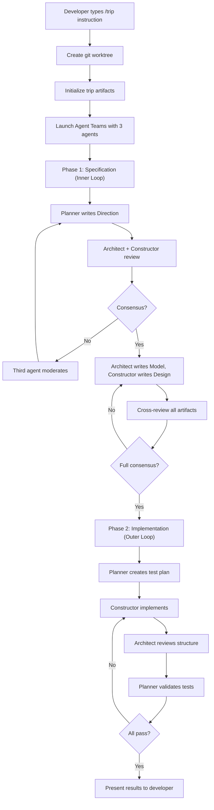
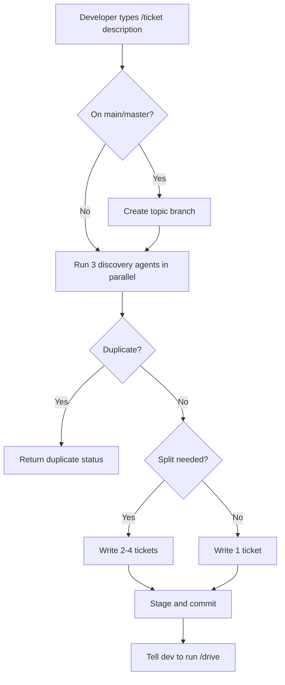
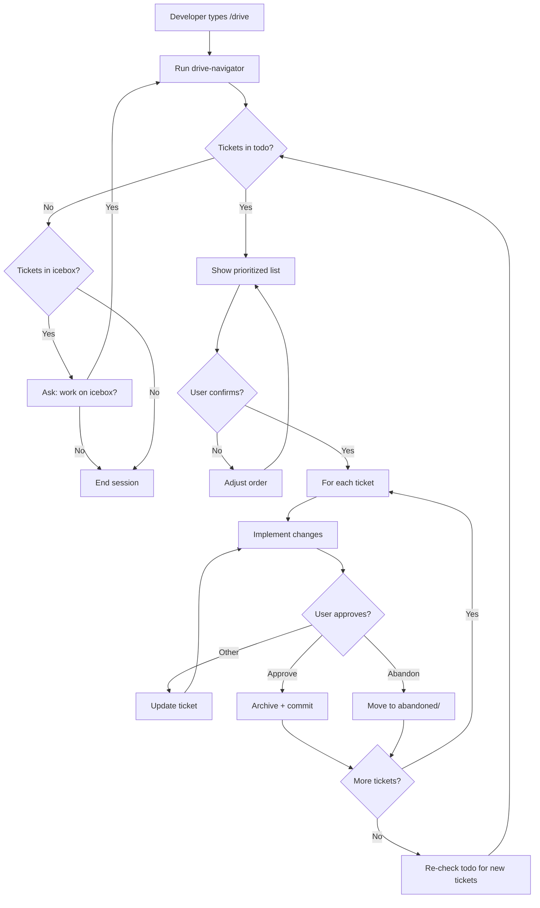
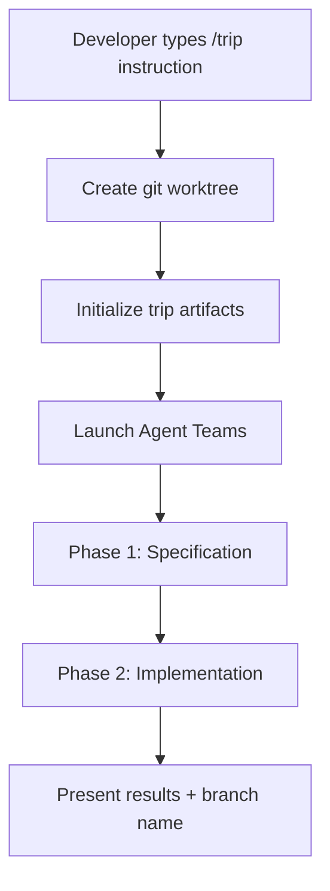

[English](ux.md) | [Japanese](ux_ja.md)

# UX Viewpoint

The UX Viewpoint examines how users experience and interact with the Workaholic plugin system, documenting the journeys they follow, the patterns they encounter, and the paths available for onboarding. Workaholic creates a triangular relationship between developers who request work, Claude Code agents that execute work, and the plugin author who maintains the system. The marketplace contains three plugins: core (shared utilities and context-aware commands), standards (the four leading skills, principle skills, and writer/analyst agents), and work (ticket-driven development plus collaborative trip-style exploration). Drive-style work uses serial implementation with per-ticket approval; trip-style work uses a collaborative three-agent workflow called the Implosive Structure inside an isolated git worktree.

## User Types and Their Goals

Workaholic serves three distinct user types whose interactions form a development ecosystem spanning structured ticket-driven development and exploratory collaborative workflows.

### Primary User: Developer (End User)

The developer represents the primary consumer of Workaholic. They install the plugin from the marketplace using `/plugin marketplace add qmu/workaholic` and interact exclusively through slash commands. The developer's workflow revolves around five commands: `/ticket` for planning changes, `/drive` for implementation, `/trip` for collaborative exploration using Agent Teams, `/report` for story/PR creation, and `/ship` for merging and verifying.

The developer operates under explicit human-in-the-loop control during drivin workflows. During `/drive` execution, the system presents approval dialogs using `AskUserQuestion` with selectable options, requiring explicit confirmation before committing each ticket. The developer never writes tickets manually -- the ticket-organizer subagent explores the codebase and writes implementation specifications on their behalf. Similarly, the developer never manually writes changelogs or PR descriptions -- these generate automatically from accumulated ticket history.

The developer's fundamental goal is fast serial development without git worktree overhead for drivin workflows. Tickets queue in `.workaholic/tickets/todo/`, implementation proceeds one ticket at a time with clear commits, and when ready to deliver, `/report` generates all documentation from the ticket archive. The bottleneck is deliberately placed on human cognition (approval decisions) rather than implementation speed (agent execution).

The developer values transparency over automation. They prefer seeing individual agent progress during multi-agent commands (such as `/report`) rather than waiting for a single subagent to complete. They prefer explicit approval dialogs with selectable options over autonomous decisions about ticket moves or implementation deviations.

For exploratory tasks, the developer uses `/trip` from the trippin plugin, which launches three peer agents (Planner, Architect, Constructor) in a dedicated git worktree. The trip workflow is autonomous once launched -- unlike `/drive`, it does not require per-step human approval. The developer provides an initial instruction and receives completed artifacts when the team finishes.

### Secondary User: Plugin Author (Maintainer)

The plugin author (currently `tamurayoshiya <a@qmu.jp>`) develops and releases both plugins. They work within the `plugins/` directory structure across both plugins: drivin (`plugins/drivin/`) for ticket-driven development and trippin (`plugins/trippin/`) for AI-oriented exploration. Each plugin has its own commands, agents, skills, and rules directories. The author follows the architecture policy defined in `CLAUDE.md`, which enforces thin commands and subagents (orchestration only) with comprehensive skills (knowledge layer).

The author maintains version synchronization across three files: `.claude-plugin/marketplace.json` (marketplace version), `plugins/drivin/.claude-plugin/plugin.json` (drivin version), and `plugins/trippin/.claude-plugin/plugin.json` (trippin version). Version management follows semantic versioning with PATCH increment by default. The `/release` command automates version bumping across all three files.

The author's workflow mirrors the developer's workflow but operates at the meta-level. They use the same `/ticket` and `/drive` commands to develop plugin features. Archived tickets in `.workaholic/tickets/archive/` document the evolution of the plugin itself, creating a searchable history of architectural decisions and implementation rationale.

The author balances feature development with documentation maintenance. Every plugin change requires updates to multiple viewpoint specs in `.workaholic/specs/`. These specs are hand-maintained reference documents updated alongside structural changes through the `/ticket` workflow.

### Tertiary User: AI Agent (Claude Code)

Claude Code acts as the execution engine that receives slash commands, invokes subagents via Task tool, executes shell scripts bundled in skills, and produces artifacts (tickets, specs, stories, changelogs, PRs). The agent operates under strict architectural constraints defined in `CLAUDE.md`:

- Commands can invoke skills and subagents, but never other commands
- Subagents can invoke skills and other subagents, but never commands
- Skills can invoke only other skills, never subagents or commands

The agent follows explicit git safety protocols: never commit without user request, never use `run_in_background: true` for agents requiring Write/Edit permissions, never skip hooks, and never force push to main/master. Complex shell operations must be extracted to bundled skill scripts rather than written inline in markdown files.

The agent provides transparency through real-time progress reporting. Multi-agent commands (such as `/report`) invoke their subagents using separate Task calls within a single message, making each agent's progress visible to the developer.

## User Journeys

Each user type follows distinct but complementary journeys within the Workaholic ecosystem.

### Developer Journey: Drivin Feature Development Cycle

The developer's primary journey in drivin is the feature development cycle, consisting of four sequential phases that transform an idea into a merged pull request.

#### Phase 1: Ticket Creation

The developer invokes `/ticket <description>`, which delegates to the ticket-organizer subagent. The ticket-organizer runs three discovery agents in parallel (history-discoverer for related tickets, source-discoverer for relevant files, ticket-discoverer for duplicate detection), then writes a ticket to `.workaholic/tickets/todo/` with sections: Overview, Key Files, Related History, Implementation Steps, Patches (if applicable), Considerations. If on main/master, the system creates a new topic branch first.

The ticket creation journey emphasizes automated exploration over manual planning. The developer provides a brief description, and the system explores the codebase, finds relevant context, and generates a comprehensive implementation specification. This shifts cognitive load from "figuring out which files to change" to "approving or improving the proposed plan."

#### Phase 2: Implementation

The developer invokes `/drive`, which delegates to the drive-navigator subagent to list and prioritize tickets. For each ticket, the system reads the ticket file, implements the changes, and requests approval via `AskUserQuestion` with selectable options (Approve, Approve and stop, Other, Abandon). Upon approval, it archives the ticket to `.workaholic/tickets/archive/<branch>/` with a Final Report section documenting deviations.

The implementation journey is serial and approval-gated. Each ticket is implemented, reviewed by the developer, and committed before the next ticket begins. This creates a clean per-ticket commit history where each commit corresponds to exactly one archived ticket. When the developer provides feedback (selects "Other"), the system updates the ticket file and re-implements, keeping the ticket as the source of truth.

All approval prompts include the ticket title and overview summary, enabling the developer to make informed decisions without re-reading the full ticket file. This context enforcement is structurally required in both the drive command and the drive-approval skill, preventing the agent from presenting blank or placeholder approval prompts.

#### Phase 3: Delivery

The developer invokes `/report` to generate a story and create a PR. The report command first checks whether a version bump commit already exists on the current branch using the branching skill's `check-version-bump.sh` script. If `already_bumped` is `false`, it bumps the version in all three version files. If `true`, it skips the bump to prevent double increments when `/report` is run multiple times on the same branch. After ensuring the version is bumped exactly once, the command invokes the story-writer subagent.

The story-writer runs 4 agents in parallel (release-readiness for release analysis, performance-analyst for decision quality, overview-writer for narrative sections, section-reviewer for outcome/concerns/ideas), composes a story file in `.workaholic/stories/<branch>.md`, commits and pushes it, then invokes 2 more agents in parallel (release-note-writer for release notes, pr-creator for GitHub PR creation).

The delivery journey transforms accumulated ticket history into a cohesive narrative. The story's Changes section presents per-ticket concise summaries instead of listing all changed files, making the story readable as a development narrative rather than an exhaustive file changelog. The generated story becomes the PR description, providing reviewers with context about motivation, journey, and decision quality. Idempotent version bumping ensures re-running `/report` to update a PR after additional commits does not cause unintended version increments.

### Developer Journey: Trippin Exploration

The developer uses `/trip <instruction>` for exploratory or creative tasks that benefit from multi-perspective collaboration. Unlike the drivin workflow, the trip journey is largely autonomous once launched.

#### Step 1: Worktree Creation

The command creates an isolated git worktree via `ensure-worktree.sh`, establishing a `trip-<timestamp>` branch and `.worktrees/<trip-name>/` directory. All agent work happens inside this worktree, preventing interference with the developer's current working tree.

#### Step 2: Trip Initialization

The `init-trip.sh` script creates the artifact directory structure at `.workaholic/.trips/<trip-name>/` with subdirectories for `directions/`, `models/`, and `designs/`.

#### Step 3: Agent Teams Session

The command launches a three-member Agent Team following the Implosive Structure protocol:

- **Planner** (Progressive stance): Creative direction, stakeholder profiling, explanatory accountability
- **Architect** (Neutral stance): Semantical consistency, static verification, accessibility
- **Constructor** (Conservative stance): Sustainable implementation, infrastructure reliability, delivery coordination

The team executes two phases. Phase 1 (Specification) is an inner loop where agents produce and mutually review Direction, Model, and Design artifacts until reaching consensus. Phase 2 (Implementation) is an outer loop where the Constructor implements, the Architect reviews structural integrity, and the Planner validates through testing. Every discrete step produces a git commit via `trip-commit.sh`, creating a complete trace of the collaborative process.

When two agents disagree, the third serves as moderator, evaluating both positions against dual objectives (optimization and constraint satisfaction) and proposing a resolution.

#### Step 4: Results

After the team completes, the developer receives a summary of all artifacts created, the agreed direction/model/design, implementation results, and the worktree branch name for merging or inspection.

### Trip Workflow Diagram



### Developer Journey: Icebox Management

When the drive-navigator finds no tickets in `.workaholic/tickets/todo/`, it checks `.workaholic/tickets/icebox/` and presents options via `AskUserQuestion`:

- **Work on icebox**: Invoke drive-navigator with `mode: icebox` to select from deferred tickets
- **Stop**: End the drive session

If the developer selects "Work on icebox," the navigator lists icebox tickets and uses `AskUserQuestion` to let the developer select one, then moves it to `.workaholic/tickets/todo/` before proceeding with implementation.

Critically, tickets never move to icebox autonomously. If a ticket cannot be implemented (out of scope, too complex, blocked), the system stops and asks the developer using `AskUserQuestion` with options: "Move to icebox", "Skip for now", or "Abort drive". This design preserves developer authority over ticket prioritization.

### Plugin Author Journey: Plugin Extension

Plugin authors follow the same four-phase journey (ticket creation, implementation, documentation, delivery) but work within the `plugins/` directory structure across both plugins (drivin and trippin). They add new commands, agents, skills, and rules while adhering to the architecture policy.

The author's journey differs in the documentation update target. Viewpoint specs document the plugin's own architecture rather than application code. The leading skills act as policy lenses on each ticket — accessibility for command UX, validity for the agent hierarchy and skill structure, availability for shared infrastructure, security for any boundary that touches secrets or authorization.

The author uses archived tickets as a searchable history of architectural decisions. When making changes to the agent hierarchy or skill structure, the author reads related tickets to understand past rationale and avoid repeating the same mistakes. This creates a feedback loop where the plugin documents its own evolution through the same mechanisms it provides to developers.

### AI Agent Journey: Command Execution

The AI agent (Claude Code) receives slash commands and follows deterministic workflows defined in command markdown files. For example, the `/report` journey is:

1. Gather git context (branch, base branch, commit hash)
2. Check whether a version bump commit already exists; bump if not, skip if yes
3. Invoke the `story-writer` orchestrator
4. The story-writer runs four content agents in parallel (release-readiness, performance-analyst, overview-writer, section-reviewer), composes the story, and commits/pushes it
5. The story-writer runs two delivery agents in parallel (release-note-writer, pr-creator), commits the release note, and returns the PR URL
6. Display PR URL to the developer

The agent's journey is structured by phases defined in command files. Each phase has explicit success criteria and failure handling. The agent cannot deviate from the workflow without asking the developer for clarification.

## Interaction Patterns

User interactions with Workaholic follow well-defined patterns that preserve context, enforce human approval, and generate documentation automatically.

### Approval Pattern

The approval pattern enforces human-in-the-loop control during `/drive` execution. After implementing a ticket, the system presents an approval dialog using `AskUserQuestion` with four selectable options:

- **Approve**: Commit the implementation and continue to next ticket
- **Approve and stop**: Commit the implementation and end the drive session
- **Other**: Provide free-form feedback, causing the system to update the ticket and re-implement
- **Abandon**: Move ticket to `.workaholic/tickets/abandoned/` and continue to next ticket

The drive-approval skill (preloaded by the drive command) defines the exact dialog format and handling logic. All approval prompts must include the ticket title and overview, ensuring the developer can make informed approval decisions without re-reading the full ticket file. This requirement is enforced at CRITICAL severity in both the drive command (Step 2.2 explicitly requires passing `title` and `overview` from the workflow result) and the drive-approval skill (Section 1 states that presenting a prompt with missing context is a failure condition). When the user provides feedback (selects "Other"), the system must update the ticket file before re-implementing to ensure the ticket always reflects the full implementation plan. This pattern creates a tight feedback loop where the ticket file is the source of truth and the developer always has the final say.

### Two-Stage Story Generation Pattern

The `/report` command uses a two-stage parallel pattern via the `story-writer` orchestrator. Stage 1 produces the story file from four content agents; stage 2 produces the release note and PR from the committed story.

**Stage 1 (Content)**:
```
story-writer -> [release-readiness, performance-analyst,
                 overview-writer, section-reviewer] in parallel
              |
              Compose .workaholic/stories/<branch>.md
              |
              Commit and push the story file
```

**Stage 2 (Delivery)**:
```
story-writer -> [release-note-writer, pr-creator] in parallel
              |
              Commit release note; PR created on GitHub
```

This pattern ensures the story file exists and is committed before the delivery agents run, since both consume it. Stage transitions are visible in the developer's session.

### Agent Transparency Pattern

Multi-agent commands invoke their subagents using parallel Task calls within a single message rather than delegating to a single orchestrator subagent. This makes each agent's progress visible in the developer's session in real time.

This pattern reflects a broader design philosophy: transparency over abstraction. Developers should see what the system is doing rather than waiting for opaque operations to complete.

### Parallel Discovery Pattern

The ticket-organizer agent uses parallel discovery during ticket creation to minimize latency:

```
ticket-organizer
  |
  Single Task call with 3 parallel invocations
  |- ticket-discoverer (find duplicates)
  |- source-discoverer (find relevant files)
  |- history-discoverer (find related tickets)
  |
  Wait for all 3 to complete
  |
  Write ticket using all 3 JSON results
```

This pattern reduces discovery time from three sequential calls to one parallel batch. The developer can see three discovery agents running simultaneously in their session, providing transparency into what context the ticket-organizer is collecting. The combined results inform the ticket's Key Files section (from source-discoverer), Related History section (from history-discoverer), and moderation decision for duplicates (from ticket-discoverer).

### Peer Collaboration Pattern (Trippin)

The `/trip` command introduces a peer-based collaboration pattern that differs fundamentally from drivin's hierarchical model. Three agents with distinct philosophical stances (Progressive, Neutral, Conservative) work as equals, communicating through shared markdown artifacts rather than command-subagent invocation chains.

Key characteristics of this pattern:

- **Artifact-mediated communication**: Agents read and write markdown files in `.workaholic/.trips/<trip-name>/` rather than passing structured JSON between invocations
- **Consensus-gated progression**: Phase transitions require agreement from all three agents
- **Third-party moderation**: When two agents disagree, the third serves as moderator
- **Commit-per-step traceability**: Every discrete action produces a git commit, creating a complete audit trail
- **Worktree isolation**: The entire session runs in a dedicated git worktree, preventing interference with the developer's main working tree

### Commit Message Enrichment Pattern

Commit messages follow a five-section structure designed for consumption by both human reviewers and downstream lead-driven analysis:

- **Title**: Concise summary
- **Description**: Why the change was needed (motivation and rationale)
- **Changes**: What users experience differently
- **Test Planning**: What verification was performed or should be
- **Release Preparation**: What is needed to ship and support

Each section requires 3-5 sentences with rich detail. This pattern gives downstream readers (human reviewers and the leading skills applied during ticket scoping and review) sufficient signal to determine what is needed to ship each change without reading the full diff.

### Story Summary Pattern

The story creation workflow presents per-ticket concise summaries rather than exhaustive file listings. Section 4 (Changes) contains one subsection per ticket with a 1-3 sentence summary explaining what changed and why, focusing on intent and scope rather than enumerating files.

This pattern makes stories readable as development narratives. Reviewers can understand the branch's journey without scanning extensive file lists. Clickable commit hashes provide a fallback for detailed file inspection.

## Command Interaction Flows

The commands form distinct interaction flows that developers navigate based on their current task.

### Ticket Command Flow



The ticket flow emphasizes automated exploration and planning. The developer provides a description, and the system handles branch creation, discovery, and ticket creation. The developer's only decision point is whether to approve or request changes to the resulting ticket.

### Drive Command Flow



The drive flow is approval-centric with multiple decision points. The developer confirms the prioritization order, approves or rejects each implementation, and decides whether to continue or stop after each ticket. This creates a tight feedback loop where the developer maintains control throughout the implementation journey.

### Report Command Flow


The report flow is largely automated with two manual touchpoints: the initial invocation and the final PR URL display. The developer does not interact with individual agents; the story-writer orchestrates all parallel execution and produces a single cohesive output.

### Trip Command Flow



The trip flow requires the experimental `CLAUDE_CODE_EXPERIMENTAL_AGENT_TEAMS=1` environment variable to be enabled. The worktree isolation ensures that trip work does not interfere with the developer's current working tree.

## Onboarding Paths

Workaholic provides multiple onboarding paths depending on user type and entry point.

### Developer Onboarding Path

New developers follow a self-service onboarding path. The root `README.md` provides a Quick Start section with installation command and typical session example. After installing via `/plugin marketplace add qmu/workaholic`, developers can immediately start using the five commands: `/ticket`, `/drive`, `/trip`, `/report`, and `/ship`.

The first command is typically `/ticket <description>`. The ticket-organizer subagent explores the codebase automatically, so the developer does not need to understand the project structure beforehand. The resulting ticket includes Key Files and Implementation Steps sections that educate the developer about the codebase while planning the change.

User documentation lives in `.workaholic/guides/` with three documents:

- `getting-started.md`: Installation and verification
- `commands.md`: Complete command reference with usage examples
- `workflow.md`: Ticket-driven development approach

The developer progresses from `/ticket` (the familiar task of describing what they want) to `/drive` (observing how Claude implements it) to `/report` and `/ship` (understanding how stories, PRs, and deployment fit together). Each command builds on the previous one, creating a natural learning progression.

### Plugin Author Onboarding Path

Plugin authors (developers extending the plugin itself) require deeper architectural understanding. Developer documentation lives in `.workaholic/specs/` with 8 viewpoint-based architecture documents:

- `ux.md`: User experience design, interaction patterns, user journeys, onboarding paths
- `model.md`: Domain concepts, relationships, core abstractions
- `usecase.md`: User workflows, command sequences, input/output contracts
- `infrastructure.md`: External dependencies, file system layout, installation
- `application.md`: Runtime behavior, agent orchestration, data flow
- `component.md`: Internal structure, module boundaries, decomposition
- `data.md`: Data formats, frontmatter schemas, naming conventions
- `feature.md`: Feature inventory, capability matrix, configuration

The `CLAUDE.md` file in the repository root serves as the authoritative source for architecture policy, defining component nesting rules, design principles, common operations, shell script principles, commands list, development workflow, and version management.

Plugin authors use the same `/ticket` and `/drive` commands to develop plugin features, but they edit files in `plugins/drivin/` or `plugins/trippin/` rather than application code. Archived tickets in `.workaholic/tickets/archive/` document the evolution of the plugin architecture, providing searchable context for understanding design decisions.

The author's onboarding path is self-documenting: the plugin uses itself to develop itself. Archived tickets show how features were added, how the agent hierarchy evolved, and why architectural decisions were made. This creates a living tutorial where the author learns by reading the plugin's own development history.

### AI Agent Onboarding Path

The AI agent (Claude Code) receives instructions through command markdown files in `plugins/drivin/commands/` and `plugins/trippin/commands/`, plus agent markdown files in `plugins/drivin/agents/` and `plugins/trippin/agents/`. Each command defines phases using preloaded skills, specifies which subagents to invoke (drivin) or Agent Teams to launch (trippin), and includes critical rules for execution.

The agent learns architectural constraints from `CLAUDE.md`, which it receives as project instructions in the Claude Code environment. The nesting hierarchy (commands can invoke subagents/skills, subagents can invoke subagents/skills, skills can invoke skills) prevents circular dependencies and ensures skills remain reusable knowledge components.

The agent receives workflow-specific knowledge through skills in `plugins/drivin/skills/` and `plugins/trippin/skills/`. For example, the gather-git-context skill provides git context gathering via bundled shell script, eliminating inline git commands in agent markdown. The branching skill handles branch state checking and creation, including version bump detection to prevent double increments during `/report`. The trip-protocol skill defines artifact format, versioning, consensus gates, and moderation rules for the trippin workflow.

The agent's onboarding is instruction-based rather than exploratory. Each command file contains explicit phases with numbered steps, making execution deterministic. The agent does not need to "figure out" how to execute a command -- it follows the instructions as written.

## UX Evolution

Recent architectural changes reflect evolving UX priorities around transparency, structure, consistency, and plugin identity.

### Single Plugin to Dual Plugin Architecture

The marketplace evolved from containing a single plugin (core) to hosting two plugins (drivin and trippin). The core plugin was renamed to drivin to reflect its ticket-driven development focus, while trippin was created as a new plugin for AI-oriented exploration workflows.

**Old pattern** (single plugin):
- One plugin ("core") providing all commands
- Generic name providing no indication of purpose
- Single orchestration model (hierarchical agent invocation)

**New pattern** (dual plugins):
- Two plugins with distinct philosophies: drivin (hierarchical, approval-gated, serial) and trippin (peer-based, autonomous, collaborative)
- Version synchronization across 3 files (`marketplace.json` + drivin `plugin.json` + trippin `plugin.json`)
- Two installed paths with updated namespace: `plugins/drivin/` and `plugins/trippin/`

This evolution gives the marketplace a clear identity for each plugin. Developers understand from the name alone that drivin is for structured development work and trippin is for exploratory collaboration.

### Hierarchical Agents to Peer Agent Teams

The addition of trippin introduced a fundamentally different orchestration model alongside drivin's existing hierarchical approach.

**Drivin model** (hierarchical subagent invocation):
- Commands invoke subagents via Task tool; subagents invoke other subagents
- Strict nesting hierarchy: commands -> subagents -> skills
- Human-in-the-loop approval at each step
- Serial execution: one ticket at a time

**Trippin model** (peer-based Agent Teams):
- `/trip` command launches three peer agents (Planner, Architect, Constructor) via Agent Teams
- Agents communicate through shared markdown artifacts, not structured JSON
- Isolated execution: dedicated git worktree per trip session
- Consensus-gated progression: all three agents must agree before phase transitions
- Commit-per-step traceability: every action produces a git commit

The dual model gives developers choice based on task nature: drivin for well-defined implementation tasks with clear ticket specs, trippin for exploratory or creative tasks that benefit from multi-perspective collaboration.

### Flat Analysts to Manager-Leader Hierarchy

The system originally used a flat set of documentation agents that all ran in parallel during a documentation command. A strategic-context tier was introduced in February 2026 to provide leads with separate project, architectural, and quality context, restructuring the documentation command into a sequential model where the upstream tier ran first and leads consumed its output. That tier (and the documentation command driving it) was removed in May 2026 in favor of preloading the four leading skills directly into work-plugin commands and orchestrators. Viewpoint specs are now hand-maintained reference documents updated through `/ticket` rather than regenerated automatically.

### File Listings to Narrative Summaries

The story generation workflow evolved from exhaustive file listings to concise summaries (ticket `20260210121628-summarize-changes-in-report.md`). This change addressed a UX pain point: stories with 140+ lines of file listings were difficult to read and provided little value beyond what `git diff` already showed.

**Old pattern**:
- Section 4 listed every changed file per ticket as individual bullet points
- Focused on exhaustive completeness
- Difficult to extract a narrative of what happened and why

**New pattern**:
- Section 4 provides 1-3 sentence summaries per ticket
- Focused on intent, scope, and impact
- Readable as a development narrative
- Clickable commit hashes provide fallback for detailed inspection

This evolution shifts stories from "change log" to "change narrative," making them more useful as PR descriptions and historical references.

### Flat Commit Sections to Lead-Targeted Structure

The commit message format evolved from 4 sections to 5 sections with richer guidance (ticket `20260210154917-expand-commit-message-sections.md`). This change recognized that commit messages are consumed by downstream lead-driven analysis, targeting AI agents as an audience alongside human reviewers.

**Old pattern** (4 sections):
- Title, Motivation, UX Change, Arch Change
- Short sentences, minimal detail
- Difficult for leads to extract domain-specific requirements

**New pattern** (5 sections):
- Title, Description, Changes, Test Planning, Release Preparation
- 3-5 sentences per section with rich detail
- Each section targets specific lead concerns: leading-validity reads Test Planning, leading-availability reads Release Preparation, etc.

This evolution improves UX for AI agents by providing structured, detailed context that informs their analysis. Commit messages become structured input for documentation generation rather than merely human-readable summaries.

### Unconditional Translation to Dynamic Language Logic

The translation system evolved from hardcoded Japanese translation requirements to dynamic language detection based on the consumer project's CLAUDE.md configuration (ticket `20260212123836-fix-duplicate-japanese-specs-in-workaholic.md`). This change fixed a bug where Japanese-primary projects ended up with duplicate spec files (both `application.md` and `application_ja.md` containing Japanese).

**Old pattern**:
- `translate` skill unconditionally required `_ja.md` translations for all `.workaholic/` files
- No logic to check if Japanese was already the primary language

**New pattern**:
- `translate` skill reads consumer CLAUDE.md to determine primary language
- If primary is English: generate `_ja.md` translations
- If primary is Japanese: generate `_en.md` translations or skip translations entirely
- All agents use dynamic "produce translations per the user's CLAUDE.md" instructions instead of hardcoding specific languages

This evolution improves UX for international projects by adapting translation behavior to project language configuration, eliminating duplicate content and supporting non-English primary languages.

### Unconditional Version Bump to Idempotent Bump

The `/report` version bump logic evolved from unconditional increment to idempotent check (ticket `20260212123209-prevent-double-version-bump-in-report.md`). This change fixed a bug where running `/report` multiple times on the same branch (e.g., to update a PR after additional commits) would increment the version multiple times.

**Old pattern**:
- `/report` unconditionally bumped version as its first step
- Re-running `/report` on the same branch incremented version again

**New pattern**:
- `/report` checks for existing "Bump version" commit on the current branch using `check-version-bump.sh`
- If `already_bumped` is `true`, skip the bump step
- If `already_bumped` is `false`, proceed with bump normally

This evolution improves developer UX by making `/report` safely re-runnable. Developers can run `/report` early to create a PR, make more commits, and re-run `/report` to update the PR description without causing unintended version increments.

### Generic Naming to Domain-Specific Naming

The project evolved through several skill renames to resolve naming collisions and improve semantic clarity. The branching utility skill was renamed from a prefix that collided with the strategic-context tier's namespace; subsequent renames distinguished cross-cutting behavioral principle skills from output-artifact skills. Lead skills were later renamed from a `<domain>-lead` form to `leading-<domain>` to make the "leading" function explicit at the namespace level.

This evolution improves plugin author UX by establishing clear conventions: `leading-*` for the four leading-skill domains, `*-principle` for cross-cutting behavioral rules, descriptive names for utility skills.

### Weak Approval Context to Enforced Ticket Context

The drive approval prompt evolved from soft guidance to structurally enforced context inclusion (ticket `20260306065407-enforce-ticket-context-in-drive-approval.md`). Previous fixes added template placeholders and an IMPORTANT note, but the agent still sometimes presented blank approval prompts because the drive command orchestration did not enforce the handoff.

**Old pattern**:
- drive-approval skill contained template placeholders with guidance notes
- Drive command did not explicitly require passing workflow result fields into the approval prompt
- Agent could skip substitution, presenting blank or placeholder-filled prompts

**New pattern**:
- Drive command Step 2.2 explicitly requires using `title` and `overview` fields from the workflow result
- drive-approval skill Section 1 states presenting a prompt with missing context is a failure condition at CRITICAL severity
- Feedback re-approval loop (Section 3, step 5) requires re-reading the ticket file if context is lost

This evolution improves developer UX by ensuring every approval prompt contains the ticket title and summary, enabling informed decisions without re-reading the full ticket file.

## Assumptions

- [Explicit] The developer installs from the marketplace using `/plugin marketplace add qmu/workaholic` as shown in `README.md`.
- [Explicit] Five slash commands (`/ticket`, `/drive`, `/trip`, `/report`, `/ship`) constitute the primary user interface, as defined in `CLAUDE.md`.
- [Explicit] The plugin author is `tamurayoshiya <a@qmu.jp>`, as declared in `marketplace.json` and both `plugin.json` files.
- [Explicit] Human-in-the-loop approval is mandatory during `/drive`, enforced by the `AskUserQuestion` requirement in `drive.md`.
- [Explicit] Version management requires synchronization across `marketplace.json` and the three plugin `plugin.json` files (core, standards, work), as documented in `CLAUDE.md`.
- [Explicit] The four leading skills (`leading-validity`, `leading-availability`, `leading-security`, `leading-accessibility`) are preloaded into work-plugin commands and orchestrators via the soft cross-plugin reference pattern.
- [Explicit] Commit message format was expanded from 4 to 5 sections to provide richer context for downstream leads (ticket `20260210154917-expand-commit-message-sections.md`).
- [Explicit] Story Section 4 was changed from file listings to concise summaries for improved readability (ticket `20260210121628-summarize-changes-in-report.md`).
- [Explicit] The branching utility skill was renamed in February 2026 to resolve a naming collision with the strategic-context tier's namespace.
- [Explicit] Cross-cutting policy skills were renamed from a `*-policy` form to `*-principle` to distinguish behavioral principles from policy output artifacts.
- [Explicit] The translation system was updated to check consumer CLAUDE.md for primary language and generate translations dynamically, fixing duplicate Japanese specs in Japanese-primary projects (ticket `20260212123836-fix-duplicate-japanese-specs-in-workaholic.md`).
- [Explicit] The `/report` command acquired idempotent version bump logic to prevent double increments when re-run on the same branch (ticket `20260212123209-prevent-double-version-bump-in-report.md`).
- [Explicit] The core plugin was renamed to drivin and the trippin plugin was created as a new exploration-focused plugin (tickets `20260302215035-rename-core-to-drivin.md` and `20260302215036-create-trippin-plugin-skeleton.md`).
- [Explicit] The `/trip` command requires `CLAUDE_CODE_EXPERIMENTAL_AGENT_TEAMS=1` to be enabled, as documented in `plugins/trippin/commands/trip.md`.
- [Explicit] The drive approval prompt context enforcement was strengthened from soft guidance to structural requirement at CRITICAL severity (ticket `20260306065407-enforce-ticket-context-in-drive-approval.md`).
- [Explicit] Trip sessions run in isolated git worktrees with commit-per-step traceability, as defined in the trip-protocol skill.
- [Inferred] The primary audience is solo developers or small teams who use Claude Code as their main development environment, based on the serial execution model, single-branch workflow design, and explicit approval requirement at each ticket.
- [Inferred] Onboarding is self-service through documentation rather than guided setup, as no interactive onboarding flow exists beyond the plugin installation command.
- [Inferred] The system prioritizes transparency over abstraction, evidenced by the migration of scanner orchestration into the scan command to make individual agent progress visible.
- [Inferred] The plugin author uses Workaholic to develop Workaholic itself (dogfooding), based on the presence of archived tickets documenting plugin feature development in `.workaholic/tickets/archive/`.
- [Inferred] The dual plugin architecture (drivin for structured development, trippin for exploration) reflects a recognition that different task types benefit from fundamentally different agent coordination models.
- [Inferred] The May 2026 removal of the strategic-context tier reflects a shift back toward leads deriving viewpoint directly from the codebase, after the intermediate context artifacts proved to have limited practical uptake.
