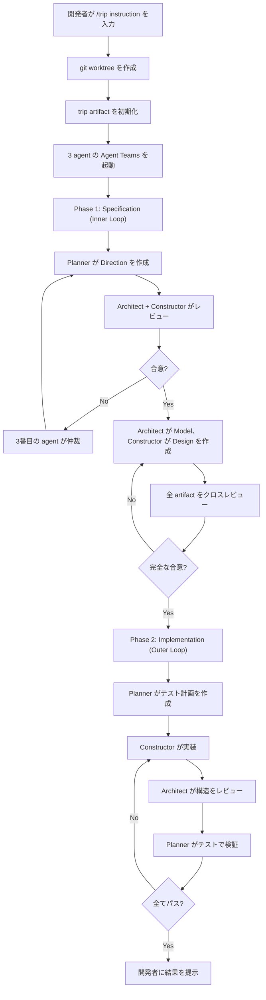
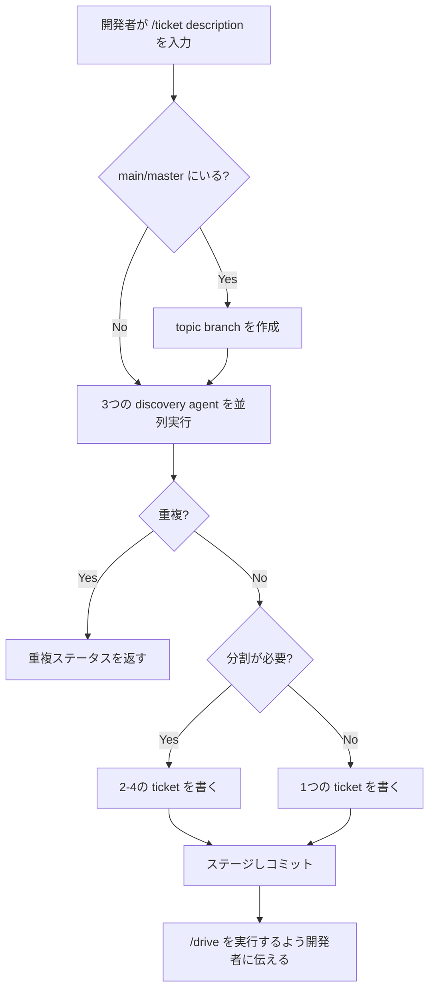
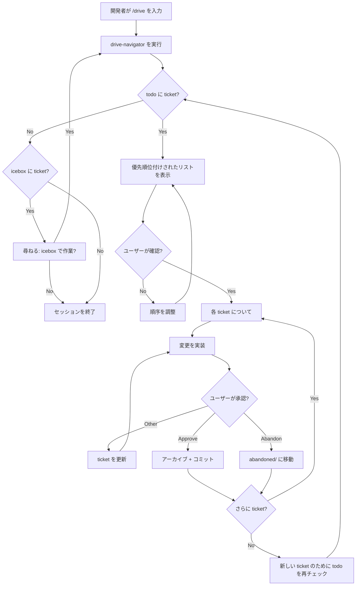
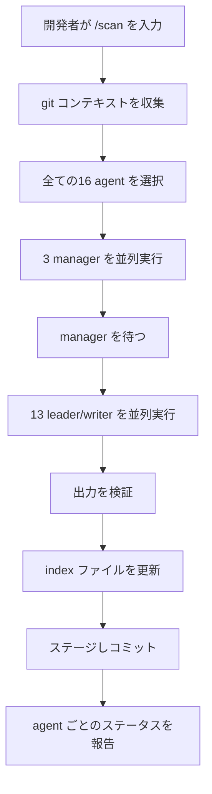
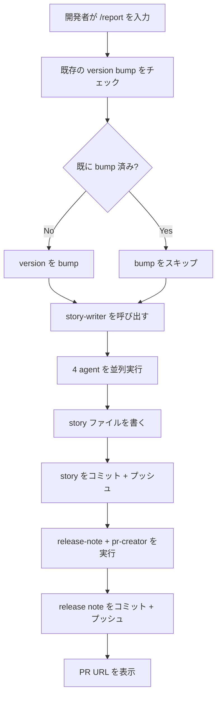
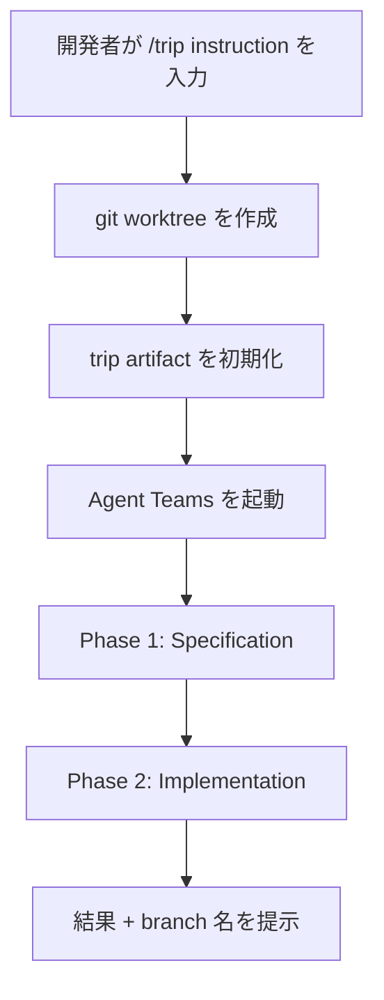

[English](ux.md) | [Japanese](ux_ja.md)

# UX Viewpoint

UX Viewpoint は、ユーザーが Workaholic plugin システムをどのように体験し、どのようにインタラクションするかを検証し、彼らが辿るジャーニー、遭遇するパターン、利用可能なオンボーディングパスを文書化します。Workaholic は、作業をリクエストする開発者、作業を実行する Claude Code agent、システムをメンテナンスする plugin 作者という三者間の関係を構築します。Marketplace は2つの plugin を含みます：drivin（階層的 agent orchestration による ticket 駆動開発）と trippin（peer ベースの Agent Teams による AI 指向の探索）。drivin plugin は documentation 生成に2層の agent 階層（manager、次に leader）を使用し、trippin plugin は探索的開発のために分離された git worktree 内で Implosive Structure と呼ばれる3エージェント共同 workflow を使用します。

## ユーザータイプとその目標

Workaholic は、構造化された ticket 駆動開発と探索的な共同 workflow にまたがる開発エコシステムを形成する3つの異なるユーザータイプにサービスを提供します。

### プライマリユーザー：開発者（エンドユーザー）

開発者は Workaholic の主要な消費者です。彼らは `/plugin marketplace add qmu/workaholic` を使用して marketplace から plugin をインストールし、スラッシュ command のみを通じてインタラクションします。開発者の workflow は、2つの plugin にまたがる5つの command を中心に展開します：drivin から変更を計画する `/ticket`、実装する `/drive`、documentation を更新する `/scan`、PR を作成する `/report`、trippin から Agent Teams を使用した共同探索の `/trip` です。

開発者は drivin workflow 中、明示的な human-in-the-loop 制御の下で操作します。`/drive` 実行中、システムは選択可能なオプションを持つ `AskUserQuestion` を使用して承認ダイアログを提示し、各 ticket をコミットする前に明示的な確認を求めます。開発者は ticket を手動で書くことはありません -- ticket-organizer subagent が codebase を探索し、実装仕様を代わりに書きます。同様に、開発者は changelog や PR description を手動で書くことはありません -- これらは蓄積された ticket history から自動的に生成されます。

開発者の基本的な目標は、drivin workflow における git worktree のオーバーヘッドなしでの高速なシリアル開発です。Ticket は `.workaholic/tickets/todo/` にキューイングされ、実装は一度に1つの ticket ずつ明確な commit で進行し、配信準備ができたら `/report` が ticket archive から全ての documentation を生成します。ボトルネックは意図的に人間の認知（承認の決定）に置かれ、実装速度（agent の実行）には置かれません。

開発者は自動化よりも透明性を重視します。彼らは単一の scanner subagent が完了するのを待つよりも、`/scan` 中の個別の agent の進捗を見ることを好みます。彼らは ticket の移動や実装の逸脱に関する自律的な決定よりも、選択可能なオプションを持つ明示的な承認ダイアログを好みます。

探索的タスクには、開発者は trippin plugin の `/trip` を使用し、専用の git worktree 内で3つの peer agent（Planner、Architect、Constructor）を起動します。trip workflow は起動後は自律的です -- `/drive` とは異なり、ステップごとの人間の承認を必要としません。開発者は初期 instruction を提供し、team が完了したときに完成した artifact を受け取ります。

### セカンダリユーザー：Plugin 作者（メンテナー）

Plugin 作者（現在は `tamurayoshiya <a@qmu.jp>`）は両方の plugin を開発しリリースします。彼らは `plugins/` directory 構造内で2つの plugin にわたって作業します：drivin（`plugins/drivin/`）は ticket 駆動開発、trippin（`plugins/trippin/`）は AI 指向の探索。各 plugin には独自の command、agent、skill、rule directory があります。作者は `CLAUDE.md` で定義された architecture policy に従い、薄い command と subagent（orchestration のみ）と包括的な skill（知識層）を強制します。

作者は `.claude-plugin/marketplace.json`（marketplace version）、`plugins/drivin/.claude-plugin/plugin.json`（drivin version）、`plugins/trippin/.claude-plugin/plugin.json`（trippin version）の3つのファイル間で version 同期を維持します。Version 管理は semantic versioning に従い、デフォルトで PATCH をインクリメントします。`/release` command は3つのファイルすべてで version の bump を自動化します。

作者の workflow は開発者の workflow を反映していますが、メタレベルで動作します。彼らは同じ `/ticket` と `/drive` command を使用して plugin 機能を開発します。`.workaholic/tickets/archive/` のアーカイブされた ticket は plugin 自体の進化を文書化し、アーキテクチャの決定と実装の理論的根拠の検索可能な履歴を作成します。

作者は機能開発と documentation メンテナンスのバランスを取ります。すべての plugin 変更には `.workaholic/specs/` の複数の viewpoint spec の更新が必要です。`/scan` command は、3つの manager agent、次に13の leader/writer agent を並列で呼び出すことでこの documentation 更新を自動化し、ドメイン固有の分析の前に戦略的コンテキストを提供します。

### ターシャリユーザー：AI Agent（Claude Code）

Claude Code は、スラッシュ command を受け取り、Task tool を介して subagent を呼び出し、skill にバンドルされた shell script を実行し、成果物（ticket、spec、story、changelog、PR）を生成する実行エンジンとして機能します。Agent は `CLAUDE.md` で定義された厳格なアーキテクチャ制約の下で動作します：

- Command は skill と subagent を呼び出すことができますが、他の command は呼び出せません
- Subagent は skill と他の subagent を呼び出すことができますが、command は呼び出せません
- Skill は他の skill のみを呼び出すことができ、subagent や command は呼び出せません

Agent は明示的な git 安全プロトコルに従います：ユーザーのリクエストなしに commit しない、Write/Edit 権限を必要とする agent には `run_in_background: true` を使用しない、hook をスキップしない、main/master への force push をしない。複雑な shell 操作は markdown ファイルにインライン記述するのではなく、バンドルされた skill script に抽出する必要があります。

Agent はリアルタイムの進捗報告を通じて透明性を提供します。`/scan` command は、単一メッセージ内の個別の Task 呼び出しを使用して全ての documentation agent を呼び出します（Phase 3a で3 manager、次に Phase 3b で13 leader/writer）。各 agent の進捗が開発者に見えるようになります。2フェーズ実行により、leader がドメイン固有の分析を開始する前に manager からの戦略的コンテキストが利用可能になります。

## ユーザージャーニー

各ユーザータイプは、Workaholic エコシステム内で異なるが補完的なジャーニーをたどります。

### 開発者ジャーニー：Drivin 機能開発サイクル

開発者の drivin における主要なジャーニーは、アイデアをマージされた pull request に変換する4つの連続したフェーズで構成される機能開発サイクルです。

#### フェーズ 1：Ticket 作成

開発者は `/ticket <description>` を呼び出し、ticket-organizer subagent に委任します。ticket-organizer は3つの discovery agent を並列実行し（関連 ticket のための history-discoverer、関連ファイルのための source-discoverer、重複検出のための ticket-discoverer）、次のセクションを持つ ticket を `.workaholic/tickets/todo/` に書き込みます：Overview、Key Files、Related History、Implementation Steps、Patches（該当する場合）、Considerations。main/master にいる場合、システムは最初に新しい topic branch を作成します。

Ticket 作成ジャーニーは、手動計画よりも自動探索を強調します。開発者は簡単な description を提供し、システムは codebase を探索し、関連するコンテキストを見つけ、包括的な実装仕様を生成します。これにより認知負荷が「どのファイルを変更するかを把握する」から「提案された計画を承認または改善する」へとシフトします。

#### フェーズ 2：実装

開発者は `/drive` を呼び出し、drive-navigator subagent に委任して ticket をリスト化し優先順位付けします。各 ticket について、システムは ticket ファイルを読み取り、変更を実装し、選択可能なオプション（Approve、Approve and stop、Other、Abandon）を持つ `AskUserQuestion` を介して承認を要求し、承認されると逸脱を文書化した Final Report セクションを持つ ticket を `.workaholic/tickets/archive/<branch>/` にアーカイブします。

実装ジャーニーはシリアルで承認ゲート化されています。各 ticket は実装され、開発者によってレビューされ、次の ticket が始まる前にコミットされます。これにより、各 commit が正確に1つのアーカイブされた ticket に対応する、クリーンな ticket ごとの commit 履歴が作成されます。開発者がフィードバックを提供する（「Other」を選択する）場合、システムは ticket ファイルを更新し再実装し、ticket を真実の源として保持します。

すべての承認プロンプトには ticket のタイトルと概要が含まれ、開発者が完全な ticket ファイルを再読する必要なく情報に基づいた承認決定を行えるようにします。このコンテキスト強制は、drive command（Step 2.2 が workflow 結果から `title` と `overview` を渡すことを明示的に要求）と drive-approval skill（Section 1 がコンテキスト欠如のプロンプト提示を failure condition と宣言）の両方で構造的に要求されています。

#### フェーズ 3：Documentation 更新

開発者はオプションで `/scan` を呼び出して全ての documentation を更新します。scan command は2つのフェーズで実行されます：

**フェーズ 3a（Manager フェーズ）**：3つの manager agent を並列実行します（project-manager、architecture-manager、quality-manager）。各 manager は戦略的観点から repository を分析し、leader が消費するコンテキストドキュメントを生成します。

**フェーズ 3b（Leader フェーズ）**：13の leader/writer agent を並列実行します（ux-lead、model-analyst、infra-lead、db-lead、test-lead、security-lead、quality-lead、a11y-lead、observability-lead、delivery-lead、recovery-lead、changelog-writer、terms-writer）。各 leader は、ドメイン固有の分析を実行する前に関連する manager 出力を読み取り、documentation が戦略的コンテキストに基づいていることを保証します。

Documentation ジャーニーは透明で並列化されています。全ての agent は各フェーズ内で同時に実行され、進捗がメインセッションで見えるようになります。開発者はどの agent が成功し、どれが失敗したかを確認でき、すぐに出力を検査できます。

#### フェーズ 4：配信

開発者は `/report` を呼び出して story を生成し PR を作成します。report command はまず、branching skill の `check-version-bump.sh` script を使用して現在の branch に version bump commit が既に存在するかをチェックします。`already_bumped` が `false` の場合、3つの version file すべてで version を bump します。`true` の場合、同じ branch で `/report` が複数回実行されたときの二重インクリメントを防ぐために bump をスキップします。Version が正確に一度だけ bump されていることを確認した後、command は story-writer subagent を呼び出します。

story-writer は4つの agent を並列実行し（release 分析のための release-readiness、決定品質のための performance-analyst、ナラティブセクションのための overview-writer、outcome/concerns/ideas のための section-reviewer）、story ファイルを `.workaholic/stories/<branch>.md` に作成し、それをコミットしてプッシュし、次に2つの agent をさらに並列実行します（release note のための release-note-writer、GitHub PR 作成のための pr-creator）。

配信ジャーニーは、蓄積された ticket 履歴を凝集したナラティブに変換します。Story の Changes セクションは、すべての変更されたファイルをリストする代わりに ticket ごとの簡潔な要約を提示し、story を網羅的なファイル changelog ではなく開発ナラティブとして読めるようにします。生成された story は PR description となり、レビュアーに motivation、journey、決定品質に関するコンテキストを提供します。冪等な version bump により、追加の commit 後に PR を更新するために `/report` を再実行しても、意図しない version インクリメントが発生しません。

### 開発者ジャーニー：Trippin 探索

開発者は、多角的な共同作業から恩恵を受ける探索的または創造的タスクに `/trip <instruction>` を使用します。drivin workflow とは異なり、trip ジャーニーは起動後はほぼ自律的です。

#### ステップ 1：Worktree 作成

Command は `ensure-worktree.sh` を介して分離された git worktree を作成し、`trip-<timestamp>` branch と `.worktrees/<trip-name>/` directory を確立します。すべての agent 作業はこの worktree 内で行われ、開発者の現在の working tree への干渉を防ぎます。

#### ステップ 2：Trip 初期化

`init-trip.sh` script が `.workaholic/.trips/<trip-name>/` に artifact directory 構造を作成し、`directions/`、`models/`、`designs/` の subdirectory を含みます。

#### ステップ 3：Agent Teams セッション

Command は Implosive Structure protocol に従う3メンバーの Agent Team を起動します：

- **Planner**（Progressive stance）：Creative Direction、Stakeholder Profiling、Explanatory Accountability
- **Architect**（Neutral stance）：Semantical Consistency、Static Verification、Accessibility
- **Constructor**（Conservative stance）：Sustainable Implementation、Infrastructure Reliability、Delivery Coordination

Team は2つのフェーズを実行します。Phase 1（Specification）は agent が Direction、Model、Design artifact を生成し相互レビューして合意に達するまでの内部ループです。Phase 2（Implementation）は Constructor が実装し、Architect が構造的整合性をレビューし、Planner がテストで検証する外部ループです。すべての離散的なステップが `trip-commit.sh` を介して git commit を生成し、共同プロセスの完全なトレースを作成します。

2つの agent が意見不一致の場合、3番目が moderator として機能し、dual objectives（optimization と constraint satisfaction）に対して両方の立場を評価し、resolution を提案します。

#### ステップ 4：結果

Team が完了した後、開発者は作成されたすべての artifact の要約、合意された direction/model/design、Phase 2 の implementation 結果、merge または検査のための worktree branch 名を受け取ります。

### Trip Workflow 図



### 開発者ジャーニー：Icebox 管理

drive-navigator が `.workaholic/tickets/todo/` に ticket を見つけられない場合、`.workaholic/tickets/icebox/` をチェックし、`AskUserQuestion` を介してオプションを提示します：

- **Work on icebox**：`mode: icebox` で drive-navigator を呼び出し、延期された ticket から選択
- **Stop**：drive セッションを終了

開発者が「Work on icebox」を選択すると、navigator は icebox ticket をリストし、`AskUserQuestion` を使用して開発者に1つを選択させ、実装を進める前にそれを `.workaholic/tickets/todo/` に移動します。

重要なことに、ticket は自律的に icebox に移動しません。Ticket が実装できない場合（範囲外、複雑すぎる、ブロックされている）、システムは停止し、オプション「Move to icebox」、「Skip for now」、または「Abort drive」を持つ `AskUserQuestion` を使用して開発者に尋ねます。この設計は ticket の優先順位付けに対する開発者の権限を保持します。

### Plugin 作者ジャーニー：Plugin の拡張

Plugin 作者は同じ4フェーズのジャーニー（ticket 作成、実装、documentation、配信）をたどりますが、`plugins/` directory 構造内で両方の plugin（drivin と trippin）にわたって作業します。彼らは architecture policy に従いながら、新しい command、agent、skill、rule を追加します。

作者のジャーニーは documentation 更新の対象において異なります。作者が `/scan` を実行すると、viewpoint spec は application code ではなく plugin 自体の architecture を文書化します。ux-lead は開発者が command とどのようにインタラクションするかを分析し、component analyst は agent 階層を文書化し、policy lead は commit message format や vendor neutrality などの横断的関心事を文書化します。

作者はアーカイブされた ticket をアーキテクチャ決定の検索可能な履歴として使用します。Agent 階層や skill 構造に変更を加える際、作者は関連する ticket を読んで過去の理論的根拠を理解し、同じ間違いを繰り返すことを避けます。これにより、plugin が開発者に提供するのと同じメカニズムを通じて自身の進化を文書化するフィードバックループが作成されます。

### Plugin 作者ジャーニー：制約の定義

Manager skill には構造化された constraint ファイルを生成する制約設定 workflow が含まれています。Manager が明示的なプロジェクト制約（release cadence、stakeholder 優先順位、scope 境界）を欠いている場合、`managers-principle` からの Constraint Setting workflow に従います：

1. 収集した証拠を分析して、欠落しているまたは暗黙的な制約を特定
2. ビジネス優先順位、stakeholder ランキング、scope 決定に関する対象を絞った質問をユーザーに尋ねる
3. 収集した証拠とユーザーの回答に基づいた制約を提案
4. `managers-principle` からの constraint file template に従って、制約を `.workaholic/constraints/<scope>.md` に生成
5. 他の指向性のある資料（roadmap、stakeholder 優先度マトリックス）を必要に応じて `.workaholic/` に生成

各 manager は専用のパスに構造化された constraint file を書き込みます：project-manager は `project.md`、architecture-manager は `architecture.md`、quality-manager は `quality.md` です。Constraint file template は frontmatter（manager 名、last_updated タイムスタンプ）、summary セクション、個別の constraint entry を使用します。各 constraint entry は、それが何を制限するか、なぜ重要か、どの leader に影響するか、falsifiability criterion、review trigger を記述します。

このジャーニーは、暗黙の仮定を将来の開発を導く明示的で構造化された境界に変換します。`.workaholic/constraints/`（manager が生成する prescriptive な境界）と `.workaholic/policies/`（leader が生成する observational な documentation）の分離により、どの成果物が決定を制約し、どれが現在の慣行を文書化するかが明確になります。

### AI Agent ジャーニー：Command 実行

AI agent（Claude Code）はスラッシュ command を受け取り、command の markdown ファイルで定義された決定論的な workflow に従います。`/scan` の場合、ジャーニーは：

1. Git コンテキストを収集（branch、base branch、commit hash）
2. select-scan-agents skill を使用して agent を選択
3. 3つの manager agent を並列実行し、完了を待つ
4. 13の leader/writer agent を並列実行し、完了を待つ
5. 出力ファイルを検証（viewpoint spec、policy ドキュメント）
6. Index ファイルを更新（README.md と README_ja.md）
7. 全ての documentation 変更をステージしコミット
8. Agent ごとのステータスを開発者に報告

Agent のジャーニーは command ファイルで定義されたフェーズによって構造化されています。各フェーズには明示的な成功基準と失敗処理があります。Agent は開発者に明確化を求めることなく workflow から逸脱することはできません。

## インタラクションパターン

Workaholic とのユーザーインタラクションは、コンテキストを保持し、人間の承認を強制し、documentation を自動的に生成する明確に定義されたパターンに従います。

### 承認パターン

承認パターンは `/drive` 実行中の human-in-the-loop 制御を強制します。Ticket を実装した後、システムは4つの選択可能なオプションを持つ `AskUserQuestion` を使用して承認ダイアログを提示します：

- **Approve**：実装をコミットし、次の ticket に続行
- **Approve and stop**：実装をコミットし、drive セッションを終了
- **Other**：自由形式のフィードバックを提供し、システムに ticket を更新させ再実装させる
- **Abandon**：ticket を `.workaholic/tickets/abandoned/` に移動し、次の ticket に続行

drive-approval skill（drive command によってプリロードされる）は、正確なダイアログ形式と処理ロジックを定義します。すべての承認プロンプトには ticket のタイトルと概要が含まれている必要があり、開発者が完全な ticket ファイルを再読する必要なく情報に基づいた承認決定を行えるようにします。この要件は、drive command（Step 2.2 が workflow 結果から `title` と `overview` を渡すことを明示的に要求）と drive-approval skill（Section 1 がコンテキスト欠如のプロンプト提示を failure condition と宣言）の両方で CRITICAL severity で強制されます。ユーザーがフィードバックを提供する（「Other」を選択する）場合、システムは再実装する前に ticket ファイルを更新して、ticket が常に完全な実装計画を反映するようにする必要があります。このパターンは、ticket ファイルが真実の源であり、開発者が常に最終決定権を持つ、緊密なフィードバックループを作成します。

### 2フェーズ実行パターン

`/scan` command は2フェーズ実行パターンを使用します。Manager が最初に並列実行され、戦略的コンテキストを生成します。Leader が2番目に並列実行され、ドメイン固有の分析のために manager 出力を消費します。

**フェーズ 1（Manager フェーズ）**：
```
/scan -> [project-manager, architecture-manager, quality-manager] を並列実行
       |
       全ての manager の完了を待つ
       |
       Manager 出力が .workaholic/specs/ と .workaholic/policies/ に書き込まれる
```

**フェーズ 2（Leader フェーズ）**：
```
       -> [ux-lead, model-analyst, infra-lead, db-lead, test-lead,
          security-lead, quality-lead, a11y-lead, observability-lead,
          delivery-lead, recovery-lead, changelog-writer, terms-writer] を並列実行
       |
       各 leader は分析前に関連する manager 出力を読み取る
       |
       Leader 出力が .workaholic/specs/, .workaholic/policies/, .workaholic/terms/ に書き込まれる
```

このパターンは、戦術的実行が始まる前に戦略的コンテキストが利用可能であることを保証します。architecture-manager がシステム構造と層を定義し、次に infra-lead、db-lead、security-lead がそのドメインを分析する際にその構造を使用します。quality-manager が品質基準を定義し、次に quality-lead、test-lead、a11y-lead がポリシーでそれらの基準を強制します。

このパターンは、開発者（戦略的コンテキストに基づいた明確な documentation）と plugin 作者（複数のドメイン固有の lead 間で一貫性を維持しやすい）の両方にとって UX を改善します。2フェーズ実行は開発者のセッションで見えるようになり、階層を透明にします。

### Agent 透明性パターン

Scanner subagent の orchestration ロジックは `/scan` command に直接移行され（ticket `20260208131751-migrate-scanner-into-scan-command.md`）、リアルタイムの進捗可視性を提供しました。以前は、`/scan` が1つの Task 呼び出しを介して単一の scanner subagent に委任し、全ての並列 agent 呼び出しを隠していました。現在、scan command は単一メッセージ内の並列 Task 呼び出しを使用して全ての agent を直接呼び出し、各 agent の進捗を開発者のセッションで見えるようにします。

このパターンは、より広い設計哲学を反映しています：抽象化よりも透明性。開発者は、不透明な操作が完了するのを待つのではなく、システムが何をしているかを見るべきです。

### 並列 Discovery パターン

ticket-organizer agent は、ticket 作成中のレイテンシを最小化するために並列 discovery を使用します：

```
ticket-organizer
  |
  3つの並列呼び出しを持つ単一の Task 呼び出し
  |- ticket-discoverer（重複を見つける）
  |- source-discoverer（関連ファイルを見つける）
  |- history-discoverer（関連 ticket を見つける）
  |
  全ての3つが完了するのを待つ
  |
  全ての3つの JSON 結果を使用して ticket を書く
```

このパターンは、discovery 時間を3つの連続呼び出しから1つの並列バッチに削減します。開発者はセッションで3つの discovery agent が同時に実行されているのを見ることができ、ticket-organizer がどのようなコンテキストを収集しているかの透明性を提供します。結合された結果は ticket の Key Files セクション（source-discoverer から）、Related History セクション（history-discoverer から）、重複のモデレート決定（ticket-discoverer から）に情報を提供します。

### Peer Collaboration パターン（Trippin）

`/trip` command は、drivin の階層モデルとは根本的に異なる peer ベースの collaboration パターンを導入します。異なる哲学的立場（Progressive、Neutral、Conservative）を持つ3つの agent が対等に作業し、command-subagent 呼び出しチェーンではなく共有 markdown artifact を通じてコミュニケーションします。

このパターンの主な特徴：

- **Artifact 媒介コミュニケーション**：Agent は構造化された JSON を呼び出し間で渡すのではなく、`.workaholic/.trips/<trip-name>/` の markdown ファイルを読み書きする
- **合意ゲート付き進行**：フェーズ遷移には3つの agent 全員の合意が必要
- **第三者仲裁**：2つの agent が意見不一致の場合、3番目が moderator として機能
- **Commit-per-step トレーサビリティ**：すべての離散的なアクションが git commit を生成し、完全な監査証跡を作成
- **Worktree 分離**：セッション全体が専用の git worktree で実行され、開発者のメイン working tree への干渉を防ぐ

### Commit Message エンリッチメントパターン

Commit message は、人間のレビュアーと `/scan` 中の downstream lead agent の両方による消費のために設計された5セクション構造に従います：

- **Title**：簡潔な要約
- **Description**：変更がなぜ必要だったか（motivation と rationale）
- **Changes**：ユーザーが何を異なって体験するか
- **Test Planning**：どのような検証が行われたか、または行われるべきか
- **Release Preparation**：ship とサポートのために何が必要か

各セクションは豊富な詳細を持つ3-5文を必要とします。このパターンは、downstream lead（test-lead が Test Planning を読み、delivery-lead が Release Preparation を読む）に、完全な diff を読むことなく各変更を ship するために何が必要かを判断するのに十分なシグナルを与えます。Leader は `/scan` 中に `git log` を介して commit message を消費し、構造化されたセクションを使用してドメイン固有の分析に情報を提供します。

### Story 要約パターン

Story 作成 workflow は、網羅的なファイルリストではなく ticket ごとの簡潔な要約を提示します。Changes セクションには、変更された内容とその理由を説明する1-3文の要約を持つ ticket ごとの1つのサブセクションが含まれ、ファイルを列挙するのではなく意図と範囲に焦点を当てています。

このパターンは story を開発ナラティブとして読めるようにします。レビュアーは網羅的なファイルリストを調べることなく branch のジャーニーを理解できます。クリック可能な commit hash は詳細なファイル検査のためのフォールバックを提供します。

## Command インタラクションフロー

Command は、開発者が現在のタスクに基づいてナビゲートする異なるインタラクションフローを形成します。

### Ticket Command フロー



Ticket フローは自動化された探索と計画を強調します。開発者は description を提供し、システムは branch 作成、discovery、ticket 作成を処理します。開発者の唯一の決定ポイントは、結果の ticket を承認するか変更を要求するかです。

### Drive Command フロー



Drive フローは複数の決定ポイントを持つ承認重視です。開発者は優先順位付けの順序を確認し、各実装を承認または拒否し、各 ticket の後に続行するか停止するかを決定します。これにより、開発者が実装ジャーニー全体で制御を維持する緊密なフィードバックループが作成されます。

### Scan Command フロー



Scan フローは1つの重要な依存関係を持つ線形です：leader が始まる前に manager が完了する必要があります。各フェーズ内では、全ての agent が並列実行されます。開発者は各 agent のリアルタイムの進捗を確認でき、失敗と遅延がすぐに見えるようになります。

### Report Command フロー



Report フローはほぼ自動化されており、2つの手動タッチポイントがあります：初期呼び出しと最終的な PR URL 表示。開発者は個別の agent とインタラクションしません；story-writer が全ての並列実行を orchestrate し、単一の凝集した出力を生成します。

### Trip Command フロー



Trip フローは experimental な `CLAUDE_CODE_EXPERIMENTAL_AGENT_TEAMS=1` 環境変数の有効化を必要とします。Worktree 分離により、trip の作業が開発者の現在の working tree に干渉しないことが保証されます。

## オンボーディングパス

Workaholic は、ユーザータイプとエントリーポイントに応じて複数のオンボーディングパスを提供します。

### 開発者オンボーディングパス

新しい開発者はセルフサービスのオンボーディングパスに従います。ルートの `README.md` は、インストール command と典型的なセッション例を含むクイックスタートセクションを提供します。`/plugin marketplace add qmu/workaholic` を介してインストールした後、開発者は両方の plugin の command をすぐに使用開始できます：drivin から `/ticket`、`/drive`、`/scan`、`/report`、trippin から `/trip`。

最初の command は通常 `/ticket <description>` です。ticket-organizer subagent は自動的に codebase を探索するため、開発者は事前にプロジェクト構造を理解する必要はありません。結果の ticket には、変更を計画しながら codebase について開発者を教育する Key Files と Implementation Steps セクションが含まれます。

ユーザー documentation は `.workaholic/guides/` に3つのドキュメントとして存在します：

- `getting-started.md`：インストールと検証
- `commands.md`：使用例を含む完全な command リファレンス
- `workflow.md`：Ticket 駆動開発アプローチ

開発者は `/ticket`（欲しいものを記述する馴染みのあるタスク）から `/drive`（Claude がどのように実装するかを観察する）、そして `/scan` と `/report`（documentation が自動的に生成される方法を理解する）へと進みます。各 command は前のものに基づいており、自然な学習進行を作成します。

### Plugin 作者オンボーディングパス

Plugin 作者（plugin 自体を拡張する開発者）は、より深いアーキテクチャ理解を必要とします。開発者 documentation は `.workaholic/specs/` に8つの viewpoint ベースの architecture ドキュメントとして存在します：

- `ux.md`：ユーザー体験設計、インタラクションパターン、ユーザージャーニー、オンボーディングパス
- `model.md`：ドメイン概念、関係、core 抽象化
- `usecase.md`：ユーザー workflow、command シーケンス、入出力契約
- `infrastructure.md`：外部依存関係、ファイルシステムレイアウト、インストール
- `application.md`：ランタイム動作、agent orchestration、データフロー
- `component.md`：内部構造、module 境界、分解
- `data.md`：データ形式、frontmatter スキーマ、命名規則
- `feature.md`：機能インベントリ、機能マトリックス、configuration

Repository ルートの `CLAUDE.md` ファイルは、component nesting rule、設計原則、共通操作、shell script 原則、command リスト、開発 workflow、version 管理を定義する architecture policy の権威ある情報源として機能します。

Plugin 作者は同じ `/ticket` と `/drive` command を使用して plugin 機能を開発しますが、application code ではなく `plugins/drivin/` または `plugins/trippin/` のファイルを編集します。`.workaholic/tickets/archive/` のアーカイブされた ticket は plugin architecture の進化を文書化し、設計決定を理解するための検索可能なコンテキストを提供します。

作者のオンボーディングパスは自己文書化されています：plugin は自身を開発するために自身を使用します。アーカイブされた ticket は、機能がどのように追加されたか、agent 階層がどのように進化したか、アーキテクチャの決定がなぜ行われたかを示します。これにより、作者が plugin 自身の開発履歴を読むことで学ぶ生きたチュートリアルが作成されます。

### AI Agent オンボーディングパス

AI agent（Claude Code）は、`plugins/drivin/commands/` と `plugins/trippin/commands/` の command markdown ファイル、および `plugins/drivin/agents/` と `plugins/trippin/agents/` の agent markdown ファイルを通じて指示を受け取ります。各 command は、プリロードされた skill を使用してフェーズを定義し、呼び出す subagent を指定（drivin）、または Agent Teams を起動（trippin）し、実行のための重要な rule を含みます。

Agent は、Claude Code 環境でプロジェクト指示として受け取る `CLAUDE.md` からアーキテクチャ制約を学習します。Nesting 階層（command は subagent/skill を呼び出せる、subagent は subagent/skill を呼び出せる、skill は skill を呼び出せる）は循環依存を防ぎ、skill が再利用可能な知識コンポーネントであることを保証します。

Agent は `plugins/drivin/skills/` と `plugins/trippin/skills/` の skill を通じて workflow 固有の知識を受け取ります。例えば、gather-git-context skill は、バンドルされた shell script を介して git コンテキスト収集を提供し、agent markdown のインライン git command を排除します。Branching skill は、`/report` 中の二重インクリメントを防ぐための version bump 検出を含む、branch state のチェックと作成を処理します。trip-protocol skill は、trippin workflow の artifact format、versioning、consensus gate、moderation rule を定義します。

Agent のオンボーディングは探索的ではなく指示ベースです。各 command ファイルには番号付きのステップを持つ明示的なフェーズが含まれており、実行を決定論的にします。Agent は command の実行方法を「把握する」必要はありません -- 指示をそのまま従います。

## UX の進化

最近のアーキテクチャ変更は、透明性、構造、一貫性、plugin アイデンティティに関する進化する UX 優先順位を反映しています。

### 単一 Plugin から Dual Plugin アーキテクチャへ

Marketplace は、単一の plugin（core）を含む状態から2つの plugin（drivin と trippin）をホストする状態へと進化しました。Core plugin は ticket 駆動開発の焦点を反映して drivin に名前変更され、trippin は AI 指向の探索 workflow のための新しい plugin として作成されました。

**旧パターン**（単一 plugin）：
- 1つの plugin（「core」）がすべての command を提供
- 目的を示さない汎用的な名前
- 単一の orchestration モデル（階層的 agent 呼び出し）

**新パターン**（dual plugin）：
- 2つの plugin が異なる哲学を持つ：drivin（階層的、承認ゲート、シリアル）と trippin（peer ベース、自律的、共同的）
- 3つのファイル間の version 同期（`marketplace.json` + drivin `plugin.json` + trippin `plugin.json`）
- 更新された namespace を持つ2つのインストールパス：`plugins/drivin/` と `plugins/trippin/`

この進化は、marketplace に各 plugin の明確なアイデンティティを与えます。開発者は名前だけで、drivin が構造化された開発作業用、trippin が探索的なコラボレーション用であることを理解できます。

### 階層的 Agent から Peer Agent Teams へ

Trippin の追加は、drivin の既存の階層的アプローチとは根本的に異なる orchestration モデルを導入しました。

**Drivin モデル**（階層的 subagent 呼び出し）：
- Command が Task tool を介して subagent を呼び出す；subagent が他の subagent を呼び出す
- 厳格な nesting 階層：command -> subagent -> skill
- 各ステップでの human-in-the-loop 承認
- シリアル実行：一度に1つの ticket

**Trippin モデル**（peer ベース Agent Teams）：
- `/trip` command が Agent Teams を介して3つの peer agent（Planner、Architect、Constructor）を起動
- Agent は構造化された JSON ではなく共有 markdown artifact を通じてコミュニケーション
- 分離された実行：trip セッションごとに専用の git worktree
- 合意ゲート付き進行：フェーズ遷移前に3つの agent 全員の合意が必要
- Commit-per-step トレーサビリティ：すべてのアクションが git commit を生成

Dual モデルは、タスクの性質に基づいた選択肢を開発者に提供します：明確な ticket 仕様を持つ定義された実装タスクには drivin、多角的なコラボレーションから恩恵を受ける探索的または創造的タスクには trippin。

### フラット Analyst から Manager-Leader 階層へ

システムはドキュメンテーション agent のフラットセットから、3つの manager と13の leader/writer を持つ2層階層に進化しました。この変更は `/scan` command を2つのフェーズで実行するように再構築しました：

**旧パターン**（フラット analyst）：
- 全ての agent が並列実行
- 各 analyst が独立して codebase を分析
- Agent 間で共有される戦略的コンテキストがない
- 一部の分析の重複

**新パターン**（manager-leader 階層）：
- フェーズ1：3つの manager が戦略的コンテキストを生成（project、architecture、quality）
- フェーズ2：13の leader が manager 出力を消費し、ドメイン固有の分析を実行
- 共有コンテキストが重複を減らし、一貫性を保証
- Leader が戦略的制約に基づいて情報に基づいた決定を行う

この進化は、開発者（戦略的コンテキストに基づいた明確な documentation）と plugin 作者（複数のドメイン固有の lead 間で一貫性を維持しやすい）の両方にとって UX を改善します。2フェーズ実行は開発者のセッションで見えるようになり、階層を透明にします。

### ファイルリストからナラティブ要約へ

Story 生成 workflow は、網羅的なファイルリストから簡潔な要約に進化しました（ticket `20260210121628-summarize-changes-in-report.md`）。この変更は UX の痛点に対処しました：140行以上のファイルリストを持つ story は読みにくく、`git diff` が既に示しているもの以上の価値をほとんど提供しませんでした。

**旧パターン**：
- セクション4は ticket ごとに変更されたすべてのファイルを個別の箇条書きとしてリスト
- 網羅的な完全性に焦点
- 何が起こったか、なぜかのナラティブを抽出することが困難

**新パターン**：
- セクション4は ticket ごとに1-3文の要約を提供
- 意図、範囲、影響に焦点
- 開発ナラティブとして読みやすい
- クリック可能な commit hash が詳細な検査のためのフォールバックを提供

この進化により、story が「変更ログ」から「変更ナラティブ」にシフトし、PR description と歴史的リファレンスとしてより有用になります。

### フラット Commit セクションから Lead 対象構造へ

Commit message 形式は、よりリッチなガイダンスを持つ4セクションから5セクションに進化しました（ticket `20260210154917-expand-commit-message-sections.md`）。この変更は、commit message が `/scan` 中に downstream lead によって消費されることを認識し、人間のレビュアーだけでなく AI agent も対象としました。

**旧パターン**（4セクション）：
- Title、Motivation、UX Change、Arch Change
- 短い文、最小限の詳細
- Lead がドメイン固有の要件を抽出することが困難

**新パターン**（5セクション）：
- Title、Description、Changes、Test Planning、Release Preparation
- セクションごとに豊富な詳細を持つ3-5文
- 各セクションが特定の lead の懸念を対象

この進化により、AI agent（downstream lead）の UX が改善され、分析に情報を提供する構造化された詳細なコンテキストが提供されます。

### 無条件翻訳から動的言語ロジックへ

Translation システムは、hardcode された Japanese translation 要件から、消費者プロジェクトの CLAUDE.md 構成に基づく動的言語検出へと進化しました（ticket `20260212123836-fix-duplicate-japanese-specs-in-workaholic.md`）。

**旧パターン**：
- `translate` skill が全ての `.workaholic/` file に対して無条件に `_ja.md` translation を要求
- Japanese が既に primary language かどうかをチェックするロジックが存在しない

**新パターン**：
- `translate` skill が消費者 CLAUDE.md を読み取り primary language を決定
- Primary が English の場合：`_ja.md` translation を生成
- Primary が Japanese の場合：`_en.md` translation を生成するか、translation を完全にスキップ
- 全ての agent が動的な「ユーザーの CLAUDE.md に従って translation を生成」指示を使用

この進化は、国際的なプロジェクトの UX を改善します。

### 無条件 Version Bump から冪等 Bump へ

`/report` の version bump ロジックは、無条件インクリメントから冪等チェックへと進化しました（ticket `20260212123209-prevent-double-version-bump-in-report.md`）。

**旧パターン**：
- `/report` が最初のステップとして無条件に version を bump
- 同じ branch で `/report` を再実行すると version が再びインクリメント

**新パターン**：
- `/report` が現在の branch の既存「Bump version」commit をチェック
- `already_bumped` が `true` の場合、bump ステップをスキップ
- `already_bumped` が `false` の場合、通常通り bump を続行

この進化は、`/report` を安全に再実行可能にすることで開発者の UX を改善します。

### 汎用的な命名からドメイン固有の命名へ

プロジェクトは、命名の衝突を解決し意味の明確性を向上させるために、いくつかの skill の名前変更を経て進化しました。`manage-branch` skill は `branching` に（ticket `20260212164717-rename-manage-branch-skill.md`）、`managers-policy` と `leaders-policy` は `managers-principle` と `leaders-principle` に（ticket `20260212173856-rename-policy-skills-to-principle.md`）名前変更されました。

この進化は、明確な convention を確立することで plugin 作者の UX を改善します：manager には `manage-*`、leader には `lead-*`、cross-cutting behavioral rule には `*-principle`、utility skill には記述的な名前。

### 曖昧な出力パスから構造化 Constraint File へ

Manager の constraint-setting workflow は、loosely-specified path への指向性のある資料の生成から、特定のパスに構造化 constraint file を生成へと進化しました（ticket `20260212165728-manager-constraint-files.md`）。

**旧パターン**：
- Manager が loosely-specified path に指向性のある資料を生成
- Constraint が他の指向性のある成果物とどこに存在するかの convention がない

**新パターン**：
- Manager が標準 template に従って `.workaholic/constraints/<scope>.md` に constraint を書き込む
- 各 constraint entry が含むもの：Bounds、Rationale、Affects、Criterion、Review trigger
- 明確な分離：`.workaholic/constraints/` が prescriptive な境界、`.workaholic/policies/` が observational な documentation

### 弱い承認コンテキストから強制された Ticket コンテキストへ

Drive 承認プロンプトは、ソフトなガイダンスから構造的に強制されたコンテキスト包含へと進化しました（ticket `20260306065407-enforce-ticket-context-in-drive-approval.md`）。以前の修正は template placeholder と IMPORTANT note を追加しましたが、drive command orchestration がハンドオフを強制しなかったため、agent がまだ空白の承認プロンプトを提示することがありました。

**旧パターン**：
- drive-approval skill にガイダンス note 付きの template placeholder が存在
- Drive command が workflow 結果フィールドを承認プロンプトに渡すことを明示的に要求しない
- Agent が substitution をスキップし、空白または placeholder 付きプロンプトを提示する可能性

**新パターン**：
- Drive command Step 2.2 が workflow 結果から `title` と `overview` フィールドの使用を明示的に要求
- drive-approval skill Section 1 がコンテキスト欠如のプロンプト提示を CRITICAL severity の failure condition と宣言
- Feedback re-approval ループ（Section 3、step 5）がコンテキスト喪失時に ticket ファイルの再読を要求

この進化は、すべての承認プロンプトに ticket のタイトルと概要が含まれることを保証し、完全な ticket ファイルを再読することなく情報に基づいた決定を可能にすることで、開発者の UX を改善します。

## 仮定

- [Explicit] 開発者は `README.md` に示されているように `/plugin marketplace add qmu/workaholic` を使用して marketplace からインストールします。
- [Explicit] 5つのスラッシュ command（drivin から `/ticket`、`/drive`、`/scan`、`/report`、trippin から `/trip`）が主要なユーザーインターフェースを構成し、`CLAUDE.md` で定義されています。
- [Explicit] Plugin 作者は `marketplace.json` と両方の `plugin.json` ファイルで宣言されているように `tamurayoshiya <a@qmu.jp>` です。
- [Explicit] `/drive` 中の human-in-the-loop 承認は必須であり、`drive.md` の `AskUserQuestion` 要件によって強制されます。
- [Explicit] Scan command は `scan.md` と `select.sh` で定義されているように、2つのフェーズ（3 manager、次に13 leader/writer）で16の agent を呼び出します。
- [Explicit] Version 管理は `CLAUDE.md` で文書化されているように、`marketplace.json` と両方の plugin `plugin.json` ファイル（drivin と trippin）間の同期を必要とします。
- [Explicit] Scanner subagent は ticket `20260208131751-migrate-scanner-into-scan-command.md` で agent 透明性を提供するために削除されました。
- [Explicit] `/story` command は同じ ticket で削除され、workflow は documentation のために `/scan` を、PR 作成のために `/report` を使用するように統合されました。
- [Explicit] Manager-leader 階層は ticket `20260211170401-define-manager-tier-and-skills.md` と `20260211170402-wire-leaders-to-manager-outputs.md` で導入されました。
- [Explicit] Commit message 形式は downstream lead により豊富なコンテキストを提供するために4から5セクションに拡張されました（ticket `20260210154917-expand-commit-message-sections.md`）。
- [Explicit] Story セクション4は読みやすさを改善するためにファイルリストから簡潔な要約に変更されました（ticket `20260210121628-summarize-changes-in-report.md`）。
- [Explicit] `manage-branch` skill は manager tier の `manage-` prefix との命名衝突を解決するために `branching` に名前変更されました（ticket `20260212164717-rename-manage-branch-skill.md`）。
- [Explicit] `managers-policy` と `leaders-policy` skill は behavioral principle と policy 出力成果物を区別するために `managers-principle` と `leaders-principle` に名前変更されました（ticket `20260212173856-rename-policy-skills-to-principle.md`）。
- [Explicit] Translation システムは primary language のために消費者 CLAUDE.md をチェックし、動的に translation を生成するように更新されました（ticket `20260212123836-fix-duplicate-japanese-specs-in-workaholic.md`）。
- [Explicit] `/report` command は同じ branch で再実行されたときの二重インクリメントを防ぐ冪等 version bump ロジックを獲得しました（ticket `20260212123209-prevent-double-version-bump-in-report.md`）。
- [Explicit] Manager は `managers-principle` で定義された標準 template に従って `.workaholic/constraints/<scope>.md` に構造化 constraint file を生成します（ticket `20260212165728-manager-constraint-files.md`）。
- [Explicit] Core plugin は drivin に名前変更され、trippin plugin は新しい探索重視の plugin として作成されました（ticket `20260302215035-rename-core-to-drivin.md` と `20260302215036-create-trippin-plugin-skeleton.md`）。
- [Explicit] `/trip` command は `plugins/trippin/commands/trip.md` で文書化されているように `CLAUDE_CODE_EXPERIMENTAL_AGENT_TEAMS=1` の有効化を必要とします。
- [Explicit] Drive 承認プロンプトのコンテキスト強制は、ソフトなガイダンスから CRITICAL severity の構造的要件に強化されました（ticket `20260306065407-enforce-ticket-context-in-drive-approval.md`）。
- [Explicit] Trip セッションは trip-protocol skill で定義されているように、分離された git worktree で commit-per-step トレーサビリティを持って実行されます。
- [Inferred] 主要なオーディエンスは、シリアル実行モデル、単一 branch workflow 設計、各 ticket での明示的な承認要件に基づいて、Claude Code をメイン開発環境として使用する単独開発者または小規模チームです。
- [Inferred] オンボーディングは、plugin インストール command 以外にインタラクティブなオンボーディングフローが存在しないため、ガイド付きセットアップではなく documentation を通じたセルフサービスです。
- [Inferred] システムは抽象化よりも透明性を優先しており、個別の agent の進捗を見えるようにするために scanner orchestration を scan command に移行したことがその証拠です。
- [Inferred] Plugin 作者は Workaholic を使用して Workaholic 自体を開発しており（dogfooding）、`.workaholic/tickets/archive/` に plugin 機能開発を文書化したアーカイブされた ticket が存在することがその証拠です。
- [Inferred] Dual plugin アーキテクチャ（drivin は構造化された開発、trippin は探索）は、異なるタスクタイプが根本的に異なる agent 調整モデルから恩恵を受けるという認識を反映しています。
- [Inferred] Manager に追加された制約設定 workflow は、暗黙の仮定を明示的にするシフトを反映しており、戦略的コンテキストが文書化されるのではなく仮定されていた過去の問題に対処しています。
