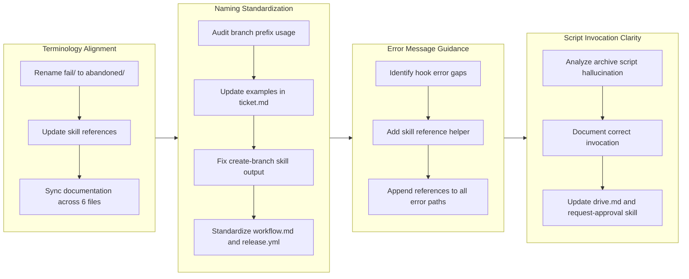

Refs #TBD

## 1. Overview

This branch implements systematic improvements to terminology alignment, documentation clarity, and error messaging within the plugin infrastructure. The work focuses on self-documenting behavior through consistent naming conventions and better guidance for Claude when validation fails. Four focused tickets addressed terminal naming discrepancies, standardized branch prefixes, enhanced error messages, and corrected archive script invocation.

**Highlights:**

1. Renamed fail/ directory to abandoned/ to align UI terminology with directory structure
2. Standardized branch naming documentation to drive-/trip- prefixes exclusively
3. Enhanced hook error messages to point Claude to authoritative skill documentation
4. Fixed archive script invocation guidance in drive and request-approval skills

## 2. Motivation

The plugin system had accumulated several terminology and documentation inconsistencies that created friction during development. The UI offered an "Abandon" action for rejected tickets, but they were stored in a directory named `fail/`. Branch naming documentation still referenced legacy prefixes (feat-, fix-, refact-) despite the create-branch skill defining only drive- and trip- as valid options. Error messages from the ticket validation hook provided no guidance on where to find correct specifications, forcing Claude to guess at format requirements. Finally, the archive script invocation pattern was unclear, leading Claude to hallucinate incorrect paths and invocation methods. These small friction points accumulated into development delays and confusion.

## 3. Journey

This branch progressed through systematic improvements to four interconnected areas. Terminology alignment centered on renaming the fail directory and cascading that change through documentation. Naming standardization updated branch prefix references to match current valid prefixes. Error message guidance added explicit skill pointers to help Claude find authoritative specifications. Script invocation clarity corrected the archive script invocation pattern across command and skill documentation. The work proceeded sequentially, with each ticket focused and independent.

## 4. Changes

### 4.1. Rename fail/ Directory to abandoned/ (06f8791)

The .workaholic/tickets/fail/ directory was renamed to .workaholic/tickets/abandoned/ to match the terminology used in the UI. When users select "Abandon" during /drive approval, it was confusing that tickets went to a directory named fail/. The rename required updating the handle-abandon skill, tickets README, and terminology documentation across both English and Japanese versions.

### 4.2. Standardize Branch Naming to drive-/trip- Prefixes Only (a69b473)

Documentation and examples across ticket.md, create-branch skill, workflow guide, and GitHub Actions release workflow were updated to reference only drive- and trip- branch prefixes. Legacy references to feat-, fix-, and refact- prefixes were removed from examples while preserving historical context in archived tickets. The release.yml workflow was updated to detect drive- and trip- branches for version bumping.

### 4.3. Point Hook Errors to create-ticket Skill (d5a432a)

The ticket validation hook was enhanced to reference the create-ticket skill when validation fails. Instead of providing error messages in isolation, the hook now guides Claude to the authoritative skill documentation where the complete specification can be found. This reduces the need for Claude to guess at format requirements.

### 4.4. Fix Archive Script Invocation Hallucination (0adb230)

The drive.md command and request-approval skill were updated to include explicit invocation instructions for the archive script. Rather than relying on Claude to read the archive-ticket skill documentation, the exact bash command is now shown inline: bash plugins/core/skills/archive-ticket/sh/archive.sh with all required arguments. This prevents hallucination of incorrect paths.

## 5. Outcome

The branch successfully aligned terminology, standardized documentation, and improved developer guidance across the plugin system. The rename of fail/ to abandoned/ resolves UI-to-filesystem confusion. Branch naming is now consistent and documented everywhere. Hook errors now point developers to authoritative sources instead of providing isolated error messages. Archive script invocation is now explicit and clear. These changes improve the developer experience by reducing friction points and preventing common mistakes during ticket processing and script invocation.

## 6. Historical Analysis

Previous work established the foundation for these improvements. The ticket renaming UI action from "Fail" to "Abandon" (20260128213850) created the initial naming inconsistency that this branch resolved. The add-fail-option-to-drive-approval ticket (20260128211728) created the original fail directory structure. Branch naming conventions evolved through the extract create-branch skill ticket (feat-20260128-001720), which defined drive and trip as valid prefixes, and auto-release on merge (feat-20260131-125844), which used the old prefix detection in GitHub Actions. The hook error messaging improvements build on the ticket validation hook implementation (feat-20260129-023941) and improved create-ticket frontmatter clarity (feat-20260131-125844). These changes represent systematic refinement of patterns established over the previous month of development.

## 7. Concerns

None. The changes are safe and backwards-compatible. Renaming the fail directory is a one-time directory move that won't affect historical data since only active tickets use these paths. Standardizing branch naming only affects new documentation and examples, not the actual behavior of branch creation. Updating error messages and inline documentation improves clarity without changing validation logic. The archive script invocation changes make the pattern more explicit but don't alter the underlying script behavior.

## 8. Ideas

None for this branch. Future improvements could include automated validation of branch names at creation time (beyond just documentation), but that's beyond the current scope. Additional standardization of other documentation references could be explored as follow-up work.

## 9. Performance

**Metrics**: 8 commits over 1.00 hour (8.0 commits/hour)

### 9.1. Pace Analysis

Development velocity was exceptionally high at 8.0 commits per hour, compressed into a single focused session. This reflects the independent, well-scoped nature of the tickets. Each ticket required minimal context switching, with clear implementation steps documented in the ticket specifications. The consistency of pace suggests the developer maintained focus and efficiently moved through implementation without backtracking or rework.

### 9.2. Decision Review

| Dimension      | Rating   | Notes |
| -------------- | -------- | ----- |
| Consistency    | Strong   | All changes follow established patterns consistently across multiple files |
| Intuitivity    | Strong   | Renaming fail/ to abandoned/ mirrors the UI action, making filesystem align with user actions |
| Describability | Strong   | Terminology improvements are precise and terminology-driven rather than arbitrary |
| Agility        | Adequate | Archive script ticket emerged late in the session rather than being identified upfront |
| Density        | Strong   | Changes avoid unnecessary scaffolding or duplicate documentation |

**Strengths**: Systematic terminology alignment across English and Japanese documentation, self-documenting fixes through naming consistency, comprehensive scope touching all affected files

**Areas for Improvement**: Initial ticket creation didn't capture the full scope (archive script issue emerged during implementation), suggesting earlier cross-cutting concern analysis would be beneficial

## 10. Release Preparation

**Verdict**: Needs attention before release

### 10.1. Concerns

- 11 files have uncommitted changes that must be staged and committed before release

### 10.2. Pre-release Instructions

- Stage all uncommitted changes: git add .
- Create a commit with the documentation and metadata updates
- Verify branch is clean: git status should show nothing to commit

### 10.3. Post-release Instructions

- None - standard release process applies

## 11. Notes

These changes improve the developer experience through small, focused improvements to consistency and clarity. The work demonstrates the value of auditing documentation for terminology alignment and making error messages more helpful. Future work could apply similar auditing to other areas of the codebase to identify similar opportunities for alignment and clarity.
