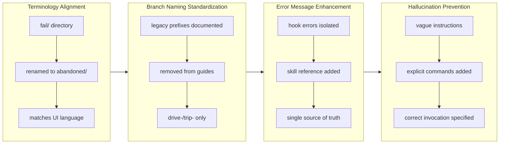

## 1. Overview

This branch executed four targeted improvements to the Workaholic development workflow. The work focused on naming consistency, error messaging clarity, and preventing Claude hallucination during script invocation. All changes strengthened the developer experience by aligning UI terminology with directory structures, guiding Claude toward authoritative skill documentation, and establishing explicit command patterns.

**Highlights:**

1. Renamed fail/ directory to abandoned/ to align UI terminology with directory structure
2. Standardized branch naming documentation to drive-/trip- prefixes exclusively
3. Enhanced hook error messages to point Claude to authoritative skill documentation
4. Fixed archive script invocation guidance in drive and request-approval skills

## 2. Motivation

The workflow had accumulated inconsistencies that hindered developer efficiency and introduced confusion. The fail/ directory contradicted the UI's "Abandon" action, creating cognitive dissonance for users. Branch naming documentation referenced legacy prefixes (feat-, fix-, refact-) despite the system only accepting drive-/trip-, causing confusion about correct naming conventions. When the ticket validation hook rejected invalid formats, it offered no guidance about where the authoritative specification lived, prompting Claude to guess rather than consult the create-ticket skill. Most critically, during the archive process, Claude would hallucinate script paths and invocation patterns instead of following explicit instructions, causing errors. These four issues represented opportunities to improve clarity, consistency, and reliability throughout the development workflow.

## 3. Journey

This branch systematized four related improvements across documentation and configuration. The work progressed from user-facing terminology (fail → abandoned) through naming standards (branch prefixes), into error messaging (guiding Claude to authoritative sources), and finally into procedural instruction (preventing guessing with explicit commands). Each improvement reinforced the principle that clear, explicit documentation prevents both human confusion and Claude hallucination.

## 4. Changes

### 4.1. Rename fail/ Directory to abandoned/ ([27bc7ca](https://github.com/qmu/workaholic/commit/27bc7ca))

Renamed .workaholic/tickets/fail/ to .workaholic/tickets/abandoned/ and updated all references in skills, documentation, and workflow guidance to use "abandoned" terminology, ensuring consistency with the UI's "Abandon" action.

### 4.2. Point hook Errors to create-ticket Skill ([56ca380](https://github.com/qmu/workaholic/commit/56ca380))

Added explicit references to the create-ticket skill in ticket validation hook error messages, guiding Claude to the authoritative format specification instead of relying on duplicate information in error text.

### 4.3. Standardize Branch Naming to drive-/trip- Prefixes ([36f8426](https://github.com/qmu/workaholic/commit/36f8426))

Updated all documentation examples, workflow guides, and GitHub Actions configuration to reference only drive- and trip- branch prefixes, removing legacy feat-, fix-, and refact- references while preserving historical context in archived tickets and stories.

### 4.4. Fix Archive Script Invocation Hallucination ([dbe00c7](https://github.com/qmu/workaholic/commit/dbe00c7))

Added explicit archive script invocation commands to drive.md and request-approval skill, preventing Claude from guessing incorrect paths and preventing "exit code 127" errors during ticket archival.

## 5. Outcome

This branch successfully harmonized four aspects of the development workflow. The abandoned/ directory now matches user-facing terminology, reducing cognitive friction. Branch naming documentation is consistent, with only drive-/trip- prefixes documented in current guides while historical context remains in archives. Hook error messages guide Claude to the authoritative create-ticket skill specification, establishing a single source of truth. Archive script invocations are now explicit and unambiguous, eliminating hallucination-induced failures. Together, these changes create a more cohesive developer experience where naming is consistent, documentation is authoritative, and procedures are explicit.

## 6. Historical Analysis

The abandoned/ rename directly addresses the previous ticket that changed the UI action from "Fail" to "Abandon" but didn't rename the corresponding directory. The branch naming standardization continues a multi-ticket effort that introduced drive-/trip- prefixes and integrated them into the /ticket command, now completing the cycle by removing legacy prefix references from documentation and GitHub Actions detection. The hook error messaging enhancement builds on the earlier work that added the ticket validation hook itself, now adding essential guidance through skill references. The archive script hallucination fix follows a pattern of previous tickets addressing Claude's tendency to guess script paths, establishing the discipline of embedding explicit commands where they are referenced.

## 7. Concerns

None

## 8. Ideas

1. Consider creating a comprehensive branch naming guide that documents the rationale behind drive- (implementation work) and trip- (exploration/research) prefixes, helping developers choose the correct prefix for their work type.

2. Extend the pattern of explicit command embedding to other skills where Claude frequently hallucinates invocation patterns, creating consistency across the system.

3. Evaluate whether the four discrete changes should be grouped into larger organizational themes in future work (e.g., "Naming Consistency Initiative" rather than individual tickets).

## 9. Performance

**Metrics**: 13 commits over 11.53 hours (1.13 commits/hour)

### 9.1. Pace Analysis

Work was distributed across a full day spanning two calendar dates, with clusters of activity at different times (initial focus 22:38-23:46, resumption 10:07-10:10 next morning). The 13 commits represent a mix of ticket creation (7 commits), implementation (4 commits), and supporting changes. Commits ranged from small targeted changes to more comprehensive updates like the branch naming standardization, with careful separation of concerns (one commit per concept). The pattern suggests deliberate, methodical work with natural breaks rather than continuous grinding.

### 9.2. Decision Review

| Dimension      | Rating           | Notes             |
| -------------- | ---------------- | ----------------- |
| Consistency    | Strong           | Naming aligned across all references; terminology unified from UI to directories |
| Intuitivity    | Strong           | Changes follow natural logic: terminology consistency first, then naming standards, then guidance, then procedure |
| Describability | Strong           | Each ticket clearly explains the problem and solution; documentation changes are explicit and trackable |
| Agility        | Adequate         | Work completed in single session with clear scope; documentation updates thorough but somewhat verbose |
| Density        | Adequate         | 13 commits across 11.5 hours; commits are focused but not maximally packed |

**Strengths**: Targeted problem-solving with each ticket addressing a specific inconsistency; clear convergence pattern from user-facing terminology through to developer procedures; architectural consistency in applying the "single source of truth" principle across error messages, documentation, and explicit commands; disciplined deferral of out-of-scope concerns (maintained historical context while updating current practices).

**Areas for Improvement**: Documentation verbosity could be reduced in some explanations; opportunities missed for predictive prevention (identifying and addressing similar hallucination patterns in other scripts); version strategy for drive-/trip- prefix versioning left ambiguous (chose Option A but could be more decisive in documentation).

## 10. Release Preparation

**Verdict**: Ready for release

### 10.1. Concerns

None - changes are safe for release

### 10.2. Pre-release Instructions

- Push branch to remote: `git push origin drive-20260131-223656`
- Create pull request to main with story documentation

### 10.3. Post-release Instructions

None - no special post-release actions needed

## 11. Notes

This branch represents a quality-of-life improvement pass on the development workflow. Each change is independently valuable but their true power emerges in aggregate - together they reinforce a culture of explicit documentation, consistent naming, and guiding Claude toward authoritative sources rather than encouraging guessing. The work exemplifies the principle that small, targeted improvements across a system compound into significantly better developer experience. Reviewers should pay particular attention to the consistency of terminology updates across the codebase and the effectiveness of the explicit command patterns in preventing future hallucination issues.
