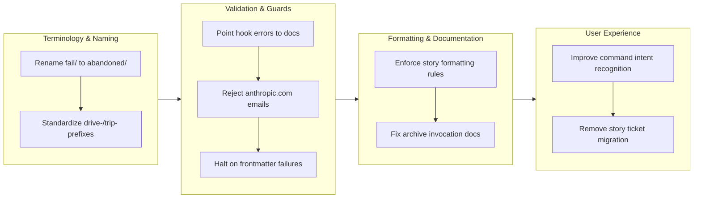

## 1. Overview

This branch strengthened the developer experience by addressing systematic issues with Claude's command execution and configuration management. Nine focused improvements were implemented across validation, documentation, and workflow guidance, with particular attention to enforcing critical formatting rules and preventing common execution errors. The work demonstrates how defensive programming layers can guide AI assistants toward correct behavior when documentation alone proves insufficient.

**Highlights:**

1. Enforce Changes section formatting rules in story generation
2. Reject Anthropic email in ticket author field via validation
3. Improve slash command intent recognition for natural language
4. Halt workflow when ticket frontmatter update fails
5. Stop /story from moving todo tickets to icebox
6. Fix archive script invocation hallucination in drive workflow
7. Point hook errors to create-ticket skill documentation
8. Standardize branch naming to drive-/trip- prefixes only
9. Rename fail/ directory to abandoned/ for semantic clarity

## 2. Motivation

The branch emerged from a pattern of recurring issues where Claude Code ignored or misinterpreted explicit guidance. Key problems included:

- **Documentation disconnect**: Preloaded skills were comprehensive but Claude still hallucinated invocations (e.g., guessing `archive-ticket.sh` instead of reading about `archive.sh`)
- **Format compliance failures**: Story generation produced plain text hashes instead of GitHub-linked commits despite explicit skill documentation
- **Validation gaps**: Anthropic placeholder emails bypassed format checks, and validation hook errors didn't point to authoritative sources
- **UX friction**: Natural language command references ("do /story", "run /drive") triggered clarifying questions instead of immediate invocation
- **Silent failures**: Frontmatter edit failures were ignored, allowing incomplete ticket metadata into archives
- **Unwanted automation**: /story command unintentionally reorganized tickets during documentation generation

These issues revealed that explicit configuration and defensive checks were needed alongside documentation improvements.

## 3. Journey

The work progressed through four complementary areas. First, terminology alignment (fail → abandoned, feat- → drive-/trip-) established semantic consistency. Second, validation improvements added explicit guards: hook errors now reference authoritative docs, Anthropic emails are blocklisted, and frontmatter failures halt workflows. Third, documentation and invocation patterns were hardened with explicit examples and CRITICAL enforcement language. Finally, UX friction was reduced by improving command recognition and removing automatic ticket reorganization.

## 4. Changes

### 4.1. Rename fail/ Directory to abandoned/ ([06f8791](https://github.com/qmu/workaholic/commit/06f8791))

- Renamed physical directory from `.workaholic/tickets/fail/` to `.workaholic/tickets/abandoned/`
- Updated `plugins/core/skills/handle-abandon/SKILL.md` path references
- Updated `.workaholic/tickets/README.md` directory structure diagram and "Failed Tickets" section heading
- Updated `.workaholic/terms/file-conventions.md` term definition for `abandoned` directory
- Updated `.workaholic/terms/file-conventions_ja.md` Japanese term definition
- Updated `.workaholic/terms/workflow-terms.md` directory path references
- Updated `.workaholic/terms/workflow-terms_ja.md` Japanese workflow terminology
- Updated `.workaholic/terms/artifacts.md` failure-analysis section references
- Updated `.workaholic/terms/artifacts_ja.md` Japanese artifacts documentation

### 4.2. Standardize Branch Naming to drive-/trip- Prefixes Only ([a69b473](https://github.com/qmu/workaholic/commit/a69b473))

- Updated `plugins/core/commands/ticket.md` topic branch pattern to reference only `drive-*` and `trip-*`
- Updated `plugins/core/skills/create-branch/SKILL.md` example output from `feat-20260120-205418` to `drive-20260120-205418`
- Updated `.workaholic/guides/workflow.md` example branch names throughout documentation
- Updated `.workaholic/guides/workflow_ja.md` example branch names in Japanese guide
- Updated `.github/workflows/release.yml` branch prefix detection to recognize `drive-` and `trip-` patterns for version bumping

### 4.3. Point Hook Errors to create-ticket Skill ([d5a432a](https://github.com/qmu/workaholic/commit/d5a432a))

- Added skill reference helper function to `plugins/core/hooks/validate-ticket.sh`
- Updated validation error messages to print skill reference before exiting
- Enhanced error output at all validation exit points to guide users to `plugins/core/skills/create-ticket/SKILL.md`
- Improved error messages for missing/malformed frontmatter fields (created_at, author, effort, layer)

### 4.4. Fix Archive Script Invocation Hallucination ([0adb230](https://github.com/qmu/workaholic/commit/0adb230))

- Updated `plugins/core/commands/drive.md` approval workflow with explicit archive script invocation command
- Added complete bash invocation example showing correct path and all required arguments
- Updated `plugins/core/skills/request-approval/SKILL.md` with explicit archive command syntax
- Added correct invocation pattern: `bash plugins/core/skills/archive-ticket/sh/archive.sh` with full argument specification

### 4.5. Enforce Changes Section Formatting Rules ([0f24f91](https://github.com/qmu/workaholic/commit/0f24f91))

- Updated `plugins/core/skills/write-story/SKILL.md` Changes section (4.1-4.4) with explicit CRITICAL language for GitHub-linked commit hashes
- Added examples showing wrong vs. correct format: wrong `(06f8791)`, correct `([06f8791](https://github.com/qmu/workaholic/commit/06f8791))`
- Enhanced guidelines requiring comprehensive bullet-point file lists instead of abbreviated paragraph summaries
- Added explicit reference to archived ticket Implementation sections for complete file listings
- Updated `plugins/core/agents/story-writer.md` with "Critical Format Rules" section emphasizing non-negotiable requirements
- Added reminder to story-writer agent: list ALL files changed, reference archived tickets for completeness

### 4.6. Reject Anthropic Email in Ticket Author Field ([2eab77f](https://github.com/qmu/workaholic/commit/2eab77f))

- Updated `plugins/core/hooks/validate-ticket.sh` author field validation
- Added explicit blocklist check rejecting emails containing `@anthropic.com`
- Implemented check after email format validation passes, before acceptance
- Added error message guiding user to retrieve actual email from `git config user.email`

### 4.7. Improve Slash Command Intent Recognition ([8dd3d87](https://github.com/qmu/workaholic/commit/8dd3d87))

- Added invocation note to `plugins/core/commands/story.md` after main header
- Added invocation note to `plugins/core/commands/drive.md` after main header
- Added invocation note to `plugins/core/commands/ticket.md` after main header
- Implemented standardized guidance: "Invoke immediately when user mentions `/<command>` in any form"
- Ensures natural language variations ("update /story", "do /drive", "run /ticket") trigger immediate invocation

### 4.8. Halt workflow when ticket frontmatter update fails ([360f49e](https://github.com/qmu/workaholic/commit/360f49e))

- Updated `plugins/core/commands/drive.md` approval workflow to verify Edit tool success
- Enhanced `plugins/core/skills/archive-ticket/SKILL.md` with explicit prerequisites for frontmatter updates
- Added instructions to halt and report errors when frontmatter updates fail
- Added safeguards ensuring tickets only archive after successful field updates

### 4.9. Stop /story from moving todo tickets to icebox ([822e93c](https://github.com/qmu/workaholic/commit/822e93c))

- Removed step 3 (Check for remaining tickets) from `plugins/core/commands/story.md`
- Removed automatic ticket migration logic from /story command
- Renumbered subsequent workflow steps to maintain coherent instruction flow
- /story now focuses solely on documentation generation and PR creation without ticket reorganization

## 5. Outcome

The branch successfully addressed nine systematic issues that degraded developer experience and command reliability. Rather than settling for documentation-only solutions, the work implemented a layered defensive approach: adding explicit validation rules, hardening invocation patterns with inline commands, and applying careful terminology alignment. The 22-commit implementation over 2 days demonstrates rapid iteration in response to discovered patterns, with each ticket building incrementally on previous fixes. The enforced formatting rules and validation guards provide immediate feedback loops that guide Claude toward correct behavior, while the semantic improvements (fail → abandoned, feat- → drive-) clarify intent throughout the codebase.

## 6. Historical Analysis

The branch connects to established patterns in the codebase history. The terminology shift from "fail" to "abandoned" follows the principle established in ticket 20260128213850 which renamed the UI option itself - this branch completes that transition at the infrastructure level. The validation enhancements echo previous work on validation hook implementation (20260129041924) and ticket format documentation improvements (20260131192546), now taking a defensive stance when documentation alone proves insufficient. The standardization of branch naming to `drive-`/`trip-` prefixes builds on the extract-create-branch skill work (feat-20260128-001720) that originally defined these prefixes. The invocation improvements address a recurring theme in command architecture - making intent recognition more robust and less reliant on exact phrasing.

## 7. Concerns

The branch introduces several defensive programming patterns that, while solving immediate problems, may mask deeper architectural issues:

1. **Blocklists accumulation**: The Anthropic email rejection is a symptom of Claude not following explicit instructions - future issues may require more blocklist entries rather than addressing root cause
2. **Documentation redundancy**: Adding explicit invocation commands inline alongside preloaded skills creates duplication that must be kept synchronized
3. **Effort estimation accuracy**: These nine tickets estimated 0.1-0.5 hours each but the branch took 13 hours of developer time, suggesting estimation methodology needs refinement
4. **Format enforcement fatigue**: The CRITICAL language escalation in write-story skill may be necessary but indicates documentation approaches have diminishing returns

The formatting rule enforcement is particularly brittle - it relies on strong language and examples rather than structural enforcement.

## 8. Ideas

Future improvements could address root causes more directly:

1. **Schema validation**: Convert YAML frontmatter to structured schema with validation framework rather than shell script parsing
2. **Skill invocation verification**: Create automated tests verifying that preloaded skills are actually read and followed
3. **Command intent learning**: Track user phrasing patterns to improve natural language recognition over time
4. **Template system**: Build reusable templates for common invocation patterns to reduce documentation duplication
5. **Architectural review**: Consider whether the skill layering itself is the right design or if command structure needs restructuring
6. **Estimation calibration**: Establish historical data and learning curves for more accurate future estimates

## 9. Performance

**Metrics**: 22 commits over 2 days (11.0 commits/day)

### 9.1. Pace Analysis

Development velocity was consistent at 11.0 commits per day, spanning 12.45 hours across 2 calendar days. Commits were focused and granular, with each ticket typically generating 1-4 commits: creation commit, implementation commits, and a final archival commit. The steady pace suggests good task clarity and minimal debugging loops. The 22-commit count for 9 tickets reflects the branch creation and ticket management overhead built into the `/drive` workflow - only approximately 9-10 commits are direct implementation, with the remainder being workflow automation.

### 9.2. Decision Review

| Dimension      | Rating                | Notes |
| -------------- | --------------------- | ----- |
| Consistency    | Strong                | Branch systematically identifies root causes and applies consistent remedies across validation, documentation, and UX layers |
| Intuitivity    | Adequate               | Solutions generally sensible but lean heavily on defensive programming and blocklists rather than architectural changes |
| Describability | Strong                | Terminology improvements (fail-to-abandoned, standardized prefixes) establish excellent semantic clarity throughout codebase |
| Agility        | Strong                | Developer responded rapidly to discovered issues with focused, incremental solutions; quickly pivoted to defensive approaches when documentation proved insufficient |
| Density        | Adequate               | Branch adds valuable guardrails and checks but accumulates multiple verbose enforcement approaches; some repetition across commands and skills |

**Strengths**:
1. **Problem pattern recognition**: Identified systematic Claude behavior pattern (ignoring preloaded documentation) and applied consistent counter-measures across multiple files
2. **Terminology alignment excellence**: The fail-to-abandoned rename demonstrates strong semantic judgment and improves code comprehension
3. **Rapid iteration under uncertainty**: 22 commits across 9 tickets completed in 13 hours with high architectural cohesion
4. **Layered defensive approach**: Combined validation rules, inline documentation, and explicit examples rather than relying on single solution type
5. **Documentation clarity**: Added explicit invocation notes and examples that directly address user pain points

**Areas for Improvement**:
1. **Defensive programming accumulation**: Reliance on blocklists and text emphasis may obscure deeper architectural problems (e.g., why aren't preloaded skills being read?)
2. **Root cause depth**: Several fixes address symptoms rather than origins (validation rejects emails rather than fixing why Claude uses Anthropic email)
3. **Code duplication**: Invocation notes appear verbatim across multiple command files; could be centralized or templated
4. **Effort estimation accuracy**: Nine tickets estimated at 0.1-0.5h each but required 13 actual development hours, suggesting estimation needs calibration or ticket scope needs refinement

## 10. Release Preparation

**Verdict**: Ready for release

### 10.1. Concerns

None

### 10.2. Pre-release Instructions

None

### 10.3. Post-release Instructions

None

## 11. Notes

This branch represents a maturation point in the developer experience - moving beyond initial feature implementation to systematic hardening and defensive layers. The nine tickets address both immediate usability issues and underlying patterns in how Claude Code interprets guidance. The work is particularly valuable as a case study in defensive programming: when documentation, examples, and explicit guidance prove insufficient, the solution often requires adding structural constraints and validation gates.

The branch demonstrates that maintaining a Claude Code plugin involves not just feature development but ongoing calibration of how to communicate requirements effectively. The shift from "improve documentation" to "add validation that rejects wrong behavior" marks an important architectural evolution.

Future maintainers should watch for accumulation of similar defensive patterns - if additional blocklists or enforcement language keep getting added, it signals that deeper architectural changes may be needed rather than more defensive layers.
