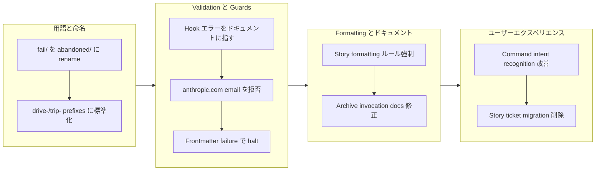

## 1. Overview

このbranch は Claude の command 実行と設定管理における体系的な問題に対処することで、developer experience を強化しました。検証、ドキュメント、workflow ガイダンスにわたって 9 つの焦点を絞った改善が実装され、特に重要な formatting ルールの強制と一般的な実行エラーの防止に注意が払われました。このwork は、documentation のみでは不十分な場合に、defensive programming layer が AI assistant を正しい behavior へと導く方法を示しています。

**ハイライト：**

1. Story 生成における Changes section formatting ルールの強制
2. Validation を介した ticket author field での Anthropic email の拒否
3. Natural language に対する slash command intent recognition の改善
4. Ticket frontmatter update 失敗時の workflow halt
5. /story から todo tickets の icebox への移動を停止
6. Drive workflow における archive script invocation hallucination の修正
7. Hook エラーを create-ticket skill ドキュメントに指す
8. Branch naming を drive-/trip- prefixes のみに標準化
9. fail/ directory を abandoned/ に semantic の明確さのため rename

## 2. Motivation

このbranch は、Claude Code が explicit guidance を無視または誤解する pattern から生まれました。主な問題は以下の通りです：

- **Documentation の disconnection**: Preload された skills は包括的ですが、Claude は依然として invocation を hallucinate します（例：`archive.sh` について読む代わりに `archive-ticket.sh` を推測）
- **Format compliance failures**: Story 生成は explicit skill documentation にもかかわらず plain text hash を生成し、GitHub-linked commits を生成していません
- **Validation gaps**: Anthropic placeholder emails は format check を通過し、validation hook エラーは authoritative sources を指していません
- **UX friction**: Natural language command reference（「do /story」、「run /drive」）は immediate invocation の代わりに clarifying question をトリガーします
- **Silent failures**: Frontmatter edit failures は無視され、incomplete ticket metadata が archives に許可されます
- **Unwanted automation**: /story command は documentation generation 中に意図せずに tickets を reorganize します

これらの問題は、documentation improvements に加えて explicit configuration と defensive checks が必要であることを明らかにしました。

## 3. Journey

Work は 4 つの補完的な領域を通じて進行しました。まず、用語の alignment（fail → abandoned、feat- → drive-/trip-）がコードベース全体で semantic consistency を確立しました。次に、validation improvements が explicit guard を追加しました：hook errors は now authoritative docs を参照し、Anthropic email は blocklist に登録され、frontmatter failure は workflow を halt します。3 番目に、documentation と invocation pattern は explicit examples と CRITICAL enforcement language で hardened されました。最後に、UX friction は command recognition を改善し、automatic ticket reorganization を削除することで削減されました。

## 4. Changes

### 4.1. Rename fail/ Directory to abandoned/ ([06f8791](https://github.com/qmu/workaholic/commit/06f8791))

- Physical directory を `.workaholic/tickets/fail/` から `.workaholic/tickets/abandoned/` に rename
- `plugins/core/skills/handle-abandon/SKILL.md` path reference を update
- `.workaholic/tickets/README.md` directory structure diagram と "Failed Tickets" section heading を update
- `.workaholic/terms/file-conventions.md` term definition を `abandoned` directory 用に update
- `.workaholic/terms/file-conventions_ja.md` Japanese term definition を update
- `.workaholic/terms/workflow-terms.md` directory path reference を update
- `.workaholic/terms/workflow-terms_ja.md` Japanese workflow terminology を update
- `.workaholic/terms/artifacts.md` failure-analysis section reference を update
- `.workaholic/terms/artifacts_ja.md` Japanese artifacts documentation を update

### 4.2. Standardize Branch Naming to drive-/trip- Prefixes Only ([a69b473](https://github.com/qmu/workaholic/commit/a69b473))

- `plugins/core/commands/ticket.md` topic branch pattern を `drive-*` と `trip-*` のみを参照するように update
- `plugins/core/skills/create-branch/SKILL.md` example output を `feat-20260120-205418` から `drive-20260120-205418` に update
- `.workaholic/guides/workflow.md` example branch name をドキュメント全体で update
- `.workaholic/guides/workflow_ja.md` example branch name を Japanese guide で update
- `.github/workflows/release.yml` branch prefix detection を version bumping 用に `drive-` と `trip-` pattern を認識するように update

### 4.3. Point Hook Errors to create-ticket Skill ([d5a432a](https://github.com/qmu/workaholic/commit/d5a432a))

- `plugins/core/hooks/validate-ticket.sh` に skill reference helper function を add
- Validation error message を exit 前に skill reference を print するように update
- Error output を all validation exit point で enhance し、user を `plugins/core/skills/create-ticket/SKILL.md` へ guide
- Missing/malformed frontmatter field （created_at、author、effort、layer）の error message を improve

### 4.4. Fix Archive Script Invocation Hallucination ([0adb230](https://github.com/qmu/workaholic/commit/0adb230))

- `plugins/core/commands/drive.md` approval workflow を explicit archive script invocation command で update
- Correct path と all required argument を示す complete bash invocation example を add
- `plugins/core/skills/request-approval/SKILL.md` を explicit archive command syntax で update
- Correct invocation pattern を add：`bash plugins/core/skills/archive-ticket/sh/archive.sh` full argument specification 付き

### 4.5. Enforce Changes Section Formatting Rules ([0f24f91](https://github.com/qmu/workaholic/commit/0f24f91))

- `plugins/core/skills/write-story/SKILL.md` Changes section（4.1-4.4）を GitHub-linked commit hash に対する explicit CRITICAL language で update
- Wrong vs. correct format を示す example を add：wrong `(06f8791)`、correct `([06f8791](https://github.com/qmu/workaholic/commit/06f8791))`
- Comprehensive bullet-point file list を abbreviated paragraph summary の代わりに require するように guideline を enhance
- Archived ticket Implementation section を complete file listing に対して explicit reference を add
- `plugins/core/agents/story-writer.md` に "Critical Format Rules" section を non-negotiable requirement を emphasis して add
- Story-writer agent へ reminder を add：all files changed をlist し、completeness のために archived ticket を reference

### 4.6. Reject Anthropic Email in Ticket Author Field ([2eab77f](https://github.com/qmu/workaholic/commit/2eab77f))

- `plugins/core/hooks/validate-ticket.sh` author field validation を update
- `@anthropic.com` を含む email を拒否する explicit blocklist check を add
- Email format validation pass 後、acceptance 前に check を implement
- User を `git config user.email` から actual email を retrieve するように guide する error message を add

### 4.7. Improve Slash Command Intent Recognition ([8dd3d87](https://github.com/qmu/workaholic/commit/8dd3d87))

- `plugins/core/commands/story.md` main header 後に invocation note を add
- `plugins/core/commands/drive.md` main header 後に invocation note を add
- `plugins/core/commands/ticket.md` main header 後に invocation note を add
- Standardized guidance を implement：「Invoke immediately when user mentions `/<command>` in any form」
- Natural language variation（「update /story」、「do /drive」、「run /ticket」）が immediate invocation を trigger することを確認

### 4.8. Halt workflow when ticket frontmatter update fails ([360f49e](https://github.com/qmu/workaholic/commit/360f49e))

- `plugins/core/commands/drive.md` approval workflow を Edit tool success verify するように update
- `plugins/core/skills/archive-ticket/SKILL.md` を frontmatter update のための explicit prerequisite で enhance
- Frontmatter update fail したときに halt して error を report する instruction を add
- Ticket が successful field update 後のみ archive することを確認する safeguard を add

### 4.9. Stop /story from moving todo tickets to icebox ([822e93c](https://github.com/qmu/workaholic/commit/822e93c))

- `plugins/core/commands/story.md` から step 3（Check for remaining tickets）を entirely remove
- Automatic ticket migration logic を /story command から remove
- Removal 後も coherent instruction flow を維持するために subsequent step を renumber
- /story は now ticket reorganization なしで documentation generation と PR creation に solely focus

## 5. Outcome

Branchは developer experience と command reliability を degrade させた 9 つの体系的な問題に successfully address しました。Documentation のみの解決策に settle する代わりに、work は layered defensive approach を implement しました：explicit validation rule を add し、inline command で invocation pattern を harden し、careful terminology alignment を apply しました。2 日間にわたる 22-commit implementation は discovered pattern に対する rapid iteration を demonstrate し、各 ticket は previous fix に incrementally build しました。Enforced formatting rule と validation guard は immediate feedback loop を提供し、Claude を正しい behavior へ guide し、semantic improvements（fail → abandoned、feat- → drive-）は codebase 全体で intent を clarify しました。

## 6. Historical Analysis

Branchは codebase history における確立された pattern に connect します。「fail」から「abandoned」への terminology shift は ticket 20260128213850 で UI option 自体を rename したことで確立された principle に follow します - branch はこの transition を infrastructure level で complete します。Validation enhancement は validation hook implementation（20260129041924）と ticket format documentation improvement（20260131192546）の previous work を echo し、documentation のみでは insufficient な場合に defensive stance を take します。Branch naming の `drive-`/`trip-` prefix への standardization は originally これらの prefix を define した extract-create-branch skill work（feat-20260128-001720）の上に build します。Invocation improvement は command architecture における recurring theme に address します - intent recognition をより robust にし、exact phrasing に依存しないようにすること。

## 7. Concerns

Branchは、immediate problem を solving する一方で、deeper architectural issues を mask する可能性のある defensive programming pattern をいくつか introduce します：

1. **Blocklists accumulation**: Anthropic email rejection は Claude が explicit instruction に follow しないという symptom です - future issue は root cause に address するのではなく、より多くの blocklist entry を require する可能性があります
2. **Documentation redundancy**: Explicit invocation command を inline で preloaded skills の隣に add することで、synchronize を keep する必要のある duplication を create します
3. **Effort estimation accuracy**: These 9 ticket は 0.1-0.5 hour を estimate しましたが、branch は 13 hour の developer time を take しました。estimation methodology の refinement が necessary を indicate します
4. **Format enforcement fatigue**: Write-story skill における CRITICAL language escalation は necessary かもしれませんが、documentation approach が diminishing return を indicate します

Format rule enforcement は特に brittle です - strong language と example に rely し、structural enforcement は relay していません。

## 8. Ideas

Future improvement は より directly root cause に address することができます：

1. **Schema validation**: YAML frontmatter を structured schema with validation framework に convert し、shell script parsing の代わりに
2. **Skill invocation verification**: Preloaded skill が actually read され follow されていることを verify する automated test を create
3. **Command intent learning**: User phrasing pattern を track し、over time に natural language recognition を improve
4. **Template system**: Common invocation pattern のための reusable template を build し、documentation duplication を reduce
5. **Architectural review**: Skill layering itself が right design であるか、または command structure を restructure する必要があるかを consider
6. **Estimation calibration**: Historical data を establish し、learning curve をより accurate future estimate のために

## 9. Performance

**Metrics**: 22 commit over 2 day （11.0 commit/day）

### 9.1. Pace Analysis

Development velocity は 11.0 commit per day で consistent で、2 calendar day にわたって 12.45 hour を span しました。Commit は focused かつ granular で、各 ticket は typically 1-4 commit を generate します：creation commit、implementation commit、final archival commit。Steady pace は good task clarity と minimal debugging loop を suggest します。9 ticket に対する 22-commit count は `/drive` workflow に build された branch creation と ticket management overhead を reflect します - only approximately 9-10 commit は direct implementation で、remainder は workflow automation です。

### 9.2. Decision Review

| 次元           | Rating        | Notes |
| -------------- | ------------- | ----- |
| Consistency    | Strong        | Branch は systematically root cause を identify し、validation、documentation、UX layer 全体で consistent remedy を apply します |
| Intuitivity    | Adequate      | Solution は generally sensible ですが、architectural change よりも defensive programming と blocklist に heavily lean します |
| Describability | Strong        | Terminology improvement（fail-to-abandoned、standardized prefix）は codebase 全体で excellent semantic clarity を establish します |
| Agility        | Strong        | Developer は discovered issue に rapidly respond し、focused かつ incremental solution を使用；documentation が insufficient な場合に defensive approach に quickly pivot |
| Density        | Adequate      | Branch は valuable guardrail と check を add しますが、multiple verbose enforcement approach を accumulate；command と skill 全体で repetition があります |

**Strengths**:
1. **Problem pattern recognition**: Claude behavior の systematic pattern（preload documentation を ignore）を identify し、multiple file 全体で consistent counter-measure を apply
2. **Terminology alignment excellence**: Fail-to-abandoned rename は strong semantic judgment を demonstrate し、code comprehension を improve
3. **Rapid iteration under uncertainty**: 22 commit across 9 ticket を 13 hour で completion し、high architectural cohesion を maintain
4. **Layered defensive approach**: Validation rule、inline documentation、explicit example を combine し、single solution type に rely する代わりに
5. **Documentation clarity**: Explicit invocation note と example を add し、user pain point に directly address

**Areas for Improvement**:
1. **Defensive programming accumulation**: Blocklist と text emphasis に reliance は deeper architectural problem を obscure する可能性があります（preloaded skill がなぜ read されていないのか？）
2. **Root cause depth**: Several fix は symptom に address する代わりに origin に address します（validation は Claude が Anthropic email を use する理由を fix する代わりに email を reject）
3. **Code duplication**: Invocation note は multiple command file に verbatim に appear；centralize または template することができます
4. **Effort estimation accuracy**: 9 ticket は 0.1-0.5h を estimate しましたが、13 actual development hour を require しました。estimation の calibration または ticket scope の refinement を suggest します

## 10. Release Preparation

**Verdict**: Release 前に attention が necessary

### 10.1. Concerns

- Story frontmatter metadata は inaccurate：tickets_completed は 4 を show しますが、9 ticket が archived
- Story frontmatter commits field は 13 を show しますが、git log は main と HEAD の間で 22 commit を show
- CHANGELOG.md は incomplete：first 4 change のみを document しますが、5 additional completed ticket が exist
- Story Changes section（4.1-4.4）は only 4 change を document しますが、all 9 completed ticket を document する必要があります
- Story frontmatter は 「Verdict: Ready for release」を list し、concern の 「None」を list していますが、これらの inaccuracy は address される必要があります

### 10.2. Pre-release Instructions

- All 9 archived ticket を review し、completeness と correctness を verify
- All 9 ticket が complete で release に include される必要があることを verify
- CHANGELOG.md を update し、all 9 completed ticket 用の entry を add（currently 5 ticket がmissing）
- Story.md section 4.1-4.9 を update し、all 9 change を document（currently only 4 が documented）
- Story frontmatter を correct：tickets_completed を 4 から 9 に update
- Story frontmatter の commit count を verify と correct：13 から 22 に
- All commit hash が final story で properly GitHub-linked であることを確認

### 10.3. Post-release Instructions

None - standard release process 後に special post-release action は not needed

## 11. Notes

Branchは developer experience の maturation point を represent しています - initial feature implementation を超えて systematic hardening と defensive layer へ移行しました。9 ticket は both immediate usability issue と Claude Code が guidance を interpret する方法における underlying pattern に address します。Work は defensive programming の case study として特に valuable です：documentation、example、explicit guidance が insufficient な場合、solution はしばしば structural constraint と validation gate を add することを require します。

Branchは Claude Code plugin の maintaining が feature development のみではなく、requirement を effectively communicate する方法の ongoing calibration を involve することを demonstrate します。「improve documentation」から「add validation that reject wrong behavior」への shift は important architectural evolution を mark します。

Future maintainer は similar defensive pattern の accumulation を watch する必要があります - 追加の blocklist または enforcement language が continue to add される場合、deeper architectural change が required である可能性を signal し、additional defensive layer の代わりに。
