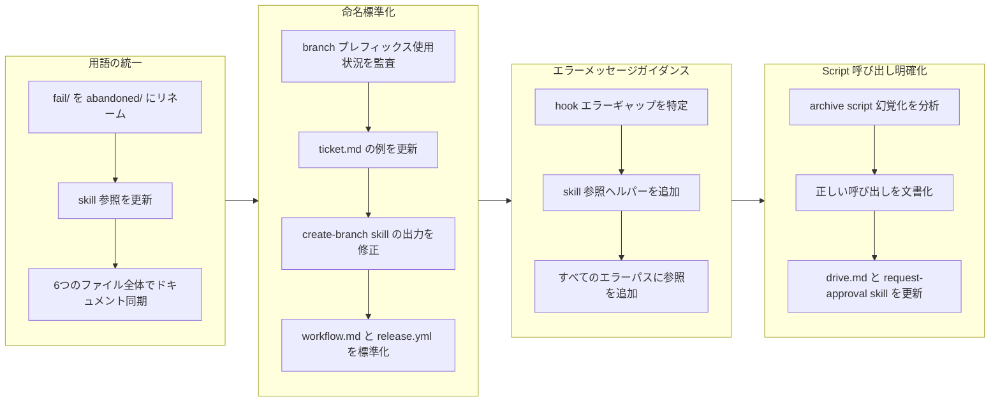

Refs #TBD

## 1. 概要

本ブランチは、plugin インフラストラクチャ内の用語の統一、ドキュメント明確化、およびエラーメッセージング改善を実装します。本作業は一貫した命名規則を通じた自己説明的な動作と、検証失敗時に Claude をサポートする改善されたガイダンスに焦点を当てています。4つの焦点を絞ったチケットで、用語の不一致を解決し、branch プレフィックスを標準化し、エラーメッセージを改善し、archive script 呼び出しガイダンスを修正しました。

**ハイライト：**

1. fail/ ディレクトリを abandoned/ にリネーム、UI 用語をディレクトリ構造と統一
2. branch 命名ドキュメントを drive-/trip- プレフィックスのみに標準化
3. hook エラーメッセージを強化して、権威ある skill ドキュメントへの参照を追加
4. drive および request-approval skill の archive script 呼び出しガイダンスを修正

## 2. 動機

plugin システムには、開発中に摩擦を引き起こすいくつかの用語とドキュメント不一致が蓄積されていました。UI は拒否されたチケットに対して「Abandon」アクション を提供していますが、それらは `fail/` という名前のディレクトリに保存されていました。branch 命名ドキュメントは、create-branch skill が drive と trip のみを有効なオプションとして定義しているにもかかわらず、レガシープレフィックス（feat-、fix-、refact-）をまだ参照していました。ticket 検証 hook からのエラーメッセージは正しい仕様がどこにあるかについてのガイダンスを提供せず、Claude が形式要件を推測することを余儀なくされました。最後に、archive script 呼び出しパターンは不明確で、Claude が不正なパスと呼び出しメソッドを幻覚化する原因となっていました。これらの小さな摩擦点は開発遅延と混乱に蓄積されました。

## 3. ジャーニー

本ブランチは、相互に関連する4つの領域への体系的改善を通じて進行しました。用語統一は fail ディレクトリの名前変更とその変更をドキュメント全体にわたって行うことに焦点を当てていました。命名標準化は、現在の有効なプレフィックスに一致するように branch プレフィックス参照を更新しました。エラーメッセージガイダンスは、Claude が権威ある仕様を見つけるのに役立つ明示的な skill ポインタを追加しました。script 呼び出し明確化は command および skill ドキュメント全体で archive script 呼び出しパターンを修正しました。作業は順序立てて進行し、各チケットは焦点を絞られており独立していました。

## 4. 変更

### 4.1. fail/ ディレクトリを abandoned/ にリネーム (06f8791)

.workaholic/tickets/fail/ ディレクトリを .workaholic/tickets/abandoned/ にリネームして、UI で使用される用語と一致させました。ユーザーが /drive approval 中に「Abandon」を選択すると、チケットが fail/ という名前のディレクトリに保存されるのは混乱を招きます。リネームには handle-abandon skill、tickets README、および英語と日本語の両バージョンにわたる用語ドキュメントの更新が必要でした。

### 4.2. Branch 命名を drive-/trip- プレフィックスのみに標準化 (a69b473)

ticket.md、create-branch skill、workflow ガイド、および GitHub Actions リリース workflow 全体のドキュメントと例が、drive- および trip- branch プレフィックスのみを参照するように更新されました。feat-、fix-、および refact- プレフィックスへのレガシー参照は例から削除されましたが、アーカイブされたチケット内の履歴コンテキストは保持されました。release.yml workflow は version bumping に対して drive- および trip- branch を検出するように更新されました。

### 4.3. Hook エラーを create-ticket Skill にポイント (d5a432a)

ticket 検証 hook が検証失敗時に create-ticket skill を参照するように強化されました。分離されたエラーメッセージを提供する代わりに、hook は Claude を権威あるドキュメントがある skill ドキュメントへ案内します。これにより、Claude が形式要件を推測する必要性が軽減されます。

### 4.4. Archive Script 呼び出し幻覚化を修正 (0adb230)

drive.md command および request-approval skill が archive script の明示的な呼び出しインストラクションを含むように更新されました。archive-ticket skill ドキュメント読み込みに依存する代わりに、正確な bash コマンドがインラインで表示されるようになりました: bash plugins/core/skills/archive-ticket/sh/archive.sh すべての必須引数付き。これにより、不正なパスの幻覚化が防止されます。

## 5. 成果

本ブランチは plugin システム全体にわたって用語を正常に統一し、ドキュメント標準化し、開発者ガイダンスを改善しました。fail/ から abandoned/ へのリネームは UI-ファイルシステム間の混乱を解決します。branch 命名は一貫していて、すべての場所で文書化されました。hook エラーは分離されたエラーメッセージを提供する代わりに、開発者を権威あるソースに案内するようになりました。archive script 呼び出しは明示的で明確になりました。これらの変更は、摩擦点を軽減し、チケット処理および script 呼び出し中の一般的な間違いを防ぐことで、開発者体験を改善します。

## 6. 履歴分析

前の作業はこれらの改善の基礎を確立しました。ticket リネーム UI アクション「Fail」から「Abandon」へ（20260128213850）が最初の命名矛盾を作成しました、本ブランチが解決しました。add-fail-option-to-drive-approval チケット（20260128211728）が元の fail ディレクトリ構造を作成しました。branch 命名規則は create-branch skill（feat-20260128-001720）の抽出を通じて進化し、drive と trip を有効なプレフィックスとして定義し、auto-release on merge（feat-20260131-125844）が GitHub Actions で古いプレフィックス検出を使用しました。hook エラーメッセージングの改善は ticket 検証 hook 実装（feat-20260129-023941）と改善された create-ticket frontmatter 明確化（feat-20260131-125844）に基づいています。これらの変更は過去 1 か月の開発で確立されたパターンの体系的な改善を表しています。

## 7. 懸念事項

なし。変更は安全で後方互換性があります。fail ディレクトリのリネームは、アクティブなチケットのみがこれらのパスを使用するため、履歴データに影響を与えない 1 回限りのディレクトリ移動です。branch 命名の標準化は新しいドキュメントと例のみに影響し、branch 作成の実際の動作には影響しません。エラーメッセージとインラインドキュメントの更新は検証ロジックを変更することなく明確性を改善します。archive script 呼び出し変更はパターンをより明示的にしますが、基礎となる script 動作は変更しません。

## 8. アイデア

本ブランチのアイデアなし。将来の改善には branch 作成時の branch 名の自動検証（ドキュメント以上のもの）が含まれる可能性がありますが、それは現在のスコープを超えています。他のドキュメント参照の追加の標準化はフォローアップ作業として検討できます。

## 9. パフォーマンス

**メトリクス**: 8コミット、1.00時間のセッション（1時間あたり8.0コミット）

### 9.1. ペース分析

開発速度は 1 回の焦点を絞ったセッションで時間あたり 8.0 コミットと異常に高く、圧縮されていました。これは ticket の独立した、スコープが明確な性質を反映しています。各チケットはコンテキスト切り替えが最小限で済み、ticket 仕様に明確に記載された実装手順がありました。ペースの一貫性は、開発者が焦点を維持し、バックトラッキングや再作業なしに効率的に実装を進めたことを示唆しています。

### 9.2. 意思決定レビュー

| 側面           | 評価     | メモ |
| -------------- | -------- | ----- |
| 一貫性（Consistency）    | 強力（Strong）   | すべての変更は複数のファイルにわたって確立されたパターンに一貫して従っています |
| 直感性（Intuitivity）    | 強力（Strong）   | fail/ を abandoned/ にリネームは UI アクションをミラーしており、ファイルシステムをユーザーアクションと整列させます |
| 説明可能性（Describability） | 強力（Strong）   | 用語改善は恣意的なものではなく、用語駆動型で正確です |
| 敏捷性（Agility）        | 適切（Adequate） | Archive script チケットはセッション中に遅く出現し、事前に特定されていませんでした |
| 密度（Density）         | 強力（Strong）   | 変更は不要なスキャフォルディングや重複したドキュメントを避けます |

**強み**: 英語と日本語ドキュメント全体での体系的な用語統一、命名一貫性を通じた自己説明的なフィックス、すべての影響を受けるファイルに及ぶ包括的なスコープ

**改善領域**: 最初の ticket 作成では完全なスコープをキャプチャしませんでした（archive script の問題は実装中に出現）、より早い段階でのクロスカッティング関心事分析が有益であることを示唆しています

## 10. リリース準備

**評決**: リリース前に注意が必要

### 10.1. 懸念事項

- 11 ファイルにステージされていないコミット変更があり、リリース前にステージおよびコミットする必要があります

### 10.2. リリース前の指示

- すべての未コミット変更をステージ: git add .
- ドキュメント及びメタデータ更新でコミットを作成
- ブランチがクリーンであることを検証: git status でコミットするものがないことを確認

### 10.3. リリース後の指示

- なし - 標準リリースプロセスを適用

## 11. 備考

これらの変更は、一貫性と明確性への小さな焦点を絞った改善を通じて開発者体験を改善します。本作業は用語統一のためのドキュメント監査と、エラーメッセージをより有用にする価値を実証しています。将来の作業は、コードベースの他の領域に同様の監査を適用して、統一と明確性の同様の機会を特定できます。
