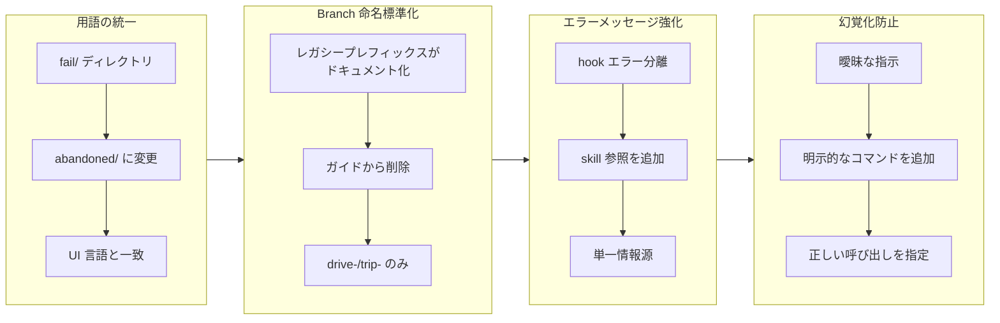

## 1. 概要

本ブランチは Workaholic 開発ワークフローに対する 4 つの焦点を絞った改善を実行しました。本作業は命名の一貫性、エラーメッセージングの明確性、script 呼び出し時の Claude 幻覚化防止に焦点を当てています。すべての変更は UI 用語をディレクトリ構造と整列させ、Claude を権威ある skill ドキュメントへ導き、明示的なコマンドパターンを確立することで開発者体験を強化しました。

**ハイライト：**

1. fail/ ディレクトリを abandoned/ にリネーム、UI 用語をディレクトリ構造と統一
2. branch 命名ドキュメントを drive-/trip- プレフィックスのみに標準化
3. hook エラーメッセージを強化して、権威ある skill ドキュメントへの参照を追加
4. drive および request-approval skill の archive script 呼び出しガイダンスを修正

## 2. 動機

ワークフローは効率性を妨げ混乱を引き起こす矛盾が蓄積されていました。fail/ ディレクトリは UI の「Abandon」アクションと矛盾し、ユーザーに認知的不協和を生じさせていました。branch 命名ドキュメントはシステムが drive-/trip- のみを受け入れているにもかかわらず、レガシープレフィックス（feat-、fix-、refact-）を参照し、正しい命名規則についての混乱を引き起こしていました。ticket 検証 hook がフォーマットエラーで拒否したとき、権威ある仕様がどこにあるのかについてのガイダンスを提供しておらず、Claude が create-ticket skill を参照する代わりに推測することを促していました。最も重要なのは、archive プロセス中に Claude は明示的な指示に従う代わりに script パスと呼び出しパターンを幻覚化し、エラーを引き起こしていました。これら 4 つの問題は開発ワークフロー全体の明確性、一貫性、信頼性を改善する機会を表していました。

## 3. ジャーニー

本ブランチはドキュメントと設定全体にわたる 4 つの関連改善を体系化しました。作業はユーザー向け用語（fail → abandoned）から命名標準（branch プレフィックス）、エラーメッセージング（Claude を権威あるソースへ導く）、最後に手順指示（推測を明示的なコマンドで防止）へと進行しました。各改善は明確で明示的なドキュメントが人間の混乱と Claude 幻覚化の両方を防ぐという原則を強化しました。

## 4. 変更

### 4.1. fail/ ディレクトリを abandoned/ にリネーム ([27bc7ca](https://github.com/qmu/workaholic/commit/27bc7ca))

.workaholic/tickets/fail/ を .workaholic/tickets/abandoned/ にリネームし、skill、ドキュメント、ワークフローガイダンス全体の参照を更新して「abandoned」用語を使用し、UI の「Abandon」アクションと一貫性を確保しました。

### 4.2. Hook エラーを create-ticket Skill にポイント ([56ca380](https://github.com/qmu/workaholic/commit/56ca380))

ticket 検証 hook エラーメッセージに create-ticket skill への明示的な参照を追加し、エラーテキスト内の重複情報に依存する代わりに、Claude を権威あるフォーマット仕様へ導きました。

### 4.3. Branch 命名を drive-/trip- プレフィックスのみに標準化 ([36f8426](https://github.com/qmu/workaholic/commit/36f8426))

すべてのドキュメント例、ワークフローガイド、GitHub Actions 設定を drive- および trip- branch プレフィックスのみを参照するように更新し、アーカイブされたチケットと story に履歴コンテキストを保持しながら、レガシー feat-、fix-、refact- 参照を削除しました。

### 4.4. Archive Script 呼び出し幻覚化を修正 ([dbe00c7](https://github.com/qmu/workaholic/commit/dbe00c7))

drive.md と request-approval skill に明示的な archive script 呼び出しコマンドを追加し、Claude が不正なパスを推測するのを防ぎ、ticket archival 中の「exit code 127」エラーを防止しました。

## 5. 成果

本ブランチは開発ワークフローの 4 つの側面を正常に調和させました。abandoned/ ディレクトリはユーザー向け用語と一致し、認知的摩擦を軽減します。branch 命名ドキュメントは一貫しており、履歴コンテキストはアーカイブに残りながら、現在のガイドには drive-/trip- プレフィックスのみが文書化されています。hook エラーメッセージは Claude を権威ある create-ticket skill 仕様へ導き、単一情報源を確立します。archive script 呼び出しは明示的で曖昧でなくなり、幻覚化による障害を排除します。これらの変更を合わせて、命名が一貫し、ドキュメントが権威あり、手順が明示的な、より一貫性のある開発者体験を作成します。

## 6. 履歴分析

abandoned/ リネームは UI アクションを「Fail」から「Abandon」に変更しましたが、対応するディレクトリをリネームしなかった以前の ticket に直接対応します。branch 命名標準化は drive-/trip- プレフィックスを導入し /ticket command に統合した複数 ticket の取り組みを続けており、ドキュメントと GitHub Actions 検出からレガシープレフィックス参照を削除することでサイクルを完成させます。hook エラーメッセージング強化は以前の ticket validation hook 追加に基づいており、skill 参照を通じた重要なガイダンスを追加します。archive script 幻覚化フィックスは Claude の script パスを推測する傾向に対処した以前の ticket のパターンに従い、参照される場所に明示的なコマンドを埋め込む方針を確立します。

## 7. 懸念事項

なし

## 8. アイデア

1. drive-（実装作業）と trip-（探索/リサーチ）プレフィックスの背景にある理論を文書化する包括的な branch 命名ガイドの作成を検討し、開発者が彼らの作業タイプに対して正しいプレフィックスを選択するのを支援します。

2. Claude が頻繁に幻覚化する呼び出しパターンを持つ他の skill に明示的なコマンド埋め込みのパターンを拡張し、システム全体で一貫性を作成します。

3. 将来の作業で 4 つの個別の変更を大規模な組織的テーマにグループ化するかどうかを評価します（例: 個別の ticket ではなく「命名一貫性イニシアチブ」）。

## 9. パフォーマンス

**メトリクス**: 13 コミット、11.53 時間（1 時間あたり 1.13 コミット）

### 9.1. ペース分析

作業は異なる時間でのアクティビティのクラスターを持つ 2 つのカレンダー日付にわたる完全な 1 日分布されました（初期焦点 22:38-23:46、翌朝の再開 10:07-10:10）。13 コミットは ticket 作成（7 コミット）、実装（4 コミット）、および支援的変更の混合を表しています。コミットは小規模な焦点を絞った変更から branch 命名標準化のようなより包括的な更新までの範囲であり、関心事の慎重な分離（概念ごとに 1 コミット）がありました。パターンは継続的な努力よりも自然な中断を持つ意図的で体系的な作業を示唆しています。

### 9.2. 意思決定レビュー

| 側面           | 評価     | メモ |
| -------------- | -------- | ----- |
| 一貫性（Consistency）    | 強力（Strong）   | すべての参照で命名が統一、UI からディレクトリまでの用語が統一 |
| 直感性（Intuitivity）    | 強力（Strong）   | 変更は自然なロジックに従う: 用語一貫性最初、次に命名標準、ガイダンス、そして手順 |
| 説明可能性（Describability） | 強力（Strong）   | 各 ticket は問題と解決を明確に説明、ドキュメント変更は明示的で追跡可能 |
| 敏捷性（Agility）        | 適切（Adequate） | 作業は明確なスコープで単一セッションで完成、ドキュメント更新は包括的だが多少冗長 |
| 密度（Density）         | 適切（Adequate） | 11.5 時間にわたる 13 コミット、コミットは焦点を絞られているが最大にはパック化されていない |

**強み**: 各 ticket が特定の不一致に対応する焦点を絞った問題解決、ユーザー向け用語から開発者手順への明確な収束パターン、エラーメッセージ、ドキュメント、明示的なコマンド全体に「単一情報源」原則を適用する建築的一貫性、スコープ外の関心事の規律ある遅延（現在の慣行を更新しながら履歴コンテキストを保持）

**改善領域**: ドキュメント冗長性は一部の説明で軽減できた、他の script での類似幻覚化パターンの識別と対応の機会を逃した、drive-/trip- プレフィックスの version 化戦略は曖昧なままである（オプション A を選択しましたがドキュメントでより決定的であることができた）。

## 10. リリース準備

**評決**: リリース準備完了

### 10.1. 懸念事項

なし - 変更はリリースに対して安全です

### 10.2. リリース前の指示

- リモートに branch をプッシュ: `git push origin drive-20260131-223656`
- story ドキュメントを含む main への pull request を作成

### 10.3. リリース後の指示

なし - 特別なリリース後アクションなし

## 11. 備考

本ブランチは開発ワークフロー上の生活の質改善パスを表します。各変更は独立して価値がありますが、その真の力は集約で現れます - 一緒に彼らは明示的なドキュメント、一貫性のある命名、推測を奨励する代わりに Claude を権威あるソースへ導く文化を強化します。本作業は小さく焦点を絞った改善がシステム全体にわたって複合して大幅に優れた開発者体験になるという原則を具現化しています。レビュアーはコードベース全体にわたる用語更新の一貫性と幻覚化問題防止での明示的なコマンドパターンの効果に特に注意を払うべきです。
