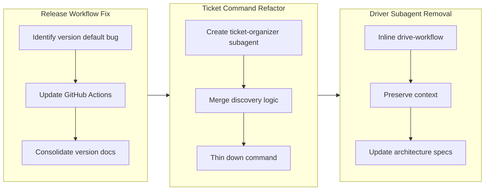

## 1. Overview

This branch refined the plugin architecture and fixed critical release workflow issues. The developer simplified the `/ticket` command to a thin orchestrator, removed the driver subagent intermediary to preserve implementation context, and corrected the release versioning default from minor to patch bumps. The work strengthened architectural consistency and improved developer visibility during implementation.

**Highlights:**

1. Fix release to default to patch version bump
2. Refactor /ticket command to thin alias for ticket-organizer subagent
3. Remove driver subagent from drive command

## 2. Motivation

The codebase maintained inconsistent patterns between commands and subagents. The `/ticket` command was too thick, the `/drive` workflow used an unnecessary subagent intermediary that isolated context, and the release automation defaulted to minor version bumps when patch was the intended default. These issues reduced code clarity, made debugging harder, and violated the established thin command/thick subagent architectural pattern. Fixing these issues strengthened the design foundation.

## 3. Journey

Three focused architectural improvements: first, correcting release versioning to default correctly; second, refactoring `/ticket` to follow the thin command pattern; third, removing the driver intermediary to keep implementation visible in the main conversation. Each reinforced the established patterns and reduced unnecessary indirection.

## 4. Changes

### 4.1. Fix Release to Default to Patch Version Bump ([74e865f](https://github.com/qmu/workaholic/commit/74e865fea0ca7911be051b5ac1d819fb9bdeae98))

- `.github/workflows/release.yml` - Updated auto-detection to default to patch bumps instead of minor
- `CLAUDE.md` - Expanded Version Management section with detailed version bump procedures and file list
- `plugins/core/commands/story.md` - Simplified version bump step to reference CLAUDE.md as single source of truth
- `.workaholic/tickets/archive/drive-20260201-112920/20260201112308-fix-release-default-to-patch.md` - Archived ticket documenting the fix

### 4.2. Refactor /ticket Command to Thin Alias for ticket-organizer Subagent ([7df462c](https://github.com/qmu/workaholic/commit/7df462cd126e068b859c2e1c575fbd19461f6bfc))

- `plugins/core/commands/ticket.md` - Simplified to thin orchestrator, delegates all discovery and writing to ticket-organizer
- `plugins/core/agents/ticket-organizer.md` - Created new subagent that handles history discovery, source discovery, duplicate checking, and ticket writing
- `.workaholic/specs/architecture.md` - Updated command flow diagrams to reflect thin command pattern
- `.workaholic/specs/architecture_ja.md` - Japanese translation of architecture updates
- `.workaholic/tickets/archive/drive-20260201-112920/20260202125814-ticket-command-alias-refactor.md` - Archived ticket documenting the refactor

### 4.3. Remove Driver Subagent from Drive Command ([3c87e62](https://github.com/qmu/workaholic/commit/3c87e629e0dae43fa14f0be1d746f2594ea7bdd0))

- `plugins/core/commands/drive.md` - Updated to directly inline drive-workflow instead of invoking driver subagent
- `plugins/core/agents/driver.md` - Deleted unnecessary intermediary that isolated context
- `plugins/core/skills/drive-workflow/SKILL.md` - Updated to clarify direct usage by drive command
- `plugins/core/skills/request-approval/SKILL.md` - Removed driver subagent references
- `.workaholic/specs/architecture.md` - Updated /drive diagram and documentation
- `.workaholic/specs/architecture_ja.md` - Japanese translation of architecture updates
- `.workaholic/tickets/archive/drive-20260201-112920/20260202125850-remove-driver-subagent.md` - Archived ticket documenting the removal

## 5. Outcome

The branch successfully simplified the command and subagent architecture along three dimensions. Release versioning now correctly defaults to patch bumps with clear, consolidated documentation. The `/ticket` command became a thin orchestrator by extracting all complexity into the ticket-organizer subagent, improving separation of concerns. The `/drive` command shed the driver subagent intermediary, preserving implementation context in the main conversation for better visibility and easier debugging. These changes strengthened architectural consistency and reduced unnecessary indirection throughout the plugin system.

## 6. Historical Analysis

The driver subagent pattern had been introduced to isolate ticket implementation (from ticket 20260131164315), and the command-subagent architecture pattern was established earlier (from ticket 20260129020653). This branch completes the architectural refinement by demonstrating when subagent intermediaries should be removed—when they add isolation overhead without corresponding benefit. The `/ticket` refactor extends the pattern established by similar skill extraction work (from ticket 20260131162854) where complexity moves down the architectural stack. The release workflow fix addresses a design oversight in the initial GitHub Actions automation (from ticket 20260129140000), correcting the version bump default that should have been patch from the start.

## 7. Concerns

The ticket-organizer subagent now handles multiple responsibilities (history discovery, source discovery, duplicate checking, and ticket writing). While the subagent is preloaded with necessary skills, this concentration of features should be monitored to ensure it doesn't become too opaque in future maintenance. The removal of the driver subagent increases the `/drive` command's interaction with the drive-workflow skill; clarity around the implementation boundary between command and skill should be documented if developers modify this flow in the future.

## 8. Ideas

Future improvements could include: extracting a changelog-writer subagent pattern to the `/story` command for consistency (similar to how ticket-organizer was extracted for `/ticket`); creating a developer guide documenting when to use subagent intermediaries versus inline skills; and adding telemetry to track which architectural patterns are most commonly followed to guide future design decisions.

## 9. Performance

**Metrics**: 35 commits over 3 days (11.6 commits/day)

### 9.1. Pace Analysis

Development proceeded steadily across the three-day span with consistent commit velocity. The work mixed small refactoring commits (file reorganization, documentation updates) with medium structural changes (subagent creation, skill updates). The longest gaps between commits occurred during parallel work on discovery integration and architecture documentation, suggesting thoughtful design work rather than rushed implementation. The final commits on day 3 focused on cleanup tasks and ticket archival, indicating completion-phase consolidation.

### 9.2. Decision Review

| Dimension      | Rating | Notes |
| -------------- | ------ | ----- |
| Consistency    | Strong | All three changes follow the established thin command/thick subagent pattern. |
| Intuitivity    | Adequate | The architectural changes are logical within the framework but require understanding the nesting rules. |
| Describability | Strong | Naming choices are precise: ticket-organizer clearly reflects comprehensive orchestration role. |
| Agility        | Strong | Effective course correction—adapted to ticket-organizer based on feedback mid-implementation. |
| Density        | Strong | High semantic compression: /ticket reduced from 91 to ~50 lines while gaining capabilities. |

**Strengths**: Consistent architecture application across three independent changes; context-aware iteration shown by renaming ticket-writer to ticket-organizer; clear architectural decision-making visible in each ticket's justification; well-documented patterns make future maintenance easier.

**Areas for Improvement**: Naming stability could be improved by confirming architectural roles before starting implementation; interdependencies between the three changes could have been more explicitly documented upfront to reduce iteration; the concentration of responsibilities in ticket-organizer warrants clearer documentation of its internal design.

## 10. Release Preparation

**Verdict**: Ready for release

### 10.1. Concerns

None - changes are safe for release

### 10.2. Pre-release Instructions

None - standard release process applies

### 10.3. Post-release Instructions

None - no special post-release actions needed

## 11. Notes

The branch represents a natural evolution of the plugin architecture pattern. Each change independently improves code clarity while reinforcing the established thin command/comprehensive subagent design principle. The removal of the driver subagent provides a clear precedent for when architectural intermediaries should be eliminated. Future architectural decisions can reference these tickets as examples of pattern application and refinement.
