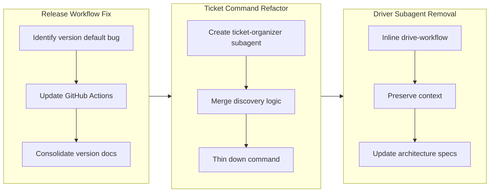

## 1. 概要

このブランチは plugin アーキテクチャを改善し、重要な release ワークフローの問題を修正しました。開発者は `/ticket` command を thin orchestrator に簡略化し、driver subagent 中間層を削除して実装コンテキストを保持し、release のバージョン固定値を minor から patch に修正しました。この作業はアーキテクチャの一貫性を強化し、実装中の開発者の可視性を向上させました。

**ハイライト：**

1. Release を patch バージョンバンプに修正
2. /ticket command を ticket-organizer subagent の thin alias に refactor
3. drive command から driver subagent を削除

## 2. 動機

コードベースは command と subagent の間で矛盾したパターンを維持していました。`/ticket` command は機能が多く、`/drive` ワークフローは不要な subagent 中間層を使用してコンテキストを分離し、release 自動化は patch が意図したデフォルトであるのに minor にデフォルト設定されていました。これらの問題はコードの明確性を低下させ、デバッグを難しくし、確立された thin command/thick subagent アーキテクチャパターンに違反していました。これらの問題を修正することで、設計基盤を強化しました。

## 3. ジャーニー

3 つの焦点を当てたアーキテクチャ改善：まず release バージョン管理を正しくデフォルト設定することで修正、次に `/ticket` を thin command パターンに従うように refactor、3 番目に driver 中間層を削除してメイン会話で実装を可視化。それぞれが確立されたパターンを強化し、不要な迂回を減らしました。

## 4. 変更

### 4.1. Release を Patch Version Bump にデフォルト設定を修正 ([74e865f](https://github.com/qmu/workaholic/commit/74e865fea0ca7911be051b5ac1d819fb9bdeae98))

- `.github/workflows/release.yml` - auto-detection を minor ではなく patch バンプにデフォルト設定するように更新
- `CLAUDE.md` - 詳細なバージョンバンプ手順とファイルリストで Version Management section を拡張
- `plugins/core/commands/story.md` - バージョンバンプステップを簡略化し、CLAUDE.md を single source of truth として参照
- `.workaholic/tickets/archive/drive-20260201-112920/20260201112308-fix-release-default-to-patch.md` - 修正を記録した archive ticket

### 4.2. /ticket Command を ticket-organizer Subagent の Thin Alias に Refactor ([7df462c](https://github.com/qmu/workaholic/commit/7df462cd126e068b859c2e1c575fbd19461f6bfc))

- `plugins/core/commands/ticket.md` - thin orchestrator に簡略化、すべての discovery と writing を ticket-organizer に委譲
- `plugins/core/agents/ticket-organizer.md` - history discovery、source discovery、重複チェック、ticket writing を処理する新しい subagent を作成
- `.workaholic/specs/architecture.md` - thin command パターンを反映するよう command flow ダイアグラムを更新
- `.workaholic/specs/architecture_ja.md` - アーキテクチャ更新の日本語翻訳
- `.workaholic/tickets/archive/drive-20260201-112920/20260202125814-ticket-command-alias-refactor.md` - refactor を記録した archive ticket

### 4.3. Drive Command から Driver Subagent を削除 ([3c87e62](https://github.com/qmu/workaholic/commit/3c87e629e0dae43fa14f0be1d746f2594ea7bdd0))

- `plugins/core/commands/drive.md` - driver subagent を呼び出す代わりに drive-workflow を directly inline するよう更新
- `plugins/core/agents/driver.md` - コンテキストを分離していた不要な中間層を削除
- `plugins/core/skills/drive-workflow/SKILL.md` - drive command による direct 使用を明確にするよう更新
- `plugins/core/skills/request-approval/SKILL.md` - driver subagent の参照を削除
- `.workaholic/specs/architecture.md` - /drive ダイアグラムとドキュメンテーションを更新
- `.workaholic/specs/architecture_ja.md` - アーキテクチャ更新の日本語翻訳
- `.workaholic/tickets/archive/drive-20260201-112920/20260202125850-remove-driver-subagent.md` - 削除を記録した archive ticket

## 5. 成果

このブランチは command と subagent アーキテクチャを 3 つの側面で成功裏に簡略化しました。Release バージョン管理は patch バンプに正しくデフォルト設定され、明確で統合されたドキュメンテーションがあります。`/ticket` command は ticket-organizer subagent にすべての複雑さを抽出することで thin orchestrator になり、関心事の分離を向上させます。`/drive` command は driver subagent 中間層を削除し、メイン会話で実装コンテキストを保持してより良い可視性とより簡単なデバッグを実現します。これらの変更は plugin システム全体でアーキテクチャの一貫性を強化し、不要な迂回を減らしました。

## 6. 歴史的分析

driver subagent パターンは ticket 実装を分離するために導入されました（ticket 20260131164315 から）。command-subagent アーキテクチャパターンは以前に確立されました（ticket 20260129020653 から）。このブランチは subagent 中間層がいつ削除すべきかを示すことでアーキテクチャの改善を完成させます—対応する利点なしに分離オーバーヘッドを追加するとき。`/ticket` refactor は同様の skill 抽出作業によって確立されたパターンを拡張します（ticket 20260131162854 から）。複雑さはアーキテクチャスタックを下に移動します。release ワークフロー修正は初期 GitHub Actions オートメーション（ticket 20260129140000 から）の設計見落としに対処し、最初から patch であるべきであったバージョンバンプのデフォルトを修正します。

## 7. 懸念

ticket-organizer subagent は複数の責任（history discovery、source discovery、重複チェック、ticket writing）を処理します。subagent は必要な skill が事前ロードされていますが、この機能の集中は将来のメンテナンスでそれが不透明になりすぎないことを監視する必要があります。driver subagent の削除は `/drive` command の drive-workflow skill との相互作用を増やします。開発者がこのフローを将来変更する場合、command と skill の間の実装の境界は明確にドキュメント化する必要があります。

## 8. アイデア

将来の改善には以下が含まれる可能性があります：`/story` command に changelog-writer subagent パターンを抽出して一貫性を持たせ（`/ticket` 用に ticket-organizer が抽出された方法と同様）；subagent 中間層をいつ使用するか対 inline skill を使用するかを文書化する開発者ガイドを作成；どのアーキテクチャパターンが最も一般的に従われているかを追跡するテレメトリを追加して将来の設計決定をガイド。

## 9. パフォーマンス

**メトリクス**: 3 日間に 35 commit（日あたり 11.6 commit）

### 9.1. ペース分析

開発は 3 日間にわたり steady に進行し、一貫した commit 速度を保ちました。作業は小さなリファクタリング commit（ファイル再構成、ドキュメンテーション更新）と中規模の構造的変更（subagent 作成、skill 更新）を混ぜました。commit 間の最も長いギャップは discovery 統合とアーキテクチャドキュメンテーションの parallel 作業中に発生し、急いだ実装ではなく思考深い設計作業を示唆しています。3 日目の最終 commit はクリーンアップタスクと ticket archive に焦点を当て、完了段階の統合を示します。

### 9.2. 決定レビュー

| 側面           | 評価 | 注釈 |
| -------------- | ------ | ----- |
| 一貫性         | Strong | 3 つの変更すべてが確立された thin command/thick subagent パターンに従う。 |
| 直感性         | Adequate | アーキテクチャの変更はフレームワーク内で論理的であるが、ネストルールの理解が必要。 |
| 説明可能性     | Strong | ネーミング選択は正確：ticket-organizer は包括的な orchestration 役割を明確に反映。 |
| 敏捷性         | Strong | 効果的な軌道修正—実装中のフィードバックに基づいて ticket-organizer に適応。 |
| 密度           | Strong | 高い semantic compression：/ticket は 91 行から約 50 行に削減しながら機能を獲得。 |

**強み**: 3 つの独立した変更にわたるアーキテクチャ一貫性の適用；ticket-writer から ticket-organizer への名前変更で示されるコンテキスト認識のイテレーション；各 ticket の正当化に見える明確なアーキテクチャ決定；明確にドキュメント化されたパターンは将来のメンテナンスを容易にします。

**改善の余地**: 実装開始前にアーキテクチャ役割を確認することでネーミング stability を改善可能；3 つの変更間の相互依存性をあらかじめより明確にドキュメント化してイテレーションを削減可能；ticket-organizer の責任の集中はその内部設計のより明確なドキュメンテーションを必要とします。

## 10. Release 準備

**判定**: Release 準備完了

### 10.1. 懸念

なし - 変更は release に対して安全です

### 10.2. Release 前の指示

なし - standard release プロセスが適用されます

### 10.3. Release 後の指示

なし - 特別な release 後のアクションは不要です

## 11. 注釈

このブランチは plugin アーキテクチャパターンの自然な進化を表しています。各変更は独立してコード明確性を向上させながら、確立された thin command/comprehensive subagent 設計原則を強化します。driver subagent の削除は、アーキテクチャ中間層がいつ排除されるべきかの明確な先例を提供します。将来のアーキテクチャ決定はこれらの ticket をパターン適用と改善の例として参照できます。
