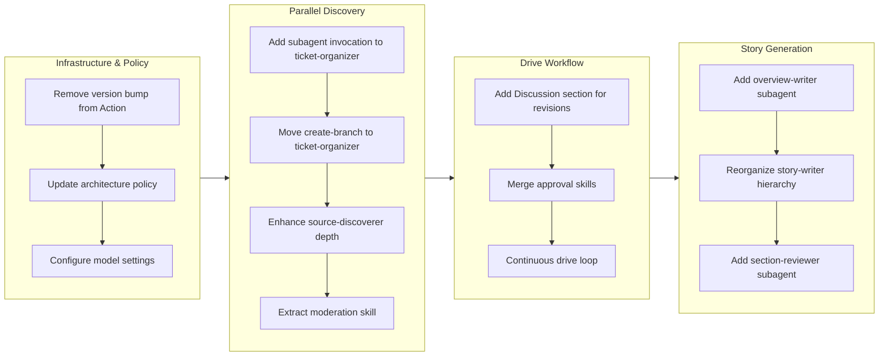

## 1. Overview

This branch delivers comprehensive improvements to the workaholic plugin architecture, focusing on three major areas: parallel subagent orchestration for both `/ticket` and `/story` commands, enhanced approval flow with revision tracking, and continuous drive loop functionality. The changes establish a more modular and efficient workflow where subagents can invoke other subagents in parallel, enabling richer context discovery and documentation generation.

**Highlights:**

1. Parallel subagent discovery in ticket-organizer with history-discoverer, source-discoverer, and ticket-moderator running concurrently
2. Reorganized story agent hierarchy where story-writer orchestrates 7 parallel documentation agents
3. Continuous drive loop that re-checks for new tickets and continues until todo directory is truly empty

## 2. Motivation

The plugin architecture had evolved to a point where commands were becoming complex orchestrators with significant inline logic. The drive command needed a revision feedback loop to track user direction changes. The story command's phase-based approach with sequential agent handoffs created unnecessary latency. By enabling subagent-to-subagent parallel invocation and moving orchestration responsibilities to dedicated subagents, the codebase achieves better separation of concerns while improving both performance and maintainability.

## 3. Journey

The work began with infrastructure cleanup by removing duplicated version bumping from the GitHub Action. The architecture policy was then relaxed to allow subagent-to-subagent parallel invocation, enabling ticket-organizer to launch three discovery agents concurrently. The drive workflow gained revision tracking through a new Discussion section and approval skills were consolidated. Finally, the story generation pipeline was reorganized with story-writer becoming the central orchestrator for 7 parallel documentation agents.

## 4. Changes

### 4.1. Remove version bump from GitHub Action ([6fe19d4](https://github.com/qmu/workaholic/commit/6fe19d4))

- `.github/workflows/release.yml` - Simplified workflow to only trigger on "Bump version to v" commits, removed version calculation/bumping steps, added release existence check

### 4.2. Parallel Subagent Discovery in ticket-organizer ([c812df2](https://github.com/qmu/workaholic/commit/c812df2))

- `CLAUDE.md` - Updated architecture policy to allow subagent-to-subagent invocation (parallel only, max depth 1)
- `plugins/core/agents/ticket-organizer.md` - Replaced skill-based discovery with parallel Task tool invocations for history-discoverer, source-discoverer, and ticket-moderator
- `plugins/core/agents/ticket-moderator.md` - Created new subagent for duplicate/merge/split analysis

### 4.3. Add Discussion section on drive rejection ([a401083](https://github.com/qmu/workaholic/commit/a401083))

- `plugins/core/skills/request-approval/SKILL.md` - Added "Needs revision" as fourth approval option
- `plugins/core/skills/handle-revision/SKILL.md` - Created skill for handling revision feedback with Discussion section template
- `plugins/core/commands/drive.md` - Added handling for "Needs revision" option with feedback loop

### 4.4. Add overview-writer Subagent for Parallel Story Preparation ([4e010e1](https://github.com/qmu/workaholic/commit/4e010e1))

- `plugins/core/agents/overview-writer.md` - Created subagent for generating overview, highlights, motivation, and journey content
- `plugins/core/skills/write-overview/SKILL.md` - Created skill with content structure guidelines
- `plugins/core/skills/write-overview/sh/collect-commits.sh` - Shell script for collecting commit information
- `plugins/core/commands/story.md` - Added overview-writer as 6th parallel agent in Phase 1
- `plugins/core/agents/story-writer.md` - Updated to receive and integrate overview-writer output

### 4.5. Move create-branch Skill to ticket-organizer ([a1b7e93](https://github.com/qmu/workaholic/commit/a1b7e93))

- `plugins/core/agents/ticket-organizer.md` - Added create-branch skill and step 0 for branch checking
- `plugins/core/commands/ticket.md` - Removed create-branch skill and renumbered steps

### 4.6. Gather Ticket Metadata Skill ([2fc59af](https://github.com/qmu/workaholic/commit/2fc59af))

- `plugins/core/skills/gather-ticket-metadata/SKILL.md` - Created skill for encapsulating metadata gathering
- `plugins/core/skills/gather-ticket-metadata/sh/gather.sh` - Shell script outputting JSON with created_at, author, filename_timestamp
- `plugins/core/skills/create-ticket/SKILL.md` - Updated to reference gather-ticket-metadata script
- `plugins/core/agents/ticket-organizer.md` - Added gather-ticket-metadata to skills list

### 4.7. Configure model for ticket-organizer and child subagents ([10923af](https://github.com/qmu/workaholic/commit/10923af))

- `plugins/core/agents/ticket-organizer.md` - Added `model: opus` to frontmatter for quality ticket writing
- `plugins/core/agents/history-discoverer.md` - Added `model: haiku` for cost-efficient discovery
- `plugins/core/agents/source-discoverer.md` - Added `model: haiku` for cost-efficient discovery
- `plugins/core/agents/ticket-moderator.md` - Added `model: haiku` for cost-efficient discovery

### 4.8. Enhance source-discoverer for deeper codebase exploration ([058ea16](https://github.com/qmu/workaholic/commit/058ea16))

- `plugins/core/skills/discover-source/SKILL.md` - Expanded from 30 to 122 lines with 5 exploration phases, depth controls, language-specific heuristics, skip patterns
- `plugins/core/agents/source-discoverer.md` - Updated instructions with phased execution steps and enhanced output JSON

### 4.9. Merge approval flow skills into unified drive-approval ([81a4d53](https://github.com/qmu/workaholic/commit/81a4d53))

- `plugins/core/skills/drive-approval/SKILL.md` - Created unified skill with 4 sections covering complete approval cycle
- `plugins/core/skills/request-approval/` - Deleted (merged)
- `plugins/core/skills/handle-revision/` - Deleted (merged)
- `plugins/core/skills/handle-abandon/` - Deleted (merged)
- `plugins/core/commands/drive.md` - Updated skills list and inline references
- `.workaholic/specs/architecture.md` - Updated directory layout and dependency diagrams
- `.workaholic/specs/architecture_ja.md` - Updated Japanese version

### 4.10. Implement Continuous Drive Loop ([4b2528b](https://github.com/qmu/workaholic/commit/4b2528b))

- `plugins/core/commands/drive.md` - Replaced Phase 3 with "Re-check and Continue" that loops until todo is truly empty, added Phase 4 for final completion summary

### 4.11. Extract moderation skill from ticket-moderator subagent ([9583e2c](https://github.com/qmu/workaholic/commit/9583e2c))

- `plugins/core/skills/moderate-ticket/SKILL.md` - Created comprehensive skill (122 lines) with overlap analysis guidelines, category definitions, and output schema
- `plugins/core/agents/ticket-moderator.md` - Thinned from 51 to 47 lines, added skill preload

### 4.12. Reorganize story agent hierarchy ([7189d03](https://github.com/qmu/workaholic/commit/7189d03))

- `plugins/core/commands/story.md` - Simplified to delegate orchestration to story-writer
- `plugins/core/agents/story-writer.md` - Expanded to orchestrate 6 subagents in parallel and integrate outputs
- `.workaholic/specs/architecture.md` - Updated dependency diagrams and documentation

### 4.13. Add Task tool to ticket-organizer agent ([39a7176](https://github.com/qmu/workaholic/commit/39a7176))

- `plugins/core/agents/ticket-organizer.md` - Added Task to tools list in frontmatter to enable proper subagent invocation

### 4.14. Add section-reviewer subagent for story sections 5-8 ([e98021a](https://github.com/qmu/workaholic/commit/e98021a))

- `plugins/core/agents/section-reviewer.md` - Created subagent for generating Outcome, Historical Analysis, Concerns, and Ideas sections
- `plugins/core/skills/review-sections/SKILL.md` - Created skill with guidelines for analyzing tickets and generating section content
- `plugins/core/agents/story-writer.md` - Updated to invoke section-reviewer as 7th parallel agent
- `plugins/core/skills/write-story/SKILL.md` - Updated documentation for section-reviewer integration

## 5. Outcome

The branch successfully delivers a more modular and efficient plugin architecture. The ticket-organizer now leverages three parallel subagents for richer context discovery, significantly improving ticket quality. The drive command gained revision tracking through the Discussion section, enabling traceable feedback loops. The story command's reorganization moves orchestration to story-writer, which now coordinates 7 parallel documentation agents (changelog-writer, spec-writer, terms-writer, release-readiness, performance-analyst, overview-writer, and section-reviewer). The continuous drive loop ensures no tickets are left unprocessed, creating a seamless development experience.

## 6. Historical Analysis

The parallel subagent pattern was first introduced in the ticket command for parallel discovery. This branch extends that pattern to ticket-organizer (3 parallel agents) and story-writer (7 parallel agents). The approval flow evolution shows a clear progression: first splitting skills for modularity, then re-merging when the split proved too granular. The architecture policy relaxation to allow subagent-to-subagent invocation (parallel only, max depth 1) represents a calculated expansion of the nesting rules while preserving the core constraint against deep nesting and context explosion.

## 7. Concerns

- **Context window pressure**: Story-writer now orchestrates 7 agents and integrates their outputs, which may approach context limits for very large branches
- **Model cost**: Using Opus for ticket-organizer increases token costs, though this is offset by higher quality tickets
- **Continuous loop termination**: The only way to stop the drive loop is "Approve and stop" or natural completion; users must be aware of this behavior

## 8. Ideas

- Add timing guidance to source-discoverer exploration phases (target 30 seconds completion)
- Consider adding maximum revision count to prevent infinite revision loops in the drive approval flow
- Explore caching frequently discovered source files to reduce redundant exploration across tickets

## 9. Performance

**Metrics**: 31 commits over 6.60 hours (4.6 commits/hour)

### 9.1. Pace Analysis

The velocity of 4.6 commits per hour reflects a steady, focused development session. Commits were well-distributed across the work, with ticket creation commits interspersed with implementation commits. The pattern shows disciplined TiDD workflow: create ticket, implement, archive, repeat. Larger refactoring tickets (approval skill merge, story hierarchy reorganization) naturally took longer while simpler bugfixes (Task tool addition) were quick.

### 9.2. Decision Review

| Dimension      | Rating   | Notes                                                                             |
| -------------- | -------- | --------------------------------------------------------------------------------- |
| Consistency    | Strong   | All changes follow established patterns (thin agents, comprehensive skills)       |
| Intuitivity    | Strong   | Subagent naming clearly indicates purpose (overview-writer, section-reviewer)     |
| Describability | Strong   | Each ticket title and commit message accurately describes the change              |
| Agility        | Strong   | Quick pivots between infrastructure, workflow, and documentation concerns         |
| Density        | Adequate | Some tickets could have been combined (model configuration with parallel changes) |

**Strengths**: Consistent adherence to architecture patterns, clear separation between orchestration (agents) and knowledge (skills), effective use of parallel execution to reduce latency.

**Areas for Improvement**: Consider batching related configuration changes into single tickets when they affect the same files.

## 10. Release Preparation

**Verdict**: Ready for release

### 10.1. Concerns

None - all changes are additive or internal refactoring that maintain backward compatibility.

### 10.2. Pre-release Instructions

None - standard release process applies.

### 10.3. Post-release Instructions

None - no special post-release actions needed.

## 11. Notes

This branch represents a significant architectural milestone in the workaholic plugin system. The subagent-to-subagent parallel invocation pattern is now proven at two levels: ticket-organizer (3 agents) and story-writer (7 agents). Future enhancements can leverage this pattern for additional parallelization opportunities. The continuous drive loop creates a more seamless development experience by eliminating the need to manually re-invoke `/drive` when new tickets appear during a session.
