## 1. 概要

この branch は workaholic plugin architecture の包括的な改善を提供し、3つの主要な領域に焦点を当てています：`/ticket` と `/story` command 両方の parallel subagent orchestration、revision tracking 付きの enhanced approval flow、そして continuous drive loop 機能です。これらの変更により、subagent が他の subagent を parallel で invoke できる、よりモジュラーで効率的な workflow が確立され、より豊富な context discovery と documentation generation が可能になりました。

**ハイライト:**

1. ticket-organizer での parallel subagent discovery - history-discoverer、source-discoverer、ticket-moderator が並行実行
2. story-writer が 7 つの parallel documentation agent を orchestrate する reorganized story agent hierarchy
3. todo directory が本当に空になるまで新しい ticket を re-check して継続する continuous drive loop

## 2. 動機

plugin architecture は、command が significant inline logic を持つ複雑な orchestrator になる段階まで進化していました。drive command は user direction changes を track するための revision feedback loop が必要でした。story command の phase-based approach は sequential agent handoff により不必要な latency を生み出していました。subagent-to-subagent parallel invocation を有効にし、orchestration responsibilities を dedicated subagent に移動することで、codebase は performance と maintainability の両方を改善しながら、より良い separation of concerns を達成しています。

## 3. 旅路

```mermaid
flowchart LR
  subgraph Infrastructure[Infrastructure & Policy]
    direction TB
    i1[Action から version bump を削除] --> i2[architecture policy を更新] --> i3[model 設定を configure]
  end

  subgraph Discovery[Parallel Discovery]
    direction TB
    d1[ticket-organizer に subagent invocation を追加] --> d2[create-branch を ticket-organizer に移動] --> d3[source-discoverer の depth を強化] --> d4[moderation skill を抽出]
  end

  subgraph DriveFlow[Drive Workflow]
    direction TB
    f1[revision 用 Discussion section を追加] --> f2[approval skill を統合] --> f3[Continuous drive loop]
  end

  subgraph Story[Story Generation]
    direction TB
    s1[overview-writer subagent を追加] --> s2[story-writer hierarchy を reorganize] --> s3[section-reviewer subagent を追加]
  end

  Infrastructure --> Discovery --> DriveFlow --> Story
```

作業は GitHub Action から duplicated version bumping を削除する infrastructure cleanup から始まりました。次に architecture policy を緩和して subagent-to-subagent parallel invocation を許可し、ticket-organizer が 3 つの discovery agent を concurrently に launch できるようになりました。drive workflow は新しい Discussion section を通じて revision tracking を獲得し、approval skill は統合されました。最後に、story generation pipeline が reorganize され、story-writer が 7 つの parallel documentation agent の central orchestrator になりました。

## 4. 変更

### 4.1. GitHub Action から version bump を削除 ([6fe19d4](https://github.com/qmu/workaholic/commit/6fe19d4))

- `.github/workflows/release.yml` - "Bump version to v" commit でのみ trigger するように workflow を simplified、version calculation/bumping step を削除、release existence check を追加

### 4.2. ticket-organizer での Parallel Subagent Discovery ([c812df2](https://github.com/qmu/workaholic/commit/c812df2))

- `CLAUDE.md` - subagent-to-subagent invocation を許可するように architecture policy を更新（parallel のみ、max depth 1）
- `plugins/core/agents/ticket-organizer.md` - skill-based discovery を history-discoverer、source-discoverer、ticket-moderator への parallel Task tool invocation に置き換え
- `plugins/core/agents/ticket-moderator.md` - duplicate/merge/split analysis 用の新しい subagent を作成

### 4.3. drive rejection 時の Discussion section 追加 ([a401083](https://github.com/qmu/workaholic/commit/a401083))

- `plugins/core/skills/request-approval/SKILL.md` - 4 番目の approval option として "Needs revision" を追加
- `plugins/core/skills/handle-revision/SKILL.md` - Discussion section template 付きの revision feedback handling skill を作成
- `plugins/core/commands/drive.md` - feedback loop 付きの "Needs revision" option handling を追加

### 4.4. Parallel Story Preparation 用の overview-writer Subagent 追加 ([4e010e1](https://github.com/qmu/workaholic/commit/4e010e1))

- `plugins/core/agents/overview-writer.md` - overview、highlights、motivation、journey content 生成用の subagent を作成
- `plugins/core/skills/write-overview/SKILL.md` - content structure guideline 付きの skill を作成
- `plugins/core/skills/write-overview/sh/collect-commits.sh` - commit 情報収集用の shell script
- `plugins/core/commands/story.md` - Phase 1 に 6 番目の parallel agent として overview-writer を追加
- `plugins/core/agents/story-writer.md` - overview-writer output を receive して integrate するように更新

### 4.5. create-branch Skill を ticket-organizer に移動 ([a1b7e93](https://github.com/qmu/workaholic/commit/a1b7e93))

- `plugins/core/agents/ticket-organizer.md` - create-branch skill と branch checking 用の step 0 を追加
- `plugins/core/commands/ticket.md` - create-branch skill を削除し step を renumber

### 4.6. Gather Ticket Metadata Skill ([2fc59af](https://github.com/qmu/workaholic/commit/2fc59af))

- `plugins/core/skills/gather-ticket-metadata/SKILL.md` - metadata gathering を encapsulate する skill を作成
- `plugins/core/skills/gather-ticket-metadata/sh/gather.sh` - created_at、author、filename_timestamp を含む JSON を output する shell script
- `plugins/core/skills/create-ticket/SKILL.md` - gather-ticket-metadata script を reference するように更新
- `plugins/core/agents/ticket-organizer.md` - skills list に gather-ticket-metadata を追加

### 4.7. ticket-organizer と child subagent の model 設定 ([10923af](https://github.com/qmu/workaholic/commit/10923af))

- `plugins/core/agents/ticket-organizer.md` - quality ticket writing 用に frontmatter に `model: opus` を追加
- `plugins/core/agents/history-discoverer.md` - cost-efficient discovery 用に `model: haiku` を追加
- `plugins/core/agents/source-discoverer.md` - cost-efficient discovery 用に `model: haiku` を追加
- `plugins/core/agents/ticket-moderator.md` - cost-efficient discovery 用に `model: haiku` を追加

### 4.8. より深い codebase exploration のための source-discoverer 強化 ([058ea16](https://github.com/qmu/workaholic/commit/058ea16))

- `plugins/core/skills/discover-source/SKILL.md` - 5 つの exploration phase、depth control、language-specific heuristic、skip pattern で 30 行から 122 行に拡張
- `plugins/core/agents/source-discoverer.md` - phased execution step と enhanced output JSON で instruction を更新

### 4.9. approval flow skill を unified drive-approval に統合 ([81a4d53](https://github.com/qmu/workaholic/commit/81a4d53))

- `plugins/core/skills/drive-approval/SKILL.md` - complete approval cycle をカバーする 4 section の unified skill を作成
- `plugins/core/skills/request-approval/` - 削除（統合）
- `plugins/core/skills/handle-revision/` - 削除（統合）
- `plugins/core/skills/handle-abandon/` - 削除（統合）
- `plugins/core/commands/drive.md` - skills list と inline reference を更新
- `.workaholic/specs/architecture.md` - directory layout と dependency diagram を更新
- `.workaholic/specs/architecture_ja.md` - 日本語版を更新

### 4.10. Continuous Drive Loop 実装 ([4b2528b](https://github.com/qmu/workaholic/commit/4b2528b))

- `plugins/core/commands/drive.md` - Phase 3 を todo が本当に空になるまで loop する "Re-check and Continue" に置き換え、final completion summary 用の Phase 4 を追加

### 4.11. ticket-moderator subagent から moderation skill を抽出 ([9583e2c](https://github.com/qmu/workaholic/commit/9583e2c))

- `plugins/core/skills/moderate-ticket/SKILL.md` - overlap analysis guideline、category definition、output schema を含む comprehensive skill（122 行）を作成
- `plugins/core/agents/ticket-moderator.md` - 51 行から 47 行に thin 化、skill preload を追加

### 4.12. story agent hierarchy の reorganize ([7189d03](https://github.com/qmu/workaholic/commit/7189d03))

- `plugins/core/commands/story.md` - orchestration を story-writer に delegate するように simplified
- `plugins/core/agents/story-writer.md` - 6 つの subagent を parallel で orchestrate し output を integrate するように expanded
- `.workaholic/specs/architecture.md` - dependency diagram と documentation を更新

### 4.13. ticket-organizer agent に Task tool を追加 ([39a7176](https://github.com/qmu/workaholic/commit/39a7176))

- `plugins/core/agents/ticket-organizer.md` - proper subagent invocation を enable するため frontmatter の tools list に Task を追加

### 4.14. story section 5-8 用の section-reviewer subagent 追加 ([e98021a](https://github.com/qmu/workaholic/commit/e98021a))

- `plugins/core/agents/section-reviewer.md` - Outcome、Historical Analysis、Concerns、Ideas section 生成用の subagent を作成
- `plugins/core/skills/review-sections/SKILL.md` - ticket 分析と section content 生成の guideline を含む skill を作成
- `plugins/core/agents/story-writer.md` - 7 番目の parallel agent として section-reviewer を invoke するように更新
- `plugins/core/skills/write-story/SKILL.md` - section-reviewer integration の documentation を更新

## 5. 成果

この branch は、よりモジュラーで効率的な plugin architecture を successfully に deliver しました。ticket-organizer は現在 3 つの parallel subagent を leverage してより豊富な context discovery を行い、ticket quality を significantly に improve しています。drive command は Discussion section を通じて revision tracking を獲得し、traceable feedback loop を enable しました。story command の reorganization により orchestration が story-writer に移動し、7 つの parallel documentation agent（changelog-writer、spec-writer、terms-writer、release-readiness、performance-analyst、overview-writer、section-reviewer）を coordinate するようになりました。continuous drive loop により、session 中に新しい ticket が appear した際に手動で `/drive` を re-invoke する必要がなくなり、seamless な development experience が create されました。

## 6. 歴史的分析

parallel subagent pattern は最初に ticket command の parallel discovery で導入されました。この branch はそのパターンを ticket-organizer（3 つの agent）と story-writer（7 つの agent）に拡張しています。approval flow の evolution は clear な progression を示しています：最初は modularity のために skill を split し、その後 split が too granular であることが判明したときに re-merge しました。subagent-to-subagent invocation を許可する architecture policy の relaxation（parallel のみ、max depth 1）は、deep nesting と context explosion に対する core constraint を preserve しながら nesting rule の calculated expansion を represents しています。

## 7. 懸念事項

- **Context window pressure**: story-writer は現在 7 つの agent を orchestrate してその output を integrate するため、very large branch では context limit に approach する可能性があります
- **Model cost**: ticket-organizer に Opus を使用すると token cost が increase しますが、higher quality ticket によって offset されます
- **Continuous loop termination**: drive loop を stop する唯一の方法は "Approve and stop" または natural completion です。user はこの behavior を aware である必要があります

## 8. アイデア

- source-discoverer exploration phase に timing guidance を追加（30 秒での completion を target）
- drive approval flow で infinite revision loop を prevent するための maximum revision count の追加を検討
- ticket 間での redundant exploration を reduce するため、frequently discovered source file の caching を explore

## 9. パフォーマンス

**メトリクス**: 6.60 時間で 31 commit（4.6 commit/時間）

### 9.1. ペース分析

4.6 commit/時間の velocity は steady で focused な development session を reflect しています。commit は作業全体に well-distributed され、ticket creation commit が implementation commit と intersperse されていました。pattern は disciplined TiDD workflow を示しています：ticket を create、implement、archive、repeat。larger refactoring ticket（approval skill merge、story hierarchy reorganization）は naturally に longer かかり、simpler bugfix（Task tool addition）は quick でした。

### 9.2. 意思決定レビュー

| Dimension      | Rating   | Notes                                                                              |
| -------------- | -------- | ---------------------------------------------------------------------------------- |
| Consistency    | Strong   | すべての変更が established pattern に従う（thin agent、comprehensive skill）       |
| Intuitivity    | Strong   | subagent naming が purpose を clearly に indicate（overview-writer、section-reviewer） |
| Describability | Strong   | 各 ticket title と commit message が変更を accurately に describe                  |
| Agility        | Strong   | infrastructure、workflow、documentation concern 間での quick pivot                 |
| Density        | Adequate | 一部の ticket は combine できた可能性がある（model configuration と parallel changes） |

**強み**: architecture pattern への consistent adherence、orchestration（agent）と knowledge（skill）間の clear separation、latency reduce のための parallel execution の effective use。

**改善点**: 同じファイルに affect する related configuration change は single ticket に batch することを検討。

## 10. リリース準備

**判定**: リリース準備完了

### 10.1. 懸念事項

なし - すべての変更は additive または backward compatibility を maintain する internal refactoring です。

### 10.2. リリース前の手順

なし - standard release process が適用されます。

### 10.3. リリース後の手順

なし - special post-release action は不要です。

## 11. 備考

この branch は workaholic plugin system における significant architectural milestone を represents しています。subagent-to-subagent parallel invocation pattern は現在 2 つの level で proven されています：ticket-organizer（3 agent）と story-writer（7 agent）。future enhancement はこの pattern を additional parallelization opportunity に leverage できます。continuous drive loop は session 中に新しい ticket が appear したときに手動で `/drive` を re-invoke する必要を eliminate することで、より seamless な development experience を create しています。
