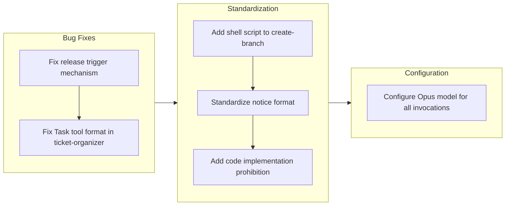

## 1. Overview

This branch delivers a focused set of improvements to the workaholic plugin system, addressing release workflow reliability, command consistency, and model configuration. The changes fix the release action trigger mechanism, standardize documentation format across commands, and configure the Opus model for all Task tool invocations as an experimental quality improvement trial.

**Highlights:**

1. Fixed release action to use version comparison instead of commit message filtering, ensuring reliable release note updates on PR merge
2. Standardized notice section format and added explicit prohibition against code implementation in the /ticket command
3. Configured Opus model for all 13 Task tool invocations across commands and subagents

## 2. Motivation

Several reliability and consistency issues had emerged from the previous development session. The release workflow was skipping PR merges because its trigger condition only matched "Bump version to v" commits. The ticket-organizer subagent was misinterpreting Task tool instructions due to code block formatting that resembled CLI flags. Command files had inconsistent notice formats. The model configuration for subagent invocations varied, and a trial with Opus model across all invocations was desired to evaluate quality improvements. These housekeeping improvements strengthen the foundation for future development.

## 3. Journey

The work began with two critical bug fixes: updating the release workflow to use version comparison for trigger decisions, and converting the ticket-organizer's Task tool instructions from code block format to prose format. Standardization efforts followed with a new shell script for branch creation, consistent notice section formatting, and an explicit prohibition against code implementation in the ticket command. The session concluded with configuring Opus model across all 13 Task tool invocations.

## 4. Changes

### 4.1. Fix Release Action Trigger on PR Merge ([80e4767](https://github.com/qmu/workaholic/commit/80e4767))

- `.github/workflows/release.yml` - Removed job-level `if` condition that filtered by commit message, added "Get latest release version" step to fetch current release tag, added "Check if release needed" step comparing repo version vs latest release

### 4.2. Fix ticket-organizer Subagent Invocation Format ([2f7fe23](https://github.com/qmu/workaholic/commit/2f7fe23))

- `plugins/core/agents/ticket-organizer.md` - Converted "Parallel Discovery" section from code block format to prose bullet point format with inline backticks for `subagent_type`

### 4.3. Add Shell Script to create-branch Skill ([97ed26c](https://github.com/qmu/workaholic/commit/97ed26c))

- `plugins/core/skills/create-branch/sh/create.sh` - Created shell script that outputs JSON with branch name
- `plugins/core/skills/create-branch/SKILL.md` - Updated to document shell script usage
- `plugins/core/agents/ticket-organizer.md` - Updated step 0 to use the shell script instead of inline bash

### 4.4. Standardize Notice Section Format Across Commands ([b2ec3c2](https://github.com/qmu/workaholic/commit/b2ec3c2))

- `plugins/core/commands/ticket.md` - Changed blockquote to `**Notice:**` format
- `plugins/core/commands/drive.md` - Changed blockquote to `**Notice:**` format
- `plugins/core/commands/story.md` - Changed blockquote to `**Notice:**` format

### 4.5. Strengthen /ticket Command Notice to Prohibit Code Implementation ([fec1e02](https://github.com/qmu/workaholic/commit/fec1e02))

- `plugins/core/commands/ticket.md` - Added `**CRITICAL:**` section prohibiting code implementation
- `plugins/core/agents/ticket-organizer.md` - Extended existing CRITICAL section with code implementation prohibition

### 4.6. Configure Opus Model for All Task Tool Invocations ([a622894](https://github.com/qmu/workaholic/commit/a622894))

- `plugins/core/commands/ticket.md` - Added `model: "opus"` to ticket-organizer invocation
- `plugins/core/commands/drive.md` - Added `model: "opus"` to drive-navigator invocation
- `plugins/core/commands/story.md` - Added `model: "opus"` to story-writer invocation, changed pr-creator from haiku to opus
- `plugins/core/agents/ticket-organizer.md` - Added `model: "opus"` to history-discoverer, source-discoverer, ticket-moderator invocations
- `plugins/core/agents/story-writer.md` - Added `model: "opus"` to all 7 parallel subagent invocations

## 5. Outcome

The branch successfully delivers reliability improvements and consistency standardization. The release workflow now correctly triggers on PR merges by comparing versions rather than parsing commit messages. The ticket-organizer correctly invokes subagents using the Task tool. Commands have consistent notice formatting and the /ticket command explicitly prohibits code implementation. All Task tool invocations now use Opus model for evaluation purposes.

## 6. Historical Analysis

The release workflow evolution shows a pattern of progressive refinement: first automatic release on merge was added, then version bumping was moved to /story command, and now trigger detection uses version comparison. The Task tool format issue relates to the recent addition of parallel subagent discovery in ticket-organizer - the code block format was introduced there and caused confusion. The shell script addition for create-branch fulfills a suggestion from the original skill extraction ticket. The Opus model configuration reverses the previous cost-saving decision to use Haiku for discovery subagents, as quality improvement is now prioritized.

## 7. Concerns

- **API cost increase**: Opus model for all 13 Task invocations will significantly increase costs compared to Haiku for discovery agents
- **Trial nature**: The Opus configuration is experimental and may be reverted if quality gains don't justify costs

## 8. Ideas

- Add cost tracking to measure actual impact of Opus model usage
- Consider selective Opus/Haiku configuration based on task complexity rather than blanket Opus
- Document the evaluation criteria for the Opus trial to guide the eventual decision

## 9. Performance

**Metrics**: 12 commits over 1.00 hours (12.0 commits/hour)

### 9.1. Pace Analysis

The velocity of 12.0 commits per hour reflects a highly efficient development session. The 6 tickets alternated between ticket creation and implementation commits, maintaining the TiDD pattern. Each change was relatively small and focused - bug fixes, format standardization, and configuration updates - allowing rapid iteration. No tickets required extensive exploration or refactoring.

### 9.2. Decision Review

| Dimension      | Rating   | Notes                                                                     |
| -------------- | -------- | ------------------------------------------------------------------------- |
| Consistency    | Strong   | All changes follow established patterns (shell scripts, notice format)    |
| Intuitivity    | Strong   | Each ticket addresses a clear, specific issue                             |
| Describability | Strong   | Commit messages accurately describe the changes                           |
| Agility        | Strong   | Quick execution of focused improvements                                   |
| Density        | Adequate | Notice format and prohibition could have been combined into one ticket    |

**Strengths**: Efficient execution of focused improvements, clear separation between bug fixes and standardization, consistent adherence to TiDD workflow.

**Areas for Improvement**: Consider combining closely related housekeeping changes (notice format + prohibition) into single tickets.

## 10. Release Preparation

**Verdict**: Ready for release

### 10.1. Concerns

None - all changes are configuration updates or documentation improvements that maintain backward compatibility.

### 10.2. Pre-release Instructions

None - standard release process applies.

### 10.3. Post-release Instructions

- Monitor API costs after release to evaluate Opus model impact
- After 1-2 weeks, review quality improvements to decide if Opus configuration should be retained

## 11. Notes

This branch represents a maintenance session focused on reliability and consistency. The release workflow fix ensures release notes are properly updated on PR merges. The model configuration change is intentionally experimental - cost monitoring will inform whether to keep Opus or revert to selective Haiku usage. The code implementation prohibition in /ticket strengthens the TiDD workflow by making the separation between ticket creation and implementation explicit.
