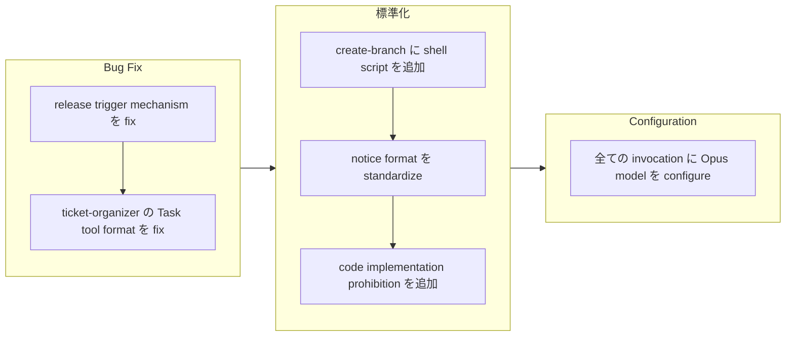

## 1. 概要

この branch は workaholic plugin system への focused な改善セットを deliver し、release workflow の reliability、command の consistency、model configuration に対応しています。変更は release action trigger mechanism を fix し、command 全体で documentation format を standardize し、experimental quality improvement trial として全ての Task tool invocation に Opus model を configure しています。

**ハイライト:**

1. commit message filtering ではなく version comparison を使用するよう release action を fix し、PR merge 時の reliable release note update を確保
2. notice section format を standardize し、/ticket command で code implementation に対する explicit prohibition を追加
3. command と subagent 全体で 13 の Task tool invocation すべてに Opus model を configure

## 2. 動機

前回の development session からいくつかの reliability と consistency の問題が emerge していました。release workflow は trigger condition が "Bump version to v" commit のみに match したため PR merge を skip していました。ticket-organizer subagent は CLI flag に resemble する code block formatting により Task tool instruction を misinterpret していました。command file は inconsistent な notice format を持っていました。subagent invocation の model configuration は vary しており、quality improvement を evaluate するために全ての invocation で Opus model を trial することが desired されていました。これらの housekeeping improvement は future development の foundation を strengthen しています。

## 3. 旅路

作業は 2 つの critical bug fix から始まりました：trigger decision に version comparison を使用するよう release workflow を update し、ticket-organizer の Task tool instruction を code block format から prose format に convert しました。standardization effort として branch creation 用の新しい shell script、consistent な notice section formatting、ticket command での code implementation に対する explicit prohibition が続きました。session は全 13 の Task tool invocation に Opus model を configure することで conclude しました。

## 4. 変更

### 4.1. PR Merge 時の Release Action Trigger を Fix ([80e4767](https://github.com/qmu/workaholic/commit/80e4767))

- `.github/workflows/release.yml` - commit message で filter する job-level `if` condition を removed、current release tag を fetch する "Get latest release version" step を追加、repo version vs latest release を compare する "Check if release needed" step を追加

### 4.2. ticket-organizer Subagent Invocation Format を Fix ([2f7fe23](https://github.com/qmu/workaholic/commit/2f7fe23))

- `plugins/core/agents/ticket-organizer.md` - "Parallel Discovery" section を code block format から `subagent_type` に inline backtick を使用した prose bullet point format に convert

### 4.3. create-branch Skill に Shell Script を追加 ([97ed26c](https://github.com/qmu/workaholic/commit/97ed26c))

- `plugins/core/skills/create-branch/sh/create.sh` - branch name を含む JSON を output する shell script を create
- `plugins/core/skills/create-branch/SKILL.md` - shell script usage を document するよう update
- `plugins/core/agents/ticket-organizer.md` - inline bash の代わりに shell script を使用するよう step 0 を update

### 4.4. Command 全体で Notice Section Format を Standardize ([b2ec3c2](https://github.com/qmu/workaholic/commit/b2ec3c2))

- `plugins/core/commands/ticket.md` - blockquote を `**Notice:**` format に change
- `plugins/core/commands/drive.md` - blockquote を `**Notice:**` format に change
- `plugins/core/commands/story.md` - blockquote を `**Notice:**` format に change

### 4.5. /ticket Command Notice を強化し Code Implementation を Prohibit ([fec1e02](https://github.com/qmu/workaholic/commit/fec1e02))

- `plugins/core/commands/ticket.md` - code implementation を prohibit する `**CRITICAL:**` section を追加
- `plugins/core/agents/ticket-organizer.md` - existing CRITICAL section を code implementation prohibition で extend

### 4.6. 全ての Task Tool Invocation に Opus Model を Configure ([a622894](https://github.com/qmu/workaholic/commit/a622894))

- `plugins/core/commands/ticket.md` - ticket-organizer invocation に `model: "opus"` を追加
- `plugins/core/commands/drive.md` - drive-navigator invocation に `model: "opus"` を追加
- `plugins/core/commands/story.md` - story-writer invocation に `model: "opus"` を追加、pr-creator を haiku から opus に change
- `plugins/core/agents/ticket-organizer.md` - history-discoverer、source-discoverer、ticket-moderator invocation に `model: "opus"` を追加
- `plugins/core/agents/story-writer.md` - 全 7 つの parallel subagent invocation に `model: "opus"` を追加

## 5. 成果

この branch は reliability improvement と consistency standardization を successfully に deliver しました。release workflow は commit message を parse するのではなく version を compare することで PR merge 時に correctly に trigger するようになりました。ticket-organizer は Task tool を使用して subagent を correctly に invoke します。command は consistent な notice formatting を持ち、/ticket command は code implementation を explicitly に prohibit します。evaluation 目的で全ての Task tool invocation が現在 Opus model を使用しています。

## 6. 歴史的分析

release workflow の evolution は progressive refinement の pattern を示しています：最初に merge 時の automatic release が add され、次に version bumping が /story command に move され、現在は trigger detection が version comparison を使用します。Task tool format issue は ticket-organizer での parallel subagent discovery の recent addition に relate しています - code block format はそこで introduce され confusion を caused しました。create-branch の shell script addition は original skill extraction ticket からの suggestion を fulfill しています。Opus model configuration は discovery subagent に Haiku を使用するという previous cost-saving decision を reverse しています。quality improvement が現在は prioritize されているためです。

## 7. 懸念事項

- **API cost increase**: 全 13 の Task invocation に Opus model を使用すると、discovery agent に Haiku を使用する場合と比較して cost が significantly に increase します
- **Trial nature**: Opus configuration は experimental であり、quality gain が cost を justify しない場合は revert される可能性があります

## 8. アイデア

- Opus model usage の actual impact を measure するために cost tracking を追加
- blanket Opus ではなく task complexity に基づいた selective Opus/Haiku configuration を検討
- eventual decision を guide するために Opus trial の evaluation criteria を document

## 9. パフォーマンス

**メトリクス**: 1.00 時間で 12 commit（12.0 commit/時間）

### 9.1. ペース分析

12.0 commit/時間の velocity は highly efficient な development session を reflect しています。6 つの ticket は ticket creation と implementation commit を alternate し、TiDD pattern を maintain しました。各変更は relatively small で focused でした - bug fix、format standardization、configuration update - rapid iteration を allow しました。extensive exploration や refactoring を require する ticket はありませんでした。

### 9.2. 意思決定レビュー

| Dimension      | Rating   | Notes                                                                     |
| -------------- | -------- | ------------------------------------------------------------------------- |
| Consistency    | Strong   | 全ての変更が established pattern に従う（shell script、notice format）    |
| Intuitivity    | Strong   | 各 ticket が clear で specific な issue に address                         |
| Describability | Strong   | commit message が変更を accurately に describe                             |
| Agility        | Strong   | focused improvement の quick execution                                    |
| Density        | Adequate | notice format と prohibition は 1 つの ticket に combine できた可能性      |

**強み**: focused improvement の efficient execution、bug fix と standardization 間の clear separation、TiDD workflow への consistent adherence。

**改善点**: closely related な housekeeping change（notice format + prohibition）は single ticket に combine することを検討。

## 10. リリース準備

**判定**: リリース準備完了

### 10.1. 懸念事項

なし - 全ての変更は backward compatibility を maintain する configuration update または documentation improvement です。

### 10.2. リリース前の手順

なし - standard release process が適用されます。

### 10.3. リリース後の手順

- Opus model impact を evaluate するためにリリース後の API cost を monitor
- 1-2 週間後に quality improvement を review して Opus configuration を retain するか decide

## 11. 備考

この branch は reliability と consistency に focused した maintenance session を represents しています。release workflow fix により PR merge 時に release note が properly に update されることが ensure されます。model configuration change は intentionally experimental です - cost monitoring が Opus を keep するか selective Haiku usage に revert するかを inform します。/ticket での code implementation prohibition は ticket creation と implementation の separation を explicit にすることで TiDD workflow を strengthen しています。
