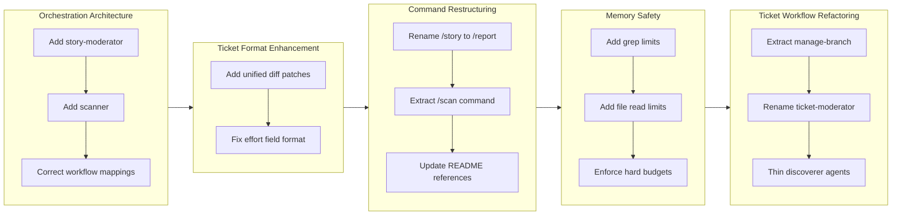

## 1. Overview

This branch implements significant architectural refinements to the plugin's documentation and ticket workflows. The work introduced a two-tier orchestration pattern for the `/story` command (later renamed to `/report`), extracted the `/scan` command for independent documentation maintenance, fixed memory leaks in the `/ticket` command, and added unified diff patches to ticket format for more precise implementations.

**Highlights:**

1. Extracted `/scan` command from `/report`, enabling independent documentation updates without PR creation
2. Fixed memory leaks in `/ticket` by adding hard limits to archive search and source exploration
3. Renamed `/story` to `/report` and refactored ticket workflow with cleaner naming conventions

## 2. Motivation

The documentation workflow had grown complex with a single `/story` command handling both documentation scanning and PR creation. Users needed the flexibility to update documentation independently. Additionally, the `/ticket` command suffered from unbounded operations that could exhaust memory when processing large archives. The refactoring addressed these usability and reliability concerns while improving architectural clarity through consistent naming patterns.

## 3. Journey

The development began with introducing a two-tier orchestration pattern for the `/story` command, separating documentation scanning from story generation. After correcting skill and subagent mappings, work shifted to enhancing ticket format with unified diff patches. The `/story` command was then renamed to `/report`, followed by extracting the `/scan` command for independent documentation updates. Memory safety improvements addressed unbounded operations in the `/ticket` command. Finally, comprehensive refactoring cleaned up naming conventions and extracted branch management into a dedicated skill.

## 4. Changes

### 4.1. Add story-moderator and scanner to Reorganize Documentation Agents ([ae9cdcf](https://github.com/qmu/workaholic/commit/ae9cdcf))

- plugins/core/agents/story-moderator.md - New orchestrator created (invokes scanner and story-writer in parallel)
- plugins/core/agents/scanner.md - New subagent created (invokes changelog-writer, spec-writer, terms-writer)
- plugins/core/agents/story-writer.md - Reduced to 4 subagents
- plugins/core/commands/story.md - Updated to invoke story-moderator
- CLAUDE.md - Removed "max depth 1" restriction
- .workaholic/specs/architecture.md - Updated dependency diagrams
- .workaholic/specs/architecture_ja.md - Japanese translation updates

### 4.2. Correct Skill and Subagent Mappings in Story Workflow ([a8111af](https://github.com/qmu/workaholic/commit/a8111af))

- plugins/core/agents/story-moderator.md - Removed write-story skill
- plugins/core/agents/story-writer.md - Added write-story skill, added pr-creator invocation
- plugins/core/commands/story.md - Removed direct pr-creator invocation
- .workaholic/specs/command-flows.md - Updated diagrams

### 4.3. Add unified diff patches to ticket format ([49febb1](https://github.com/qmu/workaholic/commit/49febb1))

- plugins/core/skills/create-ticket/SKILL.md - Added Patches section template
- plugins/core/agents/ticket-organizer.md - Updated to generate diff patches
- plugins/core/skills/drive-workflow/SKILL.md - Added patch application step
- plugins/core/agents/source-discoverer.md - Enhanced to return code snippets
- plugins/core/skills/discover-source/SKILL.md - Added snippet capture guidelines

### 4.4. Fix Effort Field Format Guidance ([8d15d05](https://github.com/qmu/workaholic/commit/8d15d05))

- plugins/core/skills/write-final-report/SKILL.md - Added prominent warning, valid values table, and estimation guidelines

### 4.5. Rename /story to /report ([837a666](https://github.com/qmu/workaholic/commit/837a666))

- plugins/core/commands/story.md - Renamed to report.md, updated frontmatter
- README.md - Updated command table and examples
- CLAUDE.md - Updated Commands table and workflow
- plugins/core/README.md - Updated command table
- .workaholic/guides/commands.md - Updated section headers
- .workaholic/guides/commands_ja.md - Japanese translation updates

### 4.6. Extract /scan Command from /report ([25743c3](https://github.com/qmu/workaholic/commit/25743c3))

- plugins/core/commands/scan.md - New command created
- plugins/core/commands/report.md - Simplified to invoke story-writer directly
- plugins/core/agents/story-moderator.md - Deleted
- plugins/core/skills/gather-git-context/ - New skill created
- plugins/core/skills/analyze-performance/ - Moved calculate.sh here
- .workaholic/specs/architecture.md - Updated diagrams
- CLAUDE.md - Added /scan command
- README.md - Added /scan to quick start

### 4.7. Fix Memory Leak in /ticket Command ([67ba0f5](https://github.com/qmu/workaholic/commit/67ba0f5))

- plugins/core/skills/discover-history/sh/search.sh - Added -m 10 limit to grep, reduced to top 10 files
- plugins/core/agents/history-discoverer.md - Added 100-line read limit
- plugins/core/skills/discover-source/SKILL.md - Converted to hard file limits
- plugins/core/agents/source-discoverer.md - Added snippet constraints
- plugins/core/agents/ticket-organizer.md - Documented JSON size expectations

### 4.8. Update /story Reference to /report in README.md How It Works Section ([fb1fcf9](https://github.com/qmu/workaholic/commit/fb1fcf9))

- README.md - Changed /story to /report in How It Works section

### 4.9. Refactor ticket-organizer and Related Subagents ([08469b7](https://github.com/qmu/workaholic/commit/08469b7))

- plugins/core/skills/create-branch/ - Renamed to manage-branch
- plugins/core/agents/ticket-moderator.md - Renamed to ticket-discoverer.md
- plugins/core/agents/ticket-organizer.md - Removed section 0 and 1, updated references
- plugins/core/agents/history-discoverer.md - Added keyword extraction, removed memory limit note
- plugins/core/agents/source-discoverer.md - Added keyword extraction, removed memory limit note
- plugins/core/skills/moderate-ticket/ - Renamed to discover-ticket
- .workaholic/specs/architecture.md - Updated all renames and diagrams

## 5. Outcome

The branch achieved a cleaner separation of concerns in the documentation workflow. The `/scan` command now allows users to update `.workaholic/` documentation independently of PR creation, while `/report` focuses solely on story generation and PR management. Memory safety improvements ensure the `/ticket` command can handle large archives without exhausting context. The unified diff patch format makes ticket implementations more precise by providing Claude with exact changes to apply. Naming consistency across the ticket workflow (discoverer pattern, manage-branch skill) improves codebase navigability.

## 6. Historical Analysis

This branch continues the architectural evolution that began with parallel subagent orchestration (drive-20260202-134332). The two-tier orchestration pattern introduced here was later simplified when `/scan` was extracted, demonstrating iterative refinement in action. The memory leak fixes address concerns first identified when parallel discovery was enabled without corresponding safeguards. The `/story` to `/report` rename completes a naming cycle that started with `/pull-request`, went to `/report`, then `/story`, and now returns to `/report` - suggesting the documentation/reporting framing resonates better than the narrative framing.

## 7. Concerns

- The `/scan` extraction changes the typical workflow from `/drive` -> `/report` to `/drive` -> `/scan` -> `/report`, which may confuse users expecting documentation updates in `/report`
- Memory limit numbers (10 files, 100 lines, 20 files, 30 lines per snippet) are educated guesses that may need tuning based on real-world usage
- Unified diff patches may become stale if the codebase changes between ticket creation and `/drive` execution

## 8. Ideas

- Consider making `/report` optionally run `/scan` automatically for users who prefer the old behavior
- Add logging when memory limits are hit to inform future tuning decisions
- Implement patch validation in `/drive` with clear fallback messaging when patches fail to apply
- Consider a patch refresh mechanism that updates patches when `/drive` detects staleness

## 9. Performance

**Metrics**: 24 commits over 7.9 hours (3.0 commits/hour)

### 9.1. Pace Analysis

Development velocity was consistent throughout the session at approximately 3 commits per hour. The work was organized into 9 focused tickets, each addressing a specific concern. Commits were small and focused, typically pairing a ticket creation commit with an implementation commit. The longest ticket (Extract /scan Command) required 8 revisions through discussion, showing thorough iteration on complex architectural decisions.

### 9.2. Decision Review

| Dimension      | Rating   | Notes                                                                 |
| -------------- | -------- | --------------------------------------------------------------------- |
| Consistency    | Strong   | Steady pace throughout, clear ticket-to-commit mapping                |
| Intuitivity    | Strong   | Command names (/scan, /report) follow user mental models              |
| Describability | Strong   | Each change has clear purpose documented in tickets                   |
| Agility        | Strong   | 8 revisions on /scan extraction shows willingness to iterate          |
| Density        | Adequate | Some commits are purely documentation (README updates)                |

**Strengths**: Thorough iteration through discussion sections, consistent ticket-driven development, good separation of concerns in final architecture.

**Areas for Improvement**: Consider batching small documentation fixes into larger tickets to reduce commit noise.

## 10. Release Preparation

**Verdict**: Ready for release

### 10.1. Concerns

- None - changes are internal architecture improvements and documentation updates

### 10.2. Pre-release Instructions

- None - standard release process applies

### 10.3. Post-release Instructions

- Update user documentation to explain the new `/scan` command and modified `/report` workflow
- Monitor for user feedback on the workflow change

## 11. Notes

This branch demonstrates the value of iterative refinement. The two-tier orchestration pattern (story-moderator -> scanner/story-writer) was introduced and then simplified within the same development session when a better separation (extract /scan) was identified. The Discussion sections in tickets capture this evolution, providing valuable context for future architectural decisions.
