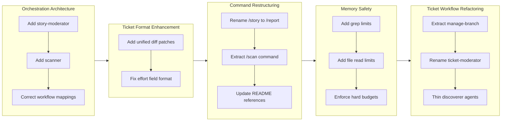

## 1. Overview

このブランチでは、プラグインのドキュメントとチケットワークフローに対して重要なアーキテクチャの改善を実装しました。`/story` コマンド（後に `/report` にリネーム）の2層オーケストレーションパターンを導入し、独立したドキュメント管理のために `/scan` コマンドを抽出し、`/ticket` コマンドのメモリリークを修正し、より正確な実装のためにチケットフォーマットに unified diff パッチを追加しました。

**Highlights:**

1. `/report` から `/scan` コマンドを抽出し、PR 作成なしで独立したドキュメント更新を可能に
2. アーカイブ検索とソース探索にハードリミットを追加し、`/ticket` のメモリリークを修正
3. `/story` を `/report` にリネームし、より明確な命名規則でチケットワークフローをリファクタリング

## 2. Motivation

ドキュメントワークフローは、単一の `/story` コマンドがドキュメントスキャンと PR 作成の両方を処理するため複雑化していました。ユーザーはドキュメントを独立して更新する柔軟性を必要としていました。また、`/ticket` コマンドは大規模なアーカイブを処理する際にメモリを枯渇させる可能性のある無制限の操作に苦しんでいました。このリファクタリングは、一貫した命名パターンによるアーキテクチャの明確性を向上させながら、これらのユーザビリティと信頼性の懸念に対処しました。

## 3. Journey

開発は `/story` コマンドの2層オーケストレーションパターンの導入から始まり、ドキュメントスキャンとストーリー生成を分離しました。スキルとサブエージェントのマッピングを修正した後、unified diff パッチによるチケットフォーマットの強化に移行しました。その後 `/story` コマンドは `/report` にリネームされ、独立したドキュメント更新のために `/scan` コマンドが抽出されました。メモリ安全性の改善は `/ticket` コマンドの無制限操作に対処しました。最後に、包括的なリファクタリングにより命名規則がクリーンアップされ、ブランチ管理が専用のスキルに抽出されました。

## 4. Changes

### 4.1. Add story-moderator and scanner to Reorganize Documentation Agents ([ae9cdcf](https://github.com/qmu/workaholic/commit/ae9cdcf))

- plugins/core/agents/story-moderator.md - 新しいオーケストレーターを作成（scanner と story-writer を並列呼び出し）
- plugins/core/agents/scanner.md - 新しいサブエージェントを作成（changelog-writer、spec-writer、terms-writer を呼び出し）
- plugins/core/agents/story-writer.md - 4つのサブエージェントに削減
- plugins/core/commands/story.md - story-moderator を呼び出すよう更新
- CLAUDE.md - "max depth 1" 制限を削除
- .workaholic/specs/architecture.md - 依存関係図を更新
- .workaholic/specs/architecture_ja.md - 日本語翻訳を更新

### 4.2. Correct Skill and Subagent Mappings in Story Workflow ([a8111af](https://github.com/qmu/workaholic/commit/a8111af))

- plugins/core/agents/story-moderator.md - write-story スキルを削除
- plugins/core/agents/story-writer.md - write-story スキルを追加、pr-creator 呼び出しを追加
- plugins/core/commands/story.md - 直接の pr-creator 呼び出しを削除
- .workaholic/specs/command-flows.md - 図を更新

### 4.3. Add unified diff patches to ticket format ([49febb1](https://github.com/qmu/workaholic/commit/49febb1))

- plugins/core/skills/create-ticket/SKILL.md - Patches セクションテンプレートを追加
- plugins/core/agents/ticket-organizer.md - diff パッチ生成を追加
- plugins/core/skills/drive-workflow/SKILL.md - パッチ適用ステップを追加
- plugins/core/agents/source-discoverer.md - コードスニペットを返すよう強化
- plugins/core/skills/discover-source/SKILL.md - スニペットキャプチャガイドラインを追加

### 4.4. Fix Effort Field Format Guidance ([8d15d05](https://github.com/qmu/workaholic/commit/8d15d05))

- plugins/core/skills/write-final-report/SKILL.md - 目立つ警告、有効値テーブル、見積もりガイドラインを追加

### 4.5. Rename /story to /report ([837a666](https://github.com/qmu/workaholic/commit/837a666))

- plugins/core/commands/story.md - report.md にリネーム、frontmatter を更新
- README.md - コマンドテーブルと例を更新
- CLAUDE.md - Commands テーブルとワークフローを更新
- plugins/core/README.md - コマンドテーブルを更新
- .workaholic/guides/commands.md - セクションヘッダーを更新
- .workaholic/guides/commands_ja.md - 日本語翻訳を更新

### 4.6. Extract /scan Command from /report ([25743c3](https://github.com/qmu/workaholic/commit/25743c3))

- plugins/core/commands/scan.md - 新しいコマンドを作成
- plugins/core/commands/report.md - story-writer を直接呼び出すよう簡素化
- plugins/core/agents/story-moderator.md - 削除
- plugins/core/skills/gather-git-context/ - 新しいスキルを作成
- plugins/core/skills/analyze-performance/ - calculate.sh をここに移動
- .workaholic/specs/architecture.md - 図を更新
- CLAUDE.md - /scan コマンドを追加
- README.md - quick start に /scan を追加

### 4.7. Fix Memory Leak in /ticket Command ([67ba0f5](https://github.com/qmu/workaholic/commit/67ba0f5))

- plugins/core/skills/discover-history/sh/search.sh - grep に -m 10 制限を追加、top 10 ファイルに削減
- plugins/core/agents/history-discoverer.md - 100行読み取り制限を追加
- plugins/core/skills/discover-source/SKILL.md - ハードファイル制限に変換
- plugins/core/agents/source-discoverer.md - スニペット制約を追加
- plugins/core/agents/ticket-organizer.md - JSON サイズ期待値を文書化

### 4.8. Update /story Reference to /report in README.md How It Works Section ([fb1fcf9](https://github.com/qmu/workaholic/commit/fb1fcf9))

- README.md - How It Works セクションで /story を /report に変更

### 4.9. Refactor ticket-organizer and Related Subagents ([08469b7](https://github.com/qmu/workaholic/commit/08469b7))

- plugins/core/skills/create-branch/ - manage-branch にリネーム
- plugins/core/agents/ticket-moderator.md - ticket-discoverer.md にリネーム
- plugins/core/agents/ticket-organizer.md - セクション 0 と 1 を削除、参照を更新
- plugins/core/agents/history-discoverer.md - キーワード抽出を追加、メモリ制限ノートを削除
- plugins/core/agents/source-discoverer.md - キーワード抽出を追加、メモリ制限ノートを削除
- plugins/core/skills/moderate-ticket/ - discover-ticket にリネーム
- .workaholic/specs/architecture.md - 全てのリネームと図を更新

## 5. Outcome

このブランチはドキュメントワークフローにおける関心の分離をより明確に達成しました。`/scan` コマンドにより、ユーザーは PR 作成とは独立して `.workaholic/` ドキュメントを更新できるようになり、`/report` はストーリー生成と PR 管理のみに集中します。メモリ安全性の改善により、`/ticket` コマンドはコンテキストを枯渇させることなく大規模なアーカイブを処理できます。unified diff パッチフォーマットにより、適用すべき正確な変更を Claude に提供することでチケット実装がより正確になります。チケットワークフロー全体での命名の一貫性（discoverer パターン、manage-branch スキル）により、コードベースのナビゲーション性が向上します。

## 6. Historical Analysis

このブランチは、並列サブエージェントオーケストレーション（drive-20260202-134332）で始まったアーキテクチャの進化を継続しています。ここで導入された2層オーケストレーションパターンは、より良い分離（/scan の抽出）が特定されたとき、同じ開発セッション内で後に簡素化されました。これは反復的な改善の実践を示しています。メモリリーク修正は、対応するセーフガードなしで並列検出が有効化されたときに最初に特定された懸念に対処しています。`/story` から `/report` へのリネームは、`/pull-request` で始まり、`/report`、`/story` を経て、再び `/report` に戻る命名サイクルを完了します - これはナラティブフレーミングよりもドキュメント/レポーティングフレーミングの方が響くことを示唆しています。

## 7. Concerns

- `/scan` の抽出により、通常のワークフローが `/drive` -> `/report` から `/drive` -> `/scan` -> `/report` に変更され、`/report` でドキュメント更新を期待するユーザーを混乱させる可能性がある
- メモリ制限の数値（10ファイル、100行、20ファイル、スニペットあたり30行）は経験に基づく推測であり、実際の使用状況に基づいてチューニングが必要な可能性がある
- unified diff パッチは、チケット作成と `/drive` 実行の間にコードベースが変更されると古くなる可能性がある

## 8. Ideas

- 古い動作を好むユーザーのために、`/report` がオプションで `/scan` を自動的に実行することを検討
- メモリ制限に達した際のログ記録を追加し、将来のチューニング決定に情報を提供
- `/drive` でパッチ検証を実装し、パッチ適用失敗時の明確なフォールバックメッセージを提供
- `/drive` が古さを検出した際にパッチを更新するパッチリフレッシュメカニズムを検討

## 9. Performance

**Metrics**: 7.9時間で24コミット（3.0コミット/時間）

### 9.1. Pace Analysis

開発速度はセッション全体を通じて約3コミット/時間で一貫していました。作業は9つの焦点を絞ったチケットに整理され、各チケットは特定の懸念に対処しました。コミットは小さく焦点が絞られており、通常はチケット作成コミットと実装コミットのペアでした。最長のチケット（Extract /scan Command）は discussion を通じて8回の revision を必要とし、複雑なアーキテクチャ決定に対する徹底的な反復を示しています。

### 9.2. Decision Review

| Dimension      | Rating   | Notes                                                                      |
| -------------- | -------- | -------------------------------------------------------------------------- |
| Consistency    | Strong   | 全体を通じて安定したペース、明確なチケットとコミットのマッピング                    |
| Intuitivity    | Strong   | コマンド名（/scan、/report）がユーザーのメンタルモデルに従う                       |
| Describability | Strong   | 各変更の目的がチケットに明確に文書化されている                                    |
| Agility        | Strong   | /scan 抽出での8回の revision は反復する意欲を示す                               |
| Density        | Adequate | 一部のコミットは純粋にドキュメント（README 更新）                                  |

**Strengths**: Discussion セクションを通じた徹底的な反復、一貫したチケット駆動開発、最終アーキテクチャでの良好な関心の分離。

**Areas for Improvement**: コミットノイズを減らすために、小さなドキュメント修正をより大きなチケットにバッチ処理することを検討。

## 10. Release Preparation

**Verdict**: Ready for release

### 10.1. Concerns

- なし - 変更は内部アーキテクチャの改善とドキュメント更新

### 10.2. Pre-release Instructions

- なし - 標準のリリースプロセスが適用される

### 10.3. Post-release Instructions

- 新しい `/scan` コマンドと変更された `/report` ワークフローを説明するためにユーザードキュメントを更新
- ワークフロー変更に関するユーザーフィードバックを監視

## 11. Notes

このブランチは反復的な改善の価値を示しています。2層オーケストレーションパターン（story-moderator -> scanner/story-writer）が導入され、その後より良い分離（/scan の抽出）が特定されたとき、同じ開発セッション内で簡素化されました。チケットの Discussion セクションはこの進化を捕捉し、将来のアーキテクチャ決定に価値あるコンテキストを提供しています。
