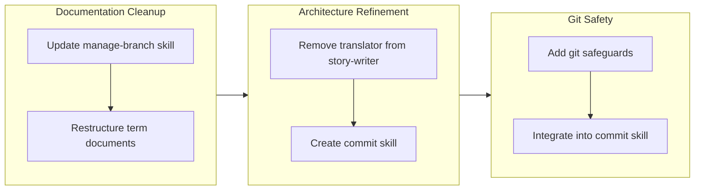

## 1. Overview

This branch focused on documentation hygiene and workflow safety improvements. The developer restructured terminology documents from verbose multi-section formats to concise single-paragraph entries, removed redundant translation responsibilities from the story-writer subagent, and strengthened git safeguards to protect against accidental data loss in multi-contributor environments.

**Highlights:**

1. Restructured 8 term documents (52 terms) from multi-section format to single-paragraph format for improved readability
2. Created centralized commit skill integrating format-commit-message with multi-contributor awareness
3. Strengthened git safeguards with explicit prohibitions and pre-flight checks for destructive operations

## 2. Motivation

The work addressed three areas of accumulated technical friction. Term documents had grown unwieldy with repetitive section headers; the story-writer subagent violated single-responsibility principle by handling both generation and translation; and the drive workflow lacked explicit protections against destructive git operations that could affect other contributors working in the same repository.

## 3. Journey

The branch progressed through three phases: documentation cleanup establishing patterns for skill documentation and term formatting, architectural refinement to separate concerns between story generation and translation, and safety improvements centralizing commit operations with multi-contributor awareness.

## 4. Changes

### 4.1. Update manage-branch SKILL.md to Reference check.sh Script ([e73a8f3](https://github.com/qmu/workaholic/commit/e73a8f3))

- `plugins/core/skills/manage-branch/SKILL.md` - Updated to reference check.sh script instead of inline bash code
- `plugins/core/skills/manage-branch/SKILL.md` - Added Auto-Approval Configuration section for settings.local.json

### 4.2. Restructure term documents to single-paragraph format ([0a50639](https://github.com/qmu/workaholic/commit/0a50639))

- `.workaholic/terms/core-concepts.md` - Rewritten from multi-section to single-paragraph format
- `.workaholic/terms/core-concepts_ja.md` - Japanese translation updated to match
- `.workaholic/terms/artifacts.md` - Rewritten from multi-section to single-paragraph format
- `.workaholic/terms/artifacts_ja.md` - Japanese translation updated to match
- `.workaholic/terms/workflow-terms.md` - Rewritten from multi-section to single-paragraph format
- `.workaholic/terms/workflow-terms_ja.md` - Japanese translation updated to match
- `.workaholic/terms/file-conventions.md` - Rewritten from multi-section to single-paragraph format
- `.workaholic/terms/file-conventions_ja.md` - Japanese translation updated to match
- `plugins/core/skills/write-terms/SKILL.md` - Updated term entry format guidelines

### 4.3. Remove translation responsibility from story-writer ([03bf311](https://github.com/qmu/workaholic/commit/03bf311))

- `plugins/core/agents/story-writer.md` - Removed translate skill preload and translation step
- `plugins/core/skills/write-story/SKILL.md` - Removed Translation section and translate skill dependency

### 4.4. Strengthen safeguards against destructive git operations ([7eab801](https://github.com/qmu/workaholic/commit/7eab801))

- `plugins/core/skills/drive-approval/SKILL.md` - Added pre-flight check before git restore, changed to exclude tickets directory
- `plugins/core/skills/drive-workflow/SKILL.md` - Added Prohibited Operations section with destructive command table
- `plugins/core/commands/drive.md` - Added Git Safety section with multi-contributor awareness

### 4.5. Create commit skill integrating format-commit-message and Git Safety ([9e71077](https://github.com/qmu/workaholic/commit/9e71077))

- `plugins/core/skills/commit/SKILL.md` - New skill documentation with multi-contributor awareness guidelines
- `plugins/core/skills/commit/sh/commit.sh` - New bash script with --skip-staging flag support
- `plugins/core/skills/archive-ticket/SKILL.md` - Updated to reference commit skill
- `plugins/core/skills/archive-ticket/sh/archive.sh` - Delegates commit to commit.sh
- `plugins/core/skills/drive-approval/SKILL.md` - Abandonment commits now use commit skill
- `plugins/core/commands/drive.md` - Added reference to commit skill in Git Safety section

## 5. Outcome

The developer completed five tickets addressing documentation and workflow safety:

- Skill documentation now references bundled scripts instead of inline bash, reducing permission prompts
- Term documents reduced from 2000+ lines to under 400 lines total while preserving semantic content
- Story-writer now follows single-responsibility principle, generating only English content
- Drive workflow explicitly prohibits destructive git operations
- Commit operations centralized in a skill with pre-flight safety checks

## 6. Historical Analysis

The term document restructuring followed patterns established in ticket 20260127010716 which renamed terminology to terms for conciseness. The translation removal from story-writer reversed an addition from ticket 20260128005021, recognizing that translation should be centralized in the scan workflow.

Git safety improvements built on several prior tickets: 20260125114643 established user approval patterns, 20260128213850 introduced git restore for abandonment, and 20260127094857 established deny rule patterns. The new safeguards extended these patterns to address multi-contributor environments.

## 7. Concerns

- The `git restore . ':!.workaholic/tickets/'` pathspec exclusion syntax requires modern git versions
- Auto-approval configuration (`Bash(bash:*)`) in settings.local.json applies to all bash scripts, which may be broader than intended for some users
- Translation responsibility was removed from story-writer but not explicitly added to scanner - story translations may be missed until scan workflow is updated

## 8. Ideas

- Create a `safe-restore.sh` script in skills directory that handles pre-flight checks and exclusions automatically
- Add automated terminology consistency analysis using the new single-paragraph format
- Consider adding story translation to the scan command workflow to maintain bilingual documentation

## 9. Performance

**Metrics**: 13 commits over 3.95 hours (3.2 commits/hour)

### 9.1. Pace Analysis

Development proceeded at a steady pace with focused commits. The ticket-commit ratio (5 tickets, 13 commits) indicates some tickets required multiple commits for staging and archiving. The single-session completion (under 4 hours) demonstrates good momentum once direction was established.

### 9.2. Decision Review

| Dimension      | Rating   | Notes |
| -------------- | -------- | ----- |
| Consistency    | Strong   | All changes followed established patterns from prior tickets |
| Intuitivity    | Strong   | Term restructuring and safety improvements are self-explanatory |
| Describability | Adequate | Some commits bundle multiple concerns (term files + skill updates) |
| Agility        | Strong   | Responded well to user feedback (term format revision, multi-contributor framing) |
| Density        | Strong   | Net reduction of 770 lines despite adding new skill and documentation |

**Strengths**: The developer demonstrated good responsiveness to feedback, revising the term document approach mid-implementation based on user input. Safety improvements were framed around collaboration rather than just technical protection.

**Areas for Improvement**: The translation responsibility removal could have been paired with explicit scanner updates to maintain bilingual coverage.

## 10. Release Preparation

**Verdict**: Ready for release

### 10.1. Concerns

- None - changes are configuration/documentation only with no runtime behavior changes

### 10.2. Pre-release Instructions

- None - standard release process applies

### 10.3. Post-release Instructions

- Consider running `/scan` to update story translations if bilingual coverage is required

## 11. Notes

One ticket remains in the queue (20260204201108-add-release-note-writer-to-report.md) and was not implemented in this drive session. The branch is complete with respect to the implemented tickets but additional work may be staged.
