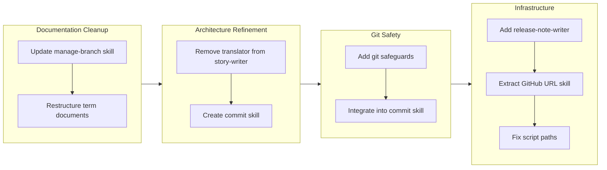

## 1. Overview

This branch focused on documentation hygiene, workflow safety improvements, and infrastructure enhancements for the /report command. The developer restructured terminology documents from verbose multi-section formats to concise single-paragraph entries, strengthened git safeguards for multi-contributor environments, created a centralized commit skill, added a release-note-writer subagent, and fixed skill script path references for reliable execution.

**Highlights:**

1. Restructured 8 term documents (52 terms) from multi-section format to single-paragraph format for improved readability
2. Created centralized commit skill and release-note-writer subagent to enhance workflow automation
3. Strengthened git safeguards with multi-contributor awareness and fixed skill script path resolution

## 2. Motivation

The work addressed accumulated technical friction across four areas. Term documents had grown unwieldy with repetitive section headers; the story-writer subagent violated single-responsibility principle by handling both generation and translation; the drive workflow lacked explicit protections against destructive git operations; and the /report command needed integrated release notes generation. Additional issues emerged around skill script path resolution and URL format consistency.

## 3. Journey

The branch progressed through four phases: documentation cleanup establishing patterns for skill documentation and term formatting, architectural refinement to separate concerns between story generation and translation, safety improvements centralizing commit operations with multi-contributor awareness, and infrastructure work adding release notes generation while fixing script path resolution issues.

## 4. Changes

### 4.1. Update manage-branch SKILL.md to Reference check.sh Script ([e73a8f3](https://github.com/qmu/workaholic/commit/e73a8f3))

- `plugins/core/skills/manage-branch/SKILL.md` - Updated to reference check.sh script instead of inline bash code
- `plugins/core/skills/manage-branch/SKILL.md` - Added Auto-Approval Configuration section for settings.local.json

### 4.2. Restructure term documents to single-paragraph format ([0a50639](https://github.com/qmu/workaholic/commit/0a50639))

- `.workaholic/terms/core-concepts.md` - Rewritten from multi-section to single-paragraph format
- `.workaholic/terms/core-concepts_ja.md` - Japanese translation updated to match
- `.workaholic/terms/artifacts.md` - Rewritten from multi-section to single-paragraph format
- `.workaholic/terms/artifacts_ja.md` - Japanese translation updated to match
- `.workaholic/terms/workflow-terms.md` - Rewritten from multi-section to single-paragraph format
- `.workaholic/terms/workflow-terms_ja.md` - Japanese translation updated to match
- `.workaholic/terms/file-conventions.md` - Rewritten from multi-section to single-paragraph format
- `.workaholic/terms/file-conventions_ja.md` - Japanese translation updated to match
- `plugins/core/skills/write-terms/SKILL.md` - Updated term entry format guidelines

### 4.3. Remove translation responsibility from story-writer ([03bf311](https://github.com/qmu/workaholic/commit/03bf311))

- `plugins/core/agents/story-writer.md` - Removed translate skill preload and translation step
- `plugins/core/skills/write-story/SKILL.md` - Removed Translation section and translate skill dependency

### 4.4. Strengthen safeguards against destructive git operations ([7eab801](https://github.com/qmu/workaholic/commit/7eab801))

- `plugins/core/skills/drive-approval/SKILL.md` - Added pre-flight check before git restore, changed to exclude tickets directory
- `plugins/core/skills/drive-workflow/SKILL.md` - Added Prohibited Operations section with destructive command table
- `plugins/core/commands/drive.md` - Added Git Safety section with multi-contributor awareness

### 4.5. Create commit skill integrating format-commit-message and Git Safety ([9e71077](https://github.com/qmu/workaholic/commit/9e71077))

- `plugins/core/skills/commit/SKILL.md` - New skill documentation with multi-contributor awareness guidelines
- `plugins/core/skills/commit/sh/commit.sh` - New bash script with --skip-staging flag support
- `plugins/core/skills/archive-ticket/SKILL.md` - Updated to reference commit skill
- `plugins/core/skills/archive-ticket/sh/archive.sh` - Delegates commit to commit.sh
- `plugins/core/skills/drive-approval/SKILL.md` - Abandonment commits now use commit skill
- `plugins/core/commands/drive.md` - Added reference to commit skill in Git Safety section

### 4.6. Add release-note-writer Subagent to /report Command ([9d6bf20](https://github.com/qmu/workaholic/commit/9d6bf20))

- `plugins/core/agents/release-note-writer.md` - New subagent for generating release notes from story
- `plugins/core/skills/write-release-note/SKILL.md` - New skill defining release note structure
- `plugins/core/agents/story-writer.md` - Updated to invoke release-note-writer in Phase 4
- `plugins/core/skills/write-story/SKILL.md` - Updated agent output mapping table
- `.github/workflows/release.yml` - Modified to use generated release notes with fallback

### 4.7. Extract GitHub URL Transformation into gather-git-context Skill ([628b826](https://github.com/qmu/workaholic/commit/628b826))

- `plugins/core/skills/gather-git-context/sh/gather.sh` - Added SSH-to-HTTPS URL transformation
- `plugins/core/skills/gather-git-context/SKILL.md` - Updated documentation to show HTTPS output
- `CLAUDE.md` - Added shell script principle prohibiting complex inline shell commands

### 4.8. Fix Skill Shell Script Path References ([bebb0a5](https://github.com/qmu/workaholic/commit/bebb0a5))

- `plugins/core/commands/drive.md` - Updated script path to marketplace plugin path
- `plugins/core/skills/archive-ticket/SKILL.md` - Updated script path references
- `plugins/core/skills/drive-approval/SKILL.md` - Updated script path references
- `plugins/core/skills/commit/SKILL.md` - Updated script path references

## 5. Outcome

The developer completed eight tickets addressing documentation, workflow safety, and infrastructure:

- Skill documentation now references bundled scripts instead of inline bash, reducing permission prompts
- Term documents reduced from 2000+ lines to under 400 lines total while preserving semantic content
- Story-writer now follows single-responsibility principle, generating only English content
- Drive workflow explicitly prohibits destructive git operations with multi-contributor awareness
- Commit operations centralized in a skill with pre-flight safety checks
- Release notes generation integrated into /report workflow with GitHub Actions support
- gather-git-context now outputs HTTPS URLs consistently for GitHub link generation
- Skill script paths use full marketplace plugin path for reliable resolution

## 6. Historical Analysis

The term document restructuring followed patterns established in ticket 20260127010716 which renamed terminology to terms for conciseness. The translation removal from story-writer reversed an addition from ticket 20260128005021, recognizing that translation should be centralized in the scan workflow.

Git safety improvements built on several prior tickets: 20260125114643 established user approval patterns, 20260128213850 introduced git restore for abandonment, and 20260127094857 established deny rule patterns. The release-note-writer follows the subagent extraction pattern from 20260127004417 and concurrent execution pattern from 20260127005414.

The shell script bundling pattern was established in 20260127193706 and the gather-git-context skill was created following patterns from 20260202182054. Script path fixes address intermittent resolution issues that emerged after marketplace plugin integration.

## 7. Concerns

- The `git restore . ':!.workaholic/tickets/'` pathspec exclusion syntax requires modern git versions
- Auto-approval configuration (`Bash(bash:*)`) in settings.local.json applies to all bash scripts, which may be broader than intended for some users
- Translation responsibility was removed from story-writer but not explicitly added to scanner - story translations may be missed until scan workflow is updated
- The marketplace plugin path (`~/.claude/plugins/marketplaces/workaholic/`) is hardcoded and assumes standard installation location

## 8. Ideas

- Create a `safe-restore.sh` script in skills directory that handles pre-flight checks and exclusions automatically
- Add automated terminology consistency analysis using the new single-paragraph format
- Consider adding story translation to the scan command workflow to maintain bilingual documentation
- Make the plugin path configurable or use environment variable for non-standard installations

## 9. Performance

**Metrics**: 24 commits over 27.15 hours (0.88 commits/hour)

### 9.1. Pace Analysis

Development spanned two days with intermittent work sessions. The commit count doubled compared to the initial session, indicating continued iteration and refinement. The ticket-commit ratio (8 tickets, 24 commits) shows consistent archiving and staging patterns with an average of 3 commits per ticket.

### 9.2. Decision Review

| Dimension      | Rating   | Notes |
| -------------- | -------- | ----- |
| Consistency    | Strong   | All changes followed established patterns from prior tickets |
| Intuitivity    | Strong   | Term restructuring, safety improvements, and infrastructure additions are self-explanatory |
| Describability | Adequate | Some commits bundle multiple concerns (term files + skill updates) |
| Agility        | Strong   | Responded well to user feedback and addressed emerging issues like script paths |
| Density        | Strong   | Added significant new functionality while maintaining code reduction in term documents |

**Strengths**: The developer demonstrated good responsiveness to feedback, revising the term document approach mid-implementation based on user input. Safety improvements were framed around collaboration rather than just technical protection. The release-note-writer integration followed established patterns for subagent extraction.

**Areas for Improvement**: The translation responsibility removal could have been paired with explicit scanner updates to maintain bilingual coverage. Script path issues could have been caught earlier through more thorough testing.

## 10. Release Preparation

**Verdict**: Ready for release

### 10.1. Concerns

- None - changes are configuration/documentation only with no runtime behavior changes

### 10.2. Pre-release Instructions

- None - standard release process applies

### 10.3. Post-release Instructions

- Consider running `/scan` to update story translations if bilingual coverage is required
- Verify release notes generation works correctly on next release

## 11. Notes

All eight tickets in the archive have been implemented. The branch includes documentation hygiene (term restructuring), architectural refinement (translation removal, commit skill), safety improvements (git safeguards), and infrastructure enhancements (release-note-writer, URL transformation, path fixes).
