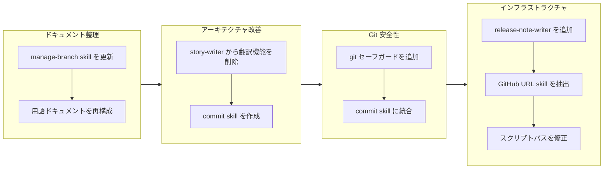

## 1. 概要

このブランチはドキュメントの整理、ワークフローの安全性改善、/report コマンドのインフラストラクチャ強化に焦点を当てました。開発者は冗長なマルチセクション形式から簡潔な単一パラグラフ形式に用語ドキュメントを再構成し、マルチコントリビューター環境向けの git セーフガードを強化し、集中型 commit skill を作成し、release-note-writer subagent を追加し、信頼性の高い実行のために skill スクリプトパス参照を修正しました。

**ハイライト:**

1. 8つの用語ドキュメント（52用語）をマルチセクション形式から単一パラグラフ形式に再構成し、可読性を向上
2. ワークフロー自動化を強化するために集中型 commit skill と release-note-writer subagent を作成
3. マルチコントリビューター対応で git セーフガードを強化し、skill スクリプトパス解決を修正

## 2. 動機

この作業は4つの領域に蓄積された技術的摩擦に対処しました。用語ドキュメントは繰り返しのセクションヘッダーで扱いにくくなっていました。story-writer subagent は生成と翻訳の両方を処理することで単一責任原則に違反していました。drive ワークフローには破壊的な git 操作に対する明示的な保護が欠けていました。そして /report コマンドには統合されたリリースノート生成が必要でした。skill スクリプトパス解決と URL 形式の一貫性に関する追加の問題も浮上しました。

## 3. 経緯

ブランチは4つのフェーズを経て進行しました：skill ドキュメントと用語フォーマットのパターンを確立するドキュメント整理、story 生成と翻訳の間の関心事を分離するアーキテクチャ改善、マルチコントリビューター対応で commit 操作を集中化する安全性改善、そしてスクリプトパス解決の問題を修正しながらリリースノート生成を追加するインフラストラクチャ作業です。

## 4. 変更内容

### 4.1. manage-branch SKILL.md を check.sh スクリプト参照に更新 ([e73a8f3](https://github.com/qmu/workaholic/commit/e73a8f3))

- `plugins/core/skills/manage-branch/SKILL.md` - インライン bash コードではなく check.sh スクリプトを参照するように更新
- `plugins/core/skills/manage-branch/SKILL.md` - settings.local.json 用の自動承認設定セクションを追加

### 4.2. 用語ドキュメントを単一パラグラフ形式に再構成 ([0a50639](https://github.com/qmu/workaholic/commit/0a50639))

- `.workaholic/terms/core-concepts.md` - マルチセクションから単一パラグラフ形式に書き直し
- `.workaholic/terms/core-concepts_ja.md` - 日本語翻訳を更新
- `.workaholic/terms/artifacts.md` - マルチセクションから単一パラグラフ形式に書き直し
- `.workaholic/terms/artifacts_ja.md` - 日本語翻訳を更新
- `.workaholic/terms/workflow-terms.md` - マルチセクションから単一パラグラフ形式に書き直し
- `.workaholic/terms/workflow-terms_ja.md` - 日本語翻訳を更新
- `.workaholic/terms/file-conventions.md` - マルチセクションから単一パラグラフ形式に書き直し
- `.workaholic/terms/file-conventions_ja.md` - 日本語翻訳を更新
- `plugins/core/skills/write-terms/SKILL.md` - 用語エントリフォーマットガイドラインを更新

### 4.3. story-writer から翻訳責任を削除 ([03bf311](https://github.com/qmu/workaholic/commit/03bf311))

- `plugins/core/agents/story-writer.md` - translate skill のプリロードと翻訳ステップを削除
- `plugins/core/skills/write-story/SKILL.md` - Translation セクションと translate skill 依存を削除

### 4.4. 破壊的な git 操作に対するセーフガードを強化 ([7eab801](https://github.com/qmu/workaholic/commit/7eab801))

- `plugins/core/skills/drive-approval/SKILL.md` - git restore 前のプリフライトチェックを追加、tickets ディレクトリを除外するように変更
- `plugins/core/skills/drive-workflow/SKILL.md` - 破壊的コマンドテーブル付きの Prohibited Operations セクションを追加
- `plugins/core/commands/drive.md` - マルチコントリビューター対応の Git Safety セクションを追加

### 4.5. format-commit-message と Git Safety を統合した commit skill を作成 ([9e71077](https://github.com/qmu/workaholic/commit/9e71077))

- `plugins/core/skills/commit/SKILL.md` - マルチコントリビューター対応ガイドライン付きの新 skill ドキュメント
- `plugins/core/skills/commit/sh/commit.sh` - --skip-staging フラグ対応の新 bash スクリプト
- `plugins/core/skills/archive-ticket/SKILL.md` - commit skill を参照するように更新
- `plugins/core/skills/archive-ticket/sh/archive.sh` - commit.sh に commit を委譲
- `plugins/core/skills/drive-approval/SKILL.md` - 放棄コミットが commit skill を使用するように変更
- `plugins/core/commands/drive.md` - Git Safety セクションに commit skill への参照を追加

### 4.6. /report コマンドに release-note-writer Subagent を追加 ([9d6bf20](https://github.com/qmu/workaholic/commit/9d6bf20))

- `plugins/core/agents/release-note-writer.md` - story からリリースノートを生成する新 subagent
- `plugins/core/skills/write-release-note/SKILL.md` - リリースノート構造を定義する新 skill
- `plugins/core/agents/story-writer.md` - Phase 4 で release-note-writer を呼び出すように更新
- `plugins/core/skills/write-story/SKILL.md` - agent output mapping テーブルを更新
- `.github/workflows/release.yml` - フォールバック付きで生成されたリリースノートを使用するように修正

### 4.7. GitHub URL 変換を gather-git-context Skill に抽出 ([628b826](https://github.com/qmu/workaholic/commit/628b826))

- `plugins/core/skills/gather-git-context/sh/gather.sh` - SSH から HTTPS への URL 変換を追加
- `plugins/core/skills/gather-git-context/SKILL.md` - HTTPS 出力を表示するようにドキュメントを更新
- `CLAUDE.md` - 複雑なインライン shell コマンドを禁止する shell script 原則を追加

### 4.8. Skill Shell Script パス参照を修正 ([bebb0a5](https://github.com/qmu/workaholic/commit/bebb0a5))

- `plugins/core/commands/drive.md` - marketplace plugin パスにスクリプトパスを更新
- `plugins/core/skills/archive-ticket/SKILL.md` - スクリプトパス参照を更新
- `plugins/core/skills/drive-approval/SKILL.md` - スクリプトパス参照を更新
- `plugins/core/skills/commit/SKILL.md` - スクリプトパス参照を更新

## 5. 成果

開発者はドキュメント、ワークフローの安全性、インフラストラクチャに関する8つのチケットを完了しました：

- Skill ドキュメントがインライン bash ではなくバンドルされたスクリプトを参照するようになり、権限プロンプトが減少
- 用語ドキュメントが合計2000行以上から400行未満に削減され、意味的な内容は保持
- story-writer が単一責任原則に従い、英語コンテンツのみを生成
- Drive ワークフローがマルチコントリビューター対応で破壊的な git 操作を明示的に禁止
- Commit 操作がプリフライト安全チェック付きの skill に集中化
- リリースノート生成が GitHub Actions サポート付きで /report ワークフローに統合
- gather-git-context が GitHub リンク生成のために HTTPS URL を一貫して出力
- Skill スクリプトパスが信頼性の高い解決のためにフル marketplace plugin パスを使用

## 6. 歴史的分析

用語ドキュメントの再構成は、簡潔さのために terminology を terms にリネームしたチケット 20260127010716 で確立されたパターンに従いました。story-writer からの翻訳削除は、翻訳を scan ワークフローに集中化すべきと認識してチケット 20260128005021 の追加を取り消しました。

Git 安全性の改善は、いくつかの以前のチケットを基に構築されました：20260125114643 がユーザー承認パターンを確立し、20260128213850 が放棄用の git restore を導入し、20260127094857 が deny ルールパターンを確立しました。release-note-writer は 20260127004417 の subagent 抽出パターンと 20260127005414 の並行実行パターンに従います。

Shell script バンドルパターンは 20260127193706 で確立され、gather-git-context skill は 20260202182054 のパターンに従って作成されました。スクリプトパスの修正は marketplace plugin 統合後に発生した断続的な解決の問題に対処します。

## 7. 懸念事項

- `git restore . ':!.workaholic/tickets/'` pathspec 除外構文は最新の git バージョンが必要
- settings.local.json の自動承認設定（`Bash(bash:*)`）はすべての bash スクリプトに適用され、一部のユーザーにとっては意図より広範囲になる可能性
- 翻訳責任は story-writer から削除されましたが、scanner には明示的に追加されていません - scan ワークフローが更新されるまで story 翻訳が欠落する可能性
- marketplace plugin パス（`~/.claude/plugins/marketplaces/workaholic/`）はハードコードされており、標準的なインストール場所を想定

## 8. アイデア

- プリフライトチェックと除外を自動的に処理する `safe-restore.sh` スクリプトを skills ディレクトリに作成
- 新しい単一パラグラフ形式を使用した自動用語一貫性分析を追加
- バイリンガルドキュメントを維持するために scan コマンドワークフローに story 翻訳を追加することを検討
- 非標準インストール用に plugin パスを設定可能にするか、環境変数を使用

## 9. パフォーマンス

**メトリクス**: 27.15時間で24コミット（0.88コミット/時間）

### 9.1. ペース分析

開発は2日間にわたり、断続的な作業セッションで行われました。コミット数は最初のセッションと比較して倍増し、継続的な反復と改善を示しています。チケットとコミットの比率（8チケット、24コミット）は、チケットあたり平均3コミットの一貫したアーカイブとステージングパターンを示しています。

### 9.2. 意思決定レビュー

| 次元 | 評価 | 備考 |
| --- | --- | --- |
| 一貫性 | 良好 | すべての変更が以前のチケットで確立されたパターンに従った |
| 直感性 | 良好 | 用語再構成、安全性改善、インフラストラクチャ追加は自明 |
| 記述性 | 適切 | 一部のコミットが複数の関心事をバンドル（用語ファイル + skill 更新） |
| 俊敏性 | 良好 | ユーザーフィードバックに適切に対応し、スクリプトパスなどの新たな問題に対処 |
| 密度 | 良好 | 用語ドキュメントでのコード削減を維持しながら重要な新機能を追加 |

**強み**: 開発者はフィードバックへの良好な対応力を示し、ユーザー入力に基づいて実装中に用語ドキュメントのアプローチを修正しました。安全性の改善は技術的な保護だけでなく、コラボレーションの観点からフレーミングされました。release-note-writer 統合は subagent 抽出の確立されたパターンに従いました。

**改善点**: 翻訳責任の削除は、バイリンガルカバレッジを維持するための明示的な scanner 更新と組み合わせることができました。スクリプトパスの問題は、より徹底したテストで早期に発見できた可能性があります。

## 10. リリース準備

**判定**: リリース準備完了

### 10.1. 懸念事項

- なし - 変更は設定/ドキュメントのみでランタイム動作の変更なし

### 10.2. リリース前の指示

- なし - 標準リリースプロセスが適用

### 10.3. リリース後の指示

- バイリンガルカバレッジが必要な場合は `/scan` を実行して story 翻訳を更新することを検討
- 次のリリースでリリースノート生成が正しく動作することを確認

## 11. 備考

アーカイブ内の8つのチケットすべてが実装されました。ブランチにはドキュメント整理（用語再構成）、アーキテクチャ改善（翻訳削除、commit skill）、安全性改善（git セーフガード）、インフラストラクチャ強化（release-note-writer、URL 変換、パス修正）が含まれています。
