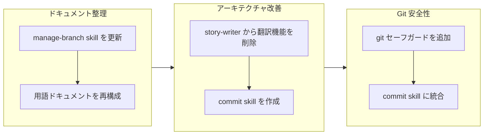

## 1. 概要

このブランチはドキュメントの整理とワークフローの安全性改善に焦点を当てました。開発者は冗長なマルチセクション形式から簡潔な単一パラグラフ形式に用語ドキュメントを再構成し、story-writer サブエージェントから冗長な翻訳責任を削除し、マルチコントリビューター環境での意図しないデータ損失を防ぐため git セーフガードを強化しました。

**ハイライト:**

1. 8つの用語ドキュメント（52用語）をマルチセクション形式から単一パラグラフ形式に再構成し、可読性を向上
2. format-commit-message とマルチコントリビューター対応を統合した集中型 commit skill を作成
3. 破壊的操作に対する明示的な禁止事項とプリフライトチェックで git セーフガードを強化

## 2. 動機

この作業は蓄積された技術的摩擦の3つの領域に対処しました。用語ドキュメントは繰り返しのセクションヘッダーで扱いにくくなっていました。story-writer サブエージェントは生成と翻訳の両方を処理することで単一責任原則に違反していました。そして drive ワークフローには、同じリポジトリで作業している他のコントリビューターに影響を与える可能性のある破壊的な git 操作に対する明示的な保護が欠けていました。

## 3. 経緯

ブランチは3つのフェーズを経て進行しました：skill ドキュメントと用語フォーマットのパターンを確立するドキュメント整理、story 生成と翻訳の間の関心事を分離するアーキテクチャ改善、そしてマルチコントリビューター対応で commit 操作を集中化する安全性改善です。

## 4. 変更内容

### 4.1. manage-branch SKILL.md を check.sh スクリプト参照に更新 ([e73a8f3](https://github.com/qmu/workaholic/commit/e73a8f3))

- `plugins/core/skills/manage-branch/SKILL.md` - インライン bash コードではなく check.sh スクリプトを参照するように更新
- `plugins/core/skills/manage-branch/SKILL.md` - settings.local.json 用の自動承認設定セクションを追加

### 4.2. 用語ドキュメントを単一パラグラフ形式に再構成 ([0a50639](https://github.com/qmu/workaholic/commit/0a50639))

- `.workaholic/terms/core-concepts.md` - マルチセクションから単一パラグラフ形式に書き直し
- `.workaholic/terms/core-concepts_ja.md` - 日本語翻訳を更新
- `.workaholic/terms/artifacts.md` - マルチセクションから単一パラグラフ形式に書き直し
- `.workaholic/terms/artifacts_ja.md` - 日本語翻訳を更新
- `.workaholic/terms/workflow-terms.md` - マルチセクションから単一パラグラフ形式に書き直し
- `.workaholic/terms/workflow-terms_ja.md` - 日本語翻訳を更新
- `.workaholic/terms/file-conventions.md` - マルチセクションから単一パラグラフ形式に書き直し
- `.workaholic/terms/file-conventions_ja.md` - 日本語翻訳を更新
- `plugins/core/skills/write-terms/SKILL.md` - 用語エントリフォーマットガイドラインを更新

### 4.3. story-writer から翻訳責任を削除 ([03bf311](https://github.com/qmu/workaholic/commit/03bf311))

- `plugins/core/agents/story-writer.md` - translate skill のプリロードと翻訳ステップを削除
- `plugins/core/skills/write-story/SKILL.md` - Translation セクションと translate skill 依存を削除

### 4.4. 破壊的な git 操作に対するセーフガードを強化 ([7eab801](https://github.com/qmu/workaholic/commit/7eab801))

- `plugins/core/skills/drive-approval/SKILL.md` - git restore 前のプリフライトチェックを追加、tickets ディレクトリを除外するように変更
- `plugins/core/skills/drive-workflow/SKILL.md` - 破壊的コマンドテーブル付きの Prohibited Operations セクションを追加
- `plugins/core/commands/drive.md` - マルチコントリビューター対応の Git Safety セクションを追加

### 4.5. format-commit-message と Git Safety を統合した commit skill を作成 ([9e71077](https://github.com/qmu/workaholic/commit/9e71077))

- `plugins/core/skills/commit/SKILL.md` - マルチコントリビューター対応ガイドライン付きの新 skill ドキュメント
- `plugins/core/skills/commit/sh/commit.sh` - --skip-staging フラグ対応の新 bash スクリプト
- `plugins/core/skills/archive-ticket/SKILL.md` - commit skill を参照するように更新
- `plugins/core/skills/archive-ticket/sh/archive.sh` - commit.sh に commit を委譲
- `plugins/core/skills/drive-approval/SKILL.md` - 放棄コミットが commit skill を使用するように変更
- `plugins/core/commands/drive.md` - Git Safety セクションに commit skill への参照を追加

## 5. 成果

開発者はドキュメントとワークフローの安全性に関する5つのチケットを完了しました：

- Skill ドキュメントがインライン bash ではなくバンドルされたスクリプトを参照するようになり、権限プロンプトが減少
- 用語ドキュメントが合計2000行以上から400行未満に削減され、意味的な内容は保持
- story-writer が単一責任原則に従い、英語コンテンツのみを生成
- Drive ワークフローが破壊的な git 操作を明示的に禁止
- Commit 操作がプリフライト安全チェック付きの skill に集中化

## 6. 歴史的分析

用語ドキュメントの再構成は、簡潔さのために terminology を terms にリネームしたチケット 20260127010716 で確立されたパターンに従いました。story-writer からの翻訳削除は、翻訳を scan ワークフローに集中化すべきと認識してチケット 20260128005021 の追加を取り消しました。

Git 安全性の改善は、いくつかの以前のチケットを基に構築されました：20260125114643 がユーザー承認パターンを確立し、20260128213850 が放棄用の git restore を導入し、20260127094857 が deny ルールパターンを確立しました。新しいセーフガードはこれらのパターンを拡張してマルチコントリビューター環境に対応しました。

## 7. 懸念事項

- `git restore . ':!.workaholic/tickets/'` pathspec 除外構文は最新の git バージョンが必要
- settings.local.json の自動承認設定（`Bash(bash:*)`）はすべての bash スクリプトに適用され、一部のユーザーにとっては意図より広範囲になる可能性
- 翻訳責任は story-writer から削除されましたが、scanner には明示的に追加されていません - scan ワークフローが更新されるまで story 翻訳が欠落する可能性

## 8. アイデア

- プリフライトチェックと除外を自動的に処理する `safe-restore.sh` スクリプトを skills ディレクトリに作成
- 新しい単一パラグラフ形式を使用した自動用語一貫性分析を追加
- バイリンガルドキュメントを維持するために scan コマンドワークフローに story 翻訳を追加することを検討

## 9. パフォーマンス

**メトリクス**: 3.95時間で13コミット（3.2コミット/時間）

### 9.1. ペース分析

開発は焦点を絞ったコミットで安定したペースで進行しました。チケットとコミットの比率（5チケット、13コミット）は、一部のチケットがステージングとアーカイブに複数のコミットを必要としたことを示しています。単一セッションでの完了（4時間未満）は、方向性が確立されてからの良好なモメンタムを示しています。

### 9.2. 意思決定レビュー

| 次元 | 評価 | 備考 |
| --- | --- | --- |
| 一貫性 | 良好 | すべての変更が以前のチケットで確立されたパターンに従った |
| 直感性 | 良好 | 用語再構成と安全性改善は自明 |
| 記述性 | 適切 | 一部のコミットが複数の関心事をバンドル（用語ファイル + skill 更新） |
| 俊敏性 | 良好 | ユーザーフィードバックに適切に対応（用語形式の修正、マルチコントリビューターの枠組み） |
| 密度 | 良好 | 新 skill とドキュメントを追加しながら770行の純減 |

**強み**: 開発者はフィードバックへの良好な対応力を示し、ユーザー入力に基づいて実装中に用語ドキュメントのアプローチを修正しました。安全性の改善は技術的な保護だけでなく、コラボレーションの観点からフレーミングされました。

**改善点**: 翻訳責任の削除は、バイリンガルカバレッジを維持するための明示的な scanner 更新と組み合わせることができました。

## 10. リリース準備

**判定**: リリース準備完了

### 10.1. 懸念事項

- なし - 変更は設定/ドキュメントのみでランタイム動作の変更なし

### 10.2. リリース前の指示

- なし - 標準リリースプロセスが適用

### 10.3. リリース後の指示

- バイリンガルカバレッジが必要な場合は `/scan` を実行して story 翻訳を更新することを検討

## 11. 備考

1つのチケットがキューに残っています（20260204201108-add-release-note-writer-to-report.md）、この drive セッションでは実装されませんでした。ブランチは実装されたチケットに関しては完了していますが、追加の作業がステージングされている可能性があります。
