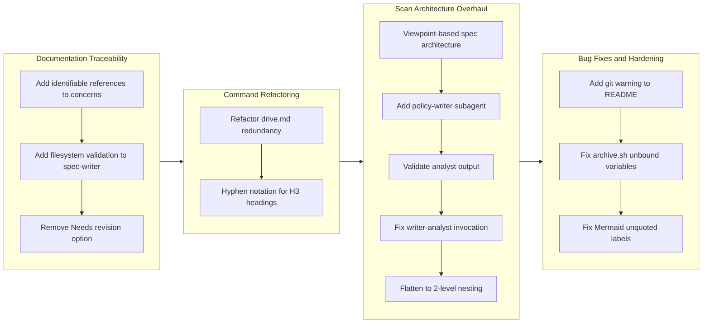

## 1. Overview

This branch delivered a comprehensive set of improvements spanning documentation traceability, workflow enforcement, scan architecture, and shell script robustness. The developer introduced identifiable references for concerns sections, enforced a ticket-update-first rule in the drive workflow, overhauled the /scan command from a fragile 3-level nesting architecture to a flat 2-level design with 17 parallel analyst subagents, and fixed recurring issues with Mermaid diagram rendering and shell script unbound variables.

**Highlights:**

1. Transformed the /scan command architecture from 3-level nesting (scanner -> writers -> analysts) to 2-level (scanner -> 17 parallel analysts) after discovering that 3-level Task nesting is inherently unreliable
2. Introduced viewpoint-based spec architecture (8 viewpoints) and policy-writer with 7 concurrent policy analysts for systematic repository documentation
3. Strengthened documentation traceability with identifiable commit/file references in concerns sections and enforced ticket-update-first feedback handling

## 2. Motivation

The branch addressed three categories of accumulated friction. First, documentation lacked verifiable references -- concerns in tickets and stories were prose descriptions without actionable audit trails. Second, the drive workflow's "Needs revision" option short-circuited the established ticket-update-first pattern, allowing code changes without updating the implementation plan. Third, the /scan command's ad-hoc 3-spec approach (architecture.md, command-flows.md, contributing.md) provided no systematic coverage guarantees, and the subsequent attempt to build viewpoint-based and policy-based parallel generation revealed that Claude Code's Task tool does not reliably execute at 3 levels of nesting. These compounding issues drove a series of incremental improvements that culminated in a significant architectural flattening of the scan pipeline.

## 3. Journey

The branch began with documentation quality improvements -- adding traceability references and filesystem validation. A refactoring phase trimmed the drive command and standardized heading notation. The most significant arc was the scan architecture overhaul: the developer built viewpoint-based spec generation and policy-writer orchestration, discovered that the 3-level Task nesting failed to invoke child analysts, attempted a prompt-engineering fix, and ultimately flattened the architecture to 2 levels with 15 dedicated per-analyst agents. The branch concluded with defensive hardening of shell scripts and Mermaid diagrams.

## 4. Changes

### 4-1. Improve Concerns Section with Identifiable References ([bbcdfa6](https://github.com/qmu/workaholic/commit/bbcdfa6))

- `plugins/core/skills/create-ticket/SKILL.md` - Added structured Considerations format with file path references and guidelines
- `plugins/core/skills/write-story/SKILL.md` - Added format, example, and guidelines for Section 7 (Concerns) with commit hash and file path references
- `plugins/core/skills/review-sections/SKILL.md` - Added instructions to extract commit_hash and file paths when generating Concerns
- `plugins/core/agents/section-reviewer.md` - Added extraction steps for commit_hash and file paths from ticket analysis

### 4-2. Add Filesystem Validation to Spec-Writer ([d7c224d](https://github.com/qmu/workaholic/commit/d7c224d))

- `plugins/core/skills/write-spec/sh/gather.sh` - Added ACTUAL STRUCTURE section that lists files in agents/, commands/, rules/, and skills/ directories
- `plugins/core/skills/write-spec/SKILL.md` - Documented the new output section and added usage guidance for detecting stale documentation
- `plugins/core/agents/spec-writer.md` - Added step 3 "Validate Structure" with instructions to compare actual vs documented structure

### 4-3. Remove "Needs revision" Option and Enforce Ticket-Update-First Rule ([971ab9a](https://github.com/qmu/workaholic/commit/971ab9a))

- `plugins/core/skills/drive-approval/SKILL.md` - Removed "Needs revision" option, renamed Section 3 to "Handle Feedback", added ticket-update-first enforcement
- `plugins/core/commands/drive.md` - Changed handling to free-form feedback via "Other" option with explicit FIRST/THEN ordering

### 4-4. Refactor drive.md to Reduce Redundancy Against Preloaded Skills ([570fb0e](https://github.com/qmu/workaholic/commit/570fb0e))

- `plugins/core/commands/drive.md` - Reduced from 178 to ~80-100 lines by removing restated skill content, consolidating Approve paths, removing duplicated Git Safety section

### 4-5. Change H3 Heading Numbering from Dot to Hyphen Notation ([37b1f98](https://github.com/qmu/workaholic/commit/37b1f98))

- `plugins/core/rules/general.md` - Updated h3 example from `### 1.1. Subsection` to `### 1-1. Subsection`
- `plugins/core/skills/write-story/SKILL.md` - Updated 8 h3 heading patterns from dot notation to hyphen notation (sections 4, 9, 10) and format guideline

### 4-6. Implement Viewpoint-Based Spec Architecture ([5b2b024](https://github.com/qmu/workaholic/commit/5b2b024))

- `plugins/core/skills/analyze-viewpoint/SKILL.md` - New comprehensive skill with output template, assumption rules, comprehensiveness policy, inference guidelines
- `plugins/core/skills/analyze-viewpoint/sh/gather.sh` - New context gathering script with viewpoint-specific file listings
- `plugins/core/skills/analyze-viewpoint/sh/read-overrides.sh` - New script to read CLAUDE.md for viewpoint override directives
- `plugins/core/agents/architecture-analyst.md` - New thin subagent receiving viewpoint definition from caller
- `plugins/core/agents/spec-writer.md` - Rewritten from 7-step sequential process to orchestrator with 8 parallel architecture-analyst dispatch
- `plugins/core/skills/write-spec/SKILL.md` - Updated directory structure and file naming for 8-viewpoint convention

### 4-7. Add Policy-Writer Subagent with 7 Concurrent Policy-Analysts ([82ffc1b](https://github.com/qmu/workaholic/commit/82ffc1b))

- `plugins/core/skills/analyze-policy/SKILL.md` - New generic framework for policy analysis
- `plugins/core/skills/analyze-policy/sh/gather.sh` - New context gathering with policy-domain-specific file scanning
- `plugins/core/agents/policy-analyst.md` - New thin subagent receiving policy definition from caller
- `plugins/core/agents/policy-writer.md` - New orchestrator with 7 policy domain definitions
- `plugins/core/agents/scanner.md` - Updated from 3 to 4 parallel agents
- `plugins/core/commands/scan.md` - Added `.workaholic/policies/` to git add
- `.workaholic/policies/README.md` - New English index
- `.workaholic/policies/README_ja.md` - New Japanese index
- `.workaholic/README.md` - Added policies link
- `.workaholic/README_ja.md` - Added policies link

### 4-8. Validate Analyst Output Before README Index Update ([d5001a0](https://github.com/qmu/workaholic/commit/d5001a0))

- `plugins/core/skills/validate-writer-output/SKILL.md` - New validation skill documentation
- `plugins/core/skills/validate-writer-output/sh/validate.sh` - New script checking file existence and non-emptiness
- `plugins/core/agents/spec-writer.md` - Added validation gate between analyst invocation and README update
- `plugins/core/agents/policy-writer.md` - Added same validation gate
- `.workaholic/specs/README.md` - Fixed broken links to non-existent files
- `.workaholic/policies/README.md` - Fixed broken links to non-existent files

### 4-9. Add Git Manipulation Warning to Root README ([f10f2e4](https://github.com/qmu/workaholic/commit/f10f2e4))

- `README.md` - Added `[!WARNING]` alert block disclosing autonomous git operations

### 4-10. Fix spec-writer and policy-writer to Actually Invoke Analyst Subagents ([093bfe3](https://github.com/qmu/workaholic/commit/093bfe3))

- `plugins/core/agents/spec-writer.md` - Restructured from flat numbered steps to Phase-based headings with explicit analyst invocation bullets
- `plugins/core/agents/policy-writer.md` - Same Phase-based restructuring with explicit bullet lists for each analyst

### 4-11. Fix archive.sh Unbound Variable Errors ([650d419](https://github.com/qmu/workaholic/commit/650d419))

- `plugins/core/skills/archive-ticket/sh/archive.sh` - Changed `$1`/`$2`/`$3` to `${1:-}`/`${2:-}`/`${3:-}`, added `REPO_URL` to usage guard
- `plugins/core/skills/update-ticket-frontmatter/sh/update.sh` - Same `${N:-}` fix
- `plugins/core/skills/create-pr/sh/create-or-update.sh` - Same fix
- `plugins/core/skills/write-release-note/sh/generate.sh` - Same fix
- `plugins/core/skills/validate-writer-output/sh/validate.sh` - Same fix

### 4-12. Flatten Scan Writer Nesting to 2-Level Architecture ([12d9509](https://github.com/qmu/workaholic/commit/12d9509))

- `plugins/core/agents/stakeholder-analyst.md` - New dedicated viewpoint analyst
- `plugins/core/agents/model-analyst.md` - New dedicated viewpoint analyst
- `plugins/core/agents/usecase-analyst.md` - New dedicated viewpoint analyst
- `plugins/core/agents/infrastructure-analyst.md` - New dedicated viewpoint analyst
- `plugins/core/agents/application-analyst.md` - New dedicated viewpoint analyst
- `plugins/core/agents/component-analyst.md` - New dedicated viewpoint analyst
- `plugins/core/agents/data-analyst.md` - New dedicated viewpoint analyst
- `plugins/core/agents/feature-analyst.md` - New dedicated viewpoint analyst
- `plugins/core/agents/test-policy-analyst.md` - New dedicated policy analyst
- `plugins/core/agents/security-policy-analyst.md` - New dedicated policy analyst
- `plugins/core/agents/quality-policy-analyst.md` - New dedicated policy analyst
- `plugins/core/agents/accessibility-policy-analyst.md` - New dedicated policy analyst
- `plugins/core/agents/observability-policy-analyst.md` - New dedicated policy analyst
- `plugins/core/agents/delivery-policy-analyst.md` - New dedicated policy analyst
- `plugins/core/agents/recovery-policy-analyst.md` - New dedicated policy analyst
- `plugins/core/agents/scanner.md` - Rewritten from 4-agent to 17-agent orchestrator with validation and index phases
- `plugins/core/agents/spec-writer.md` - Deleted (replaced by per-viewpoint agents)
- `plugins/core/agents/policy-writer.md` - Deleted (replaced by per-policy agents)
- `plugins/core/agents/architecture-analyst.md` - Deleted (replaced by per-viewpoint agents)
- `plugins/core/agents/policy-analyst.md` - Deleted (replaced by per-policy agents)

### 4-13. Fix Mermaid Unquoted Node Labels in Spec Files ([365b030](https://github.com/qmu/workaholic/commit/365b030))

- `.workaholic/specs/model.md` - Quoted 3 node labels containing `/`
- `.workaholic/specs/model_ja.md` - Same fixes
- `.workaholic/specs/component.md` - Quoted 4 node labels containing `/`
- `.workaholic/specs/component_ja.md` - Same fixes
- `.workaholic/specs/data_ja.md` - Quoted labels with `/` and special characters
- `plugins/core/skills/analyze-viewpoint/SKILL.md` - Added "Mermaid Node Label Quoting (REQUIRED)" section to prevent recurrence

## 5. Outcome

The branch delivered 13 tickets across four concern areas. Documentation traceability was improved through structured concern references with commit hashes and file paths. The drive workflow was tightened by removing the "Needs revision" bypass and enforcing ticket-update-first feedback handling, while the command file itself was halved in size through redundancy elimination. The /scan command underwent a full architectural evolution: from ad-hoc 3-spec generation, through viewpoint-based and policy-based parallel orchestration with validation gates, to a final flat 2-level design with 15 dedicated self-contained analyst agents and a clean 17-agent scanner orchestrator. Shell script robustness was improved by auditing all scripts for unbound variable vulnerabilities, and a recurring Mermaid rendering bug was addressed both at the symptom level (fixing existing files) and at the root cause level (adding quoting guidance to the analyze-viewpoint skill).

## 6. Historical Analysis

The scan architecture overhaul represents the third major iteration of documentation generation. The original monolithic sync command (20260123135431) was replaced by ticket-based change detection, then by 3 parallel writers (20260203122448), and now by 17 parallel analysts with per-viewpoint/policy specialization. Each iteration added concurrency but also nesting depth; this branch's flattening to 2 levels resolves the nesting fragility that the story-writer fix (20260131192343) first identified.

The "Needs revision" removal reverses an addition from 20260202140645, where a Discussion section was introduced for revision tracking. The developer recognized that the original ticket-update-first pattern (20260122150455) was more robust than the interactive revision dialog.

The Mermaid quoting fix is the fourth occurrence of this exact bug class (previous: 20260129024255, 20260131150915, 20260131195630). This time, the developer addressed the systemic cause by embedding the quoting rule into the analyze-viewpoint skill, breaking the recurrence cycle.

The unbound variable fix follows the `${N:-}` convention established by the commit skill extraction (20260204180858), extending it to 5 additional scripts that predated that convention.

## 7. Concerns

- The 17-agent parallel invocation from scanner is the highest parallelism attempted in this codebase; runtime behavior at this scale has not been verified (see [12d9509](https://github.com/qmu/workaholic/commit/12d9509) in `plugins/core/agents/scanner.md`)
- Legacy spec files (architecture.md, command-flows.md, contributing.md) coexist with new viewpoint files in `.workaholic/specs/`, creating potential confusion about which are authoritative (see [5b2b024](https://github.com/qmu/workaholic/commit/5b2b024) in `plugins/core/agents/spec-writer.md`)
- The Phase-based restructuring of writer agents was never verified at runtime before the writers were deleted in the flattening commit (see [093bfe3](https://github.com/qmu/workaholic/commit/093bfe3) in `plugins/core/agents/spec-writer.md`)
- The shell script principle prohibits complex inline commands, but the gather.sh scripts for viewpoint and policy analysis contain pipes and text processing (see [5b2b024](https://github.com/qmu/workaholic/commit/5b2b024) in `plugins/core/skills/analyze-viewpoint/sh/gather.sh`)
- The `read-overrides.sh` script reads arbitrary CLAUDE.md content from target repositories, which may contain unexpected directives (see [5b2b024](https://github.com/qmu/workaholic/commit/5b2b024) in `plugins/core/skills/analyze-viewpoint/sh/read-overrides.sh`)

## 8. Ideas

- Add a legacy spec migration step to the scanner that absorbs architecture.md, command-flows.md, and contributing.md content into the appropriate viewpoint files and removes the originals
- Implement partial success handling for the 17-agent scanner: update READMEs with links only to successfully generated files rather than requiring all-or-nothing
- Add a "scan --partial" mode that runs only viewpoint or only policy analysts for faster iteration during development
- Consider extracting common patterns from the 15 per-analyst agent files into a template generator to reduce maintenance burden
- Add automated Mermaid syntax validation as a pre-commit check to catch quoting issues before they reach GitHub

## 9. Performance

**Metrics**: 33 commits over 39.7 hours (0.83 commits/hour)

### 9-1. Pace Analysis

Development spanned two calendar days with concentrated work sessions. The 33 commits across 13 tickets yields an average of 2.5 commits per ticket, consistent with the project's ticket-then-implement pattern. The scan architecture arc (tickets 6-12) consumed the most effort, with a rapid iteration cycle of build-discover-fix-rebuild that compressed 7 tickets into a single architectural trajectory. Early tickets (concerns traceability, filesystem validation) were lighter at 0.1h estimated effort, while the viewpoint architecture and nesting flatten were the heaviest at 1h each.

### 9-2. Decision Review

| Dimension      | Rating                | Notes |
| -------------- | --------------------- | ----- |
| Consistency    | Strong                | All changes followed established patterns; shell script fixes used existing `${N:-}` convention |
| Intuitivity    | Strong                | Architectural progression from 3-level to 2-level nesting is a natural simplification |
| Describability | Adequate              | The scan architecture went through 4 intermediate states before settling; intermediate commits exist for superseded designs |
| Agility        | Strong                | Quickly pivoted from prompt-engineering fix to architectural flattening when the first approach proved insufficient |
| Density        | Strong                | Created 15 new agent files, 3 new skills, fixed 5 shell scripts, and overhauled scanner orchestration |

**Strengths**: The developer demonstrated strong diagnostic reasoning when the 3-level nesting failed. Rather than continuing to iterate on prompt engineering, the decision to flatten the architecture addressed the root cause. The addition of validation gates before README updates was a defensive programming pattern that prevented cascading errors. The Mermaid fix finally addressed systemic recurrence rather than just individual symptoms.

**Areas for Improvement**: The viewpoint-based spec-writer and policy-writer were built as 3-level orchestrators before the nesting limitation was known, resulting in two intermediate commits (architecture-analyst dispatch, policy-analyst dispatch) that were superseded by the flattening. Earlier recognition of the nesting constraint (from the story-writer precedent) could have avoided this rework.

## 10. Release Preparation

**Verdict**: Ready for release

### 10-1. Concerns

- The 17-agent parallel scanner has not been tested at runtime; a `/scan` execution should be attempted before release to verify the architecture works
- Legacy spec files should be reviewed for potential removal or migration

### 10-2. Pre-release Instructions

- Run `/scan` once to verify the flattened 2-level architecture produces viewpoint and policy files correctly
- Review `.workaholic/specs/` for legacy files that may need cleanup

### 10-3. Post-release Instructions

- Monitor the first post-release `/scan` execution for any analyst invocation failures
- Consider creating a ticket to migrate legacy spec content into viewpoint files

## 11. Notes

This branch contains 13 completed tickets and 33 commits. The scan architecture overhaul (tickets 6-12) represents the most significant structural change, replacing 4 orchestrator agents with 15 dedicated per-analyst agents and a single flat scanner. Two tickets remain in the todo queue as forward-looking enhancements: implementing full-scan/partial-scan modes and merging legacy specs into viewpoint documents.
