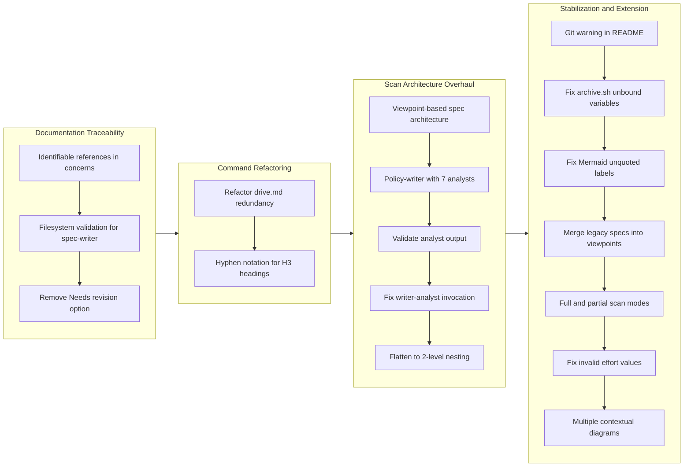

## 1. Overview

This branch delivered 17 tickets across a broad spectrum of improvements: documentation traceability, drive workflow enforcement, a complete overhaul of the /scan command architecture from fragile 3-level nesting to a flat 2-level design with 17 parallel analyst subagents, shell script hardening, Mermaid rendering fixes, legacy spec migration, dual-mode scanning (full and partial), effort validation fixes, and contextual diagram improvements. The branch transformed the scan subsystem from an ad-hoc 3-spec approach into a systematic viewpoint-based (8 viewpoints) and policy-based (7 domains) documentation generation pipeline.

**Highlights:**

1. Overhauled the /scan architecture from 3-level nesting (scanner -> writers -> analysts) to 2-level (scanner -> 17 parallel analysts), after discovering that 3-level Task nesting is inherently unreliable in Claude Code
2. Introduced full-scan and partial-scan modes with a new /story command that runs a targeted documentation refresh before generating the branch story and PR
3. Fixed the root cause of recurring invalid effort values by adding script-level validation to update.sh, closing the gap where sed-based writes bypassed the validation hook

## 2. Motivation

The branch addressed five categories of accumulated friction. First, documentation lacked verifiable references -- concerns in tickets and stories were prose descriptions without actionable audit trails. Second, the drive workflow's "Needs revision" option short-circuited the established ticket-update-first pattern, allowing code changes without updating the implementation plan. Third, the /scan command's ad-hoc 3-spec approach provided no systematic coverage guarantees, and the subsequent attempt to build viewpoint-based and policy-based parallel generation revealed that Claude Code's Task tool does not reliably execute at 3 levels of nesting. Fourth, legacy spec documents coexisted with new viewpoint files, creating confusion about which were authoritative. Fifth, the effort field continued to receive invalid t-shirt-size values because the update script bypassed the validation hook entirely. These compounding issues drove a series of incremental improvements that culminated in significant architectural and workflow changes.

## 3. Journey

The branch began with documentation quality improvements -- adding traceability references to concerns sections and filesystem validation to the spec-writer. A refactoring phase trimmed the drive command and standardized heading notation. The most significant arc was the scan architecture overhaul: the developer built viewpoint-based spec generation and policy-writer orchestration, discovered that 3-level Task nesting failed to invoke child analysts, attempted a prompt-engineering fix, and ultimately flattened the architecture to 2 levels with 15 dedicated per-analyst agents. The stabilization phase addressed shell script robustness, Mermaid rendering, legacy spec migration, dual-mode scanning, effort validation, and diagram quality -- converting two earlier ideas (partial scan, legacy migration) from the previous story into completed work.

## 4. Changes

### 4-1. Improve Concerns Section with Identifiable References ([bbcdfa6](https://github.com/qmu/workaholic/commit/bbcdfa6))

- `plugins/core/skills/create-ticket/SKILL.md` - Added structured Considerations format with file path references and guidelines
- `plugins/core/skills/write-story/SKILL.md` - Added format, example, and guidelines for Section 7 (Concerns) with commit hash and file path references
- `plugins/core/skills/review-sections/SKILL.md` - Added instructions to extract commit_hash and file paths when generating Concerns
- `plugins/core/agents/section-reviewer.md` - Added extraction steps for commit_hash and file paths from ticket analysis

### 4-2. Add Filesystem Validation to Spec-Writer ([d7c224d](https://github.com/qmu/workaholic/commit/d7c224d))

- `plugins/core/skills/write-spec/sh/gather.sh` - Added ACTUAL STRUCTURE section listing files in agents/, commands/, rules/, and skills/ directories
- `plugins/core/skills/write-spec/SKILL.md` - Documented the new output section and added usage guidance for detecting stale documentation
- `plugins/core/agents/spec-writer.md` - Added step 3 "Validate Structure" comparing actual vs documented structure

### 4-3. Remove "Needs revision" Option and Enforce Ticket-Update-First Rule ([971ab9a](https://github.com/qmu/workaholic/commit/971ab9a))

- `plugins/core/skills/drive-approval/SKILL.md` - Removed "Needs revision" option, renamed Section 3 to "Handle Feedback", added ticket-update-first enforcement with "Ticket updates" field in Discussion
- `plugins/core/commands/drive.md` - Changed handling to free-form feedback via "Other" option with explicit FIRST/THEN ordering

### 4-4. Refactor drive.md to Reduce Redundancy Against Preloaded Skills ([570fb0e](https://github.com/qmu/workaholic/commit/570fb0e))

- `plugins/core/commands/drive.md` - Reduced from 178 to ~80-100 lines by removing restated skill content, consolidating Approve/Approve-and-stop paths, removing duplicated Git Safety section

### 4-5. Change H3 Heading Numbering from Dot to Hyphen Notation ([37b1f98](https://github.com/qmu/workaholic/commit/37b1f98))

- `plugins/core/rules/general.md` - Updated h3 example from `### 1.1. Subsection` to `### 1-1. Subsection`
- `plugins/core/skills/write-story/SKILL.md` - Updated 8 h3 heading patterns from dot notation to hyphen notation (sections 4, 9, 10) and format guideline

### 4-6. Implement Viewpoint-Based Spec Architecture ([5b2b024](https://github.com/qmu/workaholic/commit/5b2b024))

- `plugins/core/skills/analyze-viewpoint/SKILL.md` - New comprehensive skill with output template, assumption rules, comprehensiveness policy, inference guidelines
- `plugins/core/skills/analyze-viewpoint/sh/gather.sh` - New context gathering script with viewpoint-specific file listings
- `plugins/core/skills/analyze-viewpoint/sh/read-overrides.sh` - New script to read CLAUDE.md for viewpoint override directives
- `plugins/core/agents/architecture-analyst.md` - New thin subagent receiving viewpoint definition from caller
- `plugins/core/agents/spec-writer.md` - Rewritten from 7-step sequential process to orchestrator with 8 parallel architecture-analyst dispatch
- `plugins/core/skills/write-spec/SKILL.md` - Updated directory structure and file naming for 8-viewpoint convention

### 4-7. Add Policy-Writer Subagent with 7 Concurrent Policy-Analysts ([82ffc1b](https://github.com/qmu/workaholic/commit/82ffc1b))

- `plugins/core/skills/analyze-policy/SKILL.md` - New generic framework for policy analysis
- `plugins/core/skills/analyze-policy/sh/gather.sh` - New context gathering with policy-domain-specific file scanning
- `plugins/core/agents/policy-analyst.md` - New thin subagent receiving policy definition from caller
- `plugins/core/agents/policy-writer.md` - New orchestrator with 7 policy domain definitions
- `plugins/core/agents/scanner.md` - Updated from 3 to 4 parallel agents
- `plugins/core/commands/scan.md` - Added `.workaholic/policies/` to git add
- `.workaholic/policies/README.md` - New English index
- `.workaholic/policies/README_ja.md` - New Japanese index
- `.workaholic/README.md` - Added policies link
- `.workaholic/README_ja.md` - Added policies link

### 4-8. Validate Analyst Output Before README Index Update ([d5001a0](https://github.com/qmu/workaholic/commit/d5001a0))

- `plugins/core/skills/validate-writer-output/SKILL.md` - New validation skill documentation
- `plugins/core/skills/validate-writer-output/sh/validate.sh` - New script checking file existence and non-emptiness
- `plugins/core/agents/spec-writer.md` - Added validation gate between analyst invocation and README update
- `plugins/core/agents/policy-writer.md` - Added same validation gate
- `.workaholic/specs/README.md` - Fixed broken links to non-existent files
- `.workaholic/policies/README.md` - Fixed broken links to non-existent files

### 4-9. Add Git Manipulation Warning to Root README ([f10f2e4](https://github.com/qmu/workaholic/commit/f10f2e4))

- `README.md` - Added `[!WARNING]` alert block disclosing autonomous git operations

### 4-10. Fix spec-writer and policy-writer to Actually Invoke Analyst Subagents ([093bfe3](https://github.com/qmu/workaholic/commit/093bfe3))

- `plugins/core/agents/spec-writer.md` - Restructured from flat numbered steps to Phase-based headings with explicit analyst invocation bullets
- `plugins/core/agents/policy-writer.md` - Same Phase-based restructuring with explicit bullet lists for each analyst

### 4-11. Fix archive.sh Unbound Variable Errors ([650d419](https://github.com/qmu/workaholic/commit/650d419))

- `plugins/core/skills/archive-ticket/sh/archive.sh` - Changed `$1`/`$2`/`$3` to `${1:-}`/`${2:-}`/`${3:-}`, added `REPO_URL` to usage guard
- `plugins/core/skills/update-ticket-frontmatter/sh/update.sh` - Same `${N:-}` fix
- `plugins/core/skills/create-pr/sh/create-or-update.sh` - Same fix
- `plugins/core/skills/write-release-note/sh/generate.sh` - Same fix
- `plugins/core/skills/validate-writer-output/sh/validate.sh` - Same fix

### 4-12. Flatten Scan Writer Nesting to 2-Level Architecture ([12d9509](https://github.com/qmu/workaholic/commit/12d9509))

- `plugins/core/agents/stakeholder-analyst.md` - New dedicated viewpoint analyst
- `plugins/core/agents/model-analyst.md` - New dedicated viewpoint analyst
- `plugins/core/agents/usecase-analyst.md` - New dedicated viewpoint analyst
- `plugins/core/agents/infrastructure-analyst.md` - New dedicated viewpoint analyst
- `plugins/core/agents/application-analyst.md` - New dedicated viewpoint analyst
- `plugins/core/agents/component-analyst.md` - New dedicated viewpoint analyst
- `plugins/core/agents/data-analyst.md` - New dedicated viewpoint analyst
- `plugins/core/agents/feature-analyst.md` - New dedicated viewpoint analyst
- `plugins/core/agents/test-policy-analyst.md` - New dedicated policy analyst
- `plugins/core/agents/security-policy-analyst.md` - New dedicated policy analyst
- `plugins/core/agents/quality-policy-analyst.md` - New dedicated policy analyst
- `plugins/core/agents/accessibility-policy-analyst.md` - New dedicated policy analyst
- `plugins/core/agents/observability-policy-analyst.md` - New dedicated policy analyst
- `plugins/core/agents/delivery-policy-analyst.md` - New dedicated policy analyst
- `plugins/core/agents/recovery-policy-analyst.md` - New dedicated policy analyst
- `plugins/core/agents/scanner.md` - Rewritten from 4-agent to 17-agent orchestrator with validation and index phases
- `plugins/core/agents/spec-writer.md` - Deleted (replaced by per-viewpoint agents)
- `plugins/core/agents/policy-writer.md` - Deleted (replaced by per-policy agents)
- `plugins/core/agents/architecture-analyst.md` - Deleted (replaced by per-viewpoint agents)
- `plugins/core/agents/policy-analyst.md` - Deleted (replaced by per-policy agents)

### 4-13. Merge Legacy Specs into Viewpoint-Based Documents ([cdf2332](https://github.com/qmu/workaholic/commit/cdf2332))

- `.workaholic/specs/architecture.md` - Deleted (content absorbed into viewpoint specs)
- `.workaholic/specs/architecture_ja.md` - Deleted
- `.workaholic/specs/command-flows.md` - Deleted (content absorbed into viewpoint specs)
- `.workaholic/specs/command-flows_ja.md` - Deleted
- `.workaholic/specs/contributing.md` - Deleted (content absorbed into viewpoint specs)
- `.workaholic/specs/contributing_ja.md` - Deleted
- `.workaholic/specs/application.md` - Replaced text flows with Mermaid diagrams for 5 commands
- `.workaholic/specs/application_ja.md` - Same Mermaid diagram migration
- `.workaholic/specs/component.md` - Added /story to hierarchy diagram
- `.workaholic/specs/component_ja.md` - Same addition
- `.workaholic/specs/usecase.md` - Added /story use case, updated workflow and I/O table
- `.workaholic/specs/usecase_ja.md` - Same updates
- `.workaholic/specs/infrastructure.md` - Removed "(+ legacy)" annotation
- `.workaholic/specs/README.md` - Removed "Legacy Documents" section
- `.workaholic/specs/README_ja.md` - Removed "Legacy Documents" section
- `plugins/core/skills/write-spec/SKILL.md` - Updated architecture.md reference

### 4-14. Fix Mermaid Unquoted Node Labels in Spec Files ([365b030](https://github.com/qmu/workaholic/commit/365b030))

- `.workaholic/specs/model.md` - Quoted 3 node labels containing `/`
- `.workaholic/specs/model_ja.md` - Same fixes
- `.workaholic/specs/component.md` - Quoted 4 node labels containing `/`
- `.workaholic/specs/component_ja.md` - Same fixes
- `.workaholic/specs/data_ja.md` - Quoted labels with `/` and special characters
- `plugins/core/skills/analyze-viewpoint/SKILL.md` - Added "Mermaid Node Label Quoting (REQUIRED)" section to prevent recurrence

### 4-15. Implement Full-Scan and Partial-Scan Modes ([6b86f7d](https://github.com/qmu/workaholic/commit/6b86f7d))

- `plugins/core/skills/select-scan-agents/SKILL.md` - New skill documenting agent selection logic for partial scans
- `plugins/core/skills/select-scan-agents/sh/select.sh` - New shell script analyzing `git diff --stat` to select relevant agents
- `plugins/core/commands/story.md` - New /story command: partial scan, commit docs, story-writer, PR
- `plugins/core/agents/scanner.md` - Added `select-scan-agents` skill, 6-phase flow with mode-aware agent selection
- `plugins/core/commands/scan.md` - Passes `mode: full` to scanner, updated description
- `CLAUDE.md` - Added /story to commands table, updated workflow
- `plugins/core/README.md` - Added /story to commands table, updated workflow
- `README.md` - Added /story to commands table, updated example session

### 4-16. Fix Root Cause of Invalid Effort Values During Drive Approval ([ae47bf6](https://github.com/qmu/workaholic/commit/ae47bf6))

- `plugins/core/skills/update-ticket-frontmatter/sh/update.sh` - Added effort validation gate with case statement rejecting non-standard values
- `plugins/core/skills/write-final-report/SKILL.md` - Replaced indirect skill reference with inline valid values and "estimate then map" instruction
- `plugins/core/agents/drive-navigator.md` - Removed misleading effort field reference and "quick wins" prioritization factor
- `plugins/core/skills/drive-approval/SKILL.md` - Added explicit valid values at the approval decision point

### 4-17. Replace Single Generic Diagram Section with Multiple Contextual Diagrams ([6e85bc2](https://github.com/qmu/workaholic/commit/6e85bc2))

- `plugins/core/skills/analyze-viewpoint/SKILL.md` - Replaced single "## Diagram" section with inline diagram placement guidance
- `plugins/core/agents/stakeholder-analyst.md` - Changed to suggested diagram types (plural) with inline placement
- `plugins/core/agents/model-analyst.md` - Same diagram guidance update
- `plugins/core/agents/usecase-analyst.md` - Same diagram guidance update
- `plugins/core/agents/infrastructure-analyst.md` - Same diagram guidance update
- `plugins/core/agents/application-analyst.md` - Same diagram guidance update
- `plugins/core/agents/component-analyst.md` - Same diagram guidance update
- `plugins/core/agents/data-analyst.md` - Same diagram guidance update
- `plugins/core/agents/feature-analyst.md` - Same diagram guidance update
- `plugins/core/skills/write-spec/SKILL.md` - Reinforced inline diagram placement policy in content style section

## 5. Outcome

The branch delivered 17 tickets across five concern areas. Documentation traceability was improved through structured concern references with commit hashes and file paths. The drive workflow was tightened by removing the "Needs revision" bypass and enforcing ticket-update-first feedback handling, while the command file itself was halved in size through redundancy elimination. The /scan command underwent a full architectural evolution: from ad-hoc 3-spec generation, through viewpoint-based and policy-based parallel orchestration with validation gates, to a final flat 2-level design with 15 dedicated self-contained analyst agents and a clean 17-agent scanner orchestrator. Legacy spec documents were absorbed into the viewpoint-based architecture, eliminating the dual-source confusion. A new /story command was introduced alongside dual-mode scanning (full and partial), reducing documentation refresh time for routine PR workflows. The root cause of recurring invalid effort values was fixed by adding script-level validation. Finally, the spec diagram framework was improved to produce multiple contextual diagrams inline within content sections rather than a single generic diagram in a separate section.

## 6. Historical Analysis

The scan architecture overhaul represents the third major iteration of documentation generation. The original monolithic sync command (20260123135431) was replaced by ticket-based change detection, then by 3 parallel writers (20260203122448), and now by 17 parallel analysts with per-viewpoint/policy specialization. Each iteration added concurrency but also nesting depth; this branch's flattening to 2 levels resolves the nesting fragility that the story-writer fix (20260131192343) first identified.

The "Needs revision" removal reverses an addition from 20260202140645, where a Discussion section was introduced for revision tracking. The developer recognized that the original ticket-update-first pattern (20260122150455) was more robust than the interactive revision dialog.

The Mermaid quoting fix is the fourth occurrence of this exact bug class (previous: 20260129024255, 20260131150915, 20260131195630). This time, the developer addressed the systemic cause by embedding the quoting rule into the analyze-viewpoint skill, breaking the recurrence cycle.

The unbound variable fix follows the `${N:-}` convention established by the commit skill extraction (20260204180858), extending it to 5 additional scripts that predated that convention.

The effort validation fix addresses a recurring issue first attempted in 20260203174022, which added warnings to the write-final-report skill without effect. The root cause was that `update.sh` used `sed` to modify files, bypassing the `validate-ticket.sh` hook entirely. Adding validation directly to the script closed this gap.

The legacy spec migration fulfills a consideration noted in the viewpoint architecture ticket (20260207023921), where the developer explicitly deferred migration to a subsequent ticket.

## 7. Concerns

- The 17-agent parallel invocation from scanner is the highest parallelism attempted in this codebase; runtime behavior at this scale has not been verified (see [12d9509](https://github.com/qmu/workaholic/commit/12d9509) in `plugins/core/agents/scanner.md`)
- The Phase-based restructuring of writer agents was never verified at runtime before the writers were deleted in the flattening commit (see [093bfe3](https://github.com/qmu/workaholic/commit/093bfe3) in `plugins/core/agents/spec-writer.md`)
- The shell script principle prohibits complex inline commands, but the gather.sh scripts for viewpoint and policy analysis contain pipes and text processing (see [5b2b024](https://github.com/qmu/workaholic/commit/5b2b024) in `plugins/core/skills/analyze-viewpoint/sh/gather.sh`)
- The `read-overrides.sh` script reads arbitrary CLAUDE.md content from target repositories, which may contain unexpected directives (see [5b2b024](https://github.com/qmu/workaholic/commit/5b2b024) in `plugins/core/skills/analyze-viewpoint/sh/read-overrides.sh`)
- The partial-scan agent selection mapping is heuristic and may miss cross-cutting changes that affect viewpoints not triggered by the diff path rules (see [6b86f7d](https://github.com/qmu/workaholic/commit/6b86f7d) in `plugins/core/skills/select-scan-agents/sh/select.sh`)
- The effort validation uses a hardcoded allowlist in `update.sh`; if new effort values are added, both the script and the hook must be updated in sync (see [ae47bf6](https://github.com/qmu/workaholic/commit/ae47bf6) in `plugins/core/skills/update-ticket-frontmatter/sh/update.sh`)

## 8. Ideas

- Implement partial success handling for the 17-agent scanner: update READMEs with links only to successfully generated files rather than requiring all-or-nothing
- Consider extracting common patterns from the 15 per-analyst agent files into a template generator to reduce maintenance burden
- Add automated Mermaid syntax validation as a pre-commit check to catch quoting issues before they reach GitHub
- Centralize the effort valid-value allowlist into a single source (e.g., a shared constants file or skill) referenced by both `update.sh` and `validate-ticket.sh`
- Add a dry-run mode to partial-scan that shows which agents would be selected without actually invoking them

## 9. Performance

**Metrics**: 40 commits over 46 hours (0.87 commits/hour)

### 9-1. Pace Analysis

Development spanned three calendar days with concentrated work sessions. The 40 commits across 17 tickets yields an average of 2.35 commits per ticket, consistent with the project's ticket-then-implement pattern (each ticket produces one ticket-creation commit and one implementation commit, with occasional documentation commits). The scan architecture arc (tickets 6-12) consumed the most effort, with a rapid iteration cycle of build-discover-fix-rebuild that compressed 7 tickets into a single architectural trajectory. The stabilization phase (tickets 13-17) maintained steady velocity, converting earlier ideas into completed work. Early tickets (concerns traceability, filesystem validation) were lighter at 0.1h estimated effort, while the viewpoint architecture, policy writer, nesting flatten, and full/partial scan modes were the heaviest at 1h each.

### 9-2. Decision Review

| Dimension      | Rating                | Notes |
| -------------- | --------------------- | ----- |
| Consistency    | Strong                | All changes followed established patterns; shell script fixes used existing `${N:-}` convention; new agents followed existing thin-subagent template |
| Intuitivity    | Strong                | Architectural progression from 3-level to 2-level nesting is a natural simplification; dual-mode scan is a logical extension |
| Describability | Adequate              | The scan architecture went through 4 intermediate states before settling; intermediate commits exist for superseded designs |
| Agility        | Strong                | Quickly pivoted from prompt-engineering fix to architectural flattening when the first approach proved insufficient; converted ideas to implementations efficiently |
| Density        | Strong                | Created 15 new agent files, 4 new skills, fixed 5 shell scripts, overhauled scanner orchestration, introduced dual-mode scanning, migrated legacy specs |

**Strengths**: The developer demonstrated strong diagnostic reasoning when the 3-level nesting failed. Rather than continuing to iterate on prompt engineering, the decision to flatten the architecture addressed the root cause. The effort validation fix similarly targeted the root cause (script bypassing hook) rather than adding more documentation warnings. The Mermaid fix finally addressed systemic recurrence by embedding the quoting rule where analyst subagents actually read it.

**Areas for Improvement**: The viewpoint-based spec-writer and policy-writer were built as 3-level orchestrators before the nesting limitation was known, resulting in intermediate commits that were superseded by the flattening. Earlier recognition of the nesting constraint (from the story-writer precedent) could have avoided this rework. Additionally, the effort validation gap between hook and script persisted across multiple branches despite the issue being observable.

## 10. Release Preparation

**Verdict**: Ready for release

### 10-1. Concerns

- The 17-agent parallel scanner has not been tested at runtime with a full /scan execution
- The partial-scan heuristic agent selection should be validated against diverse branch change patterns

### 10-2. Pre-release Instructions

- Run `/scan` once to verify the flattened 2-level architecture produces viewpoint and policy files correctly
- Run `/story` on a test branch to verify partial-scan agent selection works as expected

### 10-3. Post-release Instructions

- Monitor the first post-release `/scan` execution for any analyst invocation failures
- Monitor the first post-release `/story` execution for partial-scan agent selection accuracy

## 11. Notes

This branch contains 17 completed tickets and 40 commits. The scan architecture overhaul (tickets 6-12) represents the most significant structural change, replacing 4 orchestrator agents with 15 dedicated per-analyst agents and a single flat scanner. The stabilization phase (tickets 13-17) converted forward-looking ideas from the earlier story into completed work, including legacy spec migration, dual-mode scanning, effort validation, and diagram improvements. The /report command is preserved as a scan-less alias for cases where the user has already run /scan manually.
