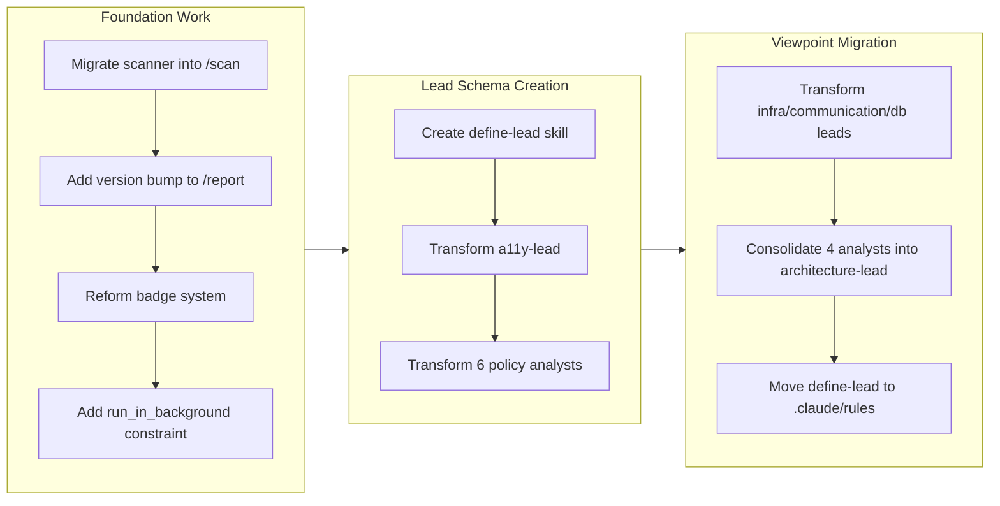

## 1. Overview

This branch executed a comprehensive architectural transformation of the Workaholic plugin system, migrating all 10 analyst subagents (7 policy analysts and 3 viewpoint analysts) to a lead-based architecture using a newly created `define-lead` skill schema, while also consolidating 4 viewpoint analysts into a single `architecture-lead` agent. Alongside the lead migration, the branch delivered foundational improvements including scanner-to-command migration for real-time progress visibility, automatic version bumping in the `/report` command, and policy badge system reform.

**Highlights:**

1. Created the `define-lead` skill schema and systematically transformed all 10 analyst agents into domain-specific leads (a11y-lead, test-lead, security-lead, quality-lead, observability-lead, delivery-lead, recovery-lead, infra-lead, communication-lead, db-lead), then consolidated 4 viewpoint analysts into a single architecture-lead -- reducing the agent count from 17 to 14
2. Migrated scanner subagent orchestration directly into the `/scan` command, enabling real-time per-agent progress visibility instead of hiding 17 parallel invocations behind a single Task call
3. Strengthened policy documentation integrity by removing the badge system that conflated documented conventions with code-enforced rules, and added automatic patch version bumping to the `/report` command to ensure every PR merge triggers a release

## 2. Motivation

The project had accumulated 17 individual analyst subagents that each followed a slightly different structure, making it difficult to enforce consistency or extend the system. The developer recognized that codifying a schema for "Leading Agents" would allow each domain expert to be defined with a uniform contract of Role, Responsibility, Goal, and Default Policies. This uniformity not only simplified the mental model but also enabled the consolidation of four closely-related viewpoint analysts into a single architecture-lead, reducing the scan invocation surface from 17 to 14 agents. Simultaneously, the scanner subagent's intermediary role was obscuring real-time scan progress from users, and the badge system in policy documents was producing misleading labels. These architectural debts motivated a focused branch of systematic refactoring.

## 3. Journey

The work began with foundational improvements: inlining scanner orchestration into the `/scan` command for transparency, adding automatic version bumping, and reforming the policy badge system. The developer then created the `define-lead` skill as a schema template and proved the pattern by converting the accessibility-policy-analyst to `a11y-lead`. With the pattern validated, the remaining six policy analysts were transformed in rapid succession. The work then expanded to viewpoint analysts, converting three to individual leads before consolidating the final four into a single `architecture-lead`. The branch concluded by moving the define-lead schema into `.claude/rules/` for automatic path-scoped enforcement.

## 4. Changes

### 4-1. Migrate Scanner Subagent into the Scan Command ([a8e0f4d](https://github.com/qmu/workaholic/commit/a8e0f4d))

- `plugins/core/commands/scan.md` - Expanded from thin delegator to full 7-phase orchestration with direct parallel agent invocation
- `plugins/core/commands/story.md` - Removed entirely (deprecated)
- `plugins/core/agents/scanner.md` - Deleted scanner subagent
- `CLAUDE.md` - Updated command table to remove /story references
- `plugins/core/README.md` - Updated command documentation
- `README.md` - Updated workflow references

### 4-2. Add Automatic Version Bump to /report Command ([6a35e98](https://github.com/qmu/workaholic/commit/6a35e98))

- `plugins/core/commands/report.md` - Added patch-increment version bump step before story-writer invocation

### 4-3. Enforce Explicit/Inferred Badge Definitions ([88b69c0](https://github.com/qmu/workaholic/commit/88b69c0))

- `plugins/core/skills/analyze-policy/SKILL.md` - Rewrote Inference Guidelines to remove badge system; policies now only document implemented and executable practices
- `plugins/core/agents/test-policy-analyst.md` - Updated badge reference instructions
- `plugins/core/agents/security-policy-analyst.md` - Updated badge reference instructions
- `plugins/core/agents/quality-policy-analyst.md` - Updated badge reference instructions
- `plugins/core/agents/accessibility-policy-analyst.md` - Updated badge reference instructions
- `plugins/core/agents/observability-policy-analyst.md` - Updated badge reference instructions
- `plugins/core/agents/delivery-policy-analyst.md` - Updated badge reference instructions
- `plugins/core/agents/recovery-policy-analyst.md` - Updated badge reference instructions

### 4-4. Add Explicit run_in_background: false to Scan Command ([d627919](https://github.com/qmu/workaholic/commit/d627919))

- `plugins/core/commands/scan.md` - Added explicit `run_in_background: false` constraint and CRITICAL warning for scan agent invocations

### 4-5. Create define-lead Skill ([d31ba29](https://github.com/qmu/workaholic/commit/d31ba29))

- `plugins/core/skills/define-lead/SKILL.md` - Created new skill with Schema Template, Guidelines, Validation Checklist, and Example sections

### 4-6. Transform Accessibility Policy Analyst to Lead Architecture ([998285d](https://github.com/qmu/workaholic/commit/998285d))

- `plugins/core/skills/lead-a11y/SKILL.md` - Created lead skill with Role, Responsibility, Goal, and Default Policies
- `plugins/core/agents/a11y-lead.md` - Created thin multi-purpose orchestrator replacing accessibility-policy-analyst
- `plugins/core/agents/accessibility-policy-analyst.md` - Deleted
- `plugins/core/commands/scan.md` - Updated agent reference
- `plugins/core/skills/select-scan-agents/sh/select.sh` - Updated ALL_AGENTS list
- `plugins/core/skills/define-lead/SKILL.md` - Added Agent Template section

### 4-7. Transform Test Policy Analyst to Lead Architecture ([8d11955](https://github.com/qmu/workaholic/commit/8d11955))

- `plugins/core/skills/lead-test/SKILL.md` - Created lead skill following define-lead schema
- `plugins/core/agents/test-lead.md` - Created thin orchestrator
- `plugins/core/agents/test-policy-analyst.md` - Deleted
- `plugins/core/commands/scan.md` - Updated agent reference
- `plugins/core/skills/select-scan-agents/sh/select.sh` - Updated ALL_AGENTS list

### 4-8. Transform Security Policy Analyst to Lead Architecture ([47b40f0](https://github.com/qmu/workaholic/commit/47b40f0))

- `plugins/core/skills/lead-security/SKILL.md` - Created lead skill following define-lead schema
- `plugins/core/agents/security-lead.md` - Created thin orchestrator
- `plugins/core/agents/security-policy-analyst.md` - Deleted
- `plugins/core/commands/scan.md` - Updated agent reference
- `plugins/core/skills/select-scan-agents/sh/select.sh` - Updated ALL_AGENTS list and partial scan mapping

### 4-9. Transform Quality Policy Analyst to Lead Architecture ([31b461c](https://github.com/qmu/workaholic/commit/31b461c))

- `plugins/core/skills/lead-quality/SKILL.md` - Created lead skill following define-lead schema
- `plugins/core/agents/quality-lead.md` - Created thin orchestrator
- `plugins/core/agents/quality-policy-analyst.md` - Deleted
- `plugins/core/commands/scan.md` - Updated agent reference
- `plugins/core/skills/select-scan-agents/sh/select.sh` - Updated ALL_AGENTS list and partial scan mapping

### 4-10. Transform Observability Policy Analyst to Lead Architecture ([bca19d3](https://github.com/qmu/workaholic/commit/bca19d3))

- `plugins/core/skills/lead-observability/SKILL.md` - Created lead skill following define-lead schema
- `plugins/core/agents/observability-lead.md` - Created thin orchestrator
- `plugins/core/agents/observability-policy-analyst.md` - Deleted
- `plugins/core/commands/scan.md` - Updated agent reference
- `plugins/core/skills/select-scan-agents/sh/select.sh` - Updated ALL_AGENTS list

### 4-11. Transform Delivery Policy Analyst to Lead Architecture ([ede7a07](https://github.com/qmu/workaholic/commit/ede7a07))

- `plugins/core/skills/lead-delivery/SKILL.md` - Created lead skill following define-lead schema
- `plugins/core/agents/delivery-lead.md` - Created thin orchestrator
- `plugins/core/agents/delivery-policy-analyst.md` - Deleted
- `plugins/core/commands/scan.md` - Updated agent reference
- `plugins/core/skills/select-scan-agents/sh/select.sh` - Updated ALL_AGENTS list and two partial scan mappings

### 4-12. Transform Recovery Policy Analyst to Lead Architecture ([630a29d](https://github.com/qmu/workaholic/commit/630a29d))

- `plugins/core/skills/lead-recovery/SKILL.md` - Created lead skill following define-lead schema
- `plugins/core/agents/recovery-lead.md` - Created thin orchestrator
- `plugins/core/agents/recovery-policy-analyst.md` - Deleted
- `plugins/core/commands/scan.md` - Updated agent reference
- `plugins/core/skills/select-scan-agents/sh/select.sh` - Updated ALL_AGENTS list

### 4-13. Transform Infrastructure Analyst to Infra-Lead Architecture ([5be188d](https://github.com/qmu/workaholic/commit/5be188d))

- `plugins/core/skills/lead-infra/SKILL.md` - Created lead skill adapted for viewpoint analysis (analyze-viewpoint instead of analyze-policy)
- `plugins/core/agents/infra-lead.md` - Created thin orchestrator with viewpoint-specific skills
- `plugins/core/agents/infrastructure-analyst.md` - Deleted
- `plugins/core/commands/scan.md` - Updated agent reference
- `plugins/core/skills/select-scan-agents/sh/select.sh` - Updated ALL_AGENTS list and partial scan mapping

### 4-14. Transform Stakeholder Analyst to Communication-Lead Architecture ([82db93d](https://github.com/qmu/workaholic/commit/82db93d))

- `plugins/core/skills/lead-communication/SKILL.md` - Created lead skill for stakeholder viewpoint
- `plugins/core/agents/communication-lead.md` - Created thin orchestrator
- `plugins/core/agents/stakeholder-analyst.md` - Deleted
- `plugins/core/commands/scan.md` - Updated agent reference
- `plugins/core/skills/select-scan-agents/sh/select.sh` - Updated ALL_AGENTS list and partial scan mapping

### 4-15. Transform Data Analyst to DB-Lead Architecture ([15e4505](https://github.com/qmu/workaholic/commit/15e4505))

- `plugins/core/skills/lead-db/SKILL.md` - Created lead skill for data/persistency viewpoint
- `plugins/core/agents/db-lead.md` - Created thin orchestrator
- `plugins/core/agents/data-analyst.md` - Deleted
- `plugins/core/commands/scan.md` - Updated agent reference
- `plugins/core/skills/select-scan-agents/sh/select.sh` - Updated ALL_AGENTS list and partial scan mapping

### 4-16. Consolidate Four Viewpoint Analysts into Architecture Lead ([8e955b8](https://github.com/qmu/workaholic/commit/8e955b8))

- `plugins/core/skills/lead-architecture/SKILL.md` - Created comprehensive lead skill encoding four viewpoint definitions (application, component, feature, usecase)
- `plugins/core/agents/architecture-lead.md` - Created thin orchestrator owning all four viewpoints
- `plugins/core/agents/application-analyst.md` - Deleted
- `plugins/core/agents/component-analyst.md` - Deleted
- `plugins/core/agents/feature-analyst.md` - Deleted
- `plugins/core/agents/usecase-analyst.md` - Deleted
- `plugins/core/commands/scan.md` - Updated agent count from 17 to 14, collapsed four table rows into one
- `plugins/core/skills/select-scan-agents/sh/select.sh` - Updated ALL_AGENTS list and all partial scan case mappings
- `plugins/core/skills/select-scan-agents/SKILL.md` - Updated agent counts, category labels, and mapping table

### 4-17. Move define-lead Skill to .claude/rules/ ([2a89029](https://github.com/qmu/workaholic/commit/2a89029))

- `.claude/rules/define-lead.md` - Created path-scoped rule targeting lead skill and agent files
- `plugins/core/skills/define-lead/` - Deleted entire directory
- `plugins/core/skills/lead-a11y/SKILL.md` - Removed `skills: [define-lead]` dependency
- `plugins/core/skills/lead-architecture/SKILL.md` - Removed `skills: [define-lead]` dependency
- `plugins/core/skills/lead-communication/SKILL.md` - Removed `skills: [define-lead]` dependency
- `plugins/core/skills/lead-db/SKILL.md` - Removed `skills: [define-lead]` dependency
- `plugins/core/skills/lead-delivery/SKILL.md` - Removed `skills: [define-lead]` dependency
- `plugins/core/skills/lead-infra/SKILL.md` - Removed `skills: [define-lead]` dependency
- `plugins/core/skills/lead-observability/SKILL.md` - Removed `skills: [define-lead]` dependency
- `plugins/core/skills/lead-quality/SKILL.md` - Removed `skills: [define-lead]` dependency
- `plugins/core/skills/lead-recovery/SKILL.md` - Removed `skills: [define-lead]` dependency
- `plugins/core/skills/lead-security/SKILL.md` - Removed `skills: [define-lead]` dependency
- `plugins/core/skills/lead-test/SKILL.md` - Removed `skills: [define-lead]` dependency
- `CLAUDE.md` - Updated project structure to include `.claude/rules/`

## 5. Outcome

The branch delivered a fundamental architectural shift from ad-hoc analyst subagents to a schema-driven lead architecture. All 7 policy analysts and 3 viewpoint analysts were transformed into leads with consistent Role/Responsibility/Goal/Default Policies contracts. The 4 remaining viewpoint analysts (application, component, feature, usecase) were consolidated into a single architecture-lead, reducing the total agent count from 17 to 14. The define-lead schema was elevated from a plugin skill to a repository-scoped rule in `.claude/rules/`, ensuring automatic enforcement whenever lead files are edited. The scanner subagent was eliminated by inlining its orchestration into the `/scan` command, providing direct user visibility into per-agent progress. The `/report` command now automatically bumps the patch version, closing the gap where developers forgot to run `/release` before merging.

## 6. Historical Analysis

The lead architecture migration builds upon several prior architectural decisions. The scanner subagent migration (ticket 4-1) follows the same flattening pattern established in the `drive-20260205-195920` branch, where the scan architecture was restructured from 3-level to 2-level nesting with 17 parallel analysts. The version bump addition (ticket 4-2) has oscillated across multiple branches: it was first added in `drive-20260201-112920`, removed in `drive-20260202-134332` to avoid double increments, and now re-introduced in `/report` only. The badge system reform (ticket 4-3) corrects an issue present since the policy analyst infrastructure was created in `drive-20260205-195920`, where `[Explicit]` badges were applied too liberally to documentation-only conventions. The skill-extraction-and-consolidation pattern used for the lead schema follows the precedent set in `feat-20260128-001720` (skill consolidation) and `feat-20260131-125844` (skill modularization).

## 7. Concerns

- The architecture-lead agent must invoke `analyze-viewpoint/sh/gather.sh` four times (once per viewpoint slug) during a single documentation scan, which may increase execution time compared to four parallel analysts (see [8e955b8](https://github.com/qmu/workaholic/commit/8e955b8) in `plugins/core/skills/lead-architecture/SKILL.md`)
- The `.workaholic/specs/` files that reference old analyst names (e.g., `accessibility-policy-analyst`, `stakeholder-analyst`) will show stale references until the next `/scan` run regenerates them (see [998285d](https://github.com/qmu/workaholic/commit/998285d) in `plugins/core/agents/a11y-lead.md`)
- The define-lead rule in `.claude/rules/` only activates when editing lead files -- it does not prevent someone from creating a non-conforming agent file with a different naming pattern that bypasses the glob (see [2a89029](https://github.com/qmu/workaholic/commit/2a89029) in `.claude/rules/define-lead.md`)
- The `run_in_background: false` constraint is a documentation-level safeguard, not a runtime enforcement mechanism; its effectiveness depends on Claude Code respecting the instruction (see [d627919](https://github.com/qmu/workaholic/commit/d627919) in `plugins/core/commands/scan.md`)

## 8. Ideas

- Extend the lead architecture to the remaining 2 viewpoint analysts (`model-analyst`) that were not converted on this branch, completing the full migration
- Create a validation script in `.claude/rules/` or as a PostToolUse hook that checks lead skill files against the define-lead schema programmatically, rather than relying solely on LLM instruction-following
- Consider splitting the architecture-lead back into separate leads if the four-viewpoint sequential execution becomes a performance bottleneck compared to the previous parallel execution
- Add a `/validate-leads` command that checks all lead skill files against the define-lead schema and reports non-conformance

## 9. Performance

**Metrics**: 29 commits over 2.0 days (14.5 commits/day)

### 9-1. Pace Analysis

The branch maintained a high velocity of 14.5 commits per day across 2 days of development. The work was front-loaded with foundational changes (scanner migration, version bump, badge reform) on day one, followed by a highly systematic lead migration campaign on day two. The lead migrations exhibited a particularly efficient pattern: after the first conversion (a11y-lead) validated the approach, the remaining 6 policy analysts were converted in rapid succession with near-identical commits. The viewpoint analyst conversions then followed the same accelerating pattern. Commits were consistently small and focused -- each representing either a ticket creation or a single implementation step.

### 9-2. Decision Review

| Dimension      | Rating   | Notes |
| -------------- | -------- | ----- |
| Consistency    | Strong   | Every lead migration followed the identical 4-step pattern (create skill, replace agent, update scan.md, update select.sh) |
| Intuitivity    | Strong   | The progression from schema creation to first conversion to batch migration was natural and well-sequenced |
| Describability | Strong   | Each ticket clearly articulates what changed and why, with explicit file references and patches |
| Agility        | Strong   | The developer validated the lead pattern with a11y-lead before committing to the full migration, allowing course correction |
| Density        | Adequate | The 10 individual lead migrations could potentially have been batched, though the one-at-a-time approach provided safety |

**Strengths**: The schema-first approach (creating define-lead before any migration) established a clear contract that prevented drift during the batch migration. The progressive escalation from policy analysts to viewpoint analysts to consolidation demonstrated disciplined architectural thinking.

**Areas for Improvement**: The 10 individual lead migration commits could have been grouped more efficiently (e.g., all 7 policy analysts in a single commit) to reduce the commit count. The `model-analyst` was left unconverted, creating an inconsistency in the final state.

## 10. Release Preparation

**Verdict**: Ready for release

### 10-1. Concerns

- None -- changes are configuration/documentation only with no runtime code impact. The version has already been bumped to v1.0.34.

### 10-2. Pre-release Instructions

- None -- standard release process applies. The version bump to v1.0.34 is already committed.

### 10-3. Post-release Instructions

- Run `/scan` after merging to regenerate all `.workaholic/specs/` and `.workaholic/policies/` files with the new lead agent references.

## 11. Notes

This branch represents the largest single architectural refactoring in the project's history, touching 110 files with 10,695 insertions and 2,561 deletions. The lead architecture establishes a foundation for future agent definitions by codifying the Role/Responsibility/Goal/Default Policies schema as a repository-level rule. The `model-analyst` was intentionally left unconverted as it will be addressed in a follow-up branch.
