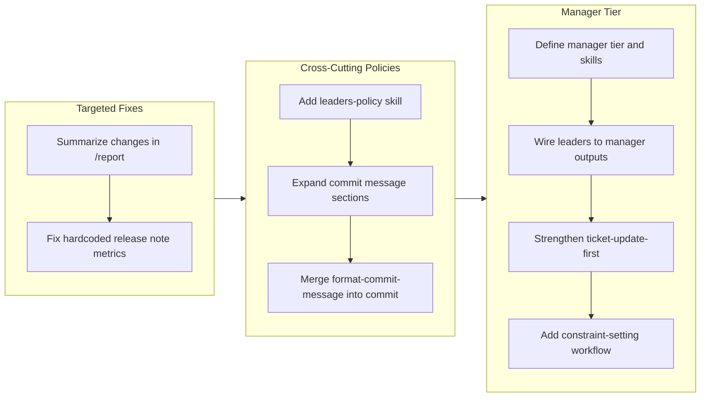

## 1. Overview

This branch introduced a management tier to the agent hierarchy, restructured commit message formatting for lead agent consumption, and hardened several workflow enforcement mechanisms. The work evolved from targeted fixes (report verbosity, hardcoded metrics) through cross-cutting policy infrastructure (leaders-policy) to a full manager-leader architectural split with constraint-setting capabilities.

**Highlights:**

1. Created a three-manager tier (project, architecture, quality) with a constraint-setting workflow that actively shapes project direction through deliberate boundaries
2. Restructured commit messages from 4 sections to 5 (Description, Changes, Test Planning, Release Preparation) to give downstream lead agents actionable signal for shipping decisions
3. Established cross-cutting behavioral policies (leaders-policy, managers-policy) enforcing Prior Term Consistency and Vendor Neutrality across all agent tiers

## 2. Motivation

The flat lead-agent architecture that emerged from the previous branch (drive-20260208-131649) handled domain-specific analysis well but lacked strategic coordination. Leaders independently derived business context, architectural boundaries, and quality standards -- leading to potential inconsistencies and duplicated reasoning. The commit message format, meanwhile, was oriented toward developer understanding (Motivation, UX Change, Arch Change) rather than the operational concerns that leads need to judge release readiness. This branch addressed both gaps: a management layer to provide strategic context top-down, and a richer commit format to carry operational signal bottom-up.

## 3. Journey

The work began with two quality-of-life fixes: reducing report verbosity by switching from per-file listings to per-ticket summaries, and eliminating hardcoded metrics in release notes. These exposed deeper structural needs -- commit messages lacked the sections leads needed, and leads lacked shared behavioral policies. The leaders-policy skill and expanded commit format addressed these gaps. The final phase introduced the manager tier as a strategic layer above leads, culminating in a constraint-setting workflow that transforms managers from passive observers into active direction-setters.

## 4. Changes

### 4-1. Summarize Changes in /report Instead of Listing Every File ([2e6e1c5](https://github.com/qmu/workaholic/commit/2e6e1c5))

Replaced the per-file bullet list format in the story's Section 4 with concise 1-3 sentence summaries per ticket. The previous format produced 140+ lines of file listings for large branches, overwhelming reviewers with detail that the clickable commit hash already provides.

### 4-2. Add leaders-policy Skill for Cross-Cutting Lead Policies ([416e52d](https://github.com/qmu/workaholic/commit/416e52d))

Created a new leaders-policy skill encoding Prior Term Consistency and Vendor Neutrality as shared behavioral policies for all 11 lead agents. Updated all lead agent files and the define-lead schema to preload this skill, establishing a growing policy registry for cross-cutting concerns.

### 4-3. Fix Release Note Hardcoded Metrics ([c28404b](https://github.com/qmu/workaholic/commit/c28404b))

Fixed the release-note-writer producing metrics matching hardcoded example values instead of extracting actual values from story frontmatter. Replaced concrete numeric examples with descriptive placeholders and added duration_days support for consistent duration formatting.

### 4-4. Expand Commit Message Sections for Lead Agent Consumption ([e74c470](https://github.com/qmu/workaholic/commit/e74c470))

Restructured the commit message format from 4 sections (Title, Motivation, UX Change, Arch Change) to 5 sections (Title, Description, Changes, Test Planning, Release Preparation). Each section now provides actionable signal for downstream lead agents evaluating shipping readiness.

### 4-5. Merge format-commit-message Skill into Commit Skill ([84bb4ce](https://github.com/qmu/workaholic/commit/84bb4ce))

Consolidated the standalone format-commit-message skill into the commit skill, eliminating dual-maintenance burden. Updated 8 files including drive-workflow, archive-ticket, delivery policies, and component specs. The commit skill is now the single authoritative source for message formatting.

### 4-6. Define Manager Tier and Create Three Manager Skills ([04b1e39](https://github.com/qmu/workaholic/commit/04b1e39))

Introduced a manager tier above the lead hierarchy with three manager skills (manage-project, manage-architecture, manage-quality), a define-manager schema rule, a managers-policy cross-cutting skill, and three thin agent orchestrators. Managers produce strategic outputs that leaders consume rather than derive independently.

### 4-7. Wire Leaders to Depend on Manager Outputs ([24c6f16](https://github.com/qmu/workaholic/commit/24c6f16))

Established two-phase scan execution (managers first, then leaders) and wired all leader skills to consume relevant manager outputs. Renamed lead-communication to lead-ux, removed architecture-lead (absorbed by architecture-manager), and updated the scan command and agent selection infrastructure for the new hierarchy.

### 4-8. Strengthen Ticket-Update-First Enforcement in Drive Feedback Flow ([b237279](https://github.com/qmu/workaholic/commit/b237279))

Upgraded the ticket-update-first rule from plain text to CRITICAL markers, moved it inside the feedback execution path (rather than trailing after all paths), and added a verification gate that forces a re-read of the ticket file before re-implementation begins.

### 4-9. Add Constraint-Setting Workflow to Manager Skills ([f7f779f](https://github.com/qmu/workaholic/commit/f7f779f))

Extended managers-policy with a four-phase constraint-setting workflow (Analyze, Ask, Propose, Produce) and updated all three manager skills and agents to incorporate it. Managers now actively shape project direction by establishing falsifiable constraints that narrow the decision space for leaders.

## 5. Outcome

The branch accomplished a significant architectural evolution: the agent hierarchy grew from a flat set of 11 leads to a two-tier system with 3 managers and 10 leads. The manager tier introduces strategic coordination that was previously absent -- managers set constraints and produce directional materials, while leaders consume these as bounded context for domain-specific work. The commit message restructuring ensures that each commit carries enough operational signal for leads to evaluate without reading full diffs. Supporting improvements (report summarization, metrics extraction, ticket-update enforcement) addressed friction points discovered during prior drive branches.

## 6. Historical Analysis

This branch continues a trajectory of agent hierarchy refinement. The previous branch (drive-20260208-131649) migrated flat analysts to domain-specific leads and established the define-lead schema. This branch builds on that foundation by adding a management layer above leads. The pattern of consolidating granular utilities into primary consumers (format-commit-message into commit) mirrors prior work in feat-20260128-001720 where 8 utility skills were merged. The ticket-update-first enforcement has been attempted in at least 3 prior tickets across different branches, suggesting this is a persistent challenge that may eventually require a structural solution beyond prompt engineering.

## 7. Concerns

- The constraint-setting workflow introduces user interaction (the "Ask" phase) into what was previously a non-interactive analysis pipeline; during /scan managers run as sub-agents that may not have direct user interaction capability (see [f7f779f](https://github.com/qmu/workaholic/commit/f7f779f) in `plugins/core/skills/managers-policy/SKILL.md`)
- Removing architecture-lead and renaming communication-lead to ux-lead changes the spec slug from "stakeholder" to "ux", which affects existing `.workaholic/specs/stakeholder.md` references (see [24c6f16](https://github.com/qmu/workaholic/commit/24c6f16) in `plugins/core/skills/lead-ux/SKILL.md`)
- The managers-policy duplicates Prior Term Consistency rules from leaders-policy rather than sharing a common source, creating dual-maintenance risk if policies diverge (see [04b1e39](https://github.com/qmu/workaholic/commit/04b1e39) in `plugins/core/skills/managers-policy/SKILL.md`)
- The ticket-update-first enforcement has been strengthened multiple times across branches; if CRITICAL markers prove insufficient, a structural approach (shell script gate checking ticket modification time) may be needed (see [b237279](https://github.com/qmu/workaholic/commit/b237279) in `plugins/core/skills/drive-approval/SKILL.md`)

## 8. Ideas

- Extract shared policies (Prior Term Consistency, Vendor Neutrality) into a base-policy skill that both managers-policy and leaders-policy reference, eliminating duplication
- Add a `/constrain` command that invokes managers in constraint-setting mode with full user interaction, separate from the non-interactive /scan flow
- Introduce constraint validation in leader Execution sections -- a "Check constraints" step that verifies leader outputs comply with manager-defined boundaries
- Create dedicated directories and write skills for new artifact types introduced by constraint-setting: `.workaholic/decisions/` for architecture decision records, `.workaholic/roadmaps/` for sequenced plans
- Consider a structural ticket-update gate (shell script checking file modification timestamps) as a fallback if prompt-based enforcement continues to be unreliable

## 9. Performance

**Metrics**: 20 commits over 2 days (12.5 commits/day)

### 9-1. Pace Analysis

Development proceeded in two distinct phases. The first day (Feb 10) produced 10 commits covering 5 tickets -- focused, incremental improvements to existing infrastructure (report format, policies, commit messages, skill consolidation). The second day (Feb 11) produced 10 commits covering 4 tickets but with substantially larger scope -- the manager tier introduction alone touched 19 files. Commit sizes varied from small targeted fixes (2 files) to large structural changes (19 files), reflecting the shift from refinement work to architectural expansion. The overnight gap between phases suggests a natural planning boundary.

### 9-2. Decision Review

| Dimension      | Rating   | Notes |
| -------------- | -------- | ----- |
| Consistency    | Strong   | Naming conventions (manage-/lead-, managers-policy/leaders-policy) maintained symmetry throughout |
| Intuitivity    | Strong   | The manager-above-leader hierarchy mirrors real organizational structures; constraint-setting as the manager's primary function is a clear mental model |
| Describability | Strong   | Each tier's responsibility is expressible in one sentence: managers set constraints, leaders enforce within them |
| Agility        | Adequate | The pivot from targeted fixes to architectural expansion was natural but the manager tier scope (3 tickets, 19+ files) could have been split further |
| Density        | Strong   | 9 tickets in 20 commits with no abandoned work; every commit advanced a ticket toward completion |

**Strengths**: The progression from small fixes to cross-cutting policies to architectural expansion followed a logical dependency chain. Each ticket built on the previous one's foundation. The constraint-setting workflow was a well-motivated culmination that gave the manager tier a concrete, actionable purpose beyond passive analysis.

**Areas for Improvement**: The manager tier introduction spanned 3 tightly coupled tickets (define, wire, constraint-setting) that could have been planned as a single epic with clearer intermediate milestones. The second ticket (wire leaders) was the largest at 2h effort and 19 files -- breaking it into "rename/remove agents" and "update scan pipeline" substeps would have reduced review burden.

## 10. Release Preparation

**Verdict**: Ready for release

### 10-1. Concerns

- The version was already bumped to v1.0.35 in commit a639337, so no additional version bump is needed
- The architecture-lead removal and communication-lead to ux-lead rename are breaking changes for any external consumers referencing those agent names by path

### 10-2. Pre-release Instructions

- Verify that the scan command correctly executes managers before leaders in two-phase mode
- Confirm that the renamed lead-ux agent and removed architecture-lead do not break any external references

### 10-3. Post-release Instructions

- None -- no special post-release actions needed

## 11. Notes

This branch marks a transition from the "lead migration" era (establishing domain-specific leads) to the "management era" (adding strategic coordination above leads). The constraint-setting workflow is conceptually significant -- it positions managers as active shapers of project direction rather than passive analysts, which changes the fundamental interaction model for the agent hierarchy.
