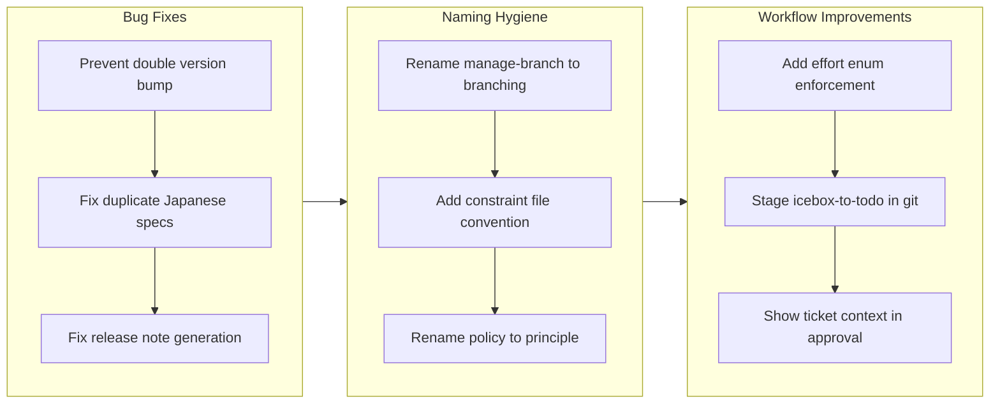

## 1. Overview

This branch delivered a focused round of naming hygiene, workflow reliability fixes, and developer experience improvements across the plugin system. The work resolved semantic collisions in skill naming conventions, hardened the drive workflow against recurring effort validation failures, and fixed gaps in release note generation and approval UX.

**Highlights:**

1. Renamed `manage-branch` to `branching` and `managers-policy`/`leaders-policy` to `managers-principle`/`leaders-principle` to resolve naming collisions with the manager tier
2. Fixed duplicate Japanese specs, double version bumps, and release note generation gaps that degraded output quality
3. Improved drive workflow with explicit effort validation enforcement, git-tracked ticket moves, and contextual approval prompts

## 2. Motivation

The previous branch (drive-20260210) introduced the manager tier with `manage-` prefixed skills, creating a naming collision with the existing `manage-branch` utility skill. Simultaneously, using "policy" for both cross-cutting behavioral rules and leader-generated output artifacts created semantic ambiguity that confused the agent hierarchy. These naming issues compounded with several workflow bugs -- double version bumps on repeated `/report` runs, duplicate Japanese translations for Japanese-primary projects, and missing context in drive approval prompts -- that had accumulated across recent iterations. This branch addressed the full set of naming and reliability issues in a single focused session to restore consistency and correctness before the next release.

## 3. Journey

The session began with two bugfixes targeting output correctness: preventing the version from incrementing multiple times when `/report` runs repeatedly, and eliminating duplicate Japanese spec files in Japanese-primary projects. Attention then shifted to naming hygiene, renaming `manage-branch` to `branching` to free the `manage-` prefix for manager-tier skills, introducing structured constraint files for managers, and renaming the behavioral policy skills to "principle" to distinguish them from leader-generated policy documents. The final phase addressed three workflow improvements that had been accumulating as known issues.

## 4. Changes

### 4-1. Prevent double version bump in /report ([d8a71f8](https://github.com/qmu/workaholic/commit/d8a71f8))

Created `check-version-bump.sh` to detect existing bump commits in the branch history and updated the `/report` command to skip the version bump when one already exists. This makes `/report` idempotent for version management.

### 4-2. Fix duplicate Japanese specs for Japanese-primary projects ([bad8efd](https://github.com/qmu/workaholic/commit/bad8efd))

Made the translation system language-aware by updating the translate skill, model-analyst agent, analyze-viewpoint skill, write-spec skill, and i18n rule to check the consumer project's primary language before producing translations. Japanese-primary projects no longer generate redundant `_ja.md` files.

### 4-3. Rename manage-branch skill to branching ([8f2d033](https://github.com/qmu/workaholic/commit/8f2d033))

Renamed the `manage-branch` utility skill to `branching` to resolve the naming collision with the manager tier's `manage-` prefix convention. Updated all references in ticket-organizer, report command, define-manager rule, and CLAUDE.md.

### 4-4. Add structured constraint file convention for managers ([324ea75](https://github.com/qmu/workaholic/commit/324ea75))

Introduced `.workaholic/constraints/` directory with a structured template for manager-generated constraint files. Updated all three manager skills to produce constraints to specific paths and added the directory to the scan commit step.

### 4-5. Rename managers-policy and leaders-policy to managers-principle and leaders-principle ([f385117](https://github.com/qmu/workaholic/commit/f385117))

Renamed both cross-cutting behavioral skills from "policy" to "principle" to eliminate semantic ambiguity with leader-generated `.workaholic/policies/` documents. Updated all 3 manager agents, 10 lead agents, both rule templates, 3 manage-* skills, and 4 term files.

### 4-6. Fix release note generation ([c3b1301](https://github.com/qmu/workaholic/commit/c3b1301))

Fixed three issues in release note output: added a descriptive H1 heading derived from the story title, restored the Changes section with Added/Changed/Removed categorization, and added the Velocity metric. Reordered Phase 4 from parallel to sequential so the PR URL is available to the release-note-writer.

### 4-7. Add explicit effort enum and update command to write-final-report ([a6dd86e](https://github.com/qmu/workaholic/commit/a6dd86e))

Added an explicit `update.sh` invocation command to the write-final-report skill with a prohibition against using the Edit tool for effort field modifications. This is the third fix for recurring effort validation failures, taking a structural enforcement approach rather than documentation-only guidance.

### 4-8. Stage icebox-to-todo ticket move in git ([9d3acc1](https://github.com/qmu/workaholic/commit/9d3acc1))

Added `git add` immediately after the `mv` command in drive-navigator's icebox mode so ticket moves are tracked in git from the moment they happen, preventing dangling unstaged deletions.

### 4-9. Show ticket context in drive approval prompt ([0784e5f](https://github.com/qmu/workaholic/commit/0784e5f))

Embedded the ticket title and overview directly into the AskUserQuestion `header` and `question` fields in the drive-approval skill, ensuring the developer sees what ticket is being reviewed regardless of whether the agent renders the freeform Format text.

## 5. Outcome

All nine tickets were completed in a single session spanning approximately 10 hours. The branch resolved two categories of issues: naming inconsistencies that had accumulated as the agent hierarchy evolved (manage-branch collision, policy/principle ambiguity), and workflow reliability gaps that degraded the developer experience (double version bumps, duplicate translations, missing approval context, effort validation failures). The constraint file convention and principle renaming established clearer semantic boundaries between the manager and leader tiers.

## 6. Historical Analysis

This branch continues the pattern of post-introduction cleanup seen after major architectural additions. The manager tier (drive-20260210) introduced naming conventions that collided with pre-existing skills, following the same trajectory as the lead tier migration (drive-20260208) which required subsequent bugfix branches. The effort validation issue (ticket 4-7) represents a third attempt at the same fix -- previous approaches in drive-20260203 and drive-20260205 added documentation-level guidance but did not enforce the script path structurally. The translation duplication fix (ticket 4-2) traces back to assumptions made during the original i18n system design (feat-20260123) where English was assumed as the primary language.

## 7. Concerns

- The relative `.claude/skills/` path used in skill documentation does not resolve at runtime; the actual installed path is the full absolute path under `~/.claude/plugins/` (see [a6dd86e](https://github.com/qmu/workaholic/commit/a6dd86e) in `plugins/core/skills/write-final-report/SKILL.md`)
- The effort validation fix is the third attempt at the same recurring issue; if agents continue bypassing `update.sh`, a hook-level enforcement may be needed (see [a6dd86e](https://github.com/qmu/workaholic/commit/a6dd86e) in `plugins/core/skills/write-final-report/SKILL.md`)
- Leaders that consume manager outputs still reference `.workaholic/policies/` rather than the new `.workaholic/constraints/` directory (see [324ea75](https://github.com/qmu/workaholic/commit/324ea75) in `plugins/core/skills/managers-principle/SKILL.md`)
- Spec documents under `.workaholic/specs/` contain stale references to `manage-branch`, `managers-policy`, and `leaders-policy` that will persist until the next `/scan` run (see [f385117](https://github.com/qmu/workaholic/commit/f385117))

## 8. Ideas

- Extract the PR title derivation logic (first highlight with "etc" suffix) into a shared skill to prevent divergence between create-pr and write-release-note
- Add a `--non-interactive` mode to the constraint-setting workflow for automated constraint generation from codebase evidence
- Consider hook-level enforcement for effort values if the third documentation-based fix proves insufficient
- Update leader Execution sections to read constraints from `.workaholic/constraints/` in addition to `.workaholic/policies/`

## 9. Performance

**Metrics**: 22 commits over 10.3 hours (2.1 commits/hour)

### 9-1. Pace Analysis

Development velocity was consistent at approximately 2.1 commits per hour across the 10-hour session. Commits were well-distributed: the first three hours (12:36-15:36) produced the initial bugfixes and ticket creation, the middle period (16:00-18:00) handled the naming renames which required touching many files simultaneously, and the final burst (18:30-22:52) completed the remaining four tickets. The higher file-touch count on the naming tickets (4-3 and 4-5 each modified 10+ files) was offset by their mechanical nature -- find-and-replace operations with minimal decision-making.

### 9-2. Decision Review

| Dimension      | Rating   | Notes                                                       |
| -------------- | -------- | ----------------------------------------------------------- |
| Consistency    | Strong   | All 9 tickets followed the same pattern: ticket, implement, archive |
| Intuitivity    | Strong   | Naming choices (branching, principle) are semantically clear |
| Describability | Strong   | Each ticket has a focused scope with clear before/after      |
| Agility        | Adequate | Sequential execution; no course corrections needed           |
| Density        | Strong   | 9 tickets in 22 commits shows minimal overhead               |

**Strengths**: The session maintained a clear thematic arc from bugfixes through naming hygiene to workflow improvements. Each ticket was self-contained with minimal cross-dependencies. The decision to rename to "branching" and "principle" was well-reasoned and resolved ambiguity without introducing new collisions.

**Areas for Improvement**: The effort validation fix (ticket 4-7) is a third attempt at the same problem, suggesting the documentation-based approach has reached its limits. Future iterations should consider structural enforcement at the hook level rather than additional skill-level guidance.

## 10. Release Preparation

**Verdict**: Ready for release

### 10-1. Concerns

- Spec documents contain stale references to renamed skills (`manage-branch`, `managers-policy`, `leaders-policy`). These are generated documentation and will be corrected on the next `/scan` run, so they do not block release.

### 10-2. Pre-release Instructions

- None -- standard release process applies. The version has already been bumped to v1.0.36 in this branch.

### 10-3. Post-release Instructions

- Run `/scan` on a consumer project to regenerate spec documents with updated skill references.

## 11. Notes

The `manage-branch` to `branching` rename settled on the final name after iterating through `branch-ops` and `branch` proposals during implementation. The ticket originally proposed `branch-ops` but the developer chose `branching` as the most natural gerund form. This kind of name refinement during implementation is expected and healthy.
