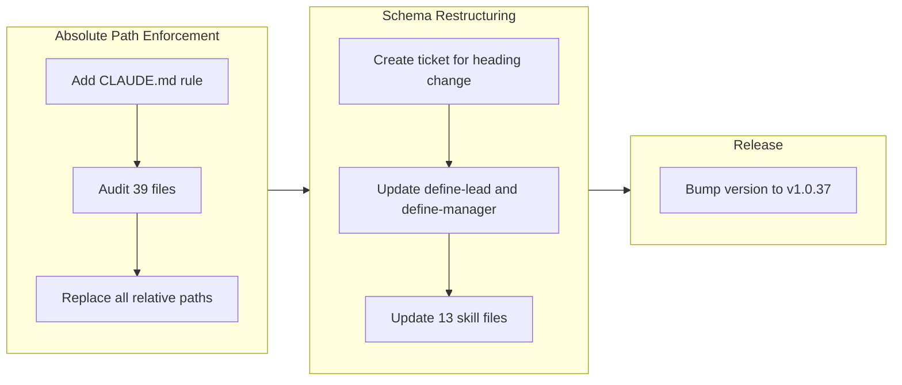

## 1. Overview

This branch resolved two long-standing infrastructure issues: runtime failures caused by relative skill script paths and a flat heading hierarchy that obscured the conceptual relationship between Role, Goal, and Responsibility in agent schemas. Across 49 files and 3 tickets, the work enforced absolute paths for all skill script references and restructured the agent definition schemas to nest Goal and Responsibility under Role.

**Highlights:**

1. Established a project-wide rule in CLAUDE.md mandating absolute paths for all skill shell script references, eliminating a recurring class of exit code 127 failures
2. Mechanically replaced relative `.claude/skills/` paths with absolute `~/.claude/plugins/marketplaces/workaholic/plugins/core/skills/` paths across 39 files
3. Restructured the define-lead and define-manager schemas so Goal and Responsibility become subsections under Role, clarifying the conceptual hierarchy

## 2. Motivation

Relative skill script paths had been causing runtime failures since the plugin architecture was first introduced. While individual files were patched in previous branches, the root cause was never addressed at the project level -- new code continued introducing the broken pattern because no rule prohibited it. The heading restructuring arose from a conceptual insight: Role is the overarching identity that contains both Goal (positive obligation: what to achieve) and Responsibility (negative obligation: what not to neglect). Making this relationship explicit in the document structure helps agents and human readers understand the intended hierarchy without relying on prose explanations.

## 3. Journey

The work progressed in two distinct phases. The first phase addressed the immediate runtime problem by codifying an absolute path rule in CLAUDE.md and then sweeping all 39 affected files to apply the fix mechanically. The second phase tackled a structural concern in the agent schema, reorganizing heading levels across 15 files so that Goal and Responsibility are explicitly nested under Role. A version bump concluded the branch.

## 4. Changes

### 4-1. Enforce Absolute Paths for Skill Shell Script References ([e1af54d](https://github.com/qmu/workaholic/commit/e1af54d))

Added a "Skill Script Path Rule" section to CLAUDE.md mandating that all skill shell script invocations use the absolute home-directory path. Updated the Common Operations table to replace the broken relative paths with correct absolute paths, closing the gap between the existing correct example and the incorrect table entries.

### 4-2. Audit and Replace All Relative Skill Script Paths ([f494b8e](https://github.com/qmu/workaholic/commit/f494b8e))

Performed a mechanical find-and-replace across 39 files (25 skill SKILL.md files, 4 agent files, 2 command files, and 6 documentation files) to change all `bash .claude/skills/` references to `bash ~/.claude/plugins/marketplaces/workaholic/plugins/core/skills/`. Archived tickets were intentionally left unchanged as historical records.

### 4-3. Restructure Role/Responsibility/Goal Heading Hierarchy ([5c99fe9](https://github.com/qmu/workaholic/commit/5c99fe9))

Restructured 15 files (2 schema rules and 13 skill files) so that `## Responsibility` and `## Goal` become `### Goal` and `### Responsibility` nested under `## Role`. The reordering places Goal before Responsibility to match the conceptual model: the forward-looking target comes first, followed by the guardrails. Schema templates, guidelines, validation checklists, and the define-lead example were all updated to reflect the new hierarchy.

## 5. Outcome

The branch accomplished two targeted infrastructure improvements. First, the relative path problem that had plagued the project since the introduction of bundled shell scripts is now permanently resolved: a CLAUDE.md rule prevents future regressions, and all existing files use the correct absolute path. Second, the agent schema hierarchy now explicitly encodes the relationship between Role, Goal, and Responsibility, making the conceptual model structurally visible rather than relying on prose explanations alone. Both changes are mechanical in nature and carry low risk of behavioral regressions.

## 6. Historical Analysis

The relative path issue has a documented history spanning multiple branches. It first appeared when bundled shell scripts were introduced in `feat-20260126-214833` using a `.claude/skills/` convention that proved incorrect at runtime. Individual fixes were applied in `drive-20260204-160722` (4 files patched) and `drive-20260212-122906` (discovered during write-final-report work), but the systemic fix was deferred each time. This branch finally addressed the root cause with both a rule and a comprehensive audit.

The heading restructuring builds on the define-lead schema created in `drive-20260208-131649` and the define-manager schema from `drive-20260210-121635`. Both schemas originally used flat Level 2 headings for Role, Responsibility, and Goal. The restructuring reflects a conceptual refinement that emerged from working with the schemas in practice.

## 7. Concerns

- The absolute path `~/.claude/plugins/marketplaces/workaholic/plugins/core/skills/` is tied to the specific marketplace installation path; if the plugin installation mechanism changes, all 39+ files will need updating again (see [f494b8e](https://github.com/qmu/workaholic/commit/f494b8e) in `plugins/core/skills/`)
- Documentation files in `.workaholic/specs/` and `.workaholic/policies/` were fixed manually but will be overwritten by the next `/scan` run; the scan agents must also generate correct absolute paths to avoid reintroducing the problem (see [f494b8e](https://github.com/qmu/workaholic/commit/f494b8e) in `.workaholic/policies/delivery.md`)
- The 13 agent markdown files still use "Role and Responsibility" in natural language, which is slightly redundant under the new structure where Role contains Responsibility; this was left as-is since it remains semantically valid (see [5c99fe9](https://github.com/qmu/workaholic/commit/5c99fe9) in `plugins/core/agents/`)

## 8. Ideas

- Consider extracting the base skill path (`~/.claude/plugins/marketplaces/workaholic/plugins/core/skills/`) into a single variable or constant that skill files reference, reducing the blast radius of future path changes
- A CI lint rule could enforce the absolute path convention by failing on any new occurrence of `bash .claude/skills/` outside of archived tickets
- The agent template phrasing "Role and Responsibility" could be simplified to just "Role" since Role now structurally contains Responsibility, reducing redundancy in the 13 agent files

## 9. Performance

**Metrics**: 6 commits over 2 days (3.0 commits/day)

### 9-1. Pace Analysis

The branch spanned a calendar period of approximately 6 days but active development was concentrated into a single working day (February 19), with only the initial ticket creation occurring on February 13. The gap between ticket creation and implementation suggests the work was queued and then executed in a focused burst. All implementation commits landed within a 3-hour window on February 19, indicating efficient sequential execution. Commit granularity was appropriate: one commit per ticket for rule establishment, one for the mechanical audit, one for the schema restructuring, and one for the version bump.

### 9-2. Decision Review

| Dimension      | Rating   | Notes                                                                 |
| -------------- | -------- | --------------------------------------------------------------------- |
| Consistency    | Strong   | Each ticket followed the same pattern: rule first, then mechanical application |
| Intuitivity    | Strong   | Changes are self-explanatory; the "why" is clear from commit subjects |
| Describability | Strong   | Both the path fix and schema restructuring are easy to summarize      |
| Agility        | Adequate | Six-day calendar span for focused work; burst execution was efficient |
| Density        | Adequate | 49 files changed but most changes were mechanical find-and-replace    |

**Strengths**: The two-phase approach (establish rule, then enforce) is a proven pattern that prevents regressions. Separating the CLAUDE.md rule from the file audit into distinct tickets made the work reviewable and the commit history readable.

**Areas for Improvement**: The relative path problem was identified multiple times in prior branches before being addressed systemically. Earlier escalation from individual fixes to a project-wide rule would have prevented repeated occurrences. The six-day gap between ticket creation and implementation could indicate prioritization friction.

## 10. Release Preparation

**Verdict**: Ready for release

### 10-1. Concerns

- None -- all changes are configuration and documentation updates with no runtime code modifications. The version bump to v1.0.37 is already included.

### 10-2. Pre-release Instructions

- None -- standard release process applies.

### 10-3. Post-release Instructions

- Run `/scan` after release to regenerate `.workaholic/specs/` and `.workaholic/policies/` files, ensuring scan agents produce correct absolute paths going forward.

## 11. Notes

This branch touches 49 files but the vast majority of changes are mechanical path substitutions. Reviewers can focus their attention on three key files: `CLAUDE.md` (new rule section), `.claude/rules/define-lead.md` (schema restructuring), and `.claude/rules/define-manager.md` (schema restructuring). All other changes follow directly from these three.
