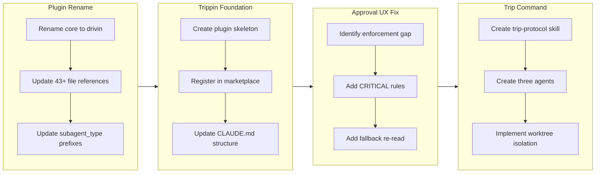

## 1. Overview

This branch establishes the multi-plugin marketplace architecture by renaming the core plugin to "drivin," creating the "trippin" plugin skeleton, and implementing its first command. Along the way, a recurring UX bug in the drive approval prompt was addressed through structural enforcement rather than soft guidance.

**Highlights:**

1. Renamed the core plugin to "drivin" with cascading reference updates across 43+ files
2. Created the trippin plugin with a full Agent Teams-based `/trip` command featuring three collaborative agents
3. Enforced ticket context in drive approval prompts through CRITICAL rules, closing a three-iteration UX bug

## 2. Motivation

The workaholic marketplace had operated as a single-plugin system since its inception. The vision of a two-plugin ecosystem -- drivin for structured development workflows and trippin for exploratory creative work -- required foundational changes. The core-to-drivin rename was a prerequisite for establishing clear naming conventions, and the trippin plugin skeleton needed to be in place before its first command could be built. The drive approval UX fix, while unrelated to the plugin restructuring, addressed a persistent pain point that had survived two prior fix attempts.

## 3. Journey

The work progressed in four distinct phases. First, the core plugin was renamed to drivin, requiring systematic updates across all subagent type references and installed plugin paths. With the naming foundation established, the trippin plugin skeleton was created with marketplace registration. A detour to fix the drive approval UX bug followed, strengthening enforcement language from soft guidance to structural rules. Finally, the trippin plugin received its first real capability: the `/trip` command with three collaborative agents operating in an isolated git worktree.

## 4. Changes

### 4-1. Rename "core" Plugin Directory to "drivin" ([54b0146](https://github.com/qmu/workaholic/commit/54b0146))

Renamed `plugins/core` to `plugins/drivin` and updated all references across the codebase, including plugin metadata, 16+ `subagent_type: "core:*"` prefixes, 43 installed plugin path references, and CLAUDE.md documentation. Historical references in archives and stories were intentionally left untouched.

### 4-2. Create "trippin" Plugin with Skeleton Minimum Structure ([0f10ed2](https://github.com/qmu/workaholic/commit/0f10ed2))

Created the trippin plugin directory structure with plugin.json, README, marketplace registration, and .gitkeep files in empty directories. This established the second plugin in the marketplace alongside drivin, following the same structural patterns.

### 4-3. Enforce Ticket Title and Summary in Drive Approval Prompt ([3464009](https://github.com/qmu/workaholic/commit/3464009))

Strengthened the drive approval prompt to structurally require ticket title and summary. Added CRITICAL rules to the drive command and drive-approval skill, upgraded soft IMPORTANT notes to failure-condition language, and added fallback re-read instructions for the feedback loop. This was the third iteration addressing the same UX issue.

### 4-4. Implement `/trip` Command for Trippin Plugin ([e4efc1a](https://github.com/qmu/workaholic/commit/e4efc1a))

Implemented the full `/trip` command with a two-phase Agent Teams workflow. Created the trip-protocol skill defining the Implosive Structure methodology, three collaborative agents (Planner, Architect, Constructor), worktree isolation via ensure-worktree.sh, artifact initialization via init-trip.sh, and standardized commit tracking via trip-commit.sh.

## 5. Outcome

The branch accomplished a significant architectural milestone: transitioning from a single-plugin to a multi-plugin marketplace. The drivin plugin retained all existing functionality under its new name, while the trippin plugin emerged as a fully structured creative exploration tool with its own command, agents, skills, and shell scripts. The drive approval UX fix closed a persistent issue that had resisted two prior attempts by shifting from guidance-based to enforcement-based language. The version was bumped to 1.0.38 to reflect these changes.

## 6. Historical Analysis

The rename pattern has precedent in this codebase. Previous branches performed similar large-scale renames (manage-branch to branching, policy to principle, story to report) following the same methodology of directory rename plus cascading reference updates. The drive approval UX fix drew on two prior attempts (20260123002028 and 20260212222003), each progressively stronger but insufficient. The third attempt succeeded by framing requirements as CRITICAL rules with failure consequences rather than helpful notes.

## 7. Concerns

- Generated documentation under `.workaholic/specs/` and `.workaholic/policies/` still contains `plugins/core` references that will persist until the next `/scan` run (see [54b0146](https://github.com/qmu/workaholic/commit/54b0146) in `plugins/drivin/skills/*/SKILL.md`)
- The Agent Teams feature used by `/trip` is experimental and requires `CLAUDE_CODE_EXPERIMENTAL_AGENT_TEAMS=1` environment variable (see [e4efc1a](https://github.com/qmu/workaholic/commit/e4efc1a) in `plugins/trippin/commands/trip.md`)
- The drive approval enforcement relies on language strength ("CRITICAL", "failure condition") rather than programmatic validation, which may still be circumvented by the agent (see [3464009](https://github.com/qmu/workaholic/commit/3464009) in `plugins/drivin/skills/drive-approval/SKILL.md`)

## 8. Ideas

- Consider adding a post-rename validation script that checks for stale references to the old plugin name across the codebase
- The `/trip` command could benefit from a cleanup command to remove worktrees and trip artifacts after completion
- A programmatic pre-check for the Agent Teams environment variable in the trip command shell script would provide a better error message than the current documentation-only approach
- Future drive approval fixes could explore a validation step that programmatically checks for placeholder text before presenting the prompt

## 9. Performance

**Metrics**: 8 commits over 7 days (1.14 commits/day)

### 9-1. Pace Analysis

Development proceeded at a measured pace of roughly one commit per day, spread across a full week. The first two commits landed on day one (the rename and skeleton creation), followed by a three-day gap before the approval UX fix, and another three-day gap before the trip command implementation. The commit pattern suggests focused bursts of work separated by planning or review periods. Individual commits were substantial in scope -- the rename touched 43+ files and the trip command created 10 new files -- indicating a preference for well-prepared, comprehensive changes over incremental iteration.

### 9-2. Decision Review

| Dimension      | Rating   | Notes                                                                 |
| -------------- | -------- | --------------------------------------------------------------------- |
| Consistency    | Strong   | All four tickets followed established patterns for their change types |
| Intuitivity    | Strong   | Rename-then-create ordering was logical; UX fix addressed root cause  |
| Describability | Strong   | Each ticket had clear scope and well-documented final reports         |
| Agility        | Adequate | Three-day gaps suggest deliberate pacing rather than reactive pivots  |
| Density        | Strong   | High impact per commit; each change was substantive and complete      |

**Strengths**: The developer demonstrated strong architectural thinking by sequencing the rename before the skeleton creation, and by escalating the UX fix through enforcement language after two prior soft attempts failed. Each ticket was self-contained with thorough test plans.

**Areas for Improvement**: The three-day gaps between work sessions could indicate opportunities for smaller, more frequent commits. The trip command implementation was ambitious for a single commit and could have been split into separate tickets for the protocol skill, agents, and command orchestration.

## 10. Release Preparation

**Verdict**: Ready for release

### 10-1. Concerns

- Generated documentation (`.workaholic/specs/`, `.workaholic/policies/`) still references `plugins/core` and will be stale until the next `/scan` run. This does not affect runtime behavior.
- The trippin `/trip` command depends on the experimental Agent Teams feature. Users without the environment variable enabled will not be able to use it, but this does not affect the drivin plugin or existing functionality.

### 10-2. Pre-release Instructions

- None -- standard release process applies

### 10-3. Post-release Instructions

- Run `/scan` to regenerate documentation that still references the old `plugins/core` paths
- Ensure `CLAUDE_CODE_EXPERIMENTAL_AGENT_TEAMS=1` is documented in the trippin plugin README for users who want to use `/trip`

## 11. Notes

The version was bumped to 1.0.38 as the final commit on this branch. The design.pdf file referenced in the trip command ticket is present in the working directory but untracked. The trippin plugin's trip-protocol skill uses the naming convention `SKILL.md` rather than `trip-protocol.md` as originally specified in the ticket, following the established skill file naming pattern from the drivin plugin.
