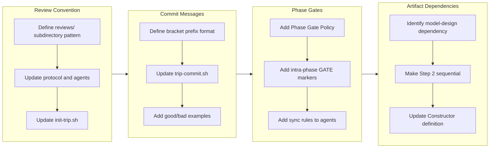

## 1. Overview

This branch hardens the Trippin plugin's trip workflow by addressing four interrelated gaps in agent coordination that were exposed during the first real usage of the `/trip` command. The changes establish deterministic review conventions, enforce phase gate synchronization, define commit message standards, and correct an artifact dependency ordering bug.

**Highlights:**

1. Established a deterministic review file convention using per-agent review files in `reviews/` subdirectories to eliminate concurrent write conflicts
2. Enforced phase gate synchronization with defense-in-depth rules at three layers (protocol skill, command instruction, agent definition)
3. Corrected the model-before-design dependency to enforce strict Direction to Model to Design data flow

## 2. Motivation

The `/trip` command was implemented in the previous branch as a novel Agent Teams-based collaborative workflow. While the initial implementation established the three-agent Implosive Structure and worktree isolation, actual usage revealed several underspecified behaviors. Reviewers wrote feedback in inconsistent locations, agents advanced autonomously past synchronization points, commit messages were terse and non-descriptive, and the Constructor began generating designs concurrently with the Architect's model despite having a data dependency on it. These four issues all stemmed from the same root cause: the original implementation prioritized getting the workflow operational over specifying agent coordination rules. This branch closes those gaps systematically.

## 3. Journey

The work addressed four complementary coordination gaps in rapid succession. First, the review convention established where agents write feedback (separate files in `reviews/` subdirectories). Next, commit message rules defined how commits are labeled (descriptive English sentences with capitalized agent prefix). Phase gate synchronization then addressed when agents may advance (only when the leader explicitly instructs them). Finally, the artifact dependency correction enforced the strict ordering of model before design generation, superseding the concurrent approach from the phase gate ticket.

## 4. Changes

### 4-1. Deterministic Artifact Review Convention for Concurrent Agents ([2ebcfc6](https://github.com/qmu/workaholic/commit/2ebcfc6))

Established a convention where reviewing agents write feedback to separate files in `reviews/` subdirectories (`directions/reviews/direction-v1-architect.md`) rather than modifying original artifacts or creating files in arbitrary locations. Updated the trip-protocol skill, all three agent definitions, the trip command, and init-trip.sh to create the review directories during initialization.

### 4-2. Establish Consistent Commit Message Rules for Trip Command ([bb094ff](https://github.com/qmu/workaholic/commit/bb094ff))

Changed the trip commit message format from `trip(<agent>): <step>` to `[Agent] Descriptive summary` with the step moved to the commit body. Made the description parameter mandatory in trip-commit.sh, added automatic agent name capitalization, and documented good/bad examples in the protocol skill. All three agent definitions received description quality guidance.

### 4-3. Enforce Phase Gate Synchronization in Trip Command ([a416957](https://github.com/qmu/workaholic/commit/a416957))

Added a Phase Gate Policy to the trip-protocol skill establishing that only the leader agent may advance the workflow. Inserted intra-phase GATE markers at every synchronization point within Phase 1 and Phase 2. Added Synchronization Rule sections to all three agent definitions and a CRITICAL coordinator policy to the trip command's Agent Teams instruction block.

### 4-4. Enforce Model-before-Design Dependency in Trip Workflow ([4924344](https://github.com/qmu/workaholic/commit/4924344))

Corrected the Phase 1 Step 2 workflow from concurrent model/design generation to strict sequential ordering: Architect writes model first, then Constructor reads the completed model before writing the design. Added an Artifact Dependencies section documenting the Direction to Model to Design data flow, and updated the Constructor agent definition to explicitly state the model prerequisite.

## 5. Outcome

The branch delivered a comprehensive coordination layer for the Trippin plugin's trip workflow. All four tickets targeted the same subsystem (trip command, trip-protocol skill, and the three agent definitions) and collectively transformed the workflow from a loosely specified sequential list into a rigorously gated process with deterministic review conventions, enforced synchronization points, descriptive commit messages, and correct artifact dependency ordering. The version was bumped to 1.0.39.

## 6. Historical Analysis

The trip workflow was implemented in the immediately preceding branch (drive-20260302-213941, ticket 20260309214650-implement-trip-command.md). That implementation established the foundational structure but intentionally left coordination details underspecified to get the workflow operational. This branch represents the expected hardening pass that follows initial implementation -- a pattern observed in the drivin plugin's own evolution, where commit message formatting underwent three iterations (structured messages, expanded sections, lead consumption format) and drive approval enforcement required three attempts before succeeding.

## 7. Concerns

- The synchronization enforcement relies on instruction text in agent context windows rather than mechanical barriers; agents operating in separate context windows may still advance autonomously if the synchronization rule is not retained prominently enough (see [a416957](https://github.com/qmu/workaholic/commit/a416957) in `plugins/trippin/skills/trip-protocol/SKILL.md`)
- The model-before-design ticket supersedes the concurrent generation approach from the phase gate ticket; if tickets are reviewed independently, the concurrent Step 2 description in the phase gate ticket may cause confusion (see [4924344](https://github.com/qmu/workaholic/commit/4924344) in `plugins/trippin/skills/trip-protocol/SKILL.md`)
- The `trip-commit.sh` capitalization logic uses bash substring extraction (`${agent:0:1}`) which assumes ASCII agent names; non-ASCII names would produce incorrect output (see [bb094ff](https://github.com/qmu/workaholic/commit/bb094ff) in `plugins/trippin/skills/trip-protocol/sh/trip-commit.sh`)

## 8. Ideas

- Consider adding a completion signal mechanism (status file or marker) that agents write when finishing a task, so the leader can poll for completion rather than relying solely on instruction-based synchronization
- The review file convention could be extended with a structured frontmatter format (verdict: approve/reject, concerns: list) to enable programmatic aggregation of review results
- A pre-trip validation script could verify that the trip-protocol skill, command, and all agent definitions contain consistent synchronization rules
- Phase 2 artifact dependencies should receive the same explicit documentation treatment as Phase 1

## 9. Performance

**Metrics**: 9 commits over 1 hour (9 commits/hour)

### 9-1. Pace Analysis

Development proceeded at an exceptionally high velocity of 9 commits per hour, with all work completed in a single focused session. The commit pattern shows a rapid ticket-creation phase (4 tickets created in 11 minutes) followed by an implementation phase (4 implementations plus version bump in 19 minutes). Commits were tightly scoped -- each ticket modified the same set of files (trip-protocol, trip command, three agent definitions) with complementary changes. The high velocity reflects the focused scope: all four tickets targeted the same subsystem and required similar structural changes to the same files.

### 9-2. Decision Review

| Dimension      | Rating   | Notes                                                                 |
| -------------- | -------- | --------------------------------------------------------------------- |
| Consistency    | Strong   | All four tickets followed the same pattern: update protocol, command, and agent definitions |
| Intuitivity    | Strong   | The ordering (where reviews go, how commits look, when to advance, dependency ordering) builds logically |
| Describability | Strong   | Each ticket addressed a single, clearly defined coordination gap |
| Agility        | Strong   | Rapid iteration within a single session; the model-before-design ticket corrected the phase gate ticket's concurrent approach |
| Density        | Adequate | High commit count but changes touched overlapping files; some consolidation may have been possible |

**Strengths**: The developer demonstrated strong systematic thinking by identifying four complementary coordination gaps and addressing them in a logical sequence. The defense-in-depth approach (rules enforced at three layers) shows mature engineering judgment. The willingness to supersede the concurrent approach from an earlier ticket within the same session shows good agility.

**Areas for Improvement**: The four tickets could potentially have been consolidated into fewer, larger tickets given that they all modify the same files. The overlap between the phase gate synchronization and model-before-design tickets suggests the dependency analysis could have been completed before the phase gate ticket was written.

## 10. Release Preparation

**Verdict**: Ready for release

### 10-1. Concerns

- All changes are configuration/documentation only (protocol skills, command markdown, agent definitions, shell script). No runtime code is affected.
- The trip workflow depends on the experimental Agent Teams feature, but these changes only improve existing functionality rather than introducing new capabilities.

### 10-2. Pre-release Instructions

- None -- standard release process applies

### 10-3. Post-release Instructions

- None -- no special post-release actions needed

## 11. Notes

The version was bumped to 1.0.39 as the final commit on this branch. All four tickets were classified as enhancements or bugfixes to the trippin plugin's trip workflow, which was implemented in the immediately preceding branch. The tickets were created and implemented sequentially within a single 43-minute session, with each building on the context of the previous ones.
