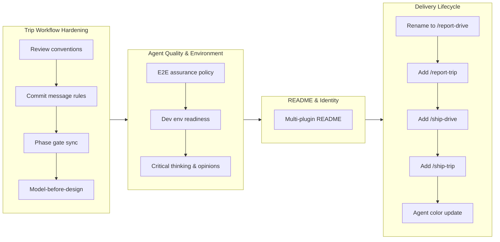

## 1. Overview

This branch delivers a comprehensive hardening and feature expansion of the Workaholic marketplace, spanning both the Trippin and Drivin plugins. The first phase established rigorous agent coordination rules for the trip workflow -- deterministic review conventions, phase gate synchronization, commit message standards, and artifact dependency ordering. The second phase expanded both plugins with new lifecycle commands (`/report-trip`, `/report-drive`, `/ship-drive`, `/ship-trip`), strengthened agent critical thinking, added E2E testing policy and dev environment validation, updated the README for multi-plugin presentation, and adjusted trip agent colors.

**Highlights:**

1. Hardened the Trippin trip workflow with deterministic review conventions, phase gate synchronization, model-before-design dependency enforcement, and structured commit messages
2. Extended both plugins with complete delivery lifecycle commands: `/report-drive`, `/report-trip`, `/ship-drive`, and `/ship-trip` with cloud.md deployment convention
3. Strengthened trip agents with opinion-domain framing (non-tech, structural, tech), critical review policy, E2E assurance, and dev environment readiness validation

## 2. Motivation

The `/trip` command had been implemented in the previous branch as a novel Agent Teams-based workflow, but actual usage exposed significant coordination gaps -- agents wrote reviews inconsistently, advanced past synchronization points autonomously, generated terse commit messages, and produced design artifacts concurrently with models despite a data dependency. Beyond these hardening needs, both plugins lacked the final stages of their delivery lifecycle: reporting and shipping. The Drivin plugin's `/report` command needed renaming to `/report-drive` to accommodate the new `/report-trip` companion, and neither plugin had any mechanism for merging PRs, deploying, or verifying. The README also still presented Workaholic as a single-plugin TiDD tool rather than the multi-plugin marketplace it had become. This branch addressed all of these concerns in a single intensive session.

## 3. Journey

The work progressed through four distinct phases. The first phase hardened the trip workflow's coordination mechanisms, addressing four complementary gaps that were exposed during the first real usage of the `/trip` command. The second phase strengthened agent quality by adding E2E testing policy, dev environment validation, and critical thinking with opinion-domain framing. The third phase updated the repository's public-facing identity with a comprehensive README rewrite. The fourth phase extended both plugins with complete delivery lifecycle commands for reporting and shipping, capping off with a cosmetic agent color update.

## 4. Changes

### 4-1. Deterministic Artifact Review Convention for Concurrent Agents ([2ebcfc6](https://github.com/qmu/workaholic/commit/2ebcfc6))

Established a convention where reviewing agents write feedback to separate files in `reviews/` subdirectories rather than modifying original artifacts. Updated the trip-protocol skill, all three agent definitions, the trip command, and init-trip.sh to create review directories during initialization.

### 4-2. Establish Consistent Commit Message Rules for Trip Command ([bb094ff](https://github.com/qmu/workaholic/commit/bb094ff))

Changed the trip commit message format from `trip(<agent>): <step>` to `[Agent] Descriptive summary` with the step moved to the commit body. Made the description parameter mandatory, added automatic agent name capitalization, and documented good/bad examples in the protocol skill.

### 4-3. Enforce Phase Gate Synchronization in Trip Command ([a416957](https://github.com/qmu/workaholic/commit/a416957))

Added a Phase Gate Policy establishing that only the leader agent may advance the workflow. Inserted intra-phase GATE markers at every synchronization point within Phase 1 and Phase 2. Added Synchronization Rule sections to all three agent definitions with defense-in-depth enforcement at three layers.

### 4-4. Enforce Model-before-Design Dependency in Trip Workflow ([4924344](https://github.com/qmu/workaholic/commit/4924344))

Corrected Phase 1 Step 2 from concurrent model/design generation to strict sequential ordering: Architect writes model first, then Constructor reads the completed model before writing the design. Added an Artifact Dependencies section documenting the Direction-to-Model-to-Design data flow.

### 4-5. Add E2E Assurance Policy to Planner's Testing Step ([1e5a012](https://github.com/qmu/workaholic/commit/1e5a012))

Extended the Planner agent's Phase 2 testing responsibility to include end-to-end validation of the full user experience. Added a tool-agnostic E2E Assurance Policy to the trip-protocol skill with Playwright as the recommended default for web projects, CLI-only execution constraints, and project-type assessment during test planning.

### 4-6. Dev Environment Readiness Validation in Trip Worktree Preparation ([1228aa6](https://github.com/qmu/workaholic/commit/1228aa6))

Created a `validate-dev-env.sh` script that checks for environment files, dependencies, port conflicts, and shared state inside worktrees. Added a Dev Environment Readiness section to the trip-protocol skill and inserted a new validation step in the trip command between initialization and Agent Teams launch.

### 4-7. Enhance Trip Agent Critical Thinking and Role-Based Opinion Framing ([77946d9](https://github.com/qmu/workaholic/commit/77946d9))

Reframed each agent around a clear domain of opinion -- Planner as non-tech side, Architect as structural side, Constructor as tech side. Added a Critical Review Policy requiring substantive analysis with constructive proposals for every concern. Updated the Moderation Protocol to require perspective synthesis during conflict resolution.

### 4-8. Update README to Present Workaholic as Multi-Plugin Marketplace ([c2d0830](https://github.com/qmu/workaholic/commit/c2d0830))

Rewrote the repository README to present Workaholic as a private marketplace for Claude Code plugins rather than a single-purpose TiDD tool. Added per-plugin sections with command tables and example sessions for both Drivin and Trippin, including the Agent Teams prerequisite note for Trippin.

### 4-9. Rename /report to /report-drive in Drivin Plugin ([5fbb486](https://github.com/qmu/workaholic/commit/5fbb486))

Renamed the `/report` command to `/report-drive` to establish the plugin-namespaced command convention. Updated all cascading references across CLAUDE.md, README.md, plugin README, rules, and skill files. Internal names (story-writer, write-story) remained unchanged.

### 4-10. Add /report-trip Command to Trippin Plugin ([aa471c7](https://github.com/qmu/workaholic/commit/aa471c7))

Created a new `/report-trip` command that generates a development journey report from trip artifacts and creates a pull request. Built the write-trip-report skill with agent-based report sections (Planner, Architect, Constructor, Journey) and a gather-artifacts.sh script. The command reads static artifacts directly rather than invoking subagents.

### 4-11. Add /ship-drive Command to Drivin Plugin ([04f17b4](https://github.com/qmu/workaholic/commit/04f17b4))

Created a new `/ship-drive` command that merges the PR, deploys to production, and verifies the deployment. Established the `cloud.md` convention -- a user-provided instruction file with Deploy and Verify sections. Created the ship skill with three shell scripts (pre-check, merge-pr, find-cloud-md) and a five-step orchestration command.

### 4-12. Add /ship-trip Command to Trippin Plugin ([117a41d](https://github.com/qmu/workaholic/commit/117a41d))

Created a new `/ship-trip` command that merges the PR, cleans up the worktree, deploys, and verifies. Added a cleanup-worktree.sh script to remove the worktree and delete the local trip branch after merge. Reuses the Drivin ship skill scripts for PR operations and cloud.md discovery via cross-plugin path references.

### 4-13. Change Trip Agent Colors ([c6616ea](https://github.com/qmu/workaholic/commit/c6616ea))

Updated agent color assignments: Planner from green to red, Architect from blue to green, Constructor from yellow to blue. All three agents now have distinct colors matching the desired palette.

## 5. Outcome

The branch delivered a comprehensive evolution of both Workaholic plugins. The Trippin plugin's trip workflow was hardened from a loosely specified prototype into a rigorously coordinated process with deterministic review conventions, enforced phase gates, descriptive commit messages, correct artifact ordering, E2E testing capability, and dev environment validation. The agents themselves were strengthened with opinion-domain framing and critical review requirements. Both plugins gained complete delivery lifecycle commands -- `/report-drive` and `/ship-drive` for Drivin, `/report-trip` and `/ship-trip` for Trippin -- establishing the cloud.md convention for deployment orchestration. The repository's public identity was updated to reflect its multi-plugin marketplace nature.

## 6. Historical Analysis

The trip workflow hardening tickets (4-1 through 4-4) follow a well-established pattern in this repository: an initial implementation pass focused on getting functionality operational, followed by a hardening pass that addresses coordination gaps exposed during actual usage. The Drivin plugin underwent a similar evolution, with commit message formatting requiring three iterations (structured messages, expanded sections, lead consumption format) and drive approval enforcement requiring three attempts. The command lifecycle expansion (report and ship commands) mirrors the Drivin plugin's own evolution from a plan-implement cycle to a complete plan-implement-report-ship workflow. The README rewrite is the third comprehensive rewrite of the repository's README, following the TiDD philosophy rewrite and the git warning addition, each reflecting a significant shift in the project's identity.

## 7. Concerns

- The synchronization enforcement in the trip workflow relies on instruction text in agent context windows rather than mechanical barriers; agents in separate context windows may still advance autonomously if the synchronization rule is not retained prominently enough (see [a416957](https://github.com/qmu/workaholic/commit/a416957) in `plugins/trippin/skills/trip-protocol/SKILL.md`)
- The `trip-commit.sh` capitalization logic uses bash substring extraction (`${agent:0:1}`) which assumes ASCII agent names; non-ASCII names would produce incorrect output (see [bb094ff](https://github.com/qmu/workaholic/commit/bb094ff) in `plugins/trippin/skills/trip-protocol/sh/trip-commit.sh`)
- The `/ship-drive` and `/ship-trip` commands execute arbitrary deployment instructions from user-provided `cloud.md` files; the deploy step has no safety guardrails beyond what the user documents (see [04f17b4](https://github.com/qmu/workaholic/commit/04f17b4) in `plugins/drivin/skills/ship/SKILL.md`)
- The `/ship-trip` command reuses Drivin's ship skill scripts via cross-plugin path references, creating an implicit coupling between the two plugins (see [117a41d](https://github.com/qmu/workaholic/commit/117a41d) in `plugins/trippin/commands/ship-trip.md`)
- Agent definitions have grown significantly with the addition of Opinion Domain, Review Approach, Synchronization Rule, and E2E testing sections; combined content may approach practical token limits for Agent Teams context windows (see [77946d9](https://github.com/qmu/workaholic/commit/77946d9) in `plugins/trippin/agents/planner.md`)

## 8. Ideas

- Consider adding a completion signal mechanism (status file or marker) that agents write when finishing a task, enabling the leader to poll for completion rather than relying solely on instruction-based synchronization
- The review file convention could be extended with structured frontmatter (verdict, concerns list) to enable programmatic aggregation of review results
- Extract the ship skill's cloud.md convention and shell scripts into a shared marketplace-level skill that both plugins reference, eliminating the cross-plugin coupling
- Add a pre-trip validation script that verifies the trip-protocol skill, command, and all agent definitions contain consistent synchronization rules
- Consider a `/status` command that shows the current lifecycle stage of each active branch (ticketed, driven, reported, shipped)

## 9. Performance

**Metrics**: 26 commits over 14 hours (1.86 commits/hour)

### 9-1. Pace Analysis

Development spanned approximately 14 hours across two calendar days, with 26 commits delivering 13 tickets. The work clustered into two distinct sessions: an evening session on March 10 that produced the first four hardening tickets in 43 minutes at very high velocity, and a longer session on March 11 that delivered nine additional tickets covering quality enhancements, README rewrite, and lifecycle commands. The evening burst (9 commits/hour for the initial hardening) contrasts with the steadier pace of the second session, reflecting the difference between focused modifications to a single subsystem versus broader cross-cutting changes. Commit sizes were generally well-scoped, with each ticket touching a targeted set of files.

### 9-2. Decision Review

| Dimension      | Rating   | Notes                                                                 |
| -------------- | -------- | --------------------------------------------------------------------- |
| Consistency    | Strong   | All tickets followed established patterns: update protocol, command, agent definitions, documentation |
| Intuitivity    | Strong   | Work progression built logically from hardening to quality to presentation to lifecycle |
| Describability | Strong   | Each ticket addressed a single, clearly defined concern with a descriptive title |
| Agility        | Strong   | The model-before-design ticket corrected the phase gate ticket's concurrent approach within the same session; the command naming convention (-drive/-trip) was established cleanly |
| Density        | Strong   | 13 tickets in 14 hours with minimal waste; ticket creation and implementation were tightly coupled |

**Strengths**: The developer demonstrated exceptional systematic thinking by identifying and addressing coordination gaps in logical sequence, then pivoting to lifecycle expansion. The defense-in-depth approach for synchronization enforcement (protocol, command, agent definitions) and the cloud.md deployment convention show mature architectural judgment. The willingness to supersede the concurrent approach from an earlier ticket within the same session demonstrates healthy agility.

**Areas for Improvement**: The initial four hardening tickets could potentially have been consolidated into fewer tickets given their overlapping file modifications. The ship commands' cross-plugin dependency on Drivin's ship skill scripts creates an implicit coupling that could be addressed by extracting shared infrastructure.

## 10. Release Preparation

**Verdict**: Ready for release

### 10-1. Concerns

- All changes are configuration, documentation, and shell scripts. No runtime code is affected.
- The trip workflow depends on the experimental Agent Teams feature, but these changes improve and extend existing functionality rather than introducing breaking changes.
- The cloud.md convention is additive -- projects without a cloud.md file simply skip the deploy/verify steps.

### 10-2. Pre-release Instructions

- None -- standard release process applies

### 10-3. Post-release Instructions

- None -- no special post-release actions needed

## 11. Notes

This branch represents one of the largest single-branch efforts in the repository's history, delivering 13 tickets across 26 commits. The work spanned two plugins and touched foundational files including CLAUDE.md, README.md, and the trip-protocol skill. The previous version bump to v1.0.39 occurred mid-branch for the first four hardening tickets; a new version bump will be needed for the remaining nine tickets. The `/ship-drive` and `/ship-trip` commands establish the cloud.md convention as a new integration point between the Workaholic marketplace and user projects.
