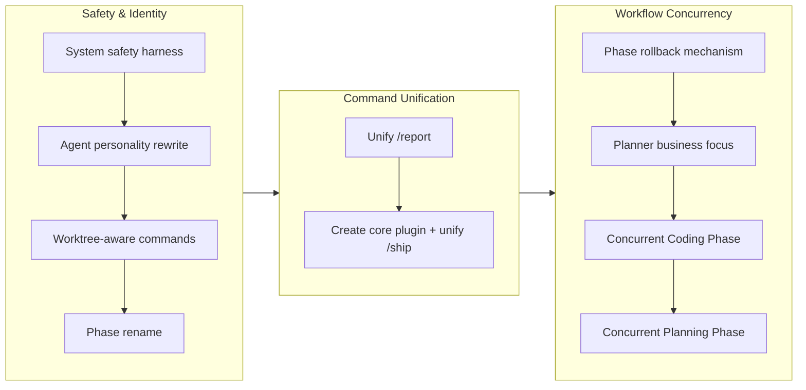

## 1. Overview

This branch delivers a deep structural evolution of the Workaholic plugin system across three themes: safety and identity hardening for agents, command unification through a new core plugin, and concurrency enablement for the Trippin trip workflow. The work began with a system-wide configuration safety harness and a personality spectrum rewrite for the three trip agents, then progressed through command consolidation (merging separate report and ship commands into unified context-aware commands housed in a new core plugin), and culminated in fundamental workflow restructuring that enables concurrent agent execution in both the Planning Phase and Coding Phase of a trip.

**Highlights:**

1. Established a system-wide configuration safety harness that detects provisioning repositories and blocks dangerous system-level operations in regular projects, protecting both drive and trip workflows
2. Created a core plugin and unified `/report` and `/ship` commands with context-aware routing, eliminating four plugin-specific command variants and establishing a shared command layer
3. Restructured both trip phases for concurrency -- the Planning Phase now uses concurrent artifact generation with mutual review instead of sequential dependency chaining, and the Coding Phase launches all three agents simultaneously with a convergence gate

## 2. Motivation

The previous branch had established a rigorously coordinated trip workflow with phase gates, synchronization enforcement, and artifact dependency ordering. However, several architectural gaps remained. First, no guardrail existed to prevent agents from modifying system-wide configuration (shell profiles, global packages, system services) during implementation. Second, the Trippin agent personalities were insufficiently differentiated -- the Planner's "creative direction" role implicitly included technical vision, and the Constructor's role was too passive. Third, the separate report and ship commands across Drivin and Trippin (`/report-drive`, `/report-trip`, `/ship-drive`, `/ship-trip`) created user friction and duplicated infrastructure. Fourth, the strictly sequential artifact generation in the Planning Phase (Direction then Model then Design) and the strictly sequential Coding Phase steps (test plan then implement then review then test) left agents idle when they could have been working concurrently from their distinct domain perspectives. This branch addressed all four concerns through safety infrastructure, identity sharpening, command unification, and concurrency enablement.

## 3. Journey

The work progressed through three distinct thematic phases. The first phase established foundational safety and identity: a system-wide configuration safety harness, a complete rewrite of the three trip agent personalities along a business-vision/structural-bridge/technical-accountability spectrum, worktree-aware fallback for report and ship commands, and a phase terminology rename from numbered to descriptive. The second phase unified the fragmented command landscape by merging four plugin-specific commands into two context-aware commands and creating a core plugin to house them. The third phase restructured the trip workflow for concurrency, adding a rollback mechanism for self-correction, enforcing the Planner's business focus, and enabling concurrent execution in both the Planning Phase and Coding Phase.

## 4. Changes

### 4-1. Add system-wide configuration safety harness ([e48d523](https://github.com/qmu/workaholic/commit/e48d523))

Created a system-safety skill with a provisioning repository detection script and a prohibited operations blocklist. The harness prevents agents from modifying shell profiles, installing global packages, editing system configuration, or escalating privileges in regular projects while allowing such operations in detected provisioning repositories.

### 4-2. Redefine Trippin agent personality spectrum ([6cc19ae](https://github.com/qmu/workaholic/commit/6cc19ae))

Repositioned the three Trippin agents along a clearer personality spectrum: the Planner became a business visionary focused on business phenomena and stakeholder advocacy, the Constructor gained stronger technical accountability and quality ownership, and the Architect was explicitly positioned as the structural bridge translating between business and technical perspectives.

### 4-3. Worktree-aware branch detection for report-trip and ship-trip ([2652084](https://github.com/qmu/workaholic/commit/2652084))

Added worktree fallback logic so that report-trip and ship-trip commands can discover active trip worktrees when run from a non-trip branch. Created a list-trip-worktrees.sh script that parses worktree data and checks PR status, with single-worktree auto-offer and multi-worktree selection prompts.

### 4-4. Rename trip phases to Planning Phase and Coding Phase ([d0cb0bb](https://github.com/qmu/workaholic/commit/d0cb0bb))

Replaced "Phase 1" and "Phase 2" with descriptive names across all Trippin plugin files. Updated phase headings, commit point labels, consensus gates, agent sections, and the trip-commit.sh example to use "Planning Phase" and "Coding Phase" consistently.

### 4-5. Unify report command across Drivin and Trippin plugins ([6776e09](https://github.com/qmu/workaholic/commit/6776e09))

Merged the separate `/report-drive` and `/report-trip` commands into a single context-aware `/report` command. Created a context detection script that routes to the appropriate workflow based on branch pattern (drive-*, trip/*, or worktree fallback). Removed both plugin-specific report commands and updated all documentation references.

### 4-6. Create core plugin with unified report and ship commands ([1c4e0a6](https://github.com/qmu/workaholic/commit/1c4e0a6))

Created the `plugins/core/` plugin to house shared commands that span both Drivin and Trippin workflows. Moved the unified `/report` from Trippin to core, created the unified `/ship` command with drive/trip/worktree routing, removed Drivin's duplicate ship skill, and updated the marketplace configuration and all documentation.

### 4-7. Add phase rollback mechanism from Coding Phase to Planning Phase ([aa037ce](https://github.com/qmu/workaholic/commit/aa037ce))

Added a rollback protocol that allows any agent to propose returning from the Coding Phase to the Planning Phase when the specification artifacts are fundamentally insufficient. Rollback requires two-out-of-three consensus. Added rollback proposal artifacts, voting mechanics, and rollback capabilities to all three agent definitions.

### 4-8. Enable concurrent agent work in Coding Phase ([0a00b3d](https://github.com/qmu/workaholic/commit/0a00b3d))

Restructured the Coding Phase so all three agents begin work simultaneously: the Constructor implements, the Planner plans tests and verifies the dev environment using Playwright CLI MCP, and the Architect discovers the codebase for structural review preparation. A convergence gate ensures all agents complete before sequential review and testing begins.

### 4-9. Enforce Planner business focus in Planning Phase ([9eb728e](https://github.com/qmu/workaholic/commit/9eb728e))

Added explicit behavioral guardrails preventing the Planner from exploring the codebase during the Planning Phase. Defined what Direction artifacts must contain (value proposition, risk assessment, user personas, system positioning, business rationale) and must not contain (file paths, code references, technical analysis). Established that codebase discovery is the Architect's responsibility.

### 4-10. Enable concurrent Planning Phase artifact generation with mutual review ([296465e](https://github.com/qmu/workaholic/commit/296465e))

Replaced the sequential Direction-then-Model-then-Design artifact dependency chain with concurrent generation followed by structured mutual review. All three agents now write their artifacts simultaneously from the user instruction, then enter a mutual review session where each agent reviews the other two artifacts, producing six review files per round. Convergence iterates until full consensus on all three artifacts.

## 5. Outcome

The branch delivered 10 tickets across 21 commits, producing three layers of improvement to the Workaholic plugin system. The safety layer introduced a system-wide configuration harness that protects both drive and trip workflows from unintended system modifications. The unification layer collapsed four plugin-specific commands into two context-aware commands housed in a new core plugin, simplifying the user experience and eliminating infrastructure duplication. The concurrency layer transformed the trip workflow from a strictly sequential process into one that leverages parallel agent execution in both phases, while adding a rollback mechanism for self-correction and enforcing clearer role boundaries. The Planner's identity as a business visionary was sharpened with explicit behavioral prohibitions against codebase exploration, completing the personality spectrum rewrite from the earlier ticket.

## 6. Historical Analysis

The safety harness follows the pattern established by the git safeguard work in drive-20260204-160722, which introduced prohibited operations to the drive workflow. The personality spectrum rewrite builds on the opinion-domain framing from drive-20260310-220224, sharpening the distinction from "non-tech / structural / tech" to "business vision / structural bridge / technical accountability." The command unification reverses the plugin-suffixed naming convention that was introduced in the same previous branch (renaming /report to /report-drive), recognizing that the split created more friction than clarity. The concurrent Planning Phase work explicitly reverses the model-before-design dependency enforcement from drive-20260310-220224, which had established strict sequential ordering; the rationale is that each agent's domain perspective is sufficiently self-contained to produce a meaningful first draft independently, with mutual review serving as the alignment mechanism instead of sequential input chaining. The concurrent Coding Phase restructuring addresses the observation that agents sat idle during sequential phases, applying the same concurrency pattern used in the Planning Phase.

## 7. Concerns

- The system-safety blocklist is enforced through agent instructions rather than a technical sandbox; agents in separate context windows could bypass the restriction if the constraint text is not retained in context (see [e48d523](https://github.com/qmu/workaholic/commit/e48d523) in `plugins/drivin/skills/system-safety/SKILL.md`)
- The concurrent Planning Phase produces artifacts without input from the other agents' work, which may lead to more divergence in first drafts and require additional revision rounds compared to the sequential approach (see [296465e](https://github.com/qmu/workaholic/commit/296465e) in `plugins/trippin/skills/trip-protocol/SKILL.md`)
- The rollback mechanism has no cooldown or maximum attempt limit; a determined agent could theoretically spam rollback proposals (see [aa037ce](https://github.com/qmu/workaholic/commit/aa037ce) in `plugins/trippin/skills/trip-protocol/SKILL.md`)
- The Planner's business-focus prohibition on codebase exploration is behavioral (instruction-based), not mechanical (tool-based), because the Planner needs Read/Glob/Grep tools during the Coding Phase for test execution (see [9eb728e](https://github.com/qmu/workaholic/commit/9eb728e) in `plugins/trippin/agents/planner.md`)
- The core plugin introduces a new dependency layer; both drive and trip workflows now depend on core for report and ship commands (see [1c4e0a6](https://github.com/qmu/workaholic/commit/1c4e0a6) in `plugins/core/commands/report.md`)

## 8. Ideas

- Add a mechanical enforcement layer for system-safety by wrapping Bash tool calls through a proxy script that intercepts and rejects blocked operations
- Consider adding a rollback cooldown or maximum attempt count to the Rollback Protocol to prevent abuse
- The mutual review session in the concurrent Planning Phase could be optimized by having agents review concurrently (all six reviews in parallel) rather than sequentially
- A shared skill layer at the marketplace level could replace the current per-plugin skill duplication pattern, building on the core plugin precedent
- The Planner's business-focus enforcement could be extended with a post-hoc validation step that checks Direction artifacts for file paths or code references before the mutual review session begins
- Consider adding a `/status` command to the core plugin that shows the lifecycle stage of all active branches and worktrees

## 9. Performance

**Metrics**: 21 commits over 21 hours (1.0 commits/hour)

### 9-1. Pace Analysis

Development spanned approximately 21 hours across two calendar days, with 21 commits delivering 10 tickets. The work had a distinctive burst pattern: the first two tickets (system safety and personality rewrite) were completed in the first 6 hours, followed by a concentrated 4-hour session that delivered the worktree-aware commands, phase rename, report unification, core plugin creation, and rollback mechanism. The final three tickets (concurrent Coding Phase, Planner business focus, concurrent Planning Phase) were completed in a 75-minute burst late in the evening, demonstrating the compounding effect of understanding built during earlier tickets. The version bump commit arrived the following morning. Commits were well-scoped, with each ticket producing 1-2 commits (one for the ticket file, one for the implementation).

### 9-2. Decision Review

| Dimension      | Rating   | Notes                                                                 |
| -------------- | -------- | --------------------------------------------------------------------- |
| Consistency    | Strong   | All 10 tickets followed the established pattern of updating protocol, command, agent definitions, and documentation in lockstep |
| Intuitivity    | Strong   | Work progressed logically from safety and identity through command unification to workflow concurrency, each theme building on the previous |
| Describability | Strong   | Each ticket addressed a clearly bounded concern with a descriptive title; the three themes (safety/identity, unification, concurrency) are easy to explain |
| Agility        | Strong   | The developer reversed two previous design decisions (plugin-suffixed commands and sequential artifact dependency) within the same branch when the rationale for change became clear |
| Density        | Adequate | 10 tickets in 21 hours is a healthy pace; the gap between the personality rewrite and worktree-aware commands suggests a natural break or context-switching period |

**Strengths**: The developer demonstrated strong architectural judgment by recognizing when previous design decisions (sequential artifact dependency, plugin-suffixed commands) needed to be reversed rather than maintained. The three-theme progression (safety, unification, concurrency) created a coherent narrative arc. The rollback mechanism and business-focus enforcement show defensive thinking about agent behavior boundaries. The creation of a core plugin was a pragmatic response to user feedback about command placement.

**Areas for Improvement**: The ticket files for concurrent Coding Phase and Planner business focus were created before the implementation of the earlier concurrent Planning Phase ticket, resulting in stale references in some ticket cross-references. The safety harness and personality spectrum could have been scoped as a single "agent identity and safety" meta-ticket to reduce per-ticket overhead.

## 10. Release Preparation

**Verdict**: Ready for release

### 10-1. Concerns

- All changes are configuration, documentation, and shell scripts. No runtime application code is affected.
- The core plugin is a new addition to the marketplace but follows the same plugin structure as Drivin and Trippin.
- The concurrent workflow changes modify the trip-protocol instructions but do not break backward compatibility for existing trips.
- The version bump to v1.0.40 is included in this branch.

### 10-2. Pre-release Instructions

- None -- standard release process applies

### 10-3. Post-release Instructions

- None -- no special post-release actions needed

## 11. Notes

This branch marks the creation of the third plugin (core) in the Workaholic marketplace, establishing a shared command layer that both Drivin and Trippin depend on. The concurrent Planning Phase restructuring is a deliberate reversal of the model-before-design dependency enforcement from the previous branch, justified by the observation that each agent's domain perspective (business vision, structural bridge, technical accountability) is sufficiently self-contained to produce a meaningful first draft independently. The personality spectrum rewrite and business-focus enforcement together complete a multi-ticket arc that began with opinion-domain framing in the previous branch and culminates in explicit behavioral prohibitions against scope drift. The last ticket file in the archive (trip worktree resume-or-create prompt) was added but not implemented, serving as a future enhancement ticket.
