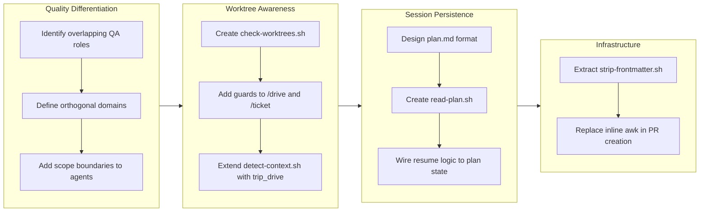

## 1. Overview

This branch bridges the gap between the trip and drive workflows by establishing cross-command compatibility, worktree awareness, and session persistence. Six tickets addressed agent quality differentiation, worktree detection guards, trip-drive hybrid routing, trip plan state documents, and infrastructure improvements -- collectively transforming two isolated plugin workflows into a cohesive development lifecycle.

**Highlights:**

1. Differentiated quality assurance responsibilities across Planner (E2E), Constructor (internal tests), and Architect (analytical review) with explicit scope boundaries
2. Added worktree detection guards and cross-command compatibility so trip branches can seamlessly transition into drive-style development
3. Introduced trip plan.md as a persistent state document enabling session resume with phase and step awareness

## 2. Motivation

The trip and drive plugins were originally developed as independent workflows with separate branch naming conventions, commit formats, and lifecycle management. As the system matured, users encountered friction at the boundaries: completing a trip session left a working branch with no supported path to continue iterating via tickets and drive. The `/drive` and `/ticket` commands had no awareness of active trip worktrees, risking accidental development in the wrong context. Agent quality assurance responsibilities overlapped without clear ownership boundaries. This branch addressed these integration gaps to create a unified development experience where trip exploration flows naturally into drive-style iterative refinement.

## 3. Journey

The work began with a foundational concern: clarifying who owns what during the Coding Phase. The developer established three orthogonal quality tracks -- Planner for E2E testing, Constructor for internal tests, Architect for analytical review -- with explicit prohibitions preventing domain crossover. This clarification set the stage for cross-plugin work by ensuring each agent had well-defined responsibilities regardless of whether the context originated from a trip or drive session. Attention then shifted to worktree awareness, adding detection guards that warn users before accidentally developing in the wrong context. The cross-command compatibility layer extended context detection to recognize hybrid trip-drive branches. Session persistence via plan.md completed the integration story, enabling interrupted trips to resume with full phase awareness. A final infrastructure ticket extracted frontmatter stripping into a reusable script.

## 4. Changes

### 4-1. Prompt to Resume or Create Worktree When Starting Trip ([c467480](https://github.com/qmu/workaholic/commit/c467480))

Added worktree detection to the `/trip` command's Step 1 so that when existing trip worktrees are found, the user is prompted to either resume an existing session or create a new one. This prevents worktree proliferation and makes returning to interrupted trips effortless.

### 4-2. Differentiate Coding Phase Quality Assurance Responsibilities ([30e01f9](https://github.com/qmu/workaholic/commit/30e01f9))

Refactored all three trippin agent files into symmetric structure with explicit QA domains: Planner owns E2E/external testing, Constructor owns internal testing (unit tests, compiler checks, linting), and Architect owns discovery-based analytical review. Added scope boundary statements and updated trip-protocol with Quality Assurance Differentiation table.

### 4-3. Add Worktree Detection Guard to /drive and /ticket Commands ([d78cb2d](https://github.com/qmu/workaholic/commit/d78cb2d))

Created a lightweight `check-worktrees.sh` script in the core branching skill that detects trip worktrees without GitHub API calls. Added Phase 0 / Step 0 worktree guards to both `/drive` and `/ticket` commands, prompting users to choose between continuing on the current branch or switching to an active trip worktree.

### 4-4. Design Trip-Drive Cross-Command Compatibility ([ced9de5](https://github.com/qmu/workaholic/commit/ced9de5))

Extended `detect-context.sh` with a `trip_drive` hybrid context type for trip branches that have drive-style tickets. Added routing for this context in `/report` and `/ship` commands, sanitized archive directory naming for trip branches (replacing `/` with `-`), and added drive transition guidance to the trip command's results step.

### 4-5. Generate Trip Plan Markdown Document for State Persistence and Resume ([790c4e5](https://github.com/qmu/workaholic/commit/790c4e5))

Introduced `plan.md` as a structured state document created during trip initialization. The document tracks the current phase, step, iteration count, and user instruction via YAML frontmatter, with append-only progress tracking in the body. Created `read-plan.sh` for parsing plan state and updated the resume logic to skip completed steps based on plan state.

### 4-6. Add Reusable Strip-Frontmatter Shell Script ([9cab3fd](https://github.com/qmu/workaholic/commit/9cab3fd))

Extracted the inline awk frontmatter-stripping logic from the PR creation script into a standalone `strip-frontmatter.sh` script. This makes frontmatter removal reusable across any markdown-to-PR-body conversion path and follows the Shell Script Principle by eliminating inline text processing.

## 5. Outcome

The branch delivered a comprehensive integration layer between the trip and drive workflows. Quality assurance responsibilities are now clearly partitioned across agents with explicit scope boundaries, eliminating the ambiguity that existed when all three agents broadly "reviewed" and "tested." Worktree awareness extends to every user-facing command, preventing accidental development in the wrong context. Trip branches can now transition into drive-style iterative development via the `trip_drive` hybrid context, with proper archive directory naming and routing in both `/report` and `/ship` commands. Session persistence through plan.md enables interrupted trips to resume at the exact phase and step where they stopped. Infrastructure improvements ensure clean PR descriptions through reusable frontmatter stripping.

## 6. Historical Analysis

This branch builds directly on the trip workflow infrastructure established in `drive-20260302-213941` (where the `/trip` command and Agent Teams were first implemented) and the unified command layer from `drive-20260311-125319` (which created `/report` and `/ship` with `detect-context.sh` routing). The worktree detection pattern was first introduced for `report-trip` and `ship-trip` in `drive-20260311-125319` via `list-trip-worktrees.sh` and is now extended to `/drive` and `/ticket`. The quality differentiation work continues the agent personality refinement from `drive-20260311-125319` where the business-vision/structural-bridge/technical-accountability spectrum was established. The pattern of extracting inline shell logic into reusable scripts (strip-frontmatter.sh) echoes the infrastructure hardening done in `drive-20260204-160722` and `drive-20260205-195920`.

## 7. Concerns

- The `detect-context.sh` change introduces state-dependent context detection (checking for ticket files in `todo/`), which makes the context non-deterministic based solely on branch name -- a departure from the previous pure-pattern-based approach (see [ced9de5](https://github.com/qmu/workaholic/commit/ced9de5) in `plugins/core/skills/branching/sh/detect-context.sh`)
- Shell-based YAML parsing in `read-plan.sh` is fragile; the script relies on simple grep/sed patterns for flat frontmatter fields, which may break if users include special characters in the instruction field (see [790c4e5](https://github.com/qmu/workaholic/commit/790c4e5) in `plugins/trippin/skills/trip-protocol/sh/read-plan.sh`)
- The `list-trip-worktrees.sh` script makes one `gh pr list` API call per worktree, which could introduce latency in the resume prompt; the guard script (`check-worktrees.sh`) avoids this but the full listing is still called when the user chooses to switch (see [d78cb2d](https://github.com/qmu/workaholic/commit/d78cb2d) in `plugins/core/skills/branching/sh/check-worktrees.sh`)
- The ticket's suggested `sed '1{/^---$/,/^---$/d}'` pattern for frontmatter stripping was discovered to be incorrect at implementation time; the actual implementation uses an awk one-liner instead (see [9cab3fd](https://github.com/qmu/workaholic/commit/9cab3fd) in `plugins/drivin/skills/create-pr/sh/strip-frontmatter.sh`)

## 8. Ideas

- Add a `--quick` flag to `list-trip-worktrees.sh` that skips the `gh pr list` API calls for scenarios where PR metadata is not needed (guard prompts, resume decisions)
- Consider a visual indicator in the CLI prompt showing which worktree context the user is currently in, reducing the need for guard checks
- The plan.md format could be extended with agent-specific sub-states (e.g., tracking which agents have completed their concurrent tasks individually) for more granular resume capabilities
- The trip-drive hybrid routing could eventually support a "merge trip artifacts into drive story" mode that combines trip planning artifacts with drive ticket archives in a single comprehensive report

## 9. Performance

**Metrics**: 11 commits over 7 days (1.57 commits/day)

### 9-1. Pace Analysis

Development proceeded in two distinct clusters. The first cluster (March 12) saw three commits in rapid succession within 34 minutes, covering the quality differentiation ticket and the trip resume prompt. A four-day gap followed before the second cluster (March 16-17) produced six commits across worktree guards, cross-command compatibility, ticket creation, and the plan document implementation. A final two-day gap preceded the infrastructure cleanup (strip-frontmatter) on March 19. The commits were consistently focused and atomic, with each ticket producing one implementation commit plus optional ticket-creation commits.

### 9-2. Decision Review

| Dimension      | Rating    | Notes                                                                 |
| -------------- | --------- | --------------------------------------------------------------------- |
| Consistency    | Adequate  | Two distinct work clusters with multi-day gaps between them           |
| Intuitivity    | Strong    | Natural progression from agent clarity to worktree awareness to state |
| Describability | Strong    | Each ticket has a clear, self-contained scope with well-defined boundaries |
| Agility        | Strong    | Adapted ticket ordering based on dependency discovery (guards before compatibility) |
| Density        | Adequate  | Six tickets in seven days; moderate density appropriate for integration work |

**Strengths**: The logical progression from agent quality clarification through worktree awareness to session persistence demonstrates thoughtful sequencing -- each ticket built on the foundation laid by previous ones. The symmetric refactoring of agent files (planner, architect, constructor) shows disciplined cross-cutting change management.

**Areas for Improvement**: The multi-day gaps suggest this branch was interleaved with other work or priorities. The version bump commit (v1.0.41) at the end suggests the branch was ready for release earlier but awaited finalization. Consider whether the plan.md ticket's scope (touching 7 files across commands, agents, skills, and scripts) could have been decomposed into smaller tickets for faster iteration.

## 10. Release Preparation

**Verdict**: Ready for release

### 10-1. Concerns

- None -- changes are configuration and documentation modifications within the plugin system. No runtime dependencies or breaking changes are introduced. The version bump to v1.0.41 is already committed.

### 10-2. Pre-release Instructions

- None -- standard release process applies. The version bump to v1.0.41 is already included in the branch.

### 10-3. Post-release Instructions

- None -- no special post-release actions needed.

## 11. Notes

- The quality differentiation ticket received feedback to refactor agent files for conciseness and symmetry, which was incorporated into the implementation. This resulted in significantly shorter agent files (61-67 lines each) with identical section structures.
- The strip-frontmatter ticket discovered that the suggested `sed` pattern was incorrect during implementation and replaced it with a correct `awk` one-liner, demonstrating the value of the ticket's Considerations section in surfacing implementation risks.
- This branch includes a version bump commit (v1.0.41) that was added as part of the standard drive workflow completion.
