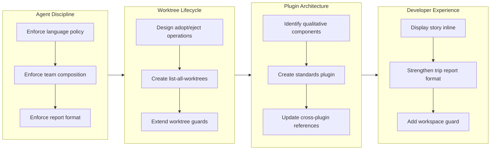

## 1. Overview

This branch strengthens cross-plugin discipline, introduces a new architectural layer for the workaholic marketplace, and adds workflow safety guards. Seven tickets addressed language policy enforcement, agent team composition constraints, worktree lifecycle management, developer experience improvements, plugin extraction, report format compliance, and workspace cleanliness checks -- collectively tightening the behavioral guarantees of the trippin plugin while creating a dedicated standards plugin to separate qualitative concerns from the drivin operational workflow.

**Highlights:**

1. Established three-layer language enforcement (rule file, agent definitions, team lead instructions) across all trippin plugin components to guarantee English-only output outside `.workaholic/`
2. Created the standards plugin by extracting 20 agents and 22 skills from drivin, cleanly separating qualitative/documentation concerns from ticket-driving operations
3. Added worktree lifecycle management (adopt, eject, list-all) and workspace cleanliness guards to strengthen pre-flight safety across `/report` and `/ship` commands

## 2. Motivation

The trippin plugin had grown through multiple iterations of feature development -- agent personalities, phase gates, concurrent execution, quality differentiation -- but lacked foundational discipline in two areas: language policy and post-completion agent management. Agents operating in isolated context windows had no language enforcement, producing mixed-language output that violated the project's CLAUDE.md policy. After trip sessions completed, the team lead freely spawned arbitrary agents that lacked all trippin behavioral constraints. Meanwhile, the drivin plugin had accumulated qualitative components (leads, managers, writers, analysts) that belonged in a separate architectural layer, obscuring its core ticket-driving purpose. The developer also identified workflow gaps: no mechanism to convert existing drive branches into worktrees, no inline story display after `/report`, insufficient report format enforcement for trip contexts, and no workspace cleanliness check before `/report` or `/ship` could proceed -- risking surprise leftover changes after command completion.

## 3. Journey

The branch began with two discipline-focused tickets targeting the trippin plugin's behavioral gaps. Language enforcement came first, establishing a three-layer redundancy pattern (rule file, agent definitions, team lead instructions) that would be reused immediately for the agent team composition ticket. With discipline foundations in place, attention turned to infrastructure: worktree lifecycle management added adopt, eject, and list-all operations that bridge drive and trip workflows. The major architectural change followed -- extracting 20 agents and 22 skills into a new standards plugin -- which required careful cross-plugin reference updates across scan commands, story-writer, and agent skill preloads. The branch concluded with three developer experience improvements: inline story display after `/report`, stronger trip report format enforcement, and a clean workspace guard for both `/report` and `/ship` commands.

## 4. Changes

### 4-1. Enforce Written Language Policy in Trippin Plugin ([bc9f189](https://github.com/qmu/workaholic/commit/bc9f189))

Added comprehensive English-only language enforcement to the trippin plugin through a new `i18n.md` rule file, language rules in all three agent definitions (Planner, Architect, Constructor), team lead instructions in the trip command, a dedicated Written Language Policy section in trip-protocol, and language guidance in write-trip-report. This three-layer approach ensures compliance even when agents operate in isolated context windows.

### 4-2. Enforce Agent Team Composition in Post-Trip Follow-Up ([68cc745](https://github.com/qmu/workaholic/commit/68cc745))

Added a Post-Completion Protocol to trip-protocol and team lead instructions that prevents the spawning of arbitrary agents after a trip reaches `complete/done`. Follow-up requests are handled either by the lead directly (for simple tasks) or by re-invoking the three designated agents (Planner, Architect, Constructor), preserving their original role boundaries and QA domains.

### 4-3. Add Worktree Management: Adopt, Eject, and List-All Commands ([0f7bf97](https://github.com/qmu/workaholic/commit/0f7bf97))

Created three new worktree lifecycle scripts in the core branching skill: `adopt-worktree.sh` for converting existing branches into worktrees, `eject-worktree.sh` for collapsing worktrees back to the main working tree while preserving branches, and `list-all-worktrees.sh` for discovering all worktree types (trip and drive). Extended `check-worktrees.sh` to detect drive worktrees alongside trip worktrees.

### 4-4. Display Story Content After /report Completes ([a970573](https://github.com/qmu/workaholic/commit/a970573))

Added inline story display to the `/report` command for both Drive Context and Trip Context flows. After story generation, the full markdown content is output directly so the developer can review the story without opening GitHub. No approval dialog is needed -- the developer decides their next action independently.

### 4-5. Create Standards Plugin and Extract Qualitative Components ([2f0f504](https://github.com/qmu/workaholic/commit/2f0f504))

Created the fourth plugin `plugins/standards/` and extracted 20 agents (10 leads, 3 managers, 7 analysts/writers) and 22 skills (principles, lead-*, manage-*, analyze-*, write-*, and utilities) from drivin. Updated all cross-plugin references in scan command, story-writer, and agent skill preloads. Updated marketplace.json, CLAUDE.md, README.md, and define-lead rule paths.

### 4-6. Enforce Trip Report Format from write-trip-report Skill ([03d6bd4](https://github.com/qmu/workaholic/commit/03d6bd4))

Strengthened the trip report format enforcement in both the `/report` command and the write-trip-report skill. Added explicit directives that the skill's template structure is mandatory -- no sections may be added, removed, or renamed -- addressing the tendency for Claude Code to treat the template as a suggestion rather than a requirement.

### 4-7. Add Clean Workspace Guard to /report and /ship ([5af3a6e](https://github.com/qmu/workaholic/commit/5af3a6e))

Added a Step 0 workspace guard to both `/report` and `/ship` commands that runs `check-workspace.sh` to detect unstaged, untracked, or staged changes before proceeding. When the workspace is not clean, the user is prompted to either ignore and proceed or stop to handle changes first. This prevents surprise leftover changes after command completion and follows the established guard pattern from worktree detection.

## 5. Outcome

The branch delivered three categories of improvement: behavioral discipline, architectural clarity, and workflow safety. On the discipline side, the trippin plugin now has comprehensive language enforcement, post-completion agent composition rules, and mandatory report format adherence. These constraints close the gaps that allowed agents to produce mixed-language output, spawn unconstrained ad-hoc agents after trip completion, and generate freeform reports that ignored the skill template. On the architecture side, the new standards plugin provides a clean separation between qualitative/policy concerns and operational ticket-driving concerns, making the drivin plugin's purpose unambiguous: ticket creation, implementation driving, and archiving. On the safety side, the workspace guard ensures that `/report` and `/ship` commands alert the user to uncommitted changes before proceeding, eliminating a class of surprise post-command state. Infrastructure additions (worktree lifecycle management and inline story display) further improve the day-to-day developer experience.

## 6. Historical Analysis

This branch continues several threads of incremental refinement. The language enforcement addresses gaps first identified during the drivin plugin's own i18n evolution (`drive-20260212-122906`, `drive-20260204-160722`), where duplicate Japanese specs and hardcoded translations were progressively eliminated. The trippin plugin lagged behind in this regard, having no language rules despite being the most language-sensitive component (agents operating in isolated context windows). The agent team composition discipline extends the phase gate and quality differentiation work from `drive-20260311-125319` and `drive-20260312-102414`, applying the same principle of "constrained agent behavior" to the post-completion state. The worktree lifecycle management builds on the trip worktree infrastructure from `drive-20260310-220224` and `drive-20260311-125319`, adding the reverse direction (existing branches into worktrees) that was identified as missing. The standards plugin extraction follows the architectural pattern established when the core plugin was created in `drive-20260311-125319` -- separating cross-cutting concerns from domain-specific workflows. The workspace guard extends the git safety philosophy from `drive-20260204-160722` (pre-flight checks in /drive) and the unstaged deletion fix from `drive-20260213-131416` to the report and ship commands.

## 7. Concerns

- Agent Teams agents operate in separate context windows and may not reliably inherit plugin rules from the `rules/` directory; the three-layer redundancy (rule file + agent definitions + team lead instructions) is a mitigation, not a guarantee (see [bc9f189](https://github.com/qmu/workaholic/commit/bc9f189) in `plugins/trippin/rules/i18n.md`)
- The post-completion team composition rule relies on instructional compliance rather than technical enforcement; Claude Code cannot be technically prevented from creating new agents (see [68cc745](https://github.com/qmu/workaholic/commit/68cc745) in `plugins/trippin/commands/trip.md`)
- The standards plugin extraction required updating both frontmatter skill preloads (using `standards:skill-name` syntax) and inline bash paths (using `/../standards/` directory traversal); missing even one reference causes a runtime resolution failure (see [2f0f504](https://github.com/qmu/workaholic/commit/2f0f504) in `plugins/drivin/commands/scan.md`)
- The `adopt-worktree.sh` script requires a clean working tree before switching branches; uncommitted changes will cause an abort rather than automatic stashing (see [0f7bf97](https://github.com/qmu/workaholic/commit/0f7bf97) in `plugins/core/skills/branching/sh/adopt-worktree.sh`)
- The workspace guard uses AskUserQuestion with two options; if the user selects "Ignore and proceed," unrelated changes will persist through the command and may cause conflicts during ship's merge-pr checkout (see [5af3a6e](https://github.com/qmu/workaholic/commit/5af3a6e) in `plugins/core/commands/ship.md`)

## 8. Ideas

- Add automated verification that all cross-plugin references resolve correctly (a "link checker" for subagent_type and skill preload references)
- Consider a `.claude-plugin/exports.json` manifest that explicitly declares which agents and skills a plugin exposes for cross-plugin consumption
- The three-layer language enforcement pattern could be generalized into a "behavioral enforcement template" that any new trippin rule follows automatically
- Worktree lifecycle operations could be exposed through a dedicated `/worktree` command for discoverability, rather than relying on natural language invocation
- The workspace guard could be extended to `/drive` for detecting unrelated changes before implementation begins, though the cost-benefit is less clear since /drive actively creates changes

## 9. Performance

**Metrics**: 14 commits over 2 days (7 commits/day)

### 9-1. Pace Analysis

Development proceeded in three clusters. The first session (March 26, 18:42-19:32) produced two ticket-creation commits within 50 minutes. After a gap of roughly 42 hours, the second session (March 28, 13:30-15:48) delivered eleven commits in 2 hours and 18 minutes -- an intense burst covering implementation of six tickets, the version bump, and the initial story/release-notes generation. A third session followed shortly after (March 28, 15:59-17:42) adding the seventh ticket (workspace guard) with its spec and implementation commits. The commits were consistently atomic: each ticket produced one implementation commit, with ticket-creation commits preceding where applicable. The high velocity in the second and third sessions reflects the preparatory nature of the first session (writing specs) followed by focused execution.

### 9-2. Decision Review

| Dimension      | Rating    | Notes                                                                 |
| -------------- | --------- | --------------------------------------------------------------------- |
| Consistency    | Adequate  | Three distinct sessions with a 42-hour gap between spec writing and implementation |
| Intuitivity    | Strong    | Natural progression: discipline first, then infrastructure, then architecture, then UX, then safety |
| Describability | Strong    | Each ticket is self-contained with clear scope; the standards extraction has the widest surface area but a coherent rationale |
| Agility        | Strong    | Moved from behavioral fixes (language, composition) to architectural restructuring (standards plugin) to polish (display, format, guard) in a logical arc; added a seventh ticket after initial story generation |
| Density        | Strong    | Seven tickets and 14 commits in two calendar days; the implementation sessions were particularly dense |

**Strengths**: The sequencing demonstrates strategic thinking -- establishing agent discipline before undertaking the major architectural extraction ensures the moved components already carry proper constraints. The spec-then-implement pattern (day 1: write tickets, day 2: execute all) enabled focused, uninterrupted implementation. The standards plugin extraction, despite touching dozens of files across multiple plugins, was executed cleanly with proper cross-plugin reference updates. The workspace guard was identified and implemented as a follow-up improvement after the initial story generation, showing responsiveness to emergent needs.

**Areas for Improvement**: The 42-hour gap between spec writing and implementation could indicate context-switching overhead. Consider whether writing and implementing tickets in tighter cycles (one at a time) would reduce the risk of stale specs. The worktree management ticket predates this branch (created March 19) and was carried forward -- older tickets may benefit from re-validation before implementation.

## 10. Release Preparation

**Verdict**: Ready for release

### 10-1. Concerns

- None -- all changes are configuration, documentation, plugin structure modifications, and shell scripts. The version bump to v1.0.42 is already committed. The standards plugin extraction maintains backward compatibility through updated cross-plugin references.

### 10-2. Pre-release Instructions

- None -- standard release process applies. The version bump to v1.0.42 is already included in the branch.

### 10-3. Post-release Instructions

- None -- no special post-release actions needed.

## 11. Notes

- The standards plugin extraction discovered that inline bash paths (using `${CLAUDE_PLUGIN_ROOT}/skills/...`) need updating alongside frontmatter skill preloads when moving skills between plugins. This dual-path pattern (frontmatter uses `standards:skill-name`, bash uses `/../standards/skills/...`) is documented in the ticket's Discovered Insights.
- The performance-analyst agent, after moving to standards, needed a cross-plugin reference to `drivin:gather-git-context` since that skill remained in drivin. This asymmetric dependency was not anticipated in the original ticket spec.
- This branch includes `bugfix` (language policy, report format), `enhancement` (worktree management, team composition, story display, workspace guard), and `refactoring` (standards extraction) ticket types, reflecting a mixed-concern branch that combines discipline, infrastructure, architecture, and safety work.
- The workspace guard follows the established guard pattern from worktree detection in `/drive` (Phase 0), extending pre-flight checks to the report and ship commands where uncommitted changes could cause downstream issues.
