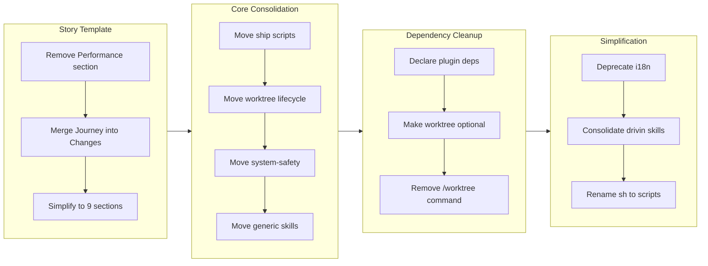

## 1. Overview

This branch performs a comprehensive plugin architecture reorganization, moving shared functionality into the core plugin, declaring formal dependency relationships, deprecating the i18n infrastructure, and consolidating drivin's granular skill directories into cohesive units. Ten tickets systematically restructured the four-plugin marketplace so that cross-plugin references follow declared dependency paths, the story template is simplified from 11 to 9 sections, worktrees become optional for trips, and all `sh/` directories are renamed to `scripts/` for consistency.

**Highlights:**

1. Moved ship scripts, worktree lifecycle scripts, system-safety, and four generic skills (commit, gather-git-context, gather-ticket-metadata, branching) from drivin/trippin into core, eliminating undeclared cross-plugin dependencies
2. Deprecated all i18n infrastructure -- deleted 43 `_ja.md` files, 2 i18n rule files, the translate skill, and translation references from 30+ agent and skill files
3. Consolidated drivin's 12 skill directories into 4 cohesive units (create-ticket, discover, drive, report), aligning skill names with their consuming commands

## 2. Motivation

The workaholic marketplace had accumulated organic cross-plugin dependencies over months of feature development. Ship scripts lived in trippin but were consumed by core. System-safety lived in drivin but was consumed by trippin. Generic utilities like `gather-git-context` lived in drivin but were needed by standards. These cross-plugin sibling references created implicit coupling that was neither documented nor enforced. Simultaneously, the i18n infrastructure -- translate skills, `_ja.md` duplicates, language navigation badges -- had become maintenance overhead without proportional value, since the simpler model of declaring the written language in CLAUDE.md proved sufficient. The story template carried a Performance section with metrics and a five-dimension decision review that added complexity without being actionable, and the Journey section belonged conceptually within Changes rather than standing alone. The drivin plugin's 12 skill directories were too granular, with many skills always consumed together by the same command or agent. This branch addressed all four concerns in a coordinated sequence: consolidate shared utilities into core, formalize dependency declarations, strip away i18n redundancy, and reorganize drivin's internal structure.

## 3. Changes

The branch began with story template restructuring to simplify the documentation format, then systematically moved shared functionality from drivin and trippin into core across four tickets. With the foundation in place, plugin dependencies were declared and worktree behavior was made flexible. The final phase simplified the codebase by deprecating i18n infrastructure, consolidating drivin's fragmented skills, and standardizing directory naming.

### 3-1. Restructure Story Template: Remove Performance and Merge Journey into Changes ([bd731c1](https://github.com/qmu/workaholic/commit/bd731c1))

Simplified the story template from 11 sections to 9 by removing the Performance section entirely and merging the Journey section (Mermaid flowchart and summary) into the Changes section as a preamble. Reduced story-writer from 4 parallel agents to 3 by dropping the performance-analyst invocation.

### 3-2. Move Ship Scripts from Trippin to Core ([7edb95b](https://github.com/qmu/workaholic/commit/7edb95b))

Relocated the three ship shell scripts (`pre-check.sh`, `merge-pr.sh`, `find-cloud-md.sh`) from trippin's ship skill to a new core ship skill. Updated all cross-plugin references in the unified `/ship` command to use core-local paths instead of reaching into trippin.

### 3-3. Move Worktree Lifecycle Scripts to Core Branching Skill ([b8bd321](https://github.com/qmu/workaholic/commit/b8bd321))

Moved `ensure-worktree.sh`, `cleanup-worktree.sh`, and `list-trip-worktrees.sh` from trippin's trip-protocol to core's branching skill, completing the worktree lifecycle in core. Fixed the fragile relative path in `detect-context.sh` that traversed two plugin directories.

### 3-4. Move System-Safety Skill from Drivin to Core ([6806cbb](https://github.com/qmu/workaholic/commit/6806cbb))

Moved the system-safety skill and its `detect.sh` script from drivin to core, since both drivin and trippin consumed it. Updated cross-plugin references in trippin's trip-protocol and drive's workflow to use core-local paths.

### 3-5. Make Worktree Optional for /trip Command ([96f5660](https://github.com/qmu/workaholic/commit/96f5660))

Added a choice to the `/trip` command: create a worktree for isolation or create a branch only in the main working tree. Created a new `create-trip-branch.sh` script in core branching and updated the ship command to skip worktree cleanup gracefully when no worktree exists.

### 3-6. Declare Plugin Dependencies and Clean Up Cross-Plugin References ([7b50ea2](https://github.com/qmu/workaholic/commit/7b50ea2))

Added explicit `dependencies` fields to all four plugin.json files: core and standards have no dependencies, drivin depends on core, trippin depends on core and drivin. Audited all remaining `${CLAUDE_PLUGIN_ROOT}/../` references and documented the dependency graph in CLAUDE.md.

### 3-7. Remove /worktree Command from Core Plugin ([1212ddc](https://github.com/qmu/workaholic/commit/1212ddc))

Deleted the standalone `/worktree` command since all worktree operations (adopt, eject, list) are already handled automatically by higher-level commands (`/trip`, `/ship`, `/drive`, `/ticket`) through the branching skill scripts.

### 3-8. Consolidate Generic Skills from Drivin to Core Plugin ([b8659cb](https://github.com/qmu/workaholic/commit/b8659cb))

Moved four generic skills (commit, gather-git-context, gather-ticket-metadata, and branching scripts) from drivin to core. Updated six frontmatter skill references across drivin and standards to use the `core:` prefix. The standards plugin no longer has any cross-plugin dependency on drivin.

### 3-9. Deprecate I18n-Related Configuration ([f5e569b](https://github.com/qmu/workaholic/commit/f5e569b))

Removed all i18n infrastructure: deleted 2 i18n rule files, 1 translate skill directory, and 43 `_ja.md` documentation files. Removed translate skill references from 15 agent frontmatter files, 4 analysis/writing skills, 10 lead skills, and 1 management skill. Simplified trippin language policy and removed language navigation from 6 README files.

### 3-10. Consolidate Drivin Skills into Cohesive Units ([e1b8696](https://github.com/qmu/workaholic/commit/e1b8696))

Consolidated drivin's 12 skill directories into 4: `create-ticket` (unchanged), `discover` (merging discover-history, discover-source, discover-ticket), `drive` (merging drive-workflow, drive-approval, write-final-report, archive-ticket, update-ticket-frontmatter), and `report` (merging write-story, create-pr, assess-release-readiness). Updated 6 agent files and the drive command frontmatter.

## 4. Outcome

The branch achieved a cleaner, more maintainable plugin architecture. Core now owns all shared utilities -- ship scripts, worktree lifecycle, system-safety, commit, git context gathering, ticket metadata, and branching operations -- making it the true foundation layer that other plugins build upon. Formal dependency declarations in plugin.json files codify the dependency graph: core and standards are independent bases, drivin depends on core, and trippin depends on both core and drivin. The i18n deprecation removed approximately 8,900 lines of redundant Japanese documentation and the infrastructure that generated it, simplifying the maintenance surface significantly. Drivin's internal structure went from 12 fragmented skill directories to 4 cohesive units whose names (discover, drive, report, create-ticket) directly correspond to their consuming commands and agents. The story template simplification from 11 to 9 sections and the version bump to v1.0.43 prepare the repository for the next release cycle. The net change across 194 files is approximately -8,900 lines -- a substantial reduction in codebase surface area.

## 5. Historical Analysis

This branch represents the culmination of an architectural trajectory that began with `drive-20260311-125319`, which created the core plugin and established the pattern of separating cross-cutting concerns from domain-specific workflows. The ship scripts were originally extracted from drivin to trippin in `drive-20260310-220224`, then the unified `/ship` command in core continued referencing trippin's copies -- this branch finally moves them to their natural home. The system-safety skill was created in drivin (`drive-20260311-125319`) and immediately consumed by trippin via a cross-plugin sibling path; moving it to core resolves an undeclared dependency that was flagged during `${CLAUDE_PLUGIN_ROOT}` migration in `trip-20260319-040153`. The i18n deprecation reverses decisions made across several early branches (`feat-20260123-191707` for multi-language policy, `feat-20260124-105903` for the translate skill) after repeated maintenance issues (`drive-20260212-122906` fixing duplicate Japanese specs, `drive-20260204-160722` removing translation from story-writer). The skill consolidation within drivin mirrors the same organizational philosophy that drove the standards plugin extraction in `drive-20260326-183949` -- reducing directory count to improve navigability without losing any behavioral content.

## 6. Concerns

- The `sh/` to `scripts/` rename touches every shell script path reference across all plugins; any path that was missed will cause exit code 127 failures at runtime (see [7b965c0](https://github.com/qmu/workaholic/commit/7b965c0) across all `plugins/*/skills/*/`)
- Core commands (`report.md`, `ship.md`) still contain soft references to trippin for trip-context routing, creating an optional reverse dependency that is not captured in core's empty `dependencies` array (see [7b50ea2](https://github.com/qmu/workaholic/commit/7b50ea2) in `plugins/core/commands/report.md`)
- The consolidated `drive` skill in drivin is approximately 400+ lines, exceeding the design principle guideline of 50-150 lines per skill, though the alternative of 5 separate directories was deemed worse for navigability (see [e1b8696](https://github.com/qmu/workaholic/commit/e1b8696) in `plugins/drivin/skills/drive/SKILL.md`)
- Generated documentation in `.workaholic/` (policies, specs) still references old skill paths from before the consolidation; these will auto-update on the next `/scan` run (see [b8659cb](https://github.com/qmu/workaholic/commit/b8659cb) in `.workaholic/policies/`)
- The `check-version-bump.sh` script hardcodes `main` as the base branch, which may need parameterization if the default branch ever changes (see [b8659cb](https://github.com/qmu/workaholic/commit/b8659cb) in `plugins/core/skills/branching/scripts/check-version-bump.sh`)

## 7. Ideas

- Add a link checker script that verifies all `${CLAUDE_PLUGIN_ROOT}/../` cross-plugin references resolve to files that actually exist, run as a pre-commit hook or CI step
- Consider a `.claude-plugin/exports.json` manifest that explicitly declares which agents and skills a plugin exposes for cross-plugin consumption, enabling build-time validation
- The `dependencies` field in plugin.json is currently a documentation convention; future marketplace releases could enforce it by refusing to load plugins with unsatisfied dependencies
- Branch-only trips (without worktrees) are invisible in the worktree discovery list; a `git branch --list 'trip/*'` fallback could surface these as resumable sessions in `/trip`
- The performance-analyst agent and analyze-performance skill are no longer invoked by story-writer; consider whether they still serve a purpose via `/scan` or should be removed entirely

## 8. Release Preparation

**Verdict**: Ready for release

### 8-1. Concerns

- None -- all changes are plugin configuration, shell scripts, documentation, and skill reorganization. The version bump to v1.0.43 is already committed. No external APIs or breaking behavioral changes are introduced.

### 8-2. Pre-release Instructions

- None -- standard release process applies. The version bump to v1.0.43 is already included in the branch.

### 8-3. Post-release Instructions

- Run `/scan` after release to regenerate `.workaholic/` documentation with updated skill paths and the simplified story template format.

## 9. Notes

- The branch includes three "infrastructure" commits not tied to specific tickets: renaming `sh/` to `scripts/` across all plugins (`7b965c0`), removing unused `design.pdf` and `memo.md` files (`50545cb`), and moving TypeScript and diagrams rules from drivin to standards (`77821d7`, `a8eb5b5`). These were discovered as necessary cleanup during the dependency audit.
- The net effect of the branch is a reduction of approximately 8,900 lines and 194 file changes, with the majority coming from the deletion of 43 `_ja.md` files and the removal of `design.pdf`.
- After this branch, the drivin plugin's skill structure mirrors its command structure: `/ticket` uses `create-ticket`, `/drive` uses `drive`, `/report` uses `report`, and the discoverer agents use `discover`. This one-to-one alignment was a deliberate design choice.
- The `scripts/` rename from `sh/` was applied uniformly to maintain consistency even though the old naming convention worked. This is a cosmetic change with broad file-touch impact.
