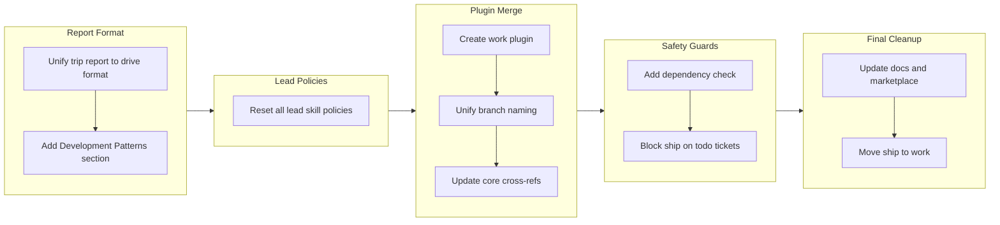

## 1. Overview

This branch merges the drivin and trippin plugins into a single unified work plugin, eliminates the drive/trip distinction in branch naming, resets lead skill policies for repopulation, and enhances the story format with a new Successful Development Patterns section. Ten tickets restructured the plugin architecture from four plugins (core, standards, drivin, trippin) to three (core, standards, work), unified branch naming from `drive-*`/`trip/*` to `work-YYYYMMDD-HHMMSS-feature`, added protective guards (dependency check, todo ticket blocker), and moved the ship command to its logical home in the work plugin.

**Highlights:**

1. Merged drivin and trippin into a unified work plugin, simplifying the dependency graph from a diamond to a single chain
2. Unified branch naming convention from separate `drive-*` and `trip/*` patterns to `work-YYYYMMDD-HHMMSS-feature`
3. Added Successful Development Patterns section to the story template for institutional knowledge capture

## 2. Motivation

The drivin and trippin plugins shared overlapping infrastructure -- trippin depended on drivin, both used the same report/ship pipeline through core, and the separation created unnecessary cross-plugin references. The branch naming divergence (`drive-*` vs `trip/*`) forced complex context detection logic and made the codebase harder to reason about. Meanwhile, the lead skill policies had accumulated default content that no longer reflected actual practice, and the story format lacked a mechanism for preserving effective patterns discovered during development. This branch addressed the structural debt by unifying the two workflow plugins, simplifying naming conventions, resetting stale policies, and adding knowledge capture to the development narrative.

## 3. Changes

The branch progressed through five phases: first unifying report formats and enhancing the story template, then resetting stale lead policies, merging the two workflow plugins with unified naming, adding safety guards for dependency checking and todo ticket enforcement, and finally cleaning up documentation and relocating the ship command.

### 3-1. Unify Trip Report Format to Match Drive Report Structure ([d4fc60f](https://github.com/qmu/workaholic/commit/d4fc60f))

Rewrote the trip report skill to produce the same 9-section drive report structure with YAML frontmatter, replacing the agent-centric Planner/Architect/Constructor/Journey template. Routed trip PR creation through the existing `create-or-update.sh` script to automatically handle frontmatter stripping.

### 3-2. Add Successful Development Patterns Section to Story Format ([d615068](https://github.com/qmu/workaholic/commit/d615068))

Added a new section 8 (Successful Development Patterns) to the story template for capturing effective patterns discovered during development. Extended the section-reviewer agent from sections 4-7 to 4-8, renumbered Release Preparation to section 9 and Notes to section 10.

### 3-3. Reset All Lead Skill Policies ([4ece896](https://github.com/qmu/workaholic/commit/4ece896))

Renamed "Default Policies" to "Policies" and erased all policy content across 10 lead skills. Updated the schema enforcement rule, all 10 lead agent files, and the leaders-principle skill to use the new terminology. The Role sections (Goal and Responsibility) were preserved unchanged.

### 3-4. Create Work Plugin by Merging Drivin and Trippin ([f769931](https://github.com/qmu/workaholic/commit/f769931))

Created the work plugin by moving all agents, commands, hooks, rules, and skills from both drivin and trippin into `plugins/work/`. Updated all internal cross-plugin references from `drivin:`/`trippin:` to `work:`, and simplified the dependency declaration to just core.

### 3-5. Unify Branch Naming to Work-Timestamp-Feature Format ([90b1e84](https://github.com/qmu/workaholic/commit/90b1e84))

Replaced the dual naming patterns (`drive-YYYYMMDD-HHMMSS` and `trip/<name>`) with a single `work-YYYYMMDD-HHMMSS-feature` convention. Updated context detection, worktree management scripts, and branching skill documentation. Maintained backward compatibility for existing `drive-*` and `trip/*` branches.

### 3-6. Update Core Cross-References for Work Plugin ([9084cf2](https://github.com/qmu/workaholic/commit/9084cf2))

Updated all cross-plugin references in core's report and ship commands from `drivin:`/`trippin:` to `work:`, including subagent type references, skill preloads, and script paths. Verified no remaining references to the old plugin names.

### 3-7. Add Core Dependency Check to Work Plugin ([41ce6e4](https://github.com/qmu/workaholic/commit/41ce6e4))

Created a `check-deps` skill with a shell script that verifies the core plugin is installed. Added dependency checks as the first step in all four work commands (drive, ticket, trip, scan) to provide clear error messages instead of cryptic file-not-found failures.

### 3-8. Update Documentation, Marketplace, and Remove Old Plugins ([59807ef](https://github.com/qmu/workaholic/commit/59807ef))

Removed the drivin and trippin plugin directories, updated marketplace.json to list work instead of drivin/trippin, rewrote CLAUDE.md project structure and dependency graph, and updated README.md with unified work plugin documentation.

### 3-9. Block Ship When Todo Tickets Remain ([ac7817a](https://github.com/qmu/workaholic/commit/ac7817a))

Added a todo ticket guard to the ship command that blocks merging when tickets remain in `.workaholic/tickets/todo/`. Created a `check-todo.sh` script and integrated it as a pre-merge check with options to move remaining tickets to icebox or stop.

### 3-10. Move Ship Command from Core to Work Plugin ([97e524e](https://github.com/qmu/workaholic/commit/97e524e))

Relocated the ship command and ship skill (including all shell scripts) from `plugins/core/` to `plugins/work/`. Updated skill preload references from cross-plugin to same-plugin and branching script paths to cross-plugin core references. Core now retains only the report command and shared skills.

## 4. Outcome

The branch accomplished a significant architectural simplification of the workaholic marketplace. The plugin count was reduced from four to three by merging drivin and trippin into a single work plugin, eliminating the artificial distinction between ticket-driven and exploration-based workflows. Branch naming was unified into a single convention that includes a human-readable feature suffix. The lead policy framework was reset for fresh repopulation. The story format gained a new section for preserving development patterns as institutional knowledge. Safety guards were added to prevent shipping incomplete work and to catch missing plugin dependencies early. The ship command was moved to its logical home alongside the workflows it serves.

## 5. Historical Analysis

The plugin architecture has evolved through several consolidation cycles. The original single-plugin design was split into core/drivin/trippin/standards to separate concerns, but the separation between drivin and trippin created more cross-plugin coupling than it eliminated -- trippin depended on drivin, and both shared reporting infrastructure through core. This branch's merger into work follows the same consolidation pattern seen in drive-20260329-173608, where 12 granular skill directories were consolidated into 4 cohesive units. The lead policy reset echoes the schema restructuring from drive-20260213-131416, where Role/Responsibility/Goal headings were reorganized across all leads. The story template continues its iterative evolution: from 11 sections to 9 (drive-20260329-173608), and now to 10 with the addition of development patterns. The ship command has traveled through drivin, trippin, core, and finally work -- each move reflecting the evolving understanding of where workflow-specific commands belong.

## 6. Concerns

- The branch naming backward compatibility for `drive-*` and `trip/*` patterns adds complexity to `detect-context.sh` that should eventually be removed once all legacy branches are merged (see [90b1e84](https://github.com/qmu/workaholic/commit/90b1e84) in `plugins/core/skills/branching/scripts/detect-context.sh`)
- The lead policy subsection headers (Implementation, Review, Documentation, Execution) were erased along with content, leaving only the `## Policies` heading -- the user plans manual repopulation but empty sections could cause confusion if scanned before repopulation (see [4ece896](https://github.com/qmu/workaholic/commit/4ece896) in `plugins/standards/skills/lead-*/SKILL.md`)
- Manager-tier skills and `define-manager.md` still reference "Default Policies" since only leads were reset; this terminology inconsistency between leads and managers should be addressed in a future ticket (see [4ece896](https://github.com/qmu/workaholic/commit/4ece896) in `.claude/rules/define-manager.md`)

## 7. Ideas

- Consider moving the `/report` command from core to work for consistency, since it also references work-specific skills and context detection
- Add automated validation that all `${CLAUDE_PLUGIN_ROOT}/../<plugin>/` references resolve to declared dependencies in `plugin.json`
- Reset manager-tier policies to match the lead policy cleanup, establishing a consistent "Policies" terminology across both tiers
- Consider removing backward compatibility for `drive-*` and `trip/*` branch patterns in a future cleanup branch

## 8. Successful Development Patterns

- Sequencing the report format unification (trip-to-drive) before the plugin merge ensured the write-trip-report skill was already aligned with the drive template when it was moved into the work plugin, avoiding a second round of format changes
- Processing the companion tickets (format unification and development patterns section) as a pair in the same branch preserved format consistency and allowed the new section to be included in the trip report template immediately
- Using the artifact-to-section mapping approach for trip reports -- mapping trip artifacts (direction, reviews, design) to drive sections (Overview/Motivation, Concerns/Ideas, Changes) -- produced a natural fit because the underlying information categories aligned despite the different source structures
- Routing trip PR creation through the existing `create-or-update.sh` script instead of raw `gh pr create` automatically handled frontmatter stripping, eliminating the need for trip-specific PR creation logic
- Creating a dedicated `check-deps` skill with a shell script for dependency validation follows the established pattern of extracting shell logic into skill scripts, preventing the inline conditional anti-pattern documented in CLAUDE.md

## 9. Release Preparation

**Verdict**: Ready for release

### 9-1. Concerns

- None - changes are configuration-only plugin restructuring with no runtime impact

### 9-2. Pre-release Instructions

- None - standard release process applies

### 9-3. Post-release Instructions

- None - no special post-release actions needed

## 10. Notes

This is the largest architectural change since the original plugin split. The merge of drivin and trippin into work reflects the realization that the drive/trip distinction was a workflow mode difference, not a plugin boundary. Both workflows share the same lifecycle (ticket/implement/report/ship or plan/build/report/ship) and the same infrastructure. The unified work plugin makes this explicit.
