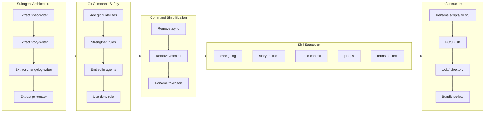

## 1. Summary

1. Extract documentation agents (spec-writer, terms-writer, story-writer, changelog-writer, pr-creator) for concurrent execution
2. Prohibit `git -C` flag via settings.json deny rule after multiple failed approaches
3. Extract reusable skills from agents (changelog, story-metrics, spec-context, pr-ops, terms-context)
4. Rename `/pull-request` to `/report` and remove standalone `/sync-workaholic` and `/commit` commands
5. Convert shell scripts to POSIX sh for Alpine Docker compatibility
6. Add topic tree flowchart to story generation for visual PR overview
7. Reorganize tickets into todo/icebox/archive structure
8. Bundle shell scripts in skills instead of using settings.json allow rules

## 2. Motivation

The `/pull-request` command had grown complex, handling documentation generation, story writing, and PR creation all inline. This made the main conversation context bloated and reduced maintainability. Additionally, subagents were triggering permission prompts by using `git -C` flags despite rules prohibiting it - rules do not inherit into subagent contexts.

The work aimed to establish a sustainable pattern: commands as lightweight orchestrators invoking specialized subagents, with reusable logic extracted into skills. Infrastructure improvements (POSIX shell, directory reorganization, bundled scripts) would prepare for Docker deployment and improve developer experience for plugin users.

## 3. Journey

The work progressed through five distinct phases over a single intensive day.

The first phase established the subagent architecture. The sync-workaholic command split into spec-writer and terms-writer subagents. The pull-request command then extracted story-writer, changelog-writer, and pr-creator, enabling all four documentation agents to run concurrently.

The second phase tackled git command safety. Initial attempts added guidelines to subagents, but the `-C` flag persisted. A rule file for subagents failed because rules do not apply to subagent prompts. Embedding guidelines in each agent file finally worked, but was not DRY. The solution came from discovering Claude Code's `settings.json` deny feature, which centrally blocks prohibited commands.

The third phase extracted skills from agents. Each agent's mechanical logic (bash scripts for metrics, changelog generation, PR operations) moved into dedicated skills, leaving agents focused on LLM reasoning tasks.

The fourth phase improved infrastructure: renaming `scripts/` to `sh/`, converting bash to POSIX shell for Docker compatibility, reorganizing tickets into `todo/icebox/archive`, and converting i18n rules to preloaded skills.

The fifth phase refined the approach to permission management. The initial attempt to add allow rules to `settings.json` was incorrect because that file is user-local, not part of the plugin distribution. The solution was to bundle shell scripts within skills, following the pattern already established by spec-context. This ensures plugin users experience no permission prompts.

## 4. Changes

### 4.1. Convert sync-workaholic command to subagent ([d4e6a07](https://github.com/qmu/workaholic/commit/d4e6a07))

Split the sync-workaholic command into two specialized subagents (spec-writer and terms-writer) for better separation of concerns and parallel execution capability.

### 4.2. Extract story-writer as subagent from pull-request command ([4c83014](https://github.com/qmu/workaholic/commit/4c83014))

Moved story generation logic into a dedicated subagent to preserve main conversation context during extensive file reading.

### 4.3. Extract changelog-writer subagent and run 4 agents concurrently ([b65d371](https://github.com/qmu/workaholic/commit/b65d371))

Created changelog-writer subagent and modified pull-request to invoke all four documentation agents (spec-writer, terms-writer, story-writer, changelog-writer) in parallel.

### 4.4. Extract pr-creator subagent from pull-request command ([4ee763d](https://github.com/qmu/workaholic/commit/4ee763d))

Isolated GitHub PR operations into a dedicated subagent handling PR existence checks, title derivation, and create/update operations.

### 4.5. Add git guidelines to subagents to prevent confirmation prompts ([7933c67](https://github.com/qmu/workaholic/commit/7933c67))

Added explicit "Never use git -C" guidelines to story-writer, spec-writer, and terms-writer to prevent permission prompts.

### 4.6. Remove /sync-workaholic command ([d142373](https://github.com/qmu/workaholic/commit/d142373))

Removed the standalone command since /pull-request already runs spec-writer and terms-writer as part of documentation generation.

### 4.7. Rename terminology to terms ([d213ea1](https://github.com/qmu/workaholic/commit/d213ea1))

Shortened directory and agent names from "terminology" to "terms" for brevity throughout the codebase.

### 4.8. Fix Decision Review format in story-writer ([d32bc52](https://github.com/qmu/workaholic/commit/d32bc52))

Updated story-writer to explicitly show the expected table format with 5 dimensions for performance-analyst output.

### 4.9. Consolidate git guidelines into a rule for all subagents ([b94045a](https://github.com/qmu/workaholic/commit/b94045a))

Created a subagents rule file to centralize git command guidelines (later discovered rules do not apply to subagents).

### 4.10. Embed git guidelines directly in each subagent definition ([13101ad](https://github.com/qmu/workaholic/commit/13101ad))

After rule approach failed, embedded CRITICAL git guidelines with WRONG/RIGHT examples directly in each agent using Bash tool.

### 4.11. Remove /commit command ([4e7658c](https://github.com/qmu/workaholic/commit/4e7658c))

Removed standalone commit command that disrupted /drive workflow and encouraged ad-hoc commits without tickets.

### 4.12. Rename /pull-request to /report ([3005144](https://github.com/qmu/workaholic/commit/3005144))

Renamed command to better reflect its comprehensive documentation generation role beyond just PR creation.

### 4.13. Make pr-creator always succeed on first attempt ([70982e1](https://github.com/qmu/workaholic/commit/70982e1))

Simplified pr-creator to always use body-file approach, eliminating shell escaping issues with HEREDOC.

### 4.14. Push branch to remote during /report command ([03f7946](https://github.com/qmu/workaholic/commit/03f7946))

Added push step before PR creation to ensure branch is on remote before gh pr create.

### 4.15. Extract changelog skill from changelog-writer agent ([396aa2f](https://github.com/qmu/workaholic/commit/396aa2f))

Moved changelog generation logic into a dedicated skill with bash script for reusability.

### 4.16. Extract story metrics skill from story-writer agent ([f1670e0](https://github.com/qmu/workaholic/commit/f1670e0))

Created story-metrics skill with script to calculate commits, timestamps, duration, and velocity.

### 4.17. Extract spec context skill from spec-writer agent ([298d0ea](https://github.com/qmu/workaholic/commit/298d0ea))

Moved context gathering logic into spec-context skill for branch and spec auditing.

### 4.18. Extract PR operations skill from pr-creator agent ([b10408b](https://github.com/qmu/workaholic/commit/b10408b))

Created pr-ops skill to handle GitHub PR create/update operations via bash script.

### 4.19. Move git -C prohibition from agents to settings.json deny ([08c9488](https://github.com/qmu/workaholic/commit/08c9488))

Centralized command prohibition using Claude Code's settings.json deny feature instead of duplicating in agents.

### 4.20. Add topic tree diagram to story generation ([cdd87a5](https://github.com/qmu/workaholic/commit/cdd87a5))

Added Mermaid flowchart diagram to stories for visual overview of ticket relationships.

### 4.21. Fix pr-ops script to use REST API instead of gh pr edit ([2b639b2](https://github.com/qmu/workaholic/commit/2b639b2))

Replaced gh pr edit with gh api REST endpoint to bypass GraphQL errors from Projects (classic) deprecation.

### 4.22. Fix /ticket to skip commit step when called during /drive ([6cb68d0](https://github.com/qmu/workaholic/commit/6cb68d0))

Added conditional logic to skip commit when /ticket is invoked during /drive session.

### 4.23. Extract /drive and /ticket instructions into skills ([2777671](https://github.com/qmu/workaholic/commit/2777671))

Refactored drive and ticket commands to be lightweight orchestrators referencing skills for detailed instructions.

### 4.24. Add dependency graph to developer guide ([29fe43b](https://github.com/qmu/workaholic/commit/29fe43b))

Added mermaid flowchart showing command/agent/skill dependency relationships in architecture docs.

### 4.25. Add related history section to ticket creation ([d8de667](https://github.com/qmu/workaholic/commit/d8de667))

Enhanced ticket creation to search archived tickets and include related history for implementer context.

### 4.26. Rename scripts/ to sh/ in skills for brevity ([39afac2](https://github.com/qmu/workaholic/commit/39afac2))

Shortened skill script directory names from scripts/ to sh/ across all skills.

### 4.27. Move active tickets from root to todo/ subdirectory ([a1d40f9](https://github.com/qmu/workaholic/commit/a1d40f9))

Reorganized ticket directory into todo/icebox/archive structure for clearer organization.

### 4.28. Convert shell scripts to POSIX sh for Alpine Docker compatibility ([9ba1cf6](https://github.com/qmu/workaholic/commit/9ba1cf6))

Modified all shell scripts to use POSIX-compliant syntax for Alpine Linux container compatibility.

### 4.29. Convert i18n rule to skill and preload in documentation agents ([09da3c1](https://github.com/qmu/workaholic/commit/09da3c1))

Created i18n skill with translation requirements and preloaded it in spec-writer and terms-writer agents.

### 4.30. Simplify topic tree and move to Journey section ([f5667ee](https://github.com/qmu/workaholic/commit/f5667ee))

Changed topic tree from mindmap to flowchart format, kept as section 0 for better PR reviewer experience.

### 4.31. Improve story Changes section granularity and Journey brevity ([c63dd53](https://github.com/qmu/workaholic/commit/c63dd53))

Updated story format to have one Changes subsection per ticket with commit links, and condensed Journey narrative.

### 4.32. Bundle shell scripts for permission-free skills ([7ff6ae9](https://github.com/qmu/workaholic/commit/7ff6ae9))

Reverted settings.json allow rules and instead bundled shell scripts within skills for permission-free operation in plugin distribution.

### 4.33. Fix topic tree inconsistency between story-writer template and output ([edea513](https://github.com/qmu/workaholic/commit/edea513))

Updated story-writer template to show Topic Tree placement matching actual agent behavior.

### 4.34. Fix Topic Tree placement to be inside Journey section ([34f3c50](https://github.com/qmu/workaholic/commit/34f3c50))

Moved Topic Tree from section 0 into Journey section, resulting in 7 sections (1-7) with embedded flowchart.

## 5. Outcome

The branch established a scalable architecture pattern for the workaholic plugin:

- **Commands as orchestrators**: `/report` now invokes 5 subagents concurrently instead of containing all logic inline
- **Skills for reusable logic**: 7 skills (archive-ticket, changelog, story-metrics, spec-context, pr-ops, terms-context, i18n) extract bash scripts and documentation patterns
- **Centralized command prohibition**: `settings.json` deny rule blocks `git -C` globally, eliminating duplication
- **Bundled scripts for distribution**: Skills bundle their shell scripts so plugin users experience no permission prompts
- **Infrastructure readiness**: POSIX shell compatibility and organized directory structure prepare for containerized deployment

The git safety journey revealed an important lesson: rules and embedded instructions do not reliably constrain subagent behavior. The `settings.json` deny feature is the authoritative mechanism for command prohibition. Similarly, `settings.json` allow rules are user-local and should not be relied upon for plugin distribution - bundled scripts are the correct solution.

## 6. Performance

**Metrics**: 86 commits over 1 day (86.0 commits/day)

### 6.1. Pace Analysis

Development maintained an exceptionally high velocity of approximately 4 commits per hour across a 20-hour session. Commits were predominantly small and focused, with clear separation between ticket creation ("Add ticket for X") and implementation commits. The work flowed through distinct phases, with bursts of activity during refactoring sessions followed by documentation updates.

The topic tree visualization went through multiple iterations, showing willingness to iterate on user experience. The git safety work similarly evolved through 4 approaches before settling on settings.json deny. The final tickets on bundled scripts and topic tree consistency corrected earlier mistakes, demonstrating continuous improvement even late in the branch.

### 6.2. Decision Review

| Dimension      | Rating   | Notes                                                                          |
| -------------- | -------- | ------------------------------------------------------------------------------ |
| Consistency    | Strong   | All 34 tickets followed identical format with frontmatter, overview, steps     |
| Intuitivity    | Strong   | Naming evolved toward clarity: terminology to terms, pull-request to report    |
| Describability | Adequate | Some tickets have vague effort estimates; others missing entirely              |
| Agility        | Strong   | Quick pivots on git safety and permission approaches when initial ideas failed |
| Density        | Adequate | 86 commits for 34 tickets includes many incremental fixes; could consolidate   |

**Strengths**: Rapid iteration with clear commit messages. Discovery and adoption of settings.json deny rule shows effective problem-solving. Concurrent agent execution improves performance significantly. Final corrections on bundled scripts and topic tree consistency show attention to detail.

**Areas for Improvement**: Effort estimates inconsistent across tickets. Topic tree took multiple commits to stabilize - could prototype locally first. Consider squashing fix commits during drive workflow. The allow-rules approach was committed before realizing it would not work for plugin distribution.

## 7. Notes

This branch represents a significant architectural evolution. The subagent pattern should be applied to future command development. New agents should:

1. Preload relevant skills via frontmatter
2. Rely on settings.json deny for command prohibition (not embedded instructions)
3. Bundle shell scripts within skills for permission-free operation
4. Output structured data for orchestrating commands

The gh api REST approach for PR updates is now the standard due to GitHub's Projects (classic) deprecation affecting GraphQL operations. Settings.json allow rules should not be used for plugin permissions - bundled scripts are the correct solution.
