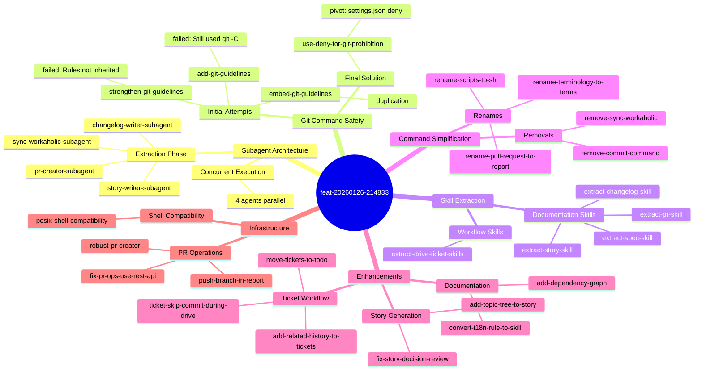

## 0. Topic Tree

## 1. Summary

1. Subagent architecture for documentation generation with parallel execution
2. Skill extraction pattern for reusable bash-based functionality
3. Command simplification: removed /sync-workaholic and /commit, renamed /pull-request to /report
4. Centralized git -C prohibition via settings.json deny rule
5. Topic tree diagram added to story generation for visual PR overview
6. Tickets reorganized to todo/ subdirectory with related history section
7. Shell scripts converted to POSIX sh for Alpine Docker compatibility
8. PR operations fixed to use REST API instead of GraphQL
9. i18n enforcement converted from rule to skill for documentation agents

## 2. Motivation

The /pull-request command had grown into a monolithic orchestrator handling documentation generation, CHANGELOG updates, story creation, and GitHub PR operations all inline. This consumed significant context window space and made the command difficult to maintain. Additionally, subagents spawned via the Task tool were not inheriting rules from the parent context, causing them to trigger confirmation prompts when running git commands.

The work aimed to decompose the pull-request command into focused subagents that each handle a specific documentation concern, enabling parallel execution and better separation of responsibilities. Secondary goals included removing redundant commands, simplifying terminology, establishing reusable skill patterns for mechanical operations, and improving the overall developer experience with better documentation tools.

## 3. Journey

Development began with the sync-workaholic command, splitting it into spec-writer and terminology-writer subagents. This established the pattern for subsequent extractions. The user requested the separation rather than a single agent, recognizing that spec and terminology updates are independent concerns.

With the pattern proven, story-writer extraction followed smoothly. The more significant change came with changelog-writer extraction, which enabled running all four documentation agents (spec-writer, terminology-writer, changelog-writer, story-writer) concurrently during PR creation. The pr-creator subagent extraction completed the pull-request command decomposition.

A persistent challenge emerged: subagents kept using `git -C` flag syntax, triggering permission confirmation prompts. The initial fix added git guidelines to individual agent files, but this proved insufficient. A centralized rule file was attempted but failed because subagents don't inherit rules from the main conversation context. Embedding the prohibition directly in each agent worked but required duplicating the "CRITICAL" section across five files. The final solution discovered Claude Code's settings.json deny rules, which centralize the prohibition at the permission level.

With the architecture stabilized, housekeeping followed. The /sync-workaholic command became redundant since /pull-request already invoked all its subagents. Similarly, the /commit command was removed because it encouraged ad-hoc commits without tickets. Finally, /pull-request was renamed to /report to better reflect its documentation-generation purpose.

The skill extraction phase moved mechanical bash operations out of agent instructions into dedicated skills. Four skills were created: changelog (generates CHANGELOG entries), story-metrics (calculates commit counts and velocity), spec-context (gathers branch context), and pr-ops (handles PR creation/update). The /drive and /ticket commands also received skill extractions (drive-workflow, ticket-format) to reduce their inline complexity.

Enhancements followed: a topic tree mindmap was added to story generation for visual PR overviews, the dependency graph was added to the developer guide, and related history sections help ticket creators understand prior work in the same area. The ticket directory was reorganized to use todo/ for active tickets, aligning with common task management conventions.

Infrastructure improvements addressed cross-platform compatibility: shell scripts were converted from bash to POSIX sh for Alpine Linux containers, and the pr-ops script was fixed to use GitHub's REST API instead of GraphQL (which failed on repositories with Projects classic enabled). The i18n rule was converted to a skill that documentation agents preload, ensuring translation requirements are enforced during /report.

## 4. Changes

### 4.1. Convert sync-workaholic command to specialized subagents

The `/sync-workaholic` command was refactored from a single command into two specialized subagents: spec-writer (handling `.workaholic/specs/` updates) and terminology-writer (handling `.workaholic/terminology/` updates). The command was updated to orchestrate both subagents in parallel, improving separation of concerns while maintaining backward compatibility.

### 4.2. Extract story-writer as subagent from pull-request command

Story generation logic was extracted from the pull-request command into a dedicated story-writer subagent. This includes gathering source data from archived tickets, calculating performance metrics, creating story files with YAML frontmatter, generating all 7 story sections, and invoking the performance-analyst for decision review. The extraction keeps extensive file reads out of the main PR conversation context.

### 4.3. Extract changelog-writer subagent and run 4 agents concurrently

A new changelog-writer subagent was created to handle CHANGELOG.md updates from archived tickets. The pull-request command was modified to run all 4 documentation agents (changelog-writer, story-writer, spec-writer, terminology-writer) concurrently via parallel Task invocations. After all agents complete, a single commit consolidates all documentation changes.

### 4.4. Extract pr-creator subagent from pull-request command

The GitHub PR creation/update logic was extracted into a pr-creator subagent. This handles checking for existing PRs, reading and processing story files, deriving PR titles, and creating or updating PRs via the `gh` CLI. The extraction completes the decomposition of pull-request into focused subagents.

### 4.5. Add git guidelines to subagents to prevent confirmation prompts

Subagents spawned via the Task tool do not inherit parent context rules. This caused story-writer, spec-writer, and terminology-writer to use `git -C` variations, triggering confirmation prompts. A "Git Command Guidelines" section was added to each affected subagent instructing them to run git commands from the working directory without the `-C` flag.

### 4.6. Remove /sync-workaholic command

The `/sync-workaholic` command was removed as redundant. The `/pull-request` command now runs spec-writer and terminology-writer (plus changelog-writer and story-writer) as part of its documentation generation step. All documentation references were updated to reflect this change.

### 4.7. Rename terminology to terms

The "terminology" naming was changed to "terms" throughout the codebase for brevity. This included renaming `.workaholic/terminology/` to `.workaholic/terms/`, renaming the terminology-writer agent to terms-writer, and updating all text references in documentation and configuration files.

### 4.8. Fix Decision Review table format in story-writer

The story-writer agent was producing Decision Review sections without the expected table format that the performance-analyst subagent outputs. The story-writer instructions were updated to explicitly show the expected table structure (5 dimensions with ratings and notes), ensuring consistent formatting across generated stories.

### 4.9. Consolidate git guidelines into a rule for all subagents

An attempt was made to create a centralized rule file (`plugins/core/rules/subagents.md`) for git guidelines. However, this approach failed because subagents don't inherit rules from the main conversation context.

### 4.10. Embed git -C prohibition in each subagent

With the rule approach failing, the "CRITICAL: Git Command Format" section was embedded directly in each subagent that uses the Bash tool. This is intentional duplication since there's no include mechanism for agent definitions.

### 4.11. Remove /commit command

The standalone `/commit` command was removed from the core plugin. Running `/commit` during a `/drive` session flushed context, disrupting the workflow. Additionally, the command encouraged ad-hoc commits without tickets, undermining the ticket-driven development philosophy where every change should be documented and tracked.

### 4.12. Rename /pull-request to /report

The `/pull-request` command was renamed to `/report`. The new name better reflects that this command generates comprehensive documentation (changelog, story, specs, terms) in addition to creating a GitHub PR. "Report" emphasizes the documentation/narrative aspect of the workflow.

### 4.13. Make pr-creator always succeed on first attempt

The pr-creator subagent was simplified to always use the `--body-file` approach for PR creation/update, avoiding shell escaping issues with HEREDOC. A simple file-based workflow writes story content to a temp file first, then uses `--body-file` for both create and edit operations.

### 4.14. Push branch to remote during /report command

A push step was added to the /report command before PR creation. This ensures the branch is pushed to remote with `git push -u origin <branch-name>` before `gh pr create` is called, preventing failures when the branch hasn't been pushed yet.

### 4.15. Extract changelog skill from changelog-writer agent

The changelog generation logic was extracted into a dedicated skill at `plugins/core/skills/changelog/`. The skill includes a bash script that reads archived tickets, extracts commit_hash and category from frontmatter, and generates formatted changelog entries grouped by category. The agent now preloads this skill via the `skills:` frontmatter field.

### 4.16. Extract story-metrics skill from story-writer agent

The performance metrics calculation logic was extracted into a skill at `plugins/core/skills/story-metrics/`. The bash script calculates commit counts, timestamps, duration, and velocity, outputting JSON for reliable parsing. The agent preloads this skill and uses the script output for story frontmatter.

### 4.17. Extract spec-context skill from spec-writer agent

The context gathering logic was extracted into a skill at `plugins/core/skills/spec-context/`. The bash script gets the current branch name, lists archived tickets, lists existing spec files, and gets the diff against main. The agent preloads this skill and uses the output for spec updates.

### 4.18. Extract pr-ops skill from pr-creator agent

The PR creation/update logic was extracted into a skill at `plugins/core/skills/pr-ops/`. The bash script handles frontmatter stripping, PR existence checking, and gh CLI operations. The agent now focuses on title derivation while the skill handles mechanical operations.

### 4.19. Move git -C prohibition to settings.json deny rule

The duplicated "CRITICAL: Git Command Format" sections were removed from all agent files. A single `deny` rule was added to `.claude/settings.json` using the pattern `"Bash(git -C:*)"`. This centralized prohibition is enforced at the Claude Code permission level before any subagent execution.

### 4.20. Add topic tree diagram to story generation

A Mermaid mindmap diagram was added to generated stories as section "0. Topic Tree". This visualizes the hierarchy of changes, showing how tickets relate to themes and each other. The diagram provides a quick visual overview before reviewers read the detailed narrative.

### 4.21. Fix pr-ops script to use REST API instead of gh pr edit

The `gh pr edit` command failed with a GraphQL error on repositories with Projects (classic) enabled. The pr-ops script was updated to use `gh api` with the REST endpoint `PATCH /repos/{owner}/{repo}/pulls/{pull_number}`, which bypasses the GraphQL layer entirely.

### 4.22. Fix /ticket to skip commit step when called during /drive

When `/ticket` is invoked during a `/drive` session, it now skips the commit step. The drive command's archive script includes uncommitted ticket files via `git add -A`, so tickets created mid-drive will be committed with the next implementation.

### 4.23. Extract /drive and /ticket instructions into skills

The `/drive` and `/ticket` commands were reorganized to follow the skill preloading pattern. Two new skills were created: ticket-format (ticket file structure and conventions) and drive-workflow (implementation workflow for processing tickets). The commands became lightweight orchestrators referencing these skills.

### 4.24. Add dependency graph to developer guide

A Mermaid flowchart was added to `.workaholic/specs/developer-guide/architecture.md` showing how commands, agents, and skills reference each other. This helps developers understand the plugin dependency structure at a glance.

### 4.25. Add related history section to ticket creation

When creating a new ticket, the ticket command now searches archived tickets for related past work. These are displayed as a "Related History" section in the ticket, providing context about previous work in the same area.

### 4.26. Rename scripts/ to sh/ in skills for brevity

The `scripts/` subdirectory was renamed to `sh/` in all skills for brevity. This creates a cleaner path structure: `plugins/core/skills/<name>/sh/*.sh`.

### 4.27. Move active tickets to todo/ subdirectory

The ticket directory structure was reorganized to use `.workaholic/tickets/todo/` for active tickets instead of placing them directly in `.workaholic/tickets/`. This creates a cleaner three-tier structure: todo/, icebox/, archive/.

### 4.28. Convert shell scripts to POSIX sh for Alpine compatibility

All shell scripts were converted from bash to POSIX sh with `#!/bin/sh -eu` shebang. This prepares for running Claude Code inside Docker containers where Alpine Linux (which lacks bash by default) may be used. A new rule file enforces this convention for future scripts.

### 4.29. Convert i18n rule to skill for documentation agents

The i18n requirements for `.workaholic/` were extracted from the rule file into a dedicated skill that documentation agents (spec-writer, terms-writer) preload. This ensures translation requirements are enforced during /report, as agents don't passively read rules but do receive preloaded skill content.

## 5. Outcome

The `/report` command is now a lightweight orchestrator that delegates to five specialized subagents (spec-writer, terms-writer, changelog-writer, story-writer, pr-creator). Documentation generation runs concurrently, improving performance. The git confirmation prompt issue was resolved through settings.json deny rules, a more maintainable approach than embedding instructions.

The skill extraction established a reusable pattern: bash scripts handle mechanical operations (file reading, git commands, API calls) while agents handle LLM-dependent decisions (content generation, title derivation). Eight new skills demonstrate this pattern: changelog, story-metrics, spec-context, pr-ops, ticket-format, drive-workflow, i18n, and command-prohibition.

The simplified command structure (only `/ticket`, `/drive`, `/report`, `/release`, `/branch`) reinforces the ticket-driven workflow philosophy where every change flows through proper documentation channels.

Infrastructure improvements ensure cross-platform compatibility with POSIX shell scripts and REST API usage for GitHub operations. The ticket workflow was enhanced with related history sections and the todo/ subdirectory structure.

## 6. Performance

**Metrics**: 58 commits over 1 day (58.0 commits/day)

### 6.1. Pace Analysis

All 58 commits occurred within a single 10.33-hour session on 2026-01-27. The pace was remarkably consistent, averaging 5.6 commits per hour sustained throughout. Commits alternated between ticket creation ("Add ticket for...") and implementation commits, showing disciplined adherence to the ticket-driven workflow.

The session had distinct phases:
1. **Subagent extraction** (4 subagents created): Established the pattern of decomposition
2. **Git guideline iterations** (4 attempts): Demonstrates resilience through failed approaches
3. **Command cleanup** (3 changes): Housekeeping to simplify the command surface
4. **Skill extraction** (8 skills): Applied the pattern systematically
5. **Enhancements** (6 improvements): Added topic tree, dependency graph, related history
6. **Infrastructure** (4 changes): POSIX compatibility, REST API, i18n skill

Commit messages used clear action verbs (Extract, Remove, Rename, Add, Fix, Move, Convert) that immediately convey the change type. The "Add ticket for..." pattern appears 29 times, demonstrating the workflow of writing specs before implementing.

### 6.2. Decision Review

| Dimension      | Rating   | Notes                                                                                                    |
| -------------- | -------- | -------------------------------------------------------------------------------------------------------- |
| Consistency    | Strong   | All 29 tickets followed identical format with frontmatter, overview, implementation steps, and final report |
| Intuitivity    | Strong   | Naming aligned with conventions: subagent pattern, skill extraction, todo/icebox/archive structure        |
| Describability | Strong   | Commit messages clearly describe changes; ticket titles are self-explanatory                             |
| Agility        | Strong   | Quick pivots when solutions failed; git guidelines evolved through 4 iterations to settings.json deny    |
| Density        | Adequate | Changes span multiple concerns (subagents, skills, commands, infra) but remained thematically coherent   |

**Strengths**: Excellent incremental decomposition strategy. Each extraction was independent and testable. Pattern recognition enabled efficient reuse across four subagent extractions and eight skill extractions. Demonstrated resilience when git guideline approaches failed, pivoting through inline instructions, rule file, embedded instructions, and finally settings.json deny. The branch maintained clear thematic coherence despite its scope.

**Areas for Improvement**: The git -C prohibition issue required four iterations to resolve. Earlier investigation of Claude Code's deny rule capability could have shortened this journey. The branch scope was broad; future work might benefit from smaller, more focused branches (e.g., separate branches for subagent architecture vs skill extraction vs infrastructure improvements).

## 7. Notes

- The spec-writer and terms-writer subagents remain available for independent use, though the primary workflow is now through `/report`
- Historical references to "terminology", "/sync-workaholic", "/commit", and "/pull-request" in archived tickets and stories were intentionally preserved as historical records
- The settings.json deny approach should be the default for command prohibitions rather than embedding in agent instructions
- Future agents that use Bash automatically benefit from the centralized git -C prohibition
- POSIX sh compatibility enables running in Alpine-based Docker containers without bash installation
- The topic tree diagram provides a visual "table of contents" that complements the numbered Summary list
