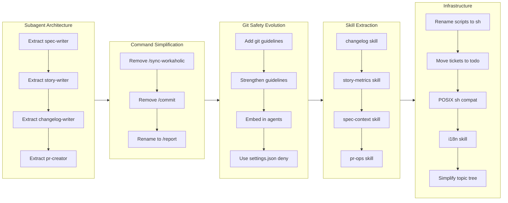

## 0. Topic Tree

## 1. Summary

1. Extract documentation agents (spec-writer, story-writer, changelog-writer, pr-creator) to run concurrently
2. Remove redundant commands (/sync-workaholic, /commit) and rename /pull-request to /report
3. Centralize git -C prohibition via settings.json deny rule after multiple iteration attempts
4. Extract skills from agents (changelog, story-metrics, spec-context, pr-ops) for maintainability
5. Add topic tree visualization (simplified from mindmap to flowchart) and dependency graph documentation
6. Infrastructure improvements: POSIX shell compatibility, ticket directory reorganization, i18n skill

## 2. Motivation

The `/pull-request` command had grown into a monolithic orchestrator handling changelog generation, story writing, spec synchronization, terminology updates, and PR creation all inline. This created a massive context window burden and made the command difficult to maintain. Additionally, the lack of concurrent execution meant documentation generation was slower than necessary.

A secondary concern was preventing subagents from using `git -C` flags, which triggered confirmation prompts and disrupted automated workflows. Multiple approaches were attempted before finding the correct solution.

## 3. Journey

The work began with a fundamental architectural shift: converting the sync-workaholic functionality into specialized subagents. The developer first split sync-workaholic into spec-writer and terminology-writer agents, then extracted story-writer and changelog-writer from the pull-request command. Finally, pr-creator was separated to handle GitHub operations. This enabled the pull-request command to orchestrate four documentation agents running concurrently.

With subagent architecture established, attention turned to git command safety. Subagents do not inherit parent context rules, so the initial attempt added git guidelines directly to each agent file. This proved insufficient - agents still used `git -C`. A rule file approach was tried next, but rules do not apply to subagent prompts. The developer then embedded stronger "CRITICAL" warnings in each agent definition. Eventually, the correct solution emerged: using `settings.json` deny rules, which are enforced before any command execution regardless of context.

The redundant /sync-workaholic command (now subsumed by /pull-request) and /commit command (which encouraged ad-hoc commits outside the ticket workflow) were removed. The /pull-request command was renamed to /report to better reflect its documentation-focused nature.

Skill extraction followed the agent extraction pattern. Each agent's bash script logic was moved into dedicated skills (changelog, story-metrics, spec-context, pr-ops), making agents lighter and scripts reusable. The scripts/ directories were renamed to sh/ for brevity.

Infrastructure work included moving active tickets from the root tickets directory to a todo/ subdirectory, converting all shell scripts to POSIX sh for Alpine Docker compatibility, and extracting i18n rules into a preloadable skill for documentation agents.

The topic tree feature was added to stories to provide visual overviews of changes. Initially implemented as a complex Mermaid mindmap, it was simplified to a flowchart format with timeline-connected subgraphs after the mindmap proved difficult to read and maintain.

## 4. Changes

### 4.1. Subagent architecture for documentation generation

The pull-request command was decomposed into focused subagents. spec-writer handles `.workaholic/specs/` updates, terminology-writer (later renamed to terms-writer) handles `.workaholic/terms/`, changelog-writer generates CHANGELOG entries, story-writer creates PR narrative documents, and pr-creator handles GitHub API operations. These agents now run concurrently during /report, significantly reducing total execution time.

### 4.2. Git -C prohibition via settings.json deny rule

After three failed attempts (inline guidelines, rule file, embedded CRITICAL warnings), the git -C prohibition was implemented correctly using `settings.json` deny rules. The pattern `"Bash(git -C:*)"` blocks any bash command starting with `git -C`, which is enforced at the tool permission level before subagent prompts are even considered.

### 4.3. Command simplification

The /sync-workaholic command was removed as its functionality is now part of /report. The /commit command was removed to enforce the ticket-driven development philosophy where all changes flow through /ticket and /drive. The /pull-request command was renamed to /report to emphasize its documentation generation role.

### 4.4. Skill extraction from agents

Reusable logic was extracted into skills: changelog generation into changelog skill, metrics calculation into story-metrics skill, context gathering into spec-context skill, and PR operations into pr-ops skill. Each skill includes shell scripts in a sh/ subdirectory.

### 4.5. Topic tree visualization

Stories now include a section 0 Topic Tree showing the hierarchy of changes as a Mermaid flowchart. The diagram groups tickets by theme/concern and shows progression with timeline-connected subgraphs. The implementation was simplified from a complex mindmap to a flowchart LR layout after the mindmap proved difficult to read.

### 4.6. Infrastructure improvements

Shell scripts were converted from bash to POSIX sh (`#!/bin/sh -eu`) for Alpine Docker compatibility. Active tickets were moved from `.workaholic/tickets/` to `.workaholic/tickets/todo/` for cleaner organization. The i18n rule was converted to a skill and preloaded in spec-writer and terms-writer agents to ensure Japanese translations are always created.

## 5. Outcome

The /report command now orchestrates five agents concurrently (spec-writer, terms-writer, changelog-writer, story-writer, then pr-creator sequentially for GitHub operations). This parallelization reduces documentation generation time while keeping each agent focused on a single responsibility.

The git -C prohibition is now enforced at the settings level, eliminating confirmation prompts during automated workflows. The command set is cleaner with three focused commands: /ticket for planning, /drive for implementation, and /report for documentation and PR creation.

## 6. Performance

**Metrics**: 68 commits over 1 day (68.0 commits/day)

### 6.1. Pace Analysis

The branch saw intense activity concentrated in a single day, with 68 commits across 30 tickets. Early work (00:33-02:10) focused on architectural refactoring - extracting subagents and skills. Mid-session work (09:48-10:40) addressed infrastructure concerns like POSIX compatibility and directory organization. The final session (16:37-17:46) refined the topic tree visualization, simplifying it from a complex mindmap to a cleaner flowchart format.

Commits were generally small and focused, following the one-ticket-one-commit pattern. The git safety evolution (4 iterations) and topic tree refinement (mindmap to flowchart) demonstrate willingness to iterate toward correct solutions rather than accepting partial fixes.

### 6.2. Decision Review

| Dimension      | Rating   | Notes                                                                 |
| -------------- | -------- | --------------------------------------------------------------------- |
| Consistency    | Strong   | All tickets follow identical frontmatter and structure conventions    |
| Intuitivity    | Strong   | Agent names clearly indicate purpose (story-writer, pr-creator)       |
| Describability | Strong   | Skill names are self-documenting (story-metrics, spec-context)        |
| Agility        | Strong   | Git safety iterated through 4 approaches to find the correct solution |
| Density        | Adequate | Some tickets could be grouped (skill extractions share similar scope) |

**Strengths**: The iterative approach to git -C prohibition demonstrates good problem-solving discipline - each failed approach informed the next. The parallel agent architecture is well-designed with clear boundaries between responsibilities. The topic tree simplification shows responsiveness to practical usability concerns.

**Areas for Improvement**: The four skill extraction tickets (changelog, story-metrics, spec-context, pr-ops) share very similar structure and could potentially have been a single larger ticket. The topic tree underwent significant revision (mindmap to flowchart) that could have been avoided with more upfront design exploration.

## 7. Notes

The git -C prohibition journey illustrates a key learning about Claude Code architecture: rules apply to file paths in the main context, not to subagent prompts. Skills are preloaded into agent context, making them reliable for cross-cutting concerns. Settings.json deny rules are enforced at the tool level, making them the correct choice for hard prohibitions.

The decision to use flowcharts with timeline-connected subgraphs (instead of mindmaps) for topic trees was driven by practical readability - the LR layout with explicit arrows between phases is easier to follow than nested mindmap hierarchies. The new format uses descriptive node labels like `s1[Extract spec-writer]` for clarity.
