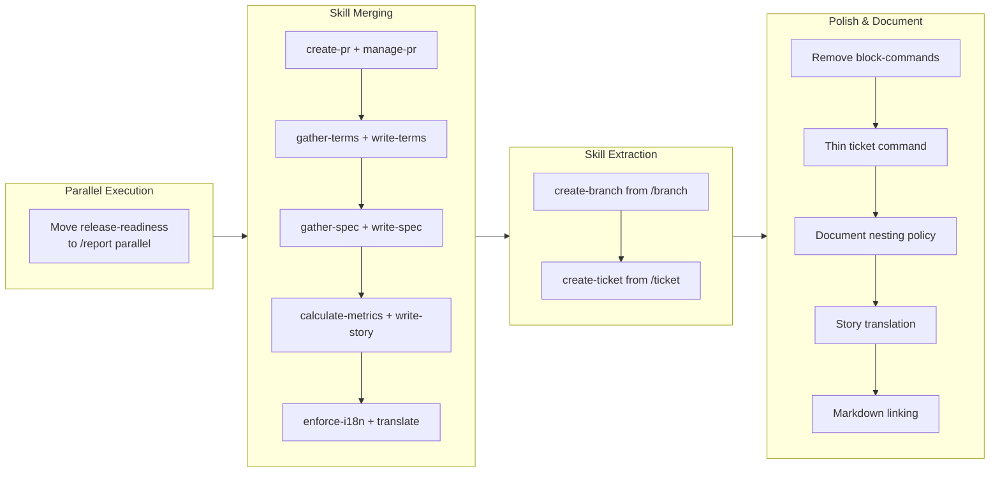

## 1. Overview

This branch executed a comprehensive skill consolidation effort, merging 8 utility skills into their primary counterparts and extracting 2 new skills from commands. The work established cleaner architectural boundaries between orchestration (commands/agents) and knowledge (skills), documented the nesting policy, and enhanced documentation practices with linking requirements and bilingual story support.

**Highlights:**

1. Restructured /report to run release-readiness as 5th parallel agent
2. Merged create-pr/manage-pr, gather-terms-context/write-terms, gather-spec-context/write-spec, calculate-story-metrics/write-story, and enforce-i18n/translate
3. Extracted create-branch and create-ticket skills from commands
4. Removed obsolete block-commands skill
5. Added architecture nesting policy documentation
6. Enhanced documentation with markdown linking and story translation

## 2. Motivation

The plugin's skill hierarchy had grown organically, resulting in fragmentation where tightly coupled skills existed separately despite always being used together. For example, `gather-terms-context` existed solely to provide context for `write-terms`, yet they were maintained as separate skills. This created unnecessary cognitive overhead when navigating the codebase and wasted context tokens when loading multiple related skills.

Additionally, the release-readiness check was invoked as a nested subagent inside story-writer, creating unnecessary complexity in the agent hierarchy. The commands contained detailed implementation logic that should reside in skills, violating the principle of "thin commands, comprehensive skills."

## 3. Journey

The branch began with restructuring /report's agent invocation for better parallelism, then systematically merged utility skills into their primary counterparts. Next, the pattern was extended by extracting skills from commands. Finally, cleanup and documentation improvements polished the architecture.

## 4. Changes

### 4.1. Invoke release-readiness as 5th parallel agent in /report (e1dcf1f)

Moved release-readiness from nested subagent inside story-writer to 5th parallel agent in /report for simpler architecture and faster execution.

### 4.2. Merge create-pr and manage-pr skills (f5c6475)

Consolidated create-pr and manage-pr into a single skill since manage-pr was purely a wrapper around the same shell script.

### 4.3. Integrate gather-terms-context into write-terms (3b2e0d7)

Merged the context-gathering instructions and shell script into write-terms, reducing the terms-writer agent's preloaded skills from three to two.

### 4.4. Integrate gather-spec-context into write-spec (1d5c124)

Merged context-gathering into write-spec following the same pattern, simplifying spec-writer agent configuration.

### 4.5. Integrate calculate-story-metrics into write-story (07ab1f4)

Merged metrics calculation into write-story, consolidating all story generation logic in one skill.

### 4.6. Extract create-branch skill from branch command (f43fe43)

Created new create-branch skill with bundled shell script for timestamped branch creation, enabling permission-free execution.

### 4.7. Extract create-ticket skill from ticket command and merge define-ticket-format (51f7384)

Created comprehensive create-ticket skill combining ticket format definitions and creation logic, reducing ticket.md from 86 to 47 lines.

### 4.8. Merge enforce-i18n skill into translate skill (4f93df4)

Consolidated all i18n concerns into the translate skill, making it the single source of truth for translation requirements.

### 4.9. Remove block-commands skill (16b0e61)

Removed obsolete skill that documented .claude/settings.json deny rules, which are not distributed with plugins.

### 4.10. Thin ticket command by moving content to create-ticket skill (2e696ff)

Further simplified ticket.md from 47 to 41 lines by condensing redundant step descriptions.

### 4.11. Document architectural nesting policy in CLAUDE.md (070f23b)

Added Architecture Policy section documenting component nesting rules and the "thin commands/agents, comprehensive skills" principle.

### 4.12. Add story translation requirement to write-story skill (36d82f0)

Added instructions for creating Japanese translations of stories and updating both README.md and README_ja.md.

### 4.13. Link archived tickets in Related History section (6d03f2c)

Changed Related History format to use markdown links instead of backticks for better navigability.

### 4.14. Add rule for linking markdown files when mentioned (93a1127)

Added general rule to link markdown files in documentation contexts for improved navigation.

## 5. Outcome

The skill consolidation reduced fragmentation significantly: 8 skills were merged into 4, and 2 new skills were extracted from commands. Agents now preload fewer skills (typically 1-2 instead of 2-3), reducing context overhead. The architecture policy documentation establishes clear guidelines for future development. Documentation practices improved with linking requirements and bilingual story support.

## 6. Historical Analysis

This work continues patterns established in the previous branch (feat-20260126-214833):
- The subagent architecture pattern informed the release-readiness parallel execution change
- The bundled shell script approach from that branch was reused for create-branch skill
- The skill extraction pattern from agents was extended to commands

## 7. Concerns

- The architecture policy documents that skills should not invoke subagents, but this branch leaves the performance-analyst invocation instruction in write-story skill. A follow-up ticket should address this by moving the invocation to the orchestrator level.
- Some documentation files in .workaholic/ still reference deleted skills (manage-pr, gather-terms-context, etc.) but will be auto-updated when documentation agents run.

## 8. Ideas

- Consider creating a skill consolidation checklist for identifying merge candidates: same-agent preload, 1:1 relationship, shared shell scripts
- The "thin command" pattern could be applied more aggressively to other commands
- A visual skill dependency diagram might help maintain the architecture

## 9. Performance

**Metrics**: 27 commits over 1.00 hours (27.0 commits/hour)

### 9.1. Pace Analysis

The velocity of 27 commits per hour is exceptionally high, indicating a well-planned batch of small, focused changes. The tickets were queued in advance with clear implementation steps, allowing rapid sequential execution. Each merge followed an identical pattern: move shell script, update SKILL.md, update agent, delete old directory. This template-driven approach enabled sustained throughput.

### 9.2. Decision Review

| Dimension      | Rating   | Notes                                                                 |
| -------------- | -------- | --------------------------------------------------------------------- |
| Consistency    | Strong   | All merges followed identical patterns; naming conventions maintained |
| Intuitivity    | Strong   | Skill names clearly indicate purpose; consolidation improves clarity  |
| Describability | Strong   | Each change is self-explanatory; Final Reports capture outcomes well  |
| Agility        | Strong   | Small commits enable easy review and potential rollback               |
| Density        | Strong   | Each commit has single purpose; no mixed concerns                     |

**Strengths**: Exceptional planning and execution. The pre-defined ticket queue with clear implementation steps enabled rapid throughput. Pattern reuse across similar merges ensured consistency.

**Areas for Improvement**: Consider batching very similar changes (like the 5 skill merges) into fewer commits if individual reversibility is not needed.

## 10. Release Preparation

**Verdict**: Ready for release

### 10.1. Concerns

None - changes are safe for release

### 10.2. Pre-release Instructions

None - standard release process applies

### 10.3. Post-release Instructions

None - no special post-release actions needed

## 11. Notes

This branch demonstrates the effectiveness of queued ticket execution. All 14 tickets were created upfront with detailed implementation steps, allowing /drive to execute them in rapid succession. The pattern-based approach (identify similar skills, merge using consistent steps) scales well for architectural cleanup work.
