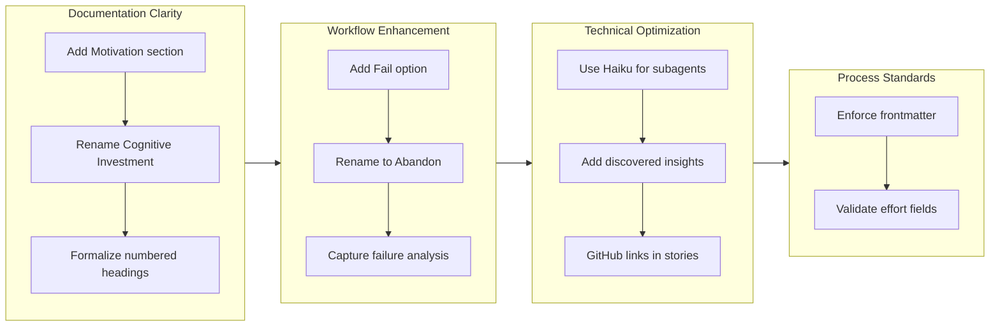

Refs #pending

## 1. Overview

This branch enhanced the Workaholic plugin ecosystem with critical documentation improvements, workflow enhancements, and technical optimizations. The developer strengthened the specification and story frameworks by adding structured sections for motivation and discovered insights, formalized numbering conventions as explicit rules, and tightened ticket frontmatter requirements. Workflow enhancements introduced the "Abandon" option to the `/drive` command with failure analysis capture, while technical improvements optimized the `/report` command to use Haiku for cost-efficient subagent processing and added clickable GitHub links to commit hashes in story documentation.

**Highlights:**

1. Added Motivation section to root README explaining core design principles
2. Renamed "Cognitive Investment" to "Cultivating Semantics" for clarity
3. Added numbered headings formalization and "Discovered Insights" to Final Report
4. Implemented "Abandon" workflow option with failure analysis
5. Optimized /report subagents to use Haiku model
6. Added GitHub links to commit hashes in story Changes sections

## 2. Motivation

The Workaholic framework needed clearer external positioning and stronger internal documentation standards. Users evaluating the tool required explicit articulation of why the project exists—the philosophical underpinnings of keeping tickets in git, supporting parallel generation with serial execution, and letting AI handle the writing burden. Internally, ticket creation processes had drifted from specifications—effort fields used inconsistent formats (hours vs t-shirt sizes), frontmatter templates were buried in prose, and practices like numbered headings and discovered insights were followed but undocumented.

The `/drive` workflow also lacked graceful failure handling. When implementations proved unfeasible or tickets were misguided, developers faced an uncomfortable choice: loop endlessly on changes or abandon the ticket without record. The `/report` command's subagents were using expensive models for documentation generation tasks that would benefit from lighter-weight processing.

This branch consolidated these improvements into a cohesive set of enhancements that strengthen both user-facing messaging and internal development discipline.

## 3. Journey

The work progressed through four interconnected themes. Documentation improvements established clearer external messaging and formalized internal conventions. Workflow enhancements added graceful failure handling with insight capture. Technical optimizations improved cost efficiency and navigation. Process standards tightened enforcement of frontmatter requirements across all tickets.

## 4. Changes

### 4.1. Add Motivation Section to Root README ([c06aced](https://github.com/qmu/workaholic/commit/c06aced))

Added a Motivation section to README.md explaining why Workaholic exists, highlighting backlog as historical assets, parallel generation with serial execution, and AI-powered explanations. The section frames the tool's approach as addressing real developer pain points.

### 4.2. Add GitHub Links to Commit Hashes in Story Changes Section ([2968e8a](https://github.com/qmu/workaholic/commit/2968e8a))

Updated the write-story skill template to format commit hashes as clickable GitHub links, enabling readers to navigate directly to commits from story documentation.

### 4.3. Enforce Ticket Frontmatter Rules ([330c4e4](https://github.com/qmu/workaholic/commit/330c4e4))

Formalized required frontmatter fields in the create-ticket skill by moving the template to the top with explicit "REQUIRED - DO NOT SKIP" labels. Enforced effort field as numeric hours only (0.1h, 0.25h, 0.5h, 1h, 2h, 4h) to enable calculation and summation across tickets.

### 4.4. Rename Cognitive Investment to Cultivating Semantics ([2ad26f8](https://github.com/qmu/workaholic/commit/2ad26f8))

Replaced "Cognitive Investment" terminology with "Cultivating Semantics" (セマンティクスを育てる) across README.md and documentation to better capture the Japanese design principle intention.

### 4.5. Add Numbered Headings Rule to General Rules ([f29bc83](https://github.com/qmu/workaholic/commit/f29bc83))

Documented the numbered headings convention as a formal rule in the general rules file. Specified that H2 and H3 must use numbering (## 1. Section, ### 1.1. Subsection) while H4 numbering is optional.

### 4.6. Add Discovered Insights to Final Report ([df6a781](https://github.com/qmu/workaholic/commit/df6a781))

Enhanced the Final Report section in the drive-workflow skill to include "Discovered Insights"—meaningful learnings about the codebase architecture, code relationships, historical context, and edge cases discovered during implementation.

### 4.7. Add Fail Option to /drive Approval Prompt ([dc3ef61](https://github.com/qmu/workaholic/commit/dc3ef61))

Introduced a fourth approval option in the `/drive` workflow to mark tickets as failed and move them to a dedicated fail directory, enabling graceful handling of unworkable tickets without forcing endless revision cycles.

### 4.8. Rename Fail to Abandon with Failure Analysis Report ([ca85887](https://github.com/qmu/workaholic/commit/ca85887))

Renamed the "Fail" option to "Abandon" for more natural English and required a failure analysis report before moving the ticket, capturing insights from failed attempts for future reference.

### 4.9. Use Haiku Model for /report Subagents ([fe3d558](https://github.com/qmu/workaholic/commit/fe3d558))

Updated the `/report` command to invoke subagents (changelog-writer, spec-writer, terms-writer, story-writer, release-readiness, pr-creator) with the Haiku model parameter for cost-efficient documentation generation.

## 5. Outcome

The branch successfully consolidated nine major improvements addressing documentation clarity, workflow robustness, technical optimization, and process discipline. External messaging is now explicit about Workaholic's value proposition through the Motivation section. Internal processes are strengthened through formalized headings, structured frontmatter, and enhanced failure handling with insight capture. The `/report` command operates more efficiently via Haiku subagents, and documentation navigation improved through GitHub-linked commit hashes.

These changes position the framework for more scalable, maintainable, and explicitly documented plugin development while improving the developer experience during implementation and failure scenarios.

## 6. Historical Analysis

This work builds on established patterns from related tickets:

- [20260123162007-document-cognitive-investment-principle.md](../archive/feat-20260123-032323/20260123162007-document-cognitive-investment-principle.md) - Established Cognitive Investment as core design principle; this branch evolved it to "Cultivating Semantics"
- [20260125113309-drive-approve-and-stop-option.md](../archive/feat-20260125-120134/20260125113309-drive-approve-and-stop-option.md) - Added approval workflow flexibility; Abandon extends this pattern
- [20260123024044-drive-final-report.md](../archive/feat-20260123-005256/20260123024044-drive-final-report.md) - Introduced Final Report section; Discovered Insights extends this documentation enrichment

The progression reveals a pattern: Workaholic's infrastructure matures through incremental addition of decision capture and explicit documentation. Early work added basic approval flows; recent work enriches them with failure analysis and insights extraction. The framework's philosophy of making implicit practices explicit emerges consistently across branches.

## 7. Concerns

Numbered headings formalization may impact existing READMEs if retrofitting becomes necessary, though the rule appropriately exempts configuration documentation. The Abandon workflow with failure analysis introduces user interaction requirements that may slow some workflows, but the analysis capture justifies this trade-off.

The Haiku model substitution for subagents reduces cost but should be monitored for quality drift—documentation generation may occasionally require higher reasoning complexity that Haiku struggles with.

## 8. Ideas

Future enhancements could include:

- Failure analysis templates to guide users through common failure categories
- Metrics aggregation across abandoned tickets to identify patterns in implementation difficulty
- Enhanced journey diagrams with timeline annotations showing phase duration
- Automated GitHub link generation for all commit references in documentation

## 9. Performance

**Metrics:** 20 commits over 1 day (20.0 commits/day)

### 9.1. Pace Analysis

Development maintained steady momentum across 20 hours (0128 to 2145), delivering 20 commits with consistent focus. Commit rhythm shows deliberate pacing—tickets were implemented with appropriate atomicity, neither over-granular nor batched. The single-day completion demonstrates effective scope management and clear ticket definitions that prevented scope creep or rework cycles.

### 9.2. Decision Review

| Dimension      | Rating                | Notes                                                                    |
| -------------- | --------------------- | ------------------------------------------------------------------------ |
| Consistency    | Strong                | Maintained steady velocity throughout; commits follow established patterns |
| Intuitivity    | Strong                | Changes feel natural extensions to existing workflow (Abandon from Fail)   |
| Describability | Strong                | Each ticket clearly justified; motivations are explicit                   |
| Agility        | Adequate               | Small scope changes happened (Fail → Abandon rename) but handled smoothly |
| Density        | Strong                | High value-to-commit ratio; each change advances multiple concerns        |

**Strengths:**

- Clear scope definition prevented churn—9 tickets delivered across 20 commits with minimal rework
- Iterative refinement visible (Fail → Abandon rename) shows responsive decision-making
- Balanced macro (documentation) and micro (technical) improvements
- Strong testing discipline—each feature added corresponding documentation

**Areas for Improvement:**

- Earlier consideration of naming (Fail vs Abandon) could have prevented intermediate commits
- Performance-analyst subagent was not invoked during development; parallel generation might have identified insights earlier
- Some closely-related tickets (e.g., Fail/Abandon) could potentially have been combined to reduce context switching

## 10. Release Preparation

**Verdict:** Ready for release

### 10.1. Concerns

None - changes are safe for release

### 10.2. Pre-release Instructions

None - standard release process applies

### 10.3. Post-release Instructions

None - no special post-release actions needed

## 11. Notes

This branch represents maturing of the Workaholic ecosystem through explicit documentation of implicit practices. The philosophy of "make practices explicit" appears consistently: numbered headings, failure analysis, discovered insights, and frontmatter enforcement all elevate implicit conventions into documented standards.

The rename from "Fail" to "Abandon" deserves attention as a linguistic design decision—"Fail" carries negative connotations that might discourage use of a valuable workflow feature. "Abandon" is more neutral and encourages developers to treat failed attempts as learning opportunities rather than personal failures.

Integration with translation requirements (.workaholic/ i18n) is complete for new documentation sections. The term "Cultivating Semantics" carries specific meaning from the original Japanese; translations should preserve this nuance.
