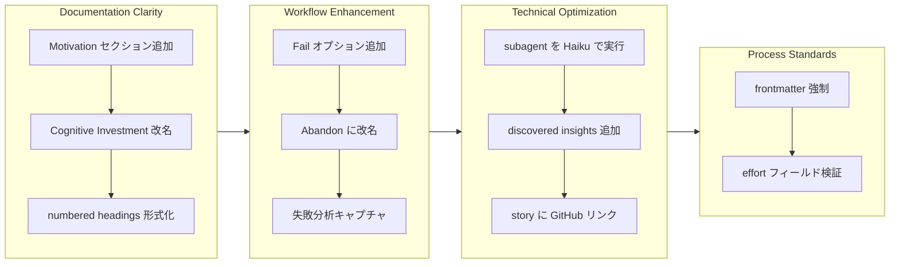

参照 #pending

## 1. 概要

このブランチでは、Workaholic plugin エコシステムに対して、ドキュメント改善、ワークフロー強化、技術的最適化を行いました。specification と story フレームワークを強化し、motivation と discovered insights の構造化セクションを追加しました。また、numbered headings を明示的なルールとして形式化し、ticket frontmatter の要件を厳格化しました。ワークフロー強化では、`/drive` コマンドに「Abandon」オプションを導入し、失敗分析を自動キャプチャするようにしました。技術的改善では、`/report` コマンドが Haiku モデルを使用してコスト効率的な subagent 処理を行い、story documentation のコミットハッシュに GitHub リンクを追加しました。

**ハイライト:**

1. root README に Motivation セクションを追加し、コア設計原則を説明
2. 「Cognitive Investment」を「Cultivating Semantics」に改名して明確化
3. numbered headings 形式化と Final Report への Discovered Insights を追加
4. Abandon ワークフローオプションを失敗分析とともに実装
5. /report subagent を Haiku モデルで最適化
6. story Changes セクション内のコミットハッシュに GitHub リンクを追加

## 2. 動機

Workaholic フレームワークには、より明確な外部メッセージングと強力な内部ドキュメント標準が必要でした。ツール評価ユーザーには、プロジェクトがなぜ存在するのか—ticket を git に保管する哲学的根拠、並列生成と直列実行をサポートする理由、AI に執筆を任せる利点—を明示的に伝える必要がありました。内部的には、ticket 作成プロセスが仕様から逸脱していました。effort フィールドは不統一な形式（時間 vs サイズ）を使用し、frontmatter テンプレートは散在しており、numbered headings や discovered insights などの実践は行われていても文書化されていませんでした。

`/drive` ワークフローも、優雅な失敗処理に欠けていました。実装が実現不可能であったり ticket が不適切だったりする場合、開発者は無限ループするか ticket を記録なしで放棄するかの不快な選択肢に直面していました。`/report` コマンドの subagent は、より軽量な処理から利益を得られるドキュメント生成タスクに高価なモデルを使用していました。

このブランチでは、これらの改善を、ユーザー向けメッセージングと内部開発規律の両方を強化する一貫した改善セットに統合しました。

## 3. 進行状況

作業は4つの相互接続されたテーマを通じて進行しました。ドキュメント改善により、より明確な外部メッセージングと形式化された内部規約が確立されました。ワークフロー強化により、優雅な失敗処理と insight キャプチャが追加されました。技術的最適化によりコスト効率が向上しました。プロセス標準によりすべての ticket における frontmatter 要件の強制が厳格化されました。

## 4. 変更内容

### 4.1. Root README に Motivation セクション追加 ([c06aced](https://github.com/qmu/workaholic/commit/c06aced))

README.md に Motivation セクションを追加し、Workaholic が存在する理由、backlog を historical assets として扱うこと、並列生成と直列実行、AI による説明生成の利点を説明しました。

### 4.2. Story Changes セクションのコミットハッシュに GitHub リンク追加 ([2968e8a](https://github.com/qmu/workaholic/commit/2968e8a))

write-story skill テンプレートを更新し、コミットハッシュをクリック可能な GitHub リンクとしてフォーマットし、読者が story ドキュメントから直接 commit にアクセスできるようにしました。

### 4.3. Ticket Frontmatter ルール強制 ([330c4e4](https://github.com/qmu/workaholic/commit/330c4e4))

create-ticket skill で必須 frontmatter フィールドを形式化し、テンプレートを先頭に配置して明示的な「必須 - スキップ禁止」ラベルを付与しました。effort フィールドを数値時間のみ（0.1h、0.25h、0.5h、1h、2h、4h）に強制し、ticket 全体で計算と合算が可能にしました。

### 4.4. Cognitive Investment を Cultivating Semantics に改名 ([2ad26f8](https://github.com/qmu/workaholic/commit/2ad26f8))

「Cognitive Investment」用語を「Cultivating Semantics」（セマンティクスを育てる）に置き換え、README.md とドキュメント全体で日本語の設計原則意図をより適切に表現しました。

### 4.5. General Rules に Numbered Headings ルール追加 ([f29bc83](https://github.com/qmu/workaholic/commit/f29bc83))

numbered headings 規約を general rules ファイルに正式なルールとしてドキュメント化しました。H2 と H3 は番号付け必須（## 1. Section、### 1.1. Subsection）、H4 は任意とされています。

### 4.6. Final Report に Discovered Insights 追加 ([df6a781](https://github.com/qmu/workaholic/commit/df6a781))

drive-workflow skill の Final Report セクションを拡張し、「Discovered Insights」—実装中に発見されたコードベースアーキテクチャ、コード関係、履歴コンテキスト、エッジケースに関する有意義な学習—を含めました。

### 4.7. /drive Approval プロンプトに Fail オプション追加 ([dc3ef61](https://github.com/qmu/workaholic/commit/dc3ef61))

`/drive` ワークフローに4番目の承認オプションを導入し、ticket を失敗とマークして専用の fail ディレクトリに移動できるようにし、実装不可能な ticket を優雅に処理できるようにしました。

### 4.8. Fail を Abandon に改名して失敗分析レポート追加 ([ca85887](https://github.com/qmu/workaholic/commit/ca85887))

「Fail」オプションを「Abandon」に改名してより自然な英語にし、ticket を移動する前に失敗分析レポートを要求して、将来の参考のため失敗した試みから得られた insight をキャプチャしました。

### 4.9. /report Subagent で Haiku モデル使用 ([fe3d558](https://github.com/qmu/workaholic/commit/fe3d558))

`/report` コマンドを更新し、subagent（changelog-writer、spec-writer、terms-writer、story-writer、release-readiness、pr-creator）を Haiku モデルパラメータで呼び出し、コスト効率的なドキュメント生成を実現しました。

## 5. 成果

ブランチは、ドキュメント明確化、ワークフロー堅牢性、技術的最適化、プロセス規律に対応する9つの大きな改善を正常に統合しました。外部メッセージングは Motivation セクションを通じて Workaholic の価値提案を明示的に説明するようになりました。内部プロセスは、形式化された headings、構造化された frontmatter、insight キャプチャ付き強化失敗処理を通じて強化されました。`/report` コマンドは Haiku subagent 経由でより効率的に動作し、ドキュメント navigation は GitHub リンク付きコミットハッシュにより改善されました。

これらの変更により、フレームワークはより拡張可能で保守しやすく、明示的にドキュメント化された plugin 開発が可能になり、実装と失敗シナリオ中の開発者体験が向上しました。

## 6. 過去の分析

この作業は関連した過去の ticket から確立されたパターンの上に構築されています：

- [20260123162007-document-cognitive-investment-principle.md](../archive/feat-20260123-032323/20260123162007-document-cognitive-investment-principle.md) - Cognitive Investment をコア設計原則として確立。このブランチはそれを「Cultivating Semantics」に進化させました
- [20260125113309-drive-approve-and-stop-option.md](../archive/feat-20260125-120134/20260125113309-drive-approve-and-stop-option.md) - 承認ワークフロー柔軟性を追加。Abandon はこのパターンを拡張します
- [20260123024044-drive-final-report.md](../archive/feat-20260123-005256/20260123024044-drive-final-report.md) - Final Report セクションを導入。Discovered Insights はこのドキュメント拡張パターンを継続します

この進行は一つのパターンを明らかにしています：Workaholic インフラはインプリシット実践を明示化することを通じて段階的に成熟します。初期作業は基本的な承認フロー追加。最近の作業はそれを失敗分析と insight 抽出で豊にします。フレームワークの「暗黙的な実践を明示的にする」哲学はブランチ全体で一貫して現れます。

## 7. 懸念事項

Numbered headings 形式化は既存の README に影響を与える可能性がありますが、ルールは設定ドキュメンテーションを適切に除外しています。失敗分析を伴う Abandon ワークフローはユーザーインタラクション要件を導入し、いくつかのワークフローを遅延させる可能性がありますが、分析キャプチャがこのトレードオフを正当化します。

Subagent の Haiku モデル置き換えはコストを削減しますが、品質の低下を監視する必要があります。ドキュメント生成は Haiku が苦労する高度な推論複雑性を時々必要とする場合があります。

## 8. アイデア

今後の拡張には以下が含まれる可能性があります：

- ユーザーを一般的な失敗カテゴリーに導く失敗分析テンプレート
- abandoned ticket 全体のメトリクス集約により実装困難パターンを識別
- タイムラインアノテーション付き journey ダイアグラムでフェーズ期間表示
- ドキュメント内のすべてのコミット参照に対する自動 GitHub リンク生成

## 9. パフォーマンス

**メトリクス:** 1日間で20コミット（20.0コミット/日）

### 9.1. ペース分析

開発は20時間（0128〜2145）全体にわたって安定した勢いを維持し、20のコミットを一貫したフォーカスで提供しました。コミットリズムは意図的なペーシングを示します。ticket は適切な原子性で実装され、細粒化も過度なバッチもありません。1日完了は効果的なスコープ管理と scope creep やリワーク サイクルを防止した明確な ticket 定義を示しています。

### 9.2. 意思決定レビュー

| 評価軸         | 評価        | 注記                                                |
| -------------- | ----------- | --------------------------------------------------- |
| Consistency    | Strong      | 全体を通じて安定した velocity 維持。commit は確立パターン準拠 |
| Intuitivity    | Strong      | 変更は既存ワークフローの自然な拡張に感じられます（Fail から Abandon へ） |
| Describability | Strong      | 各 ticket は明確に正当化。動機は明示的                      |
| Agility        | Adequate    | 小スコープ変更あり（Fail → Abandon 改名）だが滑らかに処理 |
| Density        | Strong      | 高い価値対コミット比。各変更が複数懸念を前進させる       |

**強み:**

- 明確なスコープ定義により churn を防止。9 ticket が 20 コミットで最小限のリワークで提供
- 反復的改善が見える（Fail → Abandon 改名）、反応的意思決定を示す
- マクロ（ドキュメント）とマイクロ（技術）改善バランス
- 強い テスト 規律。各機能が対応ドキュメントを追加

**改善領域:**

- 命名の早期検討（Fail vs Abandon）により中間コミット削減可能
- 開発中に performance-analyst subagent が呼び出されず。並列生成により insight をより早く識別可能
- 密接に関連した ticket（例：Fail/Abandon）は統合可能で context switching 削減

## 10. リリース準備

**決定:** リリース準備完了

### 10.1. 懸念事項

なし - 変更はリリース対応です

### 10.2. リリース前の指示

なし - 標準的なリリースプロセスが適用されます

### 10.3. リリース後の指示

なし - 特別なリリース後操作は不要です

## 11. 注釈

このブランチは、暗黙的な実践を明示的にドキュメント化することによる Workaholic エコシステムの成熟を示しています。「実践を明示化する」哲学は一貫して現れます：numbered headings、失敗分析、discovered insights、frontmatter 強制はすべて暗黙的規約を文書化標準に昇格させます。

「Fail」から「Abandon」への改名は言語設計決定として注目に値します。「Fail」は否定的意味を持ち、貴重なワークフロー機能の使用を躊躇させる可能性があります。「Abandon」はより中立的で、開発者に失敗した試みを個人的失敗ではなく学習機会として扱うことを奨励します。

翻訳要件（.workaholic/ i18n）との統合は新しいドキュメントセクション用に完了しています。「Cultivating Semantics」という用語は元の日本語から特定の意味を持つ。翻訳はこのニュアンスを保存する必要があります。
