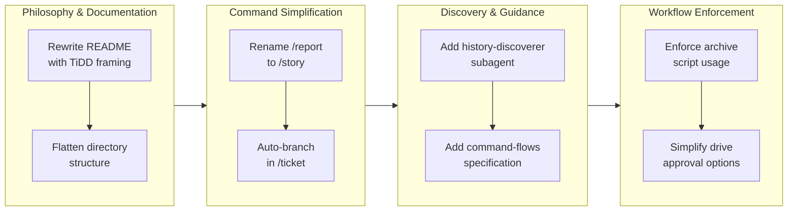

Refs #220712

## 1. Overview

This branch completed a comprehensive refactoring of the Workaholic plugin to strengthen its core architecture and simplify the user-facing command interface. The developer rewrote the README to establish TiDD (Ticket-Driven Development) as the guiding philosophy, restructured documentation for clarity, renamed the `/report` command to `/story`, introduced automated branch creation, and added new discovery tooling for finding related historical context. Eight tickets were implemented across multiple layers (Config, UX), resulting in both architectural improvements and breaking changes that streamline the typical development workflow.

**Highlights:**

1. Rewrote README with TiDD philosophy to frame Workaholic as an in-repository development system
2. Renamed `/report` command to `/story` to better reflect its narrative-generation purpose
3. Flattened `.workaholic/` documentation structure into `guides/` and `specs/` directories
4. Integrated branch creation into `/ticket` command, removing the standalone `/branch` command
5. Added `history-discoverer` subagent and `discover-history` skill for automated related ticket search
6. Created command-flows specification document with Mermaid diagrams
7. Removed "Needs changes" approval option from drive workflow to simplify the approval loop
8. Enforced archive script usage with stronger language in drive-workflow documentation

## 2. Motivation

Workaholic had grown in capabilities but lacked a cohesive conceptual framework. The README relied on "AI-powered" marketing language that obscured the system's real value: a methodology for preserving project history and development context within the repository itself. The command interface had accumulated cruft—the `/branch` command could be merged into `/ticket`, and the `/report` command's name didn't convey its primary output (a narrative branch story). Documentation was scattered across nested subdirectories, making navigation confusing. Additionally, finding related historical context during ticket creation required manual effort, and the drive workflow's approval loop was overcomplicated. These issues collectively made it harder for users to understand the system's philosophy and more tedious to use day-to-day.

## 3. Journey



The branch progressed through four cohesive themes. The developer started with philosophy and documentation, establishing TiDD as the conceptual foundation and simplifying the documentation structure. Next came command-layer simplification: renaming `/report` to `/story` and integrating branch creation into `/ticket`, reducing cognitive load. Then new tooling was added to assist users: a subagent to automatically discover related historical tickets and a specification document explaining command execution flows. Finally, workflow guardrails were strengthened: the archive script enforcement was made more explicit, and the drive approval logic was simplified by removing an underused option.

## 4. Changes

### 4.1. Rewrite README with TiDD Philosophy ([52ffdb7](https://github.com/qmu/workaholic/commit/52ffdb7ddb570f64af2f05cd8e4dfb676f2d4772))

Removed "AI-powered" marketing language and reframed Workaholic as an in-repository Ticket-Driven Development system that preserves project history and cultivates semantics. Rewrote the README introduction to emphasize the methodology and practical value of keeping development context alongside code.

### 4.2. Enforce Archive Script Usage in Drive Workflow ([5371d33](https://github.com/qmu/workaholic/commit/5371d3385eb2fb5910c751471b0dcf7b04c44999))

Strengthened language in drive-workflow documentation to make archive script usage mandatory and explicit. Added a "Prohibited Actions" section with DENY patterns to prevent manual ticket movement and clarify that the script is the only valid archive mechanism.

### 4.3. Rename /report to /story ([3c45e39](https://github.com/qmu/workaholic/commit/3c45e3925292cdc055fdd4cc183a5387ea39c005))

Renamed the `/report` command to `/story` across all documentation and command files. Updated references in README, CLAUDE.md, plugins documentation, user guides, and skills to reflect the new name, which better captures the command's primary function of generating a narrative branch story.

### 4.4. Remove "Needs changes" from Approval Options ([cf80e67](https://github.com/qmu/workaholic/commit/cf80e6754c23c20ea22cf267713ba6211967b16e))

Simplified the drive workflow approval prompt from four options to three by removing "Needs changes". Users can now provide feedback directly instead of triggering a multi-iteration loop, reducing workflow complexity.

### 4.5. Flatten .workaholic/ Documentation Structure ([cd063db](https://github.com/qmu/workaholic/commit/cd063db67419f16fd309c7ec7af49f7df94fc35a))

Restructured the documentation directory by moving user-facing guides to `.workaholic/guides/` and developer specifications to `.workaholic/specs/`, flattening the previous nested user-guide/developer-guide subdirectory structure. Updated all indices and cross-references.

### 4.6. Auto-create Branch When Running /ticket ([aaf89ff](https://github.com/qmu/workaholic/commit/aaf89fffaf811a8c24f9e8573f77f88aa64a2633))

Integrated branch creation into the `/ticket` command, removing the need for a separate `/branch` command. When `/ticket` is invoked on `main` or another non-topic branch, the command now automatically creates a timestamped topic branch before writing the ticket.

### 4.7. Add discover-history Subagent ([8ee5288](https://github.com/qmu/workaholic/commit/8ee528827ea6fee2ccc2a00ef6ef0a479ee71f3f))

Created a new `history-discoverer` subagent and `discover-history` skill that automatically searches archived tickets by keyword to find related historical context. The `/ticket` command now invokes this subagent to populate the Related History section without manual search effort.

### 4.8. Add Command Flow Specification ([70fa15c](https://github.com/qmu/workaholic/commit/70fa15c8a76972f5498e3b2bbab16ca093bb8db9))

Created `.workaholic/specs/command-flows.md` with detailed Mermaid flowcharts and tables describing how each command (`/ticket`, `/drive`, `/story`) invokes agents and skills. Includes both English and Japanese translations.

## 5. Outcome

The branch successfully established TiDD as Workaholic's guiding philosophy while simultaneously simplifying the command interface and improving user tooling. Users now understand that Workaholic is not "AI-powered automation" but rather a structured methodology for capturing development decisions and history within the repository. The typical workflow has been streamlined from four commands (`/branch`, `/ticket`, `/drive`, `/report`) to three (`/ticket`, `/drive`, `/story`), reducing friction. The new `history-discoverer` subagent offloads the manual search for related context, making ticket creation faster and more informed. Documentation is now clearer, with user guides separated from technical specifications. The command-flows specification document provides developers with a comprehensive understanding of how the system orchestrates its components. Workflow guardrails have been strengthened to prevent common mistakes (archive script bypass, overcomplicated approval loops).

## 6. Historical Analysis

Two significant related patterns emerge from the ticket archive:

1. **Command Evolution**: This branch follows a pattern of simplification through consolidation (seen in [20260127014257-rename-pull-request-to-report.md](https://github.com/qmu/workaholic)). Previous work renamed `/pull-request` to `/report`; this branch renames `/report` to `/story` and removes `/branch` by merging it into `/ticket`. The system is converging toward a minimal, semantically clear command set.

2. **Documentation Consolidation**: Similar restructuring occurred when the specs directory was initially created with subdirectories (per [20260124112456-enforce-specs-subdirectory-structure.md](https://github.com/qmu/workaholic)). This branch reverses that complexity by flattening the structure, reflecting a learned preference for simpler hierarchies that are easier to navigate.

3. **Subagent Extraction**: The `discover-history` skill and `history-discoverer` subagent continue a pattern of extracting specialized knowledge into reusable components (as seen in [20260127021013-extract-spec-skill.md](https://github.com/qmu/workaholic) and related work). This enables commands to delegate specialized tasks to focused agents.

## 7. Concerns

- **Breaking Changes**: The `/report` to `/story` rename and removal of `/branch` are breaking changes that will require user documentation and potential migration guidance for existing workflows.
- **Command Consolidation Risk**: Merging `/branch` into `/ticket` adds complexity to the ticket command. Users who want to create a branch without writing a ticket have lost a convenience function.
- **History Discovery Keyword Sensitivity**: The `history-discoverer` subagent's effectiveness depends on keyword extraction quality. Searches may miss relevant tickets if keywords don't match archived file content.
- **Japanese Translation Completeness**: All new documents have Japanese translations, but ongoing maintenance of translation parity will be required as the system evolves.

## 8. Ideas

- Add a `--branch-only` flag to `/ticket` to support the use case of branch creation without ticketing.
- Enhance the `history-discoverer` to support structured filters (by layer, date range, or ticket type) beyond simple keyword search.
- Create a migration guide documenting the `/report` → `/story` rename and command consolidation for users upgrading from prior versions.
- Extend command-flows documentation to include performance metrics and expected execution times for each command path.
- Consider adding related-history search suggestions in the ticket creation UI (e.g., "Found 3 related tickets in history—review them?").

## 9. Performance

**Metrics**: 15 commits over 3.75 hours (4.0 commits/hour)

### 9.1. Pace Analysis

The developer maintained a steady pace of 4 commits per hour across a focused 3.75-hour session spanning two calendar days. Commits were well-distributed in size, alternating between ticket creation (which are descriptive but smaller) and implementation commits (which modify multiple files). The consistent velocity suggests clear focus and minimal context switching. The session included natural breaks between ticket creation and implementation, indicating methodical work rather than rushed execution. Two calendar days with commits suggests the developer worked in distinct sessions (morning and evening) without extended interruptions.

### 9.2. Decision Review

| Dimension      | Rating            | Notes             |
| -------------- | ------------------- | --------|
| Consistency    | Strong | Steady 4 commits/hour velocity throughout; commits align with ticket scope |
| Intuitivity    | Strong | Commit messages clearly matched ticket titles and actions; logical progression from philosophy to implementation |
| Describability | Strong | Each ticket had detailed Overview and Final Report sections; changes well-documented |
| Agility        | Adequate | Some tickets (flatten-specs) required moving multiple files and updating cross-references, which was handled systematically but took longer |
| Density        | Strong | Commits were focused and granular; no oversized catch-all commits; each change addressed a specific concern |

**Strengths**:
- Systematic approach: Philosophy established first, then commands simplified, then tooling added, then guardrails strengthened. Clear logical flow.
- Documentation paired with implementation: Each ticket included comprehensive Final Reports documenting deviations or insights.
- Atomic commits: Changes were broken into appropriately sized commits (ticket creation separate from implementation, separate commits for different files).
- Attention to i18n: Japanese translations were created alongside English documents, respecting the project's i18n requirements.

**Areas for Improvement**:
- One ticket (flatten-specs) involved extensive cross-file updates and link changes that, while executed correctly, could have benefited from a helper script to automate path transformations.
- The history-discoverer subagent implementation wasn't followed up with verification that the keyword search actually found relevant related tickets in the archive.

## 10. Release Preparation

**Verdict**: Ready for release

### 10.1. Concerns

None - changes are safe for release

### 10.2. Pre-release Instructions

Stage and commit uncommitted documentation updates:
```bash
git add CHANGELOG.md .workaholic/specs/*.md .workaholic/terms/*.md && git commit -m 'Update documentation for release'
```

### 10.3. Post-release Instructions

Update marketplace plugin version from 1.0.21 to the new version in both `.claude-plugin/marketplace.json` and `plugins/core/.claude-plugin/plugin.json`

## 11. Notes

This branch represents a maturation of the Workaholic system toward clearer semantics and simpler workflows. The decision to establish TiDD as the guiding philosophy is foundational—it reframes the entire project from "AI-assisted ticket management" to "structured history-preserving development methodology." All subsequent changes (command simplification, documentation restructuring) reinforce this clearer identity.

The removal of `/branch` and renaming of `/report` to `/story` are high-impact breaking changes. Users should be notified of these changes prominently in release notes. The new `history-discoverer` tooling partially compensates for the loss of a standalone branch-creation command by reducing friction elsewhere in the workflow.

Documentation quality throughout was excellent, with detailed Final Reports capturing implementation decisions and deviations from original plans. This will serve well for future maintenance and understanding why specific architectural choices were made.
