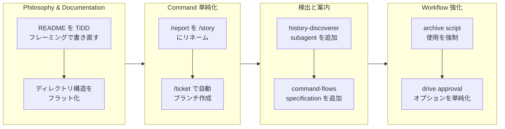

Refs #220712

## 1. Overview

このブランチは、Workaholic plugin の中核となるアーキテクチャを強化し、ユーザーに対するコマンドインターフェースを単純化する包括的なリファクタリングを完了しました。開発者は README を TiDD（Ticket-Driven Development）哲学を確立するために書き直し、ドキュメントを明確にするため構造をリファクタリングし、`/report` コマンドを `/story` にリネームし、自動化されたブランチ作成を導入し、関連する過去のコンテキストを検出するための新しいツールを追加しました。複数のレイヤー（Config、UX）にわたり 8 つのticketが実装され、アーキテクチャの改善と、一般的な開発 workflow を合理化する破壊的な変更の両方がもたらされました。

**ハイライト:**

1. TiDD 哲学を使用して README を書き直し、Workaholic をリポジトリ内開発システムとしてフレーミング
2. `/report` command を `/story` にリネームして、その物語生成目的をより適切に反映
3. `.workaholic/` documentation 構造を `guides/` と `specs/` ディレクトリにフラット化
4. branch 作成を `/ticket` command に統合し、スタンドアロン `/branch` command を削除
5. 関連する ticket を自動的に検索するための `history-discoverer` subagent と `discover-history` skill を追加
6. Mermaid 図を含むcommand-flows specification document を作成
7. drive workflow のapproval loop を単純化するために "Needs changes" オプションを削除
8. drive-workflow documentation で強力な言語を使用して archive script の使用を強制

## 2. Motivation

Workaholic は機能が増加していましたが、一貫性のある概念的なフレームワークが不足していました。README は「AI-powered」というマーケティング用語に依存していましたが、それはシステムの真の価値を曖昧にしていました。つまり、リポジトリ内でプロジェクト履歴と開発コンテキストを保存するための方法論です。command インターフェースは悪い部分が蓄積していました。`/branch` command は `/ticket` に統合できたし、`/report` command の名前はその主要な出力（narrative branch story）を伝えていませんでした。documentation はネストされたサブディレクトリに散在しており、ナビゲーションが混乱していました。さらに、ticket の作成中に関連する過去のコンテキストを見つけるには手動の努力が必要で、drive workflow の approval loop は過度に複雑でした。これらの問題は全体的に、ユーザーがシステムの哲学を理解することを難しくし、日常的に使用することをより面倒にしました。

## 3. Journey



ブランチは 4 つの一貫した主題を通じて進行しました。開発者は philosophy と documentation で開始し、TiDD を概念的な基礎として確立し、documentation 構造を単純化しました。次は command レイヤーの単純化です。`/report` を `/story` にリネームし、branch 作成を `/ticket` に統合して、認知的負荷を削減しました。その後、ユーザーを支援するための新しいツールが追加されました。自動的に関連する過去の ticket を検出する subagent と、command 実行フローを説明する specification document です。最後に、workflow ガードレールが強化されました。archive script の強制がより明確になり、未使用のオプションを削除することで drive approval ロジックが単純化されました。

## 4. Changes

### 4.1. README を TiDD 哲学で書き直す ([52ffdb7](https://github.com/qmu/workaholic/commit/52ffdb7ddb570f64af2f05cd8e4dfb676f2d4772))

「AI-powered」というマーケティング用語を削除し、Workaholic をリポジトリ内 Ticket-Driven Development システムとして再フレーミングしました。プロジェクト履歴を保存し、semantics を育成します。README の導入を書き直して、方法論とコードに並んで開発コンテキストを保つことの実用的な価値を強調しました。

### 4.2. Drive Workflow でアーカイブ script の使用を強制 ([5371d33](https://github.com/qmu/workaholic/commit/5371d3385eb2fb5910c751471b0dcf7b04c44999))

drive-workflow documentation で言語を強化して、archive script の使用を必須で明確にしました。手動での ticket 移動を防ぎ、script が唯一の有効なアーカイブメカニズムであることを明確にする「Prohibited Actions」セクションを追加しました。

### 4.3. /report を /story にリネーム ([3c45e39](https://github.com/qmu/workaholic/commit/3c45e3925292cdc055fdd4cc183a5387ea39c005))

すべての documentation と command ファイルで `/report` command を `/story` にリネームしました。README、CLAUDE.md、plugins documentation、ユーザーガイド、skills の参照を更新して、新しい名前を反映しました。これは command の主要な機能である narrative branch story の生成をより適切にキャプチャしています。

### 4.4. Approval オプションから "Needs changes" を削除 ([cf80e67](https://github.com/qmu/workaholic/commit/cf80e6754c23c20ea22cf267713ba6211967b16e))

drive workflow の approval プロンプトを 4 つのオプションから 3 つに単純化しました。「Needs changes」を削除します。ユーザーはマルチイテレーション loop をトリガーするのではなく、直接フィードバックを提供できるようになり、workflow の複雑さが軽減されます。

### 4.5. .workaholic/ Documentation 構造をフラット化 ([cd063db](https://github.com/qmu/workaholic/commit/cd063db67419f16fd309c7ec7af49f7df94fc35a))

documentation ディレクトリを再構成し、ユーザー向けガイドを `.workaholic/guides/` に移動し、開発者向けの specifications を `.workaholic/specs/` に移動して、以前のネストされた user-guide/developer-guide サブディレクトリ構造をフラット化しました。すべてのインデックスとクロスリファレンスを更新しました。

### 4.6. /ticket 実行時に自動的にブランチを作成 ([aaf89ff](https://github.com/qmu/workaholic/commit/aaf89fffaf811a8c24f9e8573f77f88aa64a2633))

branch 作成を `/ticket` command に統合し、スタンドアロンの `/branch` command の必要性を削除しました。`/ticket` が `main` または別の non-topic branch で呼び出されると、command はチケットを作成する前に自動的にタイムスタンプ付きの topic branch を作成するようになりました。

### 4.7. discover-history Subagent を追加 ([8ee5288](https://github.com/qmu/workaholic/commit/8ee528827ea6fee2ccc2a00ef6ef0a479ee71f3f))

新しい `history-discoverer` subagent と `discover-history` skill を作成しました。これは、キーワードでアーカイブされた ticket を自動的に検索して、関連する過去のコンテキストを見つけます。`/ticket` command はこの subagent を呼び出して、手動検索の努力なしに Related History セクションを入力するようになりました。

### 4.8. Command Flow Specification を追加 ([70fa15c](https://github.com/qmu/workaholic/commit/70fa15c8a76972f5498e3b2bbab16ca093bb8db9))

`.workaholic/specs/command-flows.md` を詳細な Mermaid フローチャートとテーブルを含めて作成しました。これは各 command（`/ticket`、`/drive`、`/story`）がエージェントとスキルを呼び出す方法を説明しています。英語と日本語の翻訳の両方を含みます。

## 5. Outcome

ブランチは TiDD を Workaholic の指導原理として確立しながら、同時に command インターフェースを単純化し、ユーザーツールを改善しました。ユーザーは、Workaholic が「AI-powered 自動化」ではなく、リポジトリ内で開発の決定と履歴をキャプチャするための構造化方法論であることを理解するようになりました。一般的な workflow は 4 つの command（`/branch`、`/ticket`、`/drive`、`/report`）から 3 つ（`/ticket`、`/drive`、`/story`）にスリムダウンされ、摩擦が削減されました。新しい `history-discoverer` subagent は、関連するコンテキストの手動検索をオフロードしており、ticket 作成がより高速で情報に基づいたものになります。documentation はより明確になり、ユーザーガイドが技術的な specifications から分離されました。command-flows specification document により、開発者はシステムがそのコンポーネントをどのようにオーケストレーションするかについての包括的な理解を得られます。workflow ガードレールが強化され、一般的なミスを防ぐ（archive script バイパス、複雑な approval loop）。

## 6. Historical Analysis

ticket アーカイブから 2 つの重要な関連パターンが浮かび上がります。

1. **Command 進化**: このブランチは、統合を通じた単純化のパターンに従っています（[20260127014257-rename-pull-request-to-report.md](https://github.com/qmu/workaholic)に見られる）。以前の作業では `/pull-request` を `/report` にリネームしました。このブランチは `/report` を `/story` にリネームし、`/branch` を `/ticket` に統合することによって削除します。システムは最小限で意味的に明確な command セットに収束しています。

2. **Documentation 統合**: specs ディレクトリが最初にサブディレクトリで作成された場合、同様の再構成が発生しました（[20260124112456-enforce-specs-subdirectory-structure.md](https://github.com/qmu/workaholic)による）。このブランチは構造をフラット化することによってその複雑さを逆転させており、ナビゲートしやすいシンプルな階層に対する学んだ嗜好を反映しています。

3. **Subagent 抽出**: `discover-history` skill と `history-discoverer` subagent は、専門知識を再利用可能なコンポーネントに抽出するパターンを継続しています（[20260127021013-extract-spec-skill.md](https://github.com/qmu/workaholic)および関連する作業に見られる）。これにより、command は特化した agent に特化したタスクをデリゲートすることが可能になります。

## 7. Concerns

- **破壊的な変更**: `/report` から `/story` へのリネームと `/branch` の削除は、既存のワークフローのユーザー documentation と潜在的な移行ガイダンスを必要とする破壊的な変更です。
- **Command 統合リスク**: `/branch` を `/ticket` にマージすると、ticket command に複雑さが追加されます。ticket を作成せずに branch を作成したいユーザーは、便利な機能を失いました。
- **History 検出キーワード感度**: `history-discoverer` subagent の有効性は、キーワード抽出品質に依存しています。キーワードがアーカイブされた file コンテンツと一致しない場合、検索は関連する ticket を逃す可能性があります。
- **日本語翻訳の完全性**: すべての新しい document には日本語の翻訳がありますが、システムが進化するにつれて、翻訳パリティの継続的なメンテナンスが必要になります。

## 8. Ideas

- `/ticket` に `--branch-only` flag を追加して、ticketing なしで branch 作成するユースケースをサポートします。
- `history-discoverer` を強化して、単純なキーワード検索を超えて、structured フィルター（レイヤー、日付範囲、ticket タイプによる）をサポートします。
- 前のバージョンからアップグレードするユーザーのための `/report` → `/story` リネームと command 統合をドキュメント化する移行ガイドを作成します。
- command-flows documentation を拡張して、各 command パスのパフォーマンスメトリクスと予想実行時間を含めます。
- ticket 作成 UI に関連履歴検索の提案を追加することを検討してください（例：「history で 3 つの関連 ticket が見つかりました—それらを確認しますか？」）。

## 9. Performance

**メトリクス**: 15 commits を 3.75 時間かけて実行（4.0 commits/時間）

### 9.1. Pace Analysis

開発者は、2 つのカレンダー日にまたがるフォーカスされた 3.75 時間のセッション全体で、時間あたり 4 commits の一定のペースを維持しました。Commits はサイズ全体に分配されており、ticket 作成（説明的だがより小さい）と実装 commits（複数のファイルを変更）を交互にしています。一貫性のある速度は、明確なフォーカスと最小限のコンテキスト切り替えを示唆しています。セッションには ticket 作成と実装の間に自然なブレークが含まれており、急いだ実行ではなく方法的な作業を示しています。commit を持つ 2 つのカレンダー日は、開発者が長い割り込みなしに異なるセッション（朝と夜）で作業したことを示唆しています。

### 9.2. Decision Review

| Dimension      | Rating            | Notes             |
| -------------- | ------------------- | --------|
| Consistency    | Strong | セッション全体で一定の 4 commits/時間の速度。commit は ticket スコープに適合 |
| Intuitivity    | Strong | Commit メッセージは ticket title と action と明確に一致。論理的な進行 |
| Describability | Strong | 各 ticket には詳細な Overview と Final Report セクションがあり、変更は十分に documentation されている |
| Agility        | Adequate | いくつかの ticket（flatten-specs）は複数のファイルを移動しクロスリファレンスを更新する必要があり、体系的に処理されましたがより長い時間がかかりました |
| Density        | Strong | Commits はフォーカスされ、細粒度。全部をキャッチするような oversized commits はなく、各変更は特定の問題に対処 |

**Strengths**:
- 体系的なアプローチ：最初に Philosophy が確立され、次に command が簡素化され、その後にツールが追加され、最後に guardrails が強化されました。明確な論理的フロー。
- Documentation が実装と対になっています。各 ticket には包括的な Final Reports が含まれており、偏差や洞察をドキュメント化しています。
- Atomic commits：変更は適切に規模設定された commits に分割されました（ticket 作成は実装から分離、異なるファイルのための separate commits）。
- i18n への注意：日本語の翻訳は英語の document と並んで作成され、プロジェクトの i18n 要件を尊重しました。

**Areas for Improvement**:
- 1 つの ticket（flatten-specs）には extensive クロスファイルアップデートとリンク変更が関連していました。正確に実行されましたが、パス変換を自動化するヘルパースクリプトの恩恵を受ける可能性があります。
- history-discoverer subagent 実装の後に、キーワード検索がアーカイブで実際に関連する ticket を見つけることの検証がありませんでした。

## 10. Release Preparation

**Verdict**: リリースの準備が整っています

### 10.1. Concerns

なし - 変更はリリースに対して安全です

### 10.2. Pre-release Instructions

コミットされていない documentation アップデートをステージしてコミットします：
```bash
git add CHANGELOG.md .workaholic/specs/*.md .workaholic/terms/*.md && git commit -m 'Update documentation for release'
```

### 10.3. Post-release Instructions

marketplace plugin バージョンを `.claude-plugin/marketplace.json` と `plugins/core/.claude-plugin/plugin.json` の両方で 1.0.21 から新しいバージョンに更新します

## 11. Notes

このブランチは、Workaholic システムがより明確な semantics とシンプルな workflow に向けて成熟することを表しています。TiDD を指導原理として確立する決定は基礎的なものです。これはプロジェクト全体を「AI-assisted ticket management」から「structured history-preserving development methodology」へと再フレーミングしています。その後のすべての変更（command 単純化、documentation 再構成）は、このより明確なアイデンティティを強化しています。

`/branch` の削除と `/report` から `/story` へのリネームは、高い影響を与える破壊的な変更です。ユーザーは、リリースノートでこれらの変更について顕著に通知されるべきです。新しい `history-discoverer` tooling は、workflow の別の場所の摩擦を軽減することによって、スタンドアロンの branch 作成 command の喪失を部分的に補完しています。

documentation の質は全体を通じて優れていました。詳細な Final Reports が実装の決定と元の計画からの偏差をキャプチャしています。これは、将来のメンテナンスと、なぜ特定のアーキテクチャの選択がなされたのかを理解するために適切に機能します。
