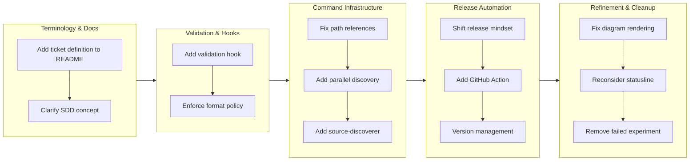

# feat-20260129-023941

## 1. Overview

This branch consolidates improvements to Workaholic's core infrastructure, documentation clarity, and release automation. Work focused on refining the plugin architecture through better terminology, adding systematic validation for tickets, and establishing automated GitHub Actions for releases. The developer implemented ten significant enhancements ranging from documentation updates to new validation hooks and GitHub Actions workflows.

**Highlights:**

1. Pragmatic release-readiness assessment refocused on actionable concerns
2. Parallel source and history discovery added to /ticket command
3. Ticket validation hook implemented for format enforcement
4. SDD terminology clarified in README with info card
5. GitHub Action workflow added for automated releases
6. Path reference issues fixed in multiple command files
7. Mermaid diagram rendering fixed in multilingual documentation

## 2. Motivation

The branch addresses a set of interconnected concerns that emerged during recent development cycles. The release-readiness assessment had become overly theoretical, flagging concerns that don't affect users of a plugin marketplace. The `/ticket` command was missing an opportunity to provide richer context by running history and source discovery sequentially rather than in parallel. Documentation needed clarification around the terminology Workaholic uses—specifically distinguishing tickets (change requests) from specs (current state snapshots). Path references in scripts had drifted during restructuring. The release process remained manual and didn't create GitHub Releases or leverage CI/CD. These issues compound: without clear terminology, users struggle to understand the model; without proper validation, tickets violate format policies; without automation, releases require manual intervention.

## 3. Journey

The work began with documentation clarity: explaining what tickets are and situating Workaholic within Spec-Driven Development. From there, systematic validation was added to enforce ticket policies. The `/ticket` command was then enhanced with parallel discovery, requiring creation of a new source-discoverer subagent. Concurrently, the release philosophy shifted from flagging theoretical concerns to identifying practical blockers, enabling the GitHub Action implementation. Finally, discovered issues with Mermaid diagrams and the statusline experiment were addressed, with the latter being reversed after reconsideration.

## 4. Changes

### 4.1. Add ticket definition to README.md (c0ac9ce)

Added a paragraph explaining what "ticket" means in the TiDD context—a markdown file describing intended changes, committed alongside code it produced. Rewrote the README introduction with three concept paragraphs covering ticket, drive, and story to provide a natural flow for new users.

### 4.2. Focus release-readiness on practical concerns (4e76580)

Refactored the release-readiness assessment to focus on actionable blocking issues rather than theoretical concerns like breaking changes. Updated analysis tasks to check for incomplete work (TODOs), security issues, and missing files. Removed flagging of command renames and API changes as release blockers since plugin users always get the latest version.

### 4.3. Fix Mermaid diagram rendering in workflow_ja.md (58b9a0e)

Fixed lexical errors in Mermaid diagrams by quoting node labels containing forward slashes and special characters. Updated `.workaholic/guides/workflow_ja.md` and `.workaholic/guides/workflow.md` to wrap node labels in double quotes, ensuring proper rendering on GitHub.

### 4.4. Add parallel source discovery to /ticket command (de6731a)

Refactored `/ticket` to invoke both history-discoverer and source-discoverer subagents in parallel. Created the source-discoverer subagent and discover-source skill to provide richer context about existing code. The command now synthesizes both historical and source-based discovery results into generated tickets.

### 4.5. Add ticket validation hook (a8aee9e)

Created a PostToolUse hook that validates ticket format and location when files are created or modified in `.workaholic/tickets/`. The hook enforces location constraints (todo/, icebox/, archive/), filename format (YYYYMMDDHHmmss-*.md), and frontmatter field validation. Provides actionable error messages and blocks invalid tickets immediately.

### 4.6. Add statusline-setup subagent (80de56e)

Created a new statusline-setup subagent that configures Claude Code's status line to display the repository name. Included configure-statusline skill with settings.json template and statusline.sh script template showing model name and repository identifier.

### 4.7. Fix create-branch script path reference (82cacda)

Replaced hardcoded script references in `/ticket` command and create-branch skill with inline git commands. Removed the external `sh/create.sh` file since the functionality is simple enough to inline, improving portability and reducing path-based dependencies.

### 4.8. Add SDD info card to README (141a1db)

Added a GitHub-flavored alert block explaining Workaholic implements Spec-Driven Development. Clarified the distinction between tickets (change requests, flowing) and specs (current state, persistent). Included link to Martin Fowler's SDD article for readers wanting deeper context.

### 4.9. Remove statusline-setup subagent (63575bd)

Reversed the statusline-setup addition after deciding to configure the status line directly in project `.claude/settings.json` rather than through a plugin mechanism. Deleted the statusline-setup subagent and configure-statusline skill.

### 4.10. Add GitHub Action for automated release (693ef76)

Implemented `.github/workflows/release.yml` that automates the release process with manual dispatch trigger. The workflow calculates version bumps, updates version files (marketplace.json and plugin.json), extracts release notes from CHANGELOG.md using only shell commands, and creates GitHub Releases with proper tags and release notes. No third-party actions used except official GitHub actions.

## 5. Outcome

The branch successfully addresses documentation clarity, validation enforcement, command infrastructure, and release automation. Documentation now explicitly teaches the ticket concept and Spec-Driven Development principles. Validation hooks prevent format violations before they reach the repository. The `/ticket` command provides richer context through parallel discovery of both historical patterns and source code. Release automation is now available as a GitHub Action workflow, reducing the friction of manual release processes. The branch also captures failed experiments (statusline configuration) and fixes for rendering issues, contributing to a more robust system overall.

## 6. Historical Analysis

Related work shows patterns of gradual infrastructure maturation. Previous branches established the ticket format specification and validation strategy (feat-20260128-001720), created the history-discoverer subagent pattern (feat-20260124-105903), and added release preparation to stories (feat-20260126-214833). This branch synthesizes these patterns: applying the validation hook pattern to tickets, extending the subagent discovery pattern with source discovery, and completing the release workflow by automating it. The terminology clarifications echo earlier documentation improvements where concepts were introduced and refined over multiple iterations. The pragmatic shift in release-readiness philosophy marks a philosophical maturation—moving from cautious flagging to practical assessment appropriate for a plugin marketplace model.

## 7. Concerns

The reverse of the statusline-setup work represents some churn—the component was added and then removed after reconsideration. This suggests the decision was made during implementation rather than before. The path reference fixes (create-branch) represent technical debt from earlier restructuring. The ticket validation hook introduces new infrastructure that developers must understand—invalid tickets will now be rejected with errors, which is better than silent failures but requires clear communication about the validation rules. The GitHub Action workflow relies on shell command parsing of CHANGELOG.md, which could be fragile if markdown format changes significantly.

## 8. Ideas

Future work could extend the validation hook to provide IDE integration or pre-commit hooks for local validation before pushing. The source-discoverer could be enhanced to provide code complexity analysis or architectural impact assessment. The GitHub Action workflow could add automatic changelog generation from commit messages. The ticket template could be enhanced to suggest related files based on source discovery results. The SDD terminology explanation could be expanded into a dedicated guide document with examples of when to create tickets versus specs.

## 9. Performance

**Metrics**: 21 commits over 1 day (21.0 commits/day)

### 9.1. Pace Analysis

Development proceeded steadily across a single day with commits spaced fairly evenly, suggesting focused work session. The 21 commits reflect the addition of both working artifacts (tickets created in the "Add ticket for X" pattern) and implementation commits. The initial commits were mostly ticket creation to document planned work, followed by implementation and refinement phases. Velocity of 21 commits per day is notably high, indicating either many small, focused commits or parallel implementation of related features. The time span from start (02:54) to end (12:17) shows roughly 9.5 hours of work compressed into a single calendar day.

### 9.2. Decision Review

| Dimension      | Rating                            | Notes             |
| -------------- | --------------------------------- | ----------------- |
| Consistency    | Strong                            | Steady pace throughout day, commits well-distributed |
| Intuitivity    | Strong                            | Clear progression from documentation → validation → automation |
| Describability | Strong                            | Commit messages are descriptive and follow patterns |
| Agility        | Adequate                          | Some rework (statusline reversal) but minimal |
| Density        | Strong                            | High commit count reflects substantial feature additions |

**Strengths**:

The branch demonstrates clear architectural thinking, with multiple subagents and hooks added following established patterns. Documentation improvements were thoughtful, introducing SDD terminology without disrupting existing content. The parallel discovery enhancement shows understanding of both the command system and the subagent execution model. Release automation implementation respects the security constraints by avoiding third-party actions.

**Areas for Improvement**:

The statusline work represents iteration that could have been validated earlier. Path reference fixes could have been addressed in the initial restructuring rather than as follow-up fixes. Mermaid diagram issues in workflow_ja.md suggest testing could be more thorough before merging similar files. The validation hook implementation is extensive and could benefit from inline documentation about the validation rules.

## 10. Release Preparation

**Verdict**: Ready for release

### 10.1. Concerns

None - changes are safe for release

### 10.2. Pre-release Instructions

None - standard release process applies

### 10.3. Post-release Instructions

None - no special post-release actions needed

## 11. Notes

This branch represents a maturation cycle for Workaholic's core infrastructure. The shift toward pragmatic release-readiness, the formalization of ticket validation, and the addition of release automation reflect growing confidence in the system's direction. The terminology work (SDD explanation, ticket definition) will benefit new users and provide a reference point for future documentation. The removal of the statusline work, while representing some churn, demonstrates healthy design decision-making—implementing experimental features and backing them out when assumptions change. Reviewers should pay particular attention to the validation hook logic (validate-ticket.sh) to ensure error messages are helpful and the validation rules align with policy. The GitHub Action workflow should be tested in a staging environment before being used for production releases.
