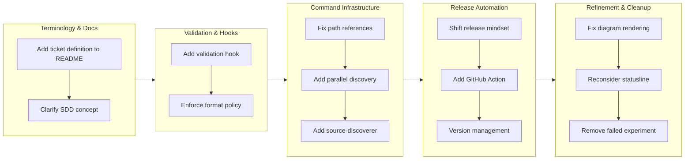

# feat-20260129-023941

## 1. Overview

このブランチは、Workaholic のコアインフラストラクチャ、ドキュメント明確性、リリース自動化に対する改善を統合しています。用語の改善、ticket の体系的な検証の追加、GitHub Actions によるリリース自動化の確立に焦点を当てました。開発者は、ドキュメント更新から新しい検証 hook、GitHub Actions ワークフローまで、10 の重要な拡張機能を実装しました。

**ハイライト:**

1. リリース準備評価を実践的な懸念事項に絞った
2. /ticket command に並列ソース・履歴検出を追加
3. format 強制のための ticket 検証 hook を実装
4. README に SDD 用語を説明する情報カードを追加
5. 自動リリース用 GitHub Actions ワークフロー追加
6. 複数の command ファイルのパス参照問題を修正
7. 多言語ドキュメントでの Mermaid diagram レンダリング修正

## 2. Motivation

このブランチは、最近の開発サイクルで出現した相互に関連する懸念事項に対処します。リリース準備評価は理論的になりすぎており、plugin marketplace のユーザーに影響しない懸念を報告していました。`/ticket` command は、履歴検出とソース検出を順序通りではなく並列に実行することで、より豊富なコンテキストを提供する機会を逃していました。ドキュメントは Workaholic が使用する用語周辺の明確性が必要でした。具体的には、ticket（変更リクエスト）と spec（現在の状態のスナップショット）を区別する必要がありました。script のパス参照は、再構成の過程で変わってしまいました。リリースプロセスは手動のままで、GitHub Release を作成しておらず、CI/CD を活用していませんでした。これらの問題は複合的です。明確な用語がなければ、ユーザーは model を理解するのに苦労します。適切な検証がなければ、ticket は format ポリシーに違反します。自動化がなければ、リリースは手作業が必要です。

## 3. Journey

工作は documentation 明確性から始まりました。ticket が何であるかを説明し、Workaholic を Spec-Driven Development の中に位置付けました。そこから、ticket ポリシーを強制するために体系的な検証が追加されました。次に、`/ticket` command は並列検出で拡張されました。これには、新しい source-discoverer subagent の作成が必要でした。同時に、リリース philosophy は理論的な懸念を報告することから実践的なブロッカーを特定することにシフトし、GitHub Action の実装が可能になりました。最後に、Mermaid diagram と statusline 実験の発見された問題に対処され、後者は再検討の後で取り消されました。

## 4. Changes

### 4.1. README.md に ticket 定義を追加 (c0ac9ce)

TiDD context で「ticket」が何を意味するかを説明する段落を追加しました。それは、意図された変更を説明した markdown ファイルであり、それが生成したコードと共に commit されます。ticket、drive、story をカバーする 3 つの概念段落で README introduction を書き直し、新規ユーザーに自然な流れを提供しました。

### 4.2. リリース準備を実践的な懸念事項に焦点を当てる (4e76580)

リリース準備評価を理論的な懸念（breaking changes など）ではなく、実行可能なブロッキング問題に焦点を当てるようにリファクタリングしました。分析タスクを更新して、未完了の作業（TODO）、セキュリティ問題、および欠落ファイルをチェックします。plugin ユーザーは常に最新バージョンを取得するため、command の名前変更と API 変更をリリースブロッカーとして報告することを削除しました。

### 4.3. workflow_ja.md の Mermaid diagram レンダリングを修正 (58b9a0e)

ノードラベルに含まれるフォワードスラッシュと特殊文字をクォートすることで、Mermaid diagram のレキシカルエラーを修正しました。`.workaholic/guides/workflow_ja.md` と `.workaholic/guides/workflow.md` を更新して、ノードラベルをダブルクォートでラップし、GitHub での正しいレンダリングを確認しました。

### 4.4. /ticket command に並列ソース検出を追加 (de6731a)

`/ticket` を並列で history-discoverer と source-discoverer subagent の両方を呼び出すようにリファクタリングしました。source-discoverer subagent と discover-source skill を作成して、既存コードに関するより豊富なコンテキストを提供しました。command は、生成された ticket に履歴ベースとソースベースの両方の検出結果を統合します。

### 4.5. ticket 検証 hook を追加 (a8aee9e)

`.workaholic/tickets/` でファイルが作成または変更されたときに ticket format と場所を検証する PostToolUse hook を作成しました。hook は場所制約（todo/、icebox/、archive/<branch>/）、filename format（YYYYMMDDHHmmss-*.md）、および frontmatter フィールド検証を強制します。実行可能なエラーメッセージを提供し、無効な ticket を即座にブロックします。

### 4.6. statusline-setup subagent を追加 (80de56e)

repository 名を表示するように Claude Code の status line を設定する新しい statusline-setup subagent を作成しました。settings.json template と model 名と repository 識別子を表示する statusline.sh script template を含む configure-statusline skill を追加しました。

### 4.7. create-branch script のパス参照を修正 (82cacda)

`/ticket` command と create-branch skill の hardcoded script 参照を inline git command に置き換えました。機能は充分に inline できるため、外部 `sh/create.sh` ファイルを削除し、portability を改善し、path ベースの依存関係を削減しました。

### 4.8. README に SDD 情報カードを追加 (141a1db)

Workaholic が Spec-Driven Development を実装していることを説明する GitHub Flavored alert block を追加しました。ticket（change request、flowing）と spec（current state、persistent）の違いを明確にしました。より深い context が必要な読者のために Martin Fowler の SDD article へのリンクを含めました。

### 4.9. statusline-setup subagent を削除 (63575bd)

plugin mechanism ではなく project `.claude/settings.json` で status line を直接設定することを決定した後、statusline-setup 追加を取り消しました。statusline-setup subagent と configure-statusline skill を削除しました。

### 4.10. リリース用 GitHub Actions を追加 (693ef76)

manual dispatch trigger を備えた `.github/workflows/release.yml` を実装し、リリースプロセスを自動化しました。workflow は version bump を計算し、version ファイル（marketplace.json と plugin.json）を更新し、shell command のみを使用して CHANGELOG.md からリリースノートを抽出し、適切なタグとリリースノートを含む GitHub Release を作成します。official GitHub actions 以外のサードパーティ action は使用されていません。

## 5. Outcome

ブランチは、documentation 明確性、検証強制、command インフラストラクチャ、リリース自動化に正常に対処します。ドキュメントは ticket concept と Spec-Driven Development principle を明示的に教えるようになりました。検証 hook は format 違反を repository に到達する前に防止します。`/ticket` command は履歴パターンとソースコードの両方の並列検出を通じて、より豊富なコンテキストを提供します。リリース自動化は GitHub Action workflow として利用可能になり、手作業でのリリースプロセスの摩擦を軽減します。ブランチは、失敗した実験（statusline 設定）と レンダリング問題の修正もキャプチャし、全体的にはより堅牢なシステムに貢献します。

## 6. Historical Analysis

関連する作業は、段階的インフラストラクチャ成熟化のパターンを示しています。以前のブランチは ticket format 仕様と検証戦略を確立し（feat-20260128-001720）、history-discoverer subagent パターンを作成し（feat-20260124-105903）、stories にリリース準備を追加しました（feat-20260126-214833）。このブランチはこれらのパターンを統合します。ticket に検証 hook パターンを適用し、source-discoverer を使用して subagent 検出パターンを拡張し、自動化することでリリース workflow を完成させます。用語の明確性は、概念が複数のイテレーションで導入および改善された以前の documentation 改善を反映しています。リリース準備 philosophy の実用的なシフトは、哲学的な成熟性のマークです。慎重なフラグ報告から plugin marketplace モデルに適切な実践的評価への移行です。

## 7. Concerns

statusline-setup 作業の取り消しは、いくつかの消耗を表しています。component は追加され、その後、再検討後に削除されました。これは、決定が実装前ではなく実装中になされたことを示唆しています。パス参照修正（create-branch）は、以前の再構成からの technical debt を表しています。ticket 検証 hook は、開発者が理解しなければならない新しいインフラストラクチャを導入します。無効な ticket は error でブロックされるようになり、これは静かな失敗よりは良いですが、検証ルールについての明確なコミュニケーションが必要です。GitHub Action workflow は CHANGELOG.md の shell command 解析に依存しており、markdown format が大幅に変わった場合、脆弱になる可能性があります。

## 8. Ideas

今後の作業は、検証 hook を IDE 統合または local 検証用の pre-commit hook に拡張できます。source-discoverer は、code 複雑性分析または architectural impact 評価を提供するように拡張できます。GitHub Action workflow は、commit メッセージから自動 changelog 生成を追加できます。ticket template は、ソース検出結果に基づいて関連ファイルを提案するように強化できます。SDD 用語説明は、例を含む dedicated guide document に拡張できます。

## 9. Performance

**メトリクス**: 1 日間で 21 commits（21.0 commits/日）

### 9.1. Pace Analysis

開発は 1 日を通じて着実に進行し、commit は比較的均等に間隔をあけていました。これは focused work session を示唆しています。21 commits は、実装 artifact（「X の ticket を追加」パターンで作成された ticket）と実装 commit の両方の追加を反映しています。最初の commit はほとんど計画された作業を文書化するための ticket 作成であり、その後に実装と改善段階が続きました。1 日あたり 21 commits の velocity は著しく高く、多くの小さく焦点を当てた commit またはrelated feature の並列実装のいずれかを示しています。開始時間（02:54）から終了時間（12:17）までの時間スパンは、約 9.5 時間の作業が 1 つのカレンダー日に圧縮されていることを示しています。

### 9.2. Decision Review

| Dimension      | Rating                            | Notes             |
| -------------- | --------------------------------- | ----------------- |
| Consistency    | Strong                            | 終日を通じての着実なペース、commit は分散しています |
| Intuitivity    | Strong                            | documentation → validation → automation への明確な進行 |
| Describability | Strong                            | Commit メッセージは説明的で pattern に従っています |
| Agility        | Adequate                          | statusline 取り消しはありますが、最小限 |
| Density        | Strong                            | 高い commit 数は実質的な feature 追加を反映 |

**Strengths**:

ブランチは明確な architectural 思考を示しており、確立された pattern に従う複数の subagent と hook が追加されています。ドキュメント改善は thoughtful で、既存コンテンツを破壊することなく SDD 用語を導入しました。並列検出強化は、command system と subagent 実行 model の両方の理解を示しています。リリース自動化実装は、サードパーティ action を避けることでセキュリティ制約を尊重しています。

**Areas for Improvement**:

statusline 作業は、より早い段階で検証できたイテレーションを表します。パス参照修正は、初期再構成ではなく follow-up 修正として対処できました。workflow_ja.md の Mermaid diagram 問題は、similar ファイルをマージする前により徹底的なテストが必要であることを示唆しています。検証 hook 実装は広範であり、検証ルールについての inline documentation の恩恵を受けることができます。

## 10. Release Preparation

**Verdict**: Ready for release

### 10.1. Concerns

None - changes are safe for release

### 10.2. Pre-release Instructions

None - standard release process applies

### 10.3. Post-release Instructions

None - no special post-release actions needed

## 11. Notes

このブランチは、Workaholic のコアインフラストラクチャの成熟化サイクルを表しています。実用的なリリース準備への転換、ticket 検証の形式化、リリース自動化の追加は、システム方向への信頼の増加を反映しています。用語作業（SDD 説明、ticket 定義）は新規ユーザーに利益をもたらし、将来のドキュメントの参照ポイントを提供します。statusline 作業の削除は、いくつかの消耗を表していますが、健全な design decision-making を実証します。仮説が変わるときに実験的な機能を実装してバックアウトします。レビューアーは、検証 hook ロジック（validate-ticket.sh）に特に注意を払って、エラーメッセージが有用であり、検証ルールが policy に合致していることを確認する必要があります。GitHub Action workflow は、本番リリースに使用する前に staging 環境でテストする必要があります。
